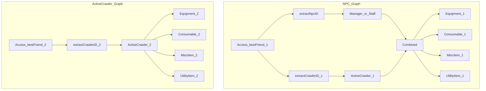

An ActiveCrawler's bestFriend can only be an ActiveCrawler  
An NPC's bestFriend can be any Character  
This means different numbers of polymorphic boundaries are passed in each case.

As of May 2025, this means the plan has two parallel paths, but in the future we
may be able to have this collapse back down to one while fetching the items of
each of the bestFriends.

NB: Although the last nodes are called `Equipment_1` and `Equipment_2`, these
nodes should in the future collapse down such that `Combined` and
`ActiveCrawler_2` go to the same nodes.
