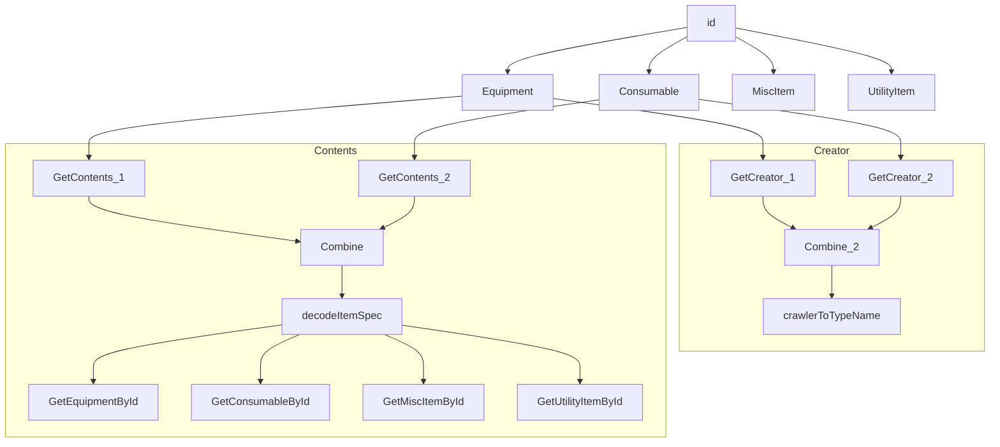

Item has four types: Equipment, Consumable, MiscItem & UtilityItem.  
Only Equipment & Consumable have Created and HasContents.  
Expect the nodes for Equipment & Consumable to Combine.

```mermaid
  graph TD

  id --> Equipment & Consumable & MiscItem & UtilityItem

  Equipment -->  GetContents_1 & GetCreator_1
  Consumable --> GetContents_2 & GetCreator_2

  subgraph Creator
  GetCreator_1 & GetCreator_2 --> Combine_2
  Combine_2 --> crawlerToTypeName
  end

  subgraph Contents
  GetContents_1 & GetContents_2 --> Combine
  Combine --> decodeItemSpec
  decodeItemSpec --> GetEquipmentById & GetConsumableById & GetMiscItemById & GetUtilityItemById
  end
```
