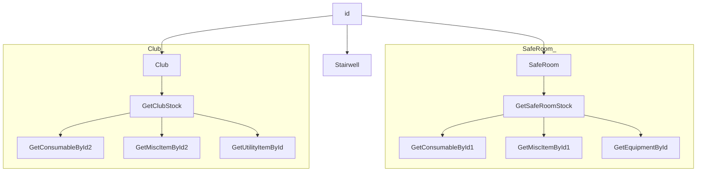

SafeRoomStock and ClubStock are different (but overlapping) abstract types, this
test puts them in the same path to see what happens.

```mermaid
graph TD

  id --> SafeRoom & Club & Stairwell

  subgraph SafeRoom_
  SafeRoom -->  GetSafeRoomStock
  GetSafeRoomStock --> GetConsumableById1 & GetMiscItemById1 & GetEquipmentById
  end

  subgraph Club_
  Club --> GetClubStock
  GetClubStock --> GetConsumableById2 & GetMiscItemById2 & GetUtilityItemById
  end
```
