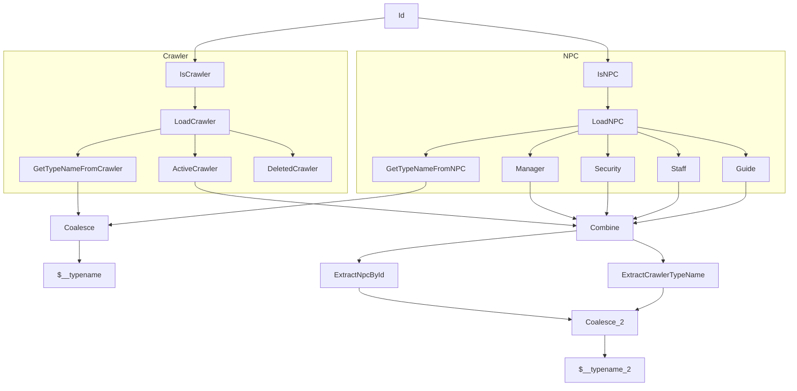

This test is an extension of the friends test - returning the friends of a
friend. A friend can be an ActiveCrawler or an NPC - and NPC is a polymorphic
type which can lead to the nodes in the plan combining when appropriate.

