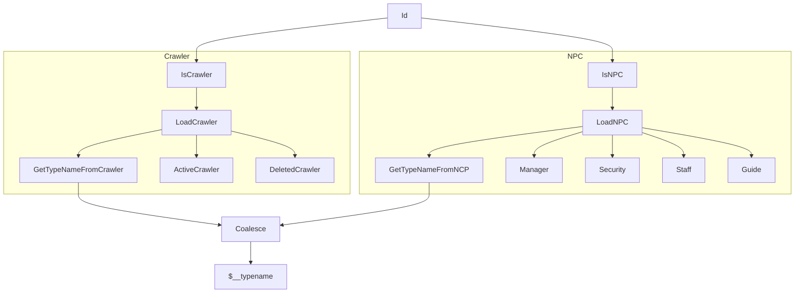

This test uses the ID of a friend to figure out the type of the Character; it
splits into two parts, one for Crawler and one for NPC, then it determines the
type from these and has to coalesce since they came from two different steps.

