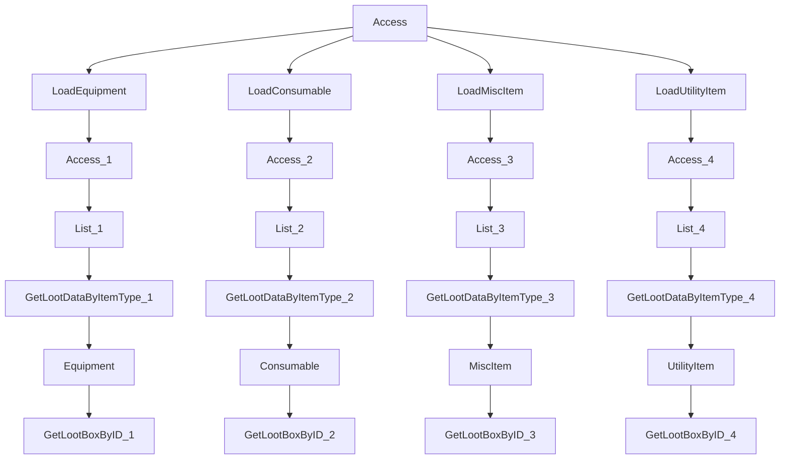

TODO: Review the plan diagram and experiment with a new way of handling the
polymorphism here. Lootbox is not polymorphic but Item is. Currently (May 2025)
the plan has more parallel paths than it should as many of the paths could
theoretically be collapsed down or deduplicated such that only one path is
executed, but not using the current way of deduplication due to the way the
schema is written.

