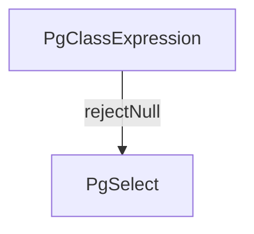

# inhibitOnNull

Wrap a step so that downstream work is inhibited when the wrapped step resolves
to `null`. The returned step resolves to the same value as the original, but it
rejects the Grafast `NULL` flag so dependants skip execution instead of
attempting to use a missing value.

```ts
const $parentId = inhibitOnNull(get($post, "parentId"));
const $parent = users.get($parentId);
```

In the example above, when `$post.parentId` is `null`, Grafast does not attempt
to read the parent's `id`, so no fetch is attempted. When the ID is present, the
plan proceeds as normal.

`inhibitOnNull` accepts an optional condition step via `{ if: $cond }`. When
provided, the value is only inhibited if both the wrapped step resolves to
`null` and `$cond` resolves to a truthy value:

```ts
const $parentId = inhibitOnNull($rawParentId, { if: $shouldGuard });
```

:::note[Declarative flow]
The inhibition only affects steps that depend on the returned step. Unrelated
steps (or related steps that read a different value) keep running as usual.
:::

Combine `inhibitOnNull` with [`trap`](./trap.md) if you want to convert an
inhibited value back into a regular `null` (or another value) further down the
plan.

## Plan diagrams

`inhibitOnNull` creates a `__FlagStep` (defined in
`grafast/src/steps/__flag.ts`), but that step is usually absorbed into the
dependency edge in plan diagrams.
Instead of a visible node, you will see the dependency arrow annotated with
labels such as `rejectNull`.



The label signals that downstream work will be inhibited if the value coming
from `A` is `null`.
