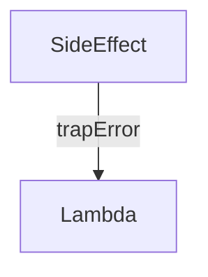

# trap

Convert flagged values (errors or inhibitions) into ordinary data. `trap`
wraps a step and accepts an `acceptFlags` argument describing which flags should
be recovered. Use the exported helpers `TRAP_ERROR`, `TRAP_INHIBITED`, or
`TRAP_ERROR_OR_INHIBITED` for common cases.

```ts
const $requireId = assertNotNull($maybeId, "Null ID");
const $nullableId = trap($requireId, TRAP_ERROR, { valueForError: "NULL" });
```

In the snippet above, the assertion still marks the branch as errored, but the
`trap` converts that error into a regular `null`, so downstream nullable fields
resolve cleanly without propagating the exception.

You can choose the replacement for inhibited or errored values via
`valueForInhibited` and `valueForError`. Accepted values are:

- `"PASS_THROUGH"` (default) – expose the underlying flagged value untouched.
- `"NULL"` – use `null`.
- `"EMPTY_LIST"` – use an empty frozen array.

Provide `{ if: $cond }` to enable/disable trapping dynamically.

:::note[Declarative flow]
Only dependants of the trapped step see the converted value. Other branches of
the plan keep operating on the original flagged result.
:::

`trap` is frequently paired with [`inhibitOnNull`](./inhibitOnNull.md) or
[`assertNotNull`](./assertNotNull.md) to recover a usable value after guarding
an upstream dependency. It also works with side-effect steps: trapping an error
allows you to continue a plan that would otherwise halt once the side effect has
been observed.

## Plan diagrams

`trap` constructs a `__FlagStep` (see `grafast/src/steps/__flag.ts`) that is
usually absorbed into the dependency arrow. Instead of its own node, the plan
diagram labels the edge with cues such as `trapError` or `trapInhibited`.



When you see these labels, the edge is recovering the flagged value before the
next step executes.
