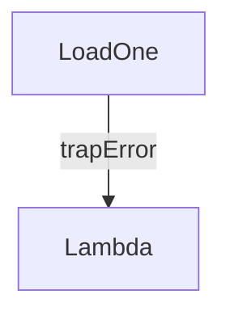

# trap

Convert [flagged values](../../flow.mdx#flagged-values) (e.g. values that
errored or were inhibited via [`inhibitOnNull`](./inhibitOnNull)) into ordinary
(unflagged) data. `trap` wraps a step and accepts an `acceptFlags` argument
describing which flags should be recovered. Use the exported helpers
`TRAP_ERROR`, `TRAP_INHIBITED`, or `TRAP_ERROR_OR_INHIBITED` for common cases.

You can choose the replacement for inhibited or errored values via
`valueForInhibited` and `valueForError`. Accepted values are:

- `"PASS_THROUGH"` (default) – expose the underlying flagged value untouched.
- `"NULL"` – use `null`.
- `"EMPTY_LIST"` – use an empty frozen array.

`trap` is frequently paired with [`inhibitOnNull`](./inhibitOnNull.mdx) or
[`assertNotNull`](./assertNotNull.mdx) to recover a usable value after guarding
an upstream dependency. It also works with side-effect steps: trapping an error
allows you to continue a plan that would otherwise halt once the error was
raised.

:::note[Declarative flow]

Only dependants of the trapped step see the converted value. Other branches of
the plan keep operating on the original flagged result.

:::

## Example

```ts
const $record = loadOne($id, batchGetThingById);
const $recordOrNull = trap($record, TRAP_ERROR, { valueForError: "NULL" });
```

In the snippet above, we attempt to load a "thing" by its id; but if it were to
fail with an error, instead of outputting the error for GraphQL consumers to
see, we simply absorb the error and turn the value into `null`.

## Plan diagrams

Internally, `trap` currently creates a `__FlagStep`, but that step is
usually converted into a dependency constraint when another step depends on it.
Thus in plan diagrams it's more common to see it on the dependency edge:
instead of a visible node, you will see the dependency arrow annotated with
labels such as `trapError` or `trapInhibited`.



## Advanced

Provide `{ if: $cond }` to enable/disable trapping dynamically.
