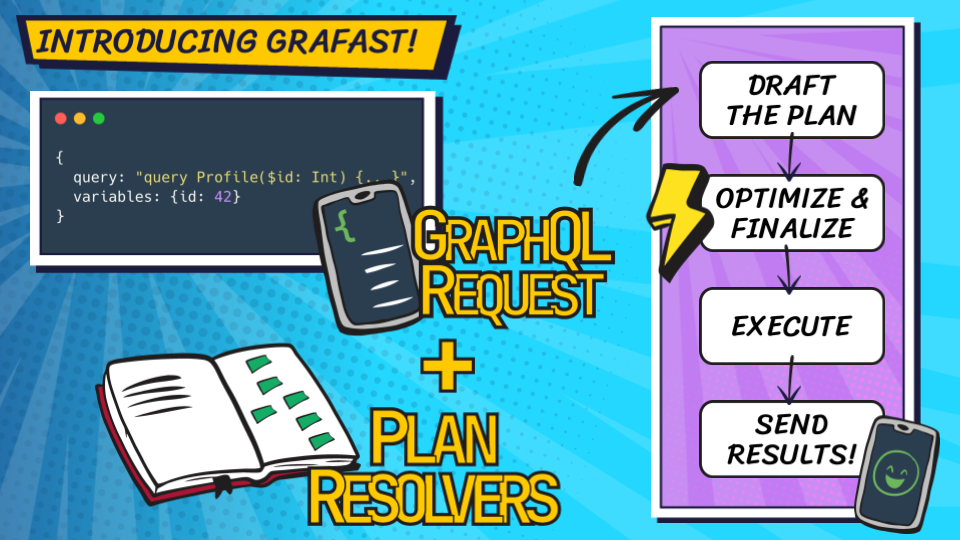
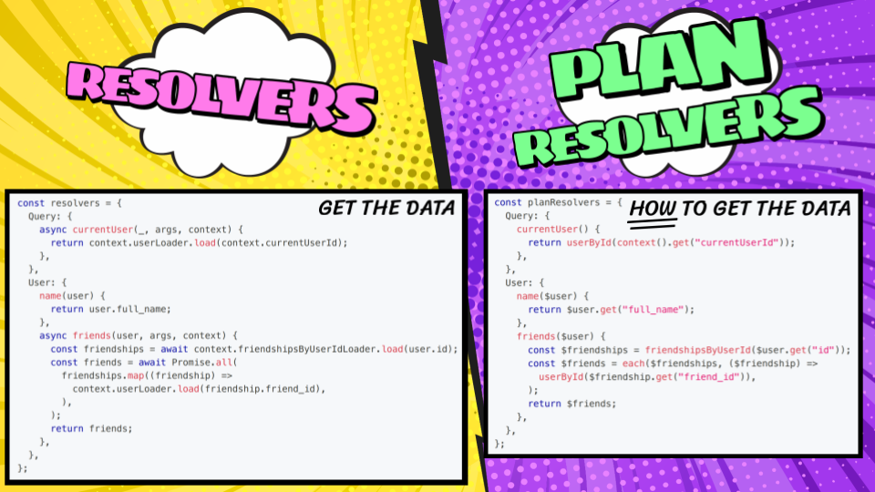

Gra*fast* is finally here &mdash; a new holistic execution engine for GraphQL. It enables greater efficiency across the entire backend stack by leveraging the declarative nature of GraphQL to give your business logic a better understanding of everything it needs to do. It&lsquo;s backwards compatible, so you can adopt it incrementally within your existing schema and it&lsquo;s finally ready to try with [the `grafast` module on npm](https://www.npmjs.com/package/grafast); or check out [the source code on GitHub](https://github.com/graphile/crystal/tree/main/grafast/grafast)!

<figure>
  <iframe
    width="560"
    height="315"
    src="https://www.youtube-nocookie.com/embed/4ao-zjiOGx8?si=R_CtMfyg0Bxx1YUT"
    title="YouTube video player"
    frameborder="0"
    allow="accelerometer; autoplay; clipboard-write; encrypted-media; gyroscope; picture-in-picture; web-share"
    allowfullscreen
  ></iframe>
  <figcaption>
    I launched Grafast v0.1 at GraphQL Conf, above is the full video of my talk
    which covers what Grafast is and how it can improve application performance,
    reduce operational costs, all without being a significant burden on
    developers.
  </figcaption>
</figure>

## Gra*fast* Working Group

There&lsquo;s still decisions to be made and edges to be smoothed before Gra*fast* can become a specification that can be implemented in any language. If the potential of this technology is interesting to you, please [join the Gra*fast* working group](https://github.com/grafast/wg) and get involved. We all deserve our future of easy GraphQL execution efficiency!

<!--truncate-->

If you don&lsquo;t have time to watch the video above, here&lsquo;s a little about Gra*fast*:

## &ldquo;GraphQL&lsquo;s execution model is wrong for most servers&rdquo;

GraphQL is a declarative language; the requests specify everything that the client is asking for up-front.

But the resolver-based execution model **_obfuscates_** this knowledge - when implemented naively, resolvers can very quickly result in serious performance issues; and even when implemented well they leave a lot to be desired.

DataLoader is one of the suggested approaches to solve the &ldquo;N+1 Problem&rdquo; but this is only the most egregious performance issue a GraphQL schema may face &mdash; there are plenty of related issues that can build up as your schemas and operations get more complex.

I set out not only to solve the well-known N+1 problem and the more subtle under- and over-fetching problems, but to help you achieve the most efficient execution for your GraphQL schema no matter what data sources you&lsquo;re working with! The solution? Leverage the declarative nature of GraphQL via a new general purpose query planner.

## &ldquo;Step aside resolvers! There&lsquo;s a new way to execute GraphQL&rdquo;

<figure>

<figcaption>

Grafast uses plan resolvers which describe the data required for the GraphQL request. Once drafted, the plan is highly optimized - which is where the real power of Grafast lies.

</figcaption>
</figure>

Gra*fast* has been designed from the ground up to give schema designers the tools they need to ensure their schemas are executing as efficiently as possible, whilst ensuring that writing their logic is still a pleasant experience. To achieve this, Gra*fast* favours a planning strategy which takes a holistic approach to understanding the incoming operation and unlocks the potential for significant optimizations: optimizations that are not achievable with a resolver-based execution model unless one puts in herculean effort (and a little sorcery 😉).

Gra*fast*, like GraphQL, is not specific to any particular technology stack, business logic shape or data storage layer. It doesn&lsquo;t care if you&lsquo;re using relational databases, document stores, ORMs, HTTP APIs, file systems or _[carrier pigeons](https://datatracker.ietf.org/doc/html/rfc1149)_. Any valid GraphQL schema can be implemented with Gra*fast*, and a Gra*fast* schema can query any data source, business logic or service.

Though it supports traditional resolvers, Gra*fast* encourages developers to use &ldquo;plan resolvers&rdquo;: small functions similar to resolvers but which describe the required data, rather than actually fetching it.

<figure>

<figcaption>

Plan resolvers are similar to traditional resolvers, they even follow the same shape, but the key difference is they describe HOW to get the data rather than actually fetch it themselves.

</figcaption>
</figure>

Gra*fast* takes the GraphQL request and, using the plan resolvers, drafts an execution plan which can be optimized and streamlined. The optimization may involve changing the shape of execution significantly from the shape the GraphQL request would imply, enabling the system to satisfy the requirements of the request in the most efficient manner.

When the planning phase is complete, Gra*fast* will execute this highly optimized execution plan, and feed the result into the output plan, which efficiently prepares the result to send to the GraphQL client.

If another request comes in using the same GraphQL document but different variables, Gra*fast* can reuse the plan and jump straight to the highly optimized execution phase.

This greater understanding of the needs of the GraphQL requests unlocks entire new avenues for optimization, without sacrificing tried-and-trusted approaches such as caching. The result is greater efficiency &mdash; not just in your GraphQL server, but also in the backend services that it relies on &mdash; letting your team operate with a simpler architecture for much longer, allowing your engineers to focus on shipping better experiences for your customers rather than on the complexities of keeping a complicated architecture running smoothly.

<blockquote class="twitter-tweet" data-conversation="none" data-theme="light">
  

    Probably worth looking into the work{" "}
    <a href="https://twitter.com/Benjie?ref_src=twsrc%5Etfw">@Benjie</a> is
    doing with Grafast as well. Feels like the missing substrate in the GraphQL
    world.
  

  &mdash; Sean Grove (@sgrove){" "}
  <a href="https://twitter.com/sgrove/status/1696572548803162477?ref_src=twsrc%5Etfw">
    August 29, 2023
  </a>
</blockquote> 

Gra*fast* already works and some of my [sponsors](https://graphile.org/sponsors) are already running it in production. You can try it out today by following the guide at [grafast.org](https://grafast.org). All that&lsquo;s left for me to say now is, if the potential of this new technology is interesting, then please:

## Help shape the future on 24th October and join the [Gra*fast* working group](https://github.com/grafast/wg)!

<figure>

</figure>
