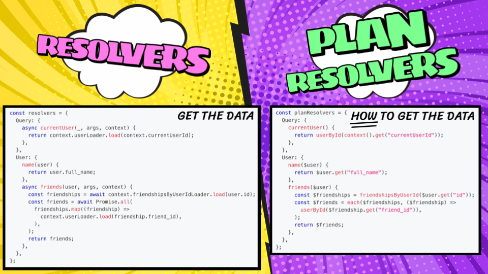

import styles from "@site/src/css/common.module.css";

<div className={styles.intro}>

The Gra*fast* v1.0 release candidate is now available. The engine has stabilized, the
epic milestones are complete, and the runtime has been hardened by more than a year of
production use through PostGraphile V5 and standalone adopters. All that
remains is to finish the documentation, tighten the TypeScript experience, and
create more examples!

</div>

_PostGraphile user? You may want to read the [PostGraphile RC
post](https://postgraphile.org/news/2025-10-28-release-candidate) instead._

## What does release candidate mean for Gra*fast*?

The runtime APIs, behaviour, and mental model have settled and the software has
proven stable with some users having ran it in production for over a year;
however, the documentation needs to catch up (and some TypeScript types and
comments still need to be brought in line). The release candidate tag signals
the stability of the software whilst leaving us the space to focus entirely on
quality and documentation before stamping the final 1.0 release.

Now is the perfect moment to validate that the “[plans as
dataflow](/grafast/flow)” approach clicks for you: do you understand the
separation of "plan time" and "execution time"? Can you see how principled
communication between the steps allows for optimization without needing to
revisit plan resolvers?

If you don't get it, that's likely a failing of our documentation! Help us
improve our explanations by sharing your feedback (whether confusion and
frustration or success and praise!) in our
[Discord](https://discord.gg/graphile) or with GitHub issues and pull requests!

## Documentation: where we need you

The code moved faster than the words that describe it. Parts of the docs are
out of date, others are missing, and a few contradict the behaviour you see in
practice. We need review, issue reports, and small patches. Your first-hand notes
about what is unclear are invaluable. If something doesn't behave according to
the docs, or of the docs are unclear, let us know!

Feedback via [GitHub issues](https://github.com/graphile/crystal) or the
[Discord server](https://discord.gg/graphile) is hugely appreciated.

## From sketches and a dream to a stable execution engine

We came up with the initial seed for Gra*fast* in 2020, having been frustrated
by the limitations, caveats and inefficiencies of traditional resolver-driven
GraphQL execution, along with the messiness and inefficiency of previous
attempts to solve these problems (such as digging through `GraphQLResolveInfo`).

<!-- truncate -->

The building block we came up with, our north star, was the "plan resolver": a
function that looks deceptively similar to traditional resolvers, but changes
the GraphQL resolution from procedural (field-by-field, layer-by-layer, with
just in time discovery of data requirements leading to over-fetching,
under-fetching, N+1 problems, and an explosion of promises) to declarative
(holistic planning of the request, followed by optimal execution).

<figure>

[](../static/img/news/2023-10-13-plan-resolvers.png)

<figcaption>

Plan resolvers are a declarative replacement for traditional resolvers, they
describe HOW to get the data rather than actually fetching it.

</figcaption>
</figure>

The various plan resolvers referenced by the
operation would detail steps sufficient to satisfy their requirements, and these
steps would be composed into an "operation plan" detailing the full requirements
and data flows of the operation. This plan could then rewrite itself through
principled communication between its constituent steps before being executed -
the code that finally executes might no longer reflect the shape of the GraphQL
request, leveraging advanced capabilities of the underlying business logic.

## Working with the group

In 2023, we presented an early version of Grafast at GraphQLConf, and sought
feedback from anyone who wished to get involved. Together, the Grafast working
group identified four epics stood between this proof of concept and a stable
1.0:

- ✅ **Global dependencies**: initially everything was batched, but we
  identified that steps which would always have exactly one value in a request
  (such as field arguments, user credentials, and API clients) should be marked as
  such - "unary". The planning infrastructure was rewritten to accomodate this,
  and it's now much easier to write custom step classes that rely on these kinds
  of values!
- ✅ **Early exit**: Grafast is about _data flow_, and branching should be
  handled inside business logic (i.e. inside the steps themselves, not within plan
  resolvers). However, sometimes a plan resolver wants to "exit early" either with
  an error or a null, so these needs now have first-class support. 
- ✅ **Plan-time evaluation removal**: we eliminated `$step.eval*()` and other
  hooks that allowed "peeking" at the value of inputs at plan time, and thus
  limited the reusability of the plan based on "constraints". Today, plan
  resolvers stay declarative; all decision making happens in step execution where
  it belongs, so plans can normally be reused for the same operation independent
  of runtime values.
- ✅ **Polymorphism convergence**: in the initial release of Grafast, the plan
  would branch each time an abstract position was reached. This could lead to
  exponential branching for highly polymorphic requests, causing excessive
  planning time. By having polymorphic branches merge back together becure
  branching out for the next layer of abstract types, Grafast has eliminated this
  exponential planning hazard.

Ultimately this has helped us solidify the [“thinking in plans”](/grafast/flow)
model: describe a simple dataflow for each field, let Gra*fast* orchestrate its
optimization, and reap the rewards of declarative execution in the form of
reduced resource utilisation, lower bills, and increased application
performance.

## Try Gra*fast* v1 today

Install the release candidate from npm:

```bash
yarn add grafast
```

Start working your way through [the documentation](/grafast) and let us know
what still feels rough.

## Sponsors make Gra*fast* possible

Gra*fast* exists thanks to the companies and individuals who fund our work.
Their backing lets us spend the time needed to invent, iterate, and polish the
engine you are using today. If Gra*fast* helps you ship faster or operate more
efficiently, please join them; find out more at
[graphile.org/sponsor](https://graphile.org/sponsor).

<figure>


</figure>
