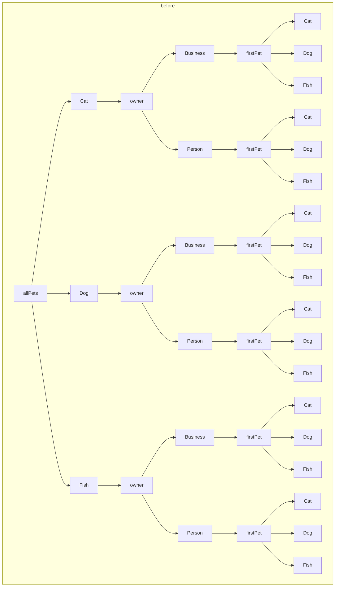
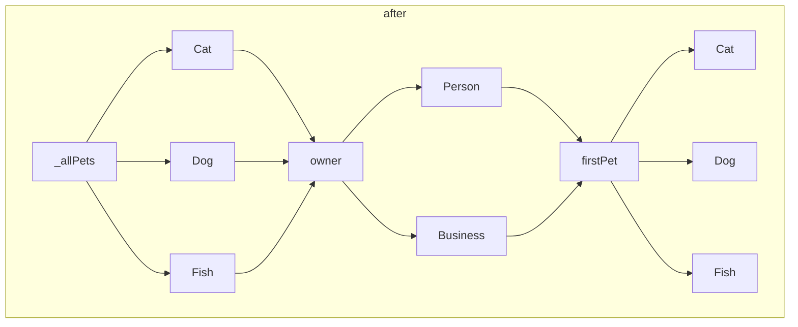

# Polymorphic step migration

<!-- TODO: update this -->

We determined that one of the ways to reduce the amount of time spent planning
is to ensure that all polymorphic types are planned in a "data only" approach.
This allows us to ensure that polymorphism doesn't multiply, but will only ever
branch to as many types as you have in a polymorphic type, and will then fold
back in before branching out again (see [diagrams](#diagrams) at the bottom of
the page).

To accomplish this, we had to split `planForType` into two parts: the new
`dataForType` (which just retrieves the data necessary to fetch the relevant
record - for example, it's identifier), and a new _static_ `planForType` method
which accepts the type to plan and a step representing this data.

It's important this new method is static, as it prevents referencing any other
non-ambient steps, which allows for the plan to fold back in again.

Previously:

```ts
class PolymorphicBranchStep extends Step {
  //...
  planForType(objectType: GraphQLObjectType): Step {
    const matcher = this.matchers[objectType.name];
    const $step = this.getDep<TStep>(0, true);
    if (matcher) {
      if (typeof matcher.plan === "function") {
        return matcher.plan($step);
      } else {
        return $step;
      }
    } else {
      // TODO: should this be an error?
      return constant(null);
    }
  }
}
```

Afterwards:

```ts
class MyClass extends Step {
  //...
  static planForType() {
    //...
  }
  dataForType() {
    //...
  }
}
```

## Diagrams

### Before



### After


