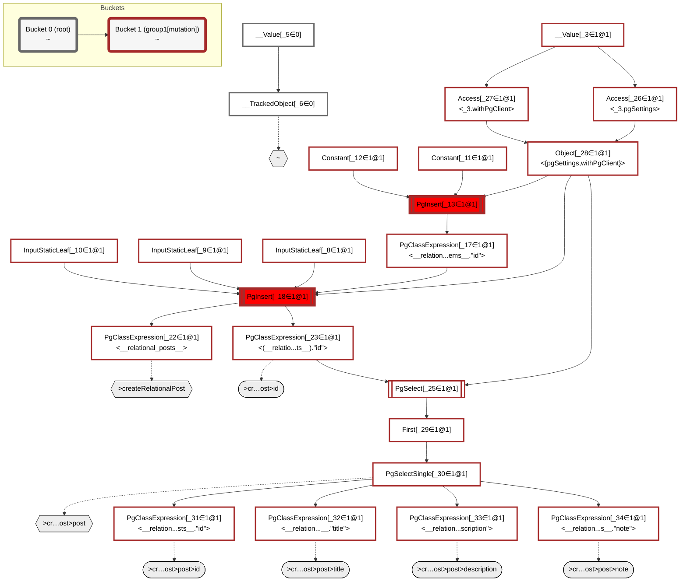

```mermaid
graph TD
    classDef path fill:#eee,stroke:#000,color:#000
    classDef plan fill:#fff,stroke-width:3px,color:#000
    classDef itemplan fill:#fff,stroke-width:6px,color:#000
    classDef sideeffectplan fill:#f00,stroke-width:6px,color:#000
    classDef bucket fill:#f6f6f6,color:#000,stroke-width:6px

    %% subgraph fields
    P1{{"~"}}:::path
    P2{{">createRelationalPost"}}:::path
    P3([">cr…ost>id"]):::path
    %% P2 -.-> P3
    P4{{">cr…ost>post"}}:::path
    P5([">cr…ost>post>id"]):::path
    %% P4 -.-> P5
    P6([">cr…ost>post>title"]):::path
    %% P4 -.-> P6
    P7([">cr…ost>post>description"]):::path
    %% P4 -.-> P7
    P8([">cr…ost>post>note"]):::path
    %% P4 -.-> P8
    %% P2 -.-> P4
    %% P1 -.-> P2
    %% end

    %% define plans
    __Value_3["__Value[_3∈1@1]<br /><context>"]:::plan
    __Value_5["__Value[_5∈0]<br /><rootValue>"]:::plan
    __TrackedObject_6["__TrackedObject[_6∈0]"]:::plan
    InputStaticLeaf_8["InputStaticLeaf[_8∈1@1]"]:::plan
    InputStaticLeaf_9["InputStaticLeaf[_9∈1@1]"]:::plan
    InputStaticLeaf_10["InputStaticLeaf[_10∈1@1]"]:::plan
    Constant_11["Constant[_11∈1@1]"]:::plan
    Constant_12["Constant[_12∈1@1]"]:::plan
    PgInsert_13[["PgInsert[_13∈1@1]"]]:::sideeffectplan
    PgClassExpression_17["PgClassExpression[_17∈1@1]<br /><__relation...ems__.#quot;id#quot;>"]:::plan
    PgInsert_18[["PgInsert[_18∈1@1]"]]:::sideeffectplan
    PgClassExpression_22["PgClassExpression[_22∈1@1]<br /><__relational_posts__>"]:::plan
    PgClassExpression_23["PgClassExpression[_23∈1@1]<br /><(__relatio...ts__).#quot;id#quot;>"]:::plan
    PgSelect_25[["PgSelect[_25∈1@1]<br /><relational_posts>"]]:::plan
    Access_26["Access[_26∈1@1]<br /><_3.pgSettings>"]:::plan
    Access_27["Access[_27∈1@1]<br /><_3.withPgClient>"]:::plan
    Object_28["Object[_28∈1@1]<br /><{pgSettings,withPgClient}>"]:::plan
    First_29["First[_29∈1@1]"]:::plan
    PgSelectSingle_30["PgSelectSingle[_30∈1@1]<br /><relational_posts>"]:::plan
    PgClassExpression_31["PgClassExpression[_31∈1@1]<br /><__relation...sts__.#quot;id#quot;>"]:::plan
    PgClassExpression_32["PgClassExpression[_32∈1@1]<br /><__relation...__.#quot;title#quot;>"]:::plan
    PgClassExpression_33["PgClassExpression[_33∈1@1]<br /><__relation...scription#quot;>"]:::plan
    PgClassExpression_34["PgClassExpression[_34∈1@1]<br /><__relation...s__.#quot;note#quot;>"]:::plan

    %% plan dependencies
    __Value_5 --> __TrackedObject_6
    Object_28 --> PgInsert_13
    Constant_11 --> PgInsert_13
    Constant_12 --> PgInsert_13
    PgInsert_13 --> PgClassExpression_17
    Object_28 --> PgInsert_18
    PgClassExpression_17 --> PgInsert_18
    InputStaticLeaf_8 --> PgInsert_18
    InputStaticLeaf_9 --> PgInsert_18
    InputStaticLeaf_10 --> PgInsert_18
    PgInsert_18 --> PgClassExpression_22
    PgInsert_18 --> PgClassExpression_23
    Object_28 --> PgSelect_25
    PgClassExpression_23 --> PgSelect_25
    __Value_3 --> Access_26
    __Value_3 --> Access_27
    Access_26 --> Object_28
    Access_27 --> Object_28
    PgSelect_25 --> First_29
    First_29 --> PgSelectSingle_30
    PgSelectSingle_30 --> PgClassExpression_31
    PgSelectSingle_30 --> PgClassExpression_32
    PgSelectSingle_30 --> PgClassExpression_33
    PgSelectSingle_30 --> PgClassExpression_34

    %% plan-to-path relationships
    __TrackedObject_6 -.-> P1
    PgClassExpression_22 -.-> P2
    PgClassExpression_23 -.-> P3
    PgSelectSingle_30 -.-> P4
    PgClassExpression_31 -.-> P5
    PgClassExpression_32 -.-> P6
    PgClassExpression_33 -.-> P7
    PgClassExpression_34 -.-> P8

    %% allocate buckets
    classDef bucket0 stroke:#696969
    class __Value_5,__TrackedObject_6 bucket0
    classDef bucket1 stroke:#a52a2a
    class __Value_3,InputStaticLeaf_8,InputStaticLeaf_9,InputStaticLeaf_10,Constant_11,Constant_12,PgInsert_13,PgClassExpression_17,PgInsert_18,PgClassExpression_22,PgClassExpression_23,PgSelect_25,Access_26,Access_27,Object_28,First_29,PgSelectSingle_30,PgClassExpression_31,PgClassExpression_32,PgClassExpression_33,PgClassExpression_34 bucket1

    subgraph Buckets
    Bucket0("Bucket 0 (root)<br />~"):::bucket
    style Bucket0 stroke:#696969
    Bucket1("Bucket 1 (group1[mutation])<br />~"):::bucket
    style Bucket1 stroke:#a52a2a
    Bucket0 --> Bucket1
    end
```
