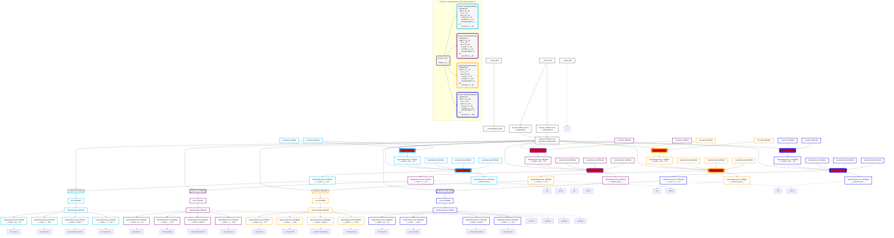

```mermaid
graph TD
    classDef path fill:#eee,stroke:#000,color:#000
    classDef plan fill:#fff,stroke-width:3px,color:#000
    classDef itemplan fill:#fff,stroke-width:6px,color:#000
    classDef sideeffectplan fill:#f00,stroke-width:6px,color:#000
    classDef bucket fill:#f6f6f6,color:#000,stroke-width:6px,text-align:left


    %% define plans
    __Value_0["__Value[_0∈0]"]:::plan
    __Value_3["__Value[_3∈0]<br /><context>"]:::plan
    __Value_5["__Value[_5∈0]<br /><rootValue>"]:::plan
    __TrackedObject_6["__TrackedObject[_6∈0]"]:::plan
    InputStaticLeaf_8["InputStaticLeaf[_8∈1@1]"]:::plan
    InputStaticLeaf_9["InputStaticLeaf[_9∈1@1]"]:::plan
    InputStaticLeaf_10["InputStaticLeaf[_10∈1@1]"]:::plan
    Constant_11["Constant[_11∈1@1]"]:::plan
    Constant_12["Constant[_12∈1@1]"]:::plan
    PgInsert_13[["PgInsert[_13∈1@1]"]]:::sideeffectplan
    PgClassExpression_17["PgClassExpression[_17∈1@1]<br /><__relation...ems__.”id”>"]:::plan
    PgInsert_18[["PgInsert[_18∈1@1]"]]:::sideeffectplan
    PgClassExpression_22["PgClassExpression[_22∈1@1]<br /><__relational_posts__>"]:::plan
    PgClassExpression_23["PgClassExpression[_23∈1@1]<br /><(__relatio...ts__).”id”>"]:::plan
    PgSelect_25[["PgSelect[_25∈1@1]<br /><relational_posts>"]]:::plan
    First_29["First[_29∈1@1]"]:::plan
    PgSelectSingle_30["PgSelectSingle[_30∈1@1]<br /><relational_posts>"]:::plan
    PgClassExpression_31["PgClassExpression[_31∈1@1]<br /><__relation...sts__.”id”>"]:::plan
    PgClassExpression_32["PgClassExpression[_32∈1@1]<br /><__relation...__.”title”>"]:::plan
    PgClassExpression_33["PgClassExpression[_33∈1@1]<br /><__relation...scription”>"]:::plan
    PgClassExpression_34["PgClassExpression[_34∈1@1]<br /><__relation...s__.”note”>"]:::plan
    InputStaticLeaf_36["InputStaticLeaf[_36∈2@2]"]:::plan
    InputStaticLeaf_37["InputStaticLeaf[_37∈2@2]"]:::plan
    InputStaticLeaf_38["InputStaticLeaf[_38∈2@2]"]:::plan
    Constant_39["Constant[_39∈2@2]"]:::plan
    Constant_40["Constant[_40∈2@2]"]:::plan
    PgInsert_41[["PgInsert[_41∈2@2]"]]:::sideeffectplan
    PgClassExpression_45["PgClassExpression[_45∈2@2]<br /><__relation...ems__.”id”>"]:::plan
    PgInsert_46[["PgInsert[_46∈2@2]"]]:::sideeffectplan
    PgClassExpression_50["PgClassExpression[_50∈2@2]<br /><__relational_posts__>"]:::plan
    PgClassExpression_51["PgClassExpression[_51∈2@2]<br /><(__relatio...ts__).”id”>"]:::plan
    PgSelect_53[["PgSelect[_53∈2@2]<br /><relational_posts>"]]:::plan
    First_57["First[_57∈2@2]"]:::plan
    PgSelectSingle_58["PgSelectSingle[_58∈2@2]<br /><relational_posts>"]:::plan
    PgClassExpression_59["PgClassExpression[_59∈2@2]<br /><__relation...sts__.”id”>"]:::plan
    PgClassExpression_60["PgClassExpression[_60∈2@2]<br /><__relation...__.”title”>"]:::plan
    PgClassExpression_61["PgClassExpression[_61∈2@2]<br /><__relation...scription”>"]:::plan
    PgClassExpression_62["PgClassExpression[_62∈2@2]<br /><__relation...s__.”note”>"]:::plan
    InputStaticLeaf_64["InputStaticLeaf[_64∈3@3]"]:::plan
    InputStaticLeaf_65["InputStaticLeaf[_65∈3@3]"]:::plan
    InputStaticLeaf_66["InputStaticLeaf[_66∈3@3]"]:::plan
    Constant_67["Constant[_67∈3@3]"]:::plan
    Constant_68["Constant[_68∈3@3]"]:::plan
    PgInsert_69[["PgInsert[_69∈3@3]"]]:::sideeffectplan
    PgClassExpression_73["PgClassExpression[_73∈3@3]<br /><__relation...ems__.”id”>"]:::plan
    PgInsert_74[["PgInsert[_74∈3@3]"]]:::sideeffectplan
    PgClassExpression_78["PgClassExpression[_78∈3@3]<br /><__relational_posts__>"]:::plan
    PgClassExpression_79["PgClassExpression[_79∈3@3]<br /><(__relatio...ts__).”id”>"]:::plan
    PgSelect_81[["PgSelect[_81∈3@3]<br /><relational_posts>"]]:::plan
    First_85["First[_85∈3@3]"]:::plan
    PgSelectSingle_86["PgSelectSingle[_86∈3@3]<br /><relational_posts>"]:::plan
    PgClassExpression_87["PgClassExpression[_87∈3@3]<br /><__relation...sts__.”id”>"]:::plan
    PgClassExpression_88["PgClassExpression[_88∈3@3]<br /><__relation...__.”title”>"]:::plan
    PgClassExpression_89["PgClassExpression[_89∈3@3]<br /><__relation...scription”>"]:::plan
    PgClassExpression_90["PgClassExpression[_90∈3@3]<br /><__relation...s__.”note”>"]:::plan
    InputStaticLeaf_92["InputStaticLeaf[_92∈4@4]"]:::plan
    InputStaticLeaf_93["InputStaticLeaf[_93∈4@4]"]:::plan
    InputStaticLeaf_94["InputStaticLeaf[_94∈4@4]"]:::plan
    Constant_95["Constant[_95∈4@4]"]:::plan
    Constant_96["Constant[_96∈4@4]"]:::plan
    PgInsert_97[["PgInsert[_97∈4@4]"]]:::sideeffectplan
    PgClassExpression_101["PgClassExpression[_101∈4@4]<br /><__relation...ems__.”id”>"]:::plan
    PgInsert_102[["PgInsert[_102∈4@4]"]]:::sideeffectplan
    PgClassExpression_106["PgClassExpression[_106∈4@4]<br /><__relational_posts__>"]:::plan
    PgClassExpression_107["PgClassExpression[_107∈4@4]<br /><(__relatio...ts__).”id”>"]:::plan
    PgSelect_109[["PgSelect[_109∈4@4]<br /><relational_posts>"]]:::plan
    Access_110["Access[_110∈0] {1,2,3,4}<br /><_3.pgSettings>"]:::plan
    Access_111["Access[_111∈0] {1,2,3,4}<br /><_3.withPgClient>"]:::plan
    Object_112["Object[_112∈0] {1,2,3,4}<br /><{pgSettings,withPgClient}>"]:::plan
    First_113["First[_113∈4@4]"]:::plan
    PgSelectSingle_114["PgSelectSingle[_114∈4@4]<br /><relational_posts>"]:::plan
    PgClassExpression_115["PgClassExpression[_115∈4@4]<br /><__relation...sts__.”id”>"]:::plan
    PgClassExpression_116["PgClassExpression[_116∈4@4]<br /><__relation...__.”title”>"]:::plan
    PgClassExpression_117["PgClassExpression[_117∈4@4]<br /><__relation...scription”>"]:::plan
    PgClassExpression_118["PgClassExpression[_118∈4@4]<br /><__relation...s__.”note”>"]:::plan

    %% plan dependencies
    __Value_5 --> __TrackedObject_6
    Object_112 --> PgInsert_13
    Constant_11 --> PgInsert_13
    Constant_12 --> PgInsert_13
    PgInsert_13 --> PgClassExpression_17
    Object_112 --> PgInsert_18
    PgClassExpression_17 --> PgInsert_18
    InputStaticLeaf_8 --> PgInsert_18
    InputStaticLeaf_9 --> PgInsert_18
    InputStaticLeaf_10 --> PgInsert_18
    PgInsert_18 --> PgClassExpression_22
    PgInsert_18 --> PgClassExpression_23
    Object_112 --> PgSelect_25
    PgClassExpression_23 --> PgSelect_25
    PgSelect_25 --> First_29
    First_29 --> PgSelectSingle_30
    PgSelectSingle_30 --> PgClassExpression_31
    PgSelectSingle_30 --> PgClassExpression_32
    PgSelectSingle_30 --> PgClassExpression_33
    PgSelectSingle_30 --> PgClassExpression_34
    Object_112 --> PgInsert_41
    Constant_39 --> PgInsert_41
    Constant_40 --> PgInsert_41
    PgInsert_41 --> PgClassExpression_45
    Object_112 --> PgInsert_46
    PgClassExpression_45 --> PgInsert_46
    InputStaticLeaf_36 --> PgInsert_46
    InputStaticLeaf_37 --> PgInsert_46
    InputStaticLeaf_38 --> PgInsert_46
    PgInsert_46 --> PgClassExpression_50
    PgInsert_46 --> PgClassExpression_51
    Object_112 --> PgSelect_53
    PgClassExpression_51 --> PgSelect_53
    PgSelect_53 --> First_57
    First_57 --> PgSelectSingle_58
    PgSelectSingle_58 --> PgClassExpression_59
    PgSelectSingle_58 --> PgClassExpression_60
    PgSelectSingle_58 --> PgClassExpression_61
    PgSelectSingle_58 --> PgClassExpression_62
    Object_112 --> PgInsert_69
    Constant_67 --> PgInsert_69
    Constant_68 --> PgInsert_69
    PgInsert_69 --> PgClassExpression_73
    Object_112 --> PgInsert_74
    PgClassExpression_73 --> PgInsert_74
    InputStaticLeaf_64 --> PgInsert_74
    InputStaticLeaf_65 --> PgInsert_74
    InputStaticLeaf_66 --> PgInsert_74
    PgInsert_74 --> PgClassExpression_78
    PgInsert_74 --> PgClassExpression_79
    Object_112 --> PgSelect_81
    PgClassExpression_79 --> PgSelect_81
    PgSelect_81 --> First_85
    First_85 --> PgSelectSingle_86
    PgSelectSingle_86 --> PgClassExpression_87
    PgSelectSingle_86 --> PgClassExpression_88
    PgSelectSingle_86 --> PgClassExpression_89
    PgSelectSingle_86 --> PgClassExpression_90
    Object_112 --> PgInsert_97
    Constant_95 --> PgInsert_97
    Constant_96 --> PgInsert_97
    PgInsert_97 --> PgClassExpression_101
    Object_112 --> PgInsert_102
    PgClassExpression_101 --> PgInsert_102
    InputStaticLeaf_92 --> PgInsert_102
    InputStaticLeaf_93 --> PgInsert_102
    InputStaticLeaf_94 --> PgInsert_102
    PgInsert_102 --> PgClassExpression_106
    PgInsert_102 --> PgClassExpression_107
    Object_112 --> PgSelect_109
    PgClassExpression_107 --> PgSelect_109
    __Value_3 --> Access_110
    __Value_3 --> Access_111
    Access_110 --> Object_112
    Access_111 --> Object_112
    PgSelect_109 --> First_113
    First_113 --> PgSelectSingle_114
    PgSelectSingle_114 --> PgClassExpression_115
    PgSelectSingle_114 --> PgClassExpression_116
    PgSelectSingle_114 --> PgClassExpression_117
    PgSelectSingle_114 --> PgClassExpression_118

    %% plan-to-path relationships
    P_0["~"]
    __Value_0 -.-> P_0
    P_22[">p1"]
    PgClassExpression_22 -.-> P_22
    P_23[">p1>id"]
    PgClassExpression_23 -.-> P_23
    P_30[">p1>post"]
    PgSelectSingle_30 -.-> P_30
    P_31[">p1>post>id"]
    PgClassExpression_31 -.-> P_31
    P_32[">p1>post>title"]
    PgClassExpression_32 -.-> P_32
    P_33[">p1>post>description"]
    PgClassExpression_33 -.-> P_33
    P_34[">p1>post>note"]
    PgClassExpression_34 -.-> P_34
    P_50[">p2"]
    PgClassExpression_50 -.-> P_50
    P_51[">p2>id"]
    PgClassExpression_51 -.-> P_51
    P_58[">p2>post"]
    PgSelectSingle_58 -.-> P_58
    P_59[">p2>post>id"]
    PgClassExpression_59 -.-> P_59
    P_60[">p2>post>title"]
    PgClassExpression_60 -.-> P_60
    P_61[">p2>post>description"]
    PgClassExpression_61 -.-> P_61
    P_62[">p2>post>note"]
    PgClassExpression_62 -.-> P_62
    P_78[">p3"]
    PgClassExpression_78 -.-> P_78
    P_79[">p3>id"]
    PgClassExpression_79 -.-> P_79
    P_86[">p3>post"]
    PgSelectSingle_86 -.-> P_86
    P_87[">p3>post>id"]
    PgClassExpression_87 -.-> P_87
    P_88[">p3>post>title"]
    PgClassExpression_88 -.-> P_88
    P_89[">p3>post>description"]
    PgClassExpression_89 -.-> P_89
    P_90[">p3>post>note"]
    PgClassExpression_90 -.-> P_90
    P_106[">p4"]
    PgClassExpression_106 -.-> P_106
    P_107[">p4>id"]
    PgClassExpression_107 -.-> P_107
    P_114[">p4>post"]
    PgSelectSingle_114 -.-> P_114
    P_115[">p4>post>id"]
    PgClassExpression_115 -.-> P_115
    P_116[">p4>post>title"]
    PgClassExpression_116 -.-> P_116
    P_117[">p4>post>description"]
    PgClassExpression_117 -.-> P_117
    P_118[">p4>post>note"]
    PgClassExpression_118 -.-> P_118

    %% allocate buckets
    classDef bucket0 stroke:#696969
    class __Value_0,__Value_3,__Value_5,__TrackedObject_6,Access_110,Access_111,Object_112 bucket0
    classDef bucket1 stroke:#00bfff
    class InputStaticLeaf_8,InputStaticLeaf_9,InputStaticLeaf_10,Constant_11,Constant_12,PgInsert_13,PgClassExpression_17,PgInsert_18,PgClassExpression_22,PgClassExpression_23,PgSelect_25,First_29,PgSelectSingle_30,PgClassExpression_31,PgClassExpression_32,PgClassExpression_33,PgClassExpression_34 bucket1
    classDef bucket2 stroke:#7f007f
    class InputStaticLeaf_36,InputStaticLeaf_37,InputStaticLeaf_38,Constant_39,Constant_40,PgInsert_41,PgClassExpression_45,PgInsert_46,PgClassExpression_50,PgClassExpression_51,PgSelect_53,First_57,PgSelectSingle_58,PgClassExpression_59,PgClassExpression_60,PgClassExpression_61,PgClassExpression_62 bucket2
    classDef bucket3 stroke:#ffa500
    class InputStaticLeaf_64,InputStaticLeaf_65,InputStaticLeaf_66,Constant_67,Constant_68,PgInsert_69,PgClassExpression_73,PgInsert_74,PgClassExpression_78,PgClassExpression_79,PgSelect_81,First_85,PgSelectSingle_86,PgClassExpression_87,PgClassExpression_88,PgClassExpression_89,PgClassExpression_90 bucket3
    classDef bucket4 stroke:#0000ff
    class InputStaticLeaf_92,InputStaticLeaf_93,InputStaticLeaf_94,Constant_95,Constant_96,PgInsert_97,PgClassExpression_101,PgInsert_102,PgClassExpression_106,PgClassExpression_107,PgSelect_109,First_113,PgSelectSingle_114,PgClassExpression_115,PgClassExpression_116,PgClassExpression_117,PgClassExpression_118 bucket4

    subgraph "Buckets for mutations/basics/create-relational-post-x4"
    Bucket0("Bucket 0 (root)<br />~<br />⠀ROOT <-O- _0"):::bucket
    style Bucket0 stroke:#696969
    Bucket1("Bucket 1 (group1[mutation])<br />~>Mutation.p1<br />⠀ROOT <-O- _22<br />⠀⠀id <-L- _23<br />⠀⠀post <-O- _30<br />⠀⠀⠀post.id <-L- _31<br />⠀⠀⠀post.title <-L- _32<br />⠀⠀⠀post.description <-L- _33<br />⠀⠀⠀post.note <-L- _34"):::bucket
    style Bucket1 stroke:#00bfff
    Bucket0 --> Bucket1
    Bucket2("Bucket 2 (group2[mutation])<br />~>Mutation.p2<br />⠀ROOT <-O- _50<br />⠀⠀id <-L- _51<br />⠀⠀post <-O- _58<br />⠀⠀⠀post.id <-L- _59<br />⠀⠀⠀post.title <-L- _60<br />⠀⠀⠀post.description <-L- _61<br />⠀⠀⠀post.note <-L- _62"):::bucket
    style Bucket2 stroke:#7f007f
    Bucket0 --> Bucket2
    Bucket3("Bucket 3 (group3[mutation])<br />~>Mutation.p3<br />⠀ROOT <-O- _78<br />⠀⠀id <-L- _79<br />⠀⠀post <-O- _86<br />⠀⠀⠀post.id <-L- _87<br />⠀⠀⠀post.title <-L- _88<br />⠀⠀⠀post.description <-L- _89<br />⠀⠀⠀post.note <-L- _90"):::bucket
    style Bucket3 stroke:#ffa500
    Bucket0 --> Bucket3
    Bucket4("Bucket 4 (group4[mutation])<br />~>Mutation.p4<br />⠀ROOT <-O- _106<br />⠀⠀id <-L- _107<br />⠀⠀post <-O- _114<br />⠀⠀⠀post.id <-L- _115<br />⠀⠀⠀post.title <-L- _116<br />⠀⠀⠀post.description <-L- _117<br />⠀⠀⠀post.note <-L- _118"):::bucket
    style Bucket4 stroke:#0000ff
    Bucket0 --> Bucket4
    end
```
