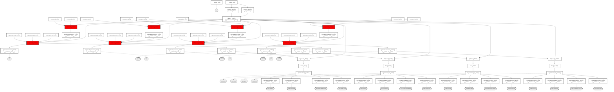

```mermaid
graph TD
    classDef path fill:#eee,stroke:#000
    classDef plan fill:#fff,stroke-width:3px
    classDef itemplan fill:#fff,stroke-width:6px
    classDef sideeffectplan fill:#f00,stroke-width:6px

    %% subgraph fields
    P1{{"~"}}:::path
    P2{{">p1"}}:::path
    P3([">p1>id"]):::path
    %% P2 -.-> P3
    P4{{">p1>post"}}:::path
    P5([">p1>post>id"]):::path
    %% P4 -.-> P5
    P6([">p1>post>title"]):::path
    %% P4 -.-> P6
    P7([">p1>post>description"]):::path
    %% P4 -.-> P7
    P8([">p1>post>note"]):::path
    %% P4 -.-> P8
    %% P2 -.-> P4
    %% P1 -.-> P2
    P9{{">p2"}}:::path
    P10([">p2>id"]):::path
    %% P9 -.-> P10
    P11{{">p2>post"}}:::path
    P12([">p2>post>id"]):::path
    %% P11 -.-> P12
    P13([">p2>post>title"]):::path
    %% P11 -.-> P13
    P14([">p2>post>description"]):::path
    %% P11 -.-> P14
    P15([">p2>post>note"]):::path
    %% P11 -.-> P15
    %% P9 -.-> P11
    %% P1 -.-> P9
    P16{{">p3"}}:::path
    P17([">p3>id"]):::path
    %% P16 -.-> P17
    P18{{">p3>post"}}:::path
    P19([">p3>post>id"]):::path
    %% P18 -.-> P19
    P20([">p3>post>title"]):::path
    %% P18 -.-> P20
    P21([">p3>post>description"]):::path
    %% P18 -.-> P21
    P22([">p3>post>note"]):::path
    %% P18 -.-> P22
    %% P16 -.-> P18
    %% P1 -.-> P16
    P23{{">p4"}}:::path
    P24([">p4>id"]):::path
    %% P23 -.-> P24
    P25{{">p4>post"}}:::path
    P26([">p4>post>id"]):::path
    %% P25 -.-> P26
    P27([">p4>post>title"]):::path
    %% P25 -.-> P27
    P28([">p4>post>description"]):::path
    %% P25 -.-> P28
    P29([">p4>post>note"]):::path
    %% P25 -.-> P29
    %% P23 -.-> P25
    %% P1 -.-> P23
    %% end

    %% define plans
    __Value_3["__Value[_3∈0]<br /><context>"]:::plan
    __Value_5["__Value[_5∈0]<br /><rootValue>"]:::plan
    InputStaticLeaf_8["InputStaticLeaf[_8∈0]"]:::plan
    InputStaticLeaf_9["InputStaticLeaf[_9∈0]"]:::plan
    InputStaticLeaf_10["InputStaticLeaf[_10∈0]"]:::plan
    Constant_11["Constant[_11∈0]"]:::plan
    Constant_12["Constant[_12∈0]"]:::plan
    PgInsert_13["PgInsert[_13∈0]"]:::sideeffectplan
    PgClassExpression_17["PgClassExpression[_17∈0]<br /><__relation...ems__.#quot;id#quot;>"]:::plan
    PgInsert_18["PgInsert[_18∈0]"]:::sideeffectplan
    PgClassExpression_22["PgClassExpression[_22∈0]<br /><__relational_posts__>"]:::plan
    PgClassExpression_23["PgClassExpression[_23∈0]<br /><(__relatio...ts__).#quot;id#quot;>"]:::plan
    PgSelect_25["PgSelect[_25∈0]<br /><relational_posts>"]:::plan
    First_29["First[_29∈0]"]:::plan
    PgSelectSingle_30["PgSelectSingle[_30∈0]<br /><relational_posts>"]:::plan
    PgClassExpression_31["PgClassExpression[_31∈0]<br /><__relation...sts__.#quot;id#quot;>"]:::plan
    PgClassExpression_32["PgClassExpression[_32∈0]<br /><__relation...__.#quot;title#quot;>"]:::plan
    PgClassExpression_33["PgClassExpression[_33∈0]<br /><__relation...scription#quot;>"]:::plan
    PgClassExpression_34["PgClassExpression[_34∈0]<br /><__relation...s__.#quot;note#quot;>"]:::plan
    InputStaticLeaf_36["InputStaticLeaf[_36∈0]"]:::plan
    InputStaticLeaf_37["InputStaticLeaf[_37∈0]"]:::plan
    InputStaticLeaf_38["InputStaticLeaf[_38∈0]"]:::plan
    Constant_39["Constant[_39∈0]"]:::plan
    Constant_40["Constant[_40∈0]"]:::plan
    PgInsert_41["PgInsert[_41∈0]"]:::sideeffectplan
    PgClassExpression_45["PgClassExpression[_45∈0]<br /><__relation...ems__.#quot;id#quot;>"]:::plan
    PgInsert_46["PgInsert[_46∈0]"]:::sideeffectplan
    PgClassExpression_50["PgClassExpression[_50∈0]<br /><__relational_posts__>"]:::plan
    PgClassExpression_51["PgClassExpression[_51∈0]<br /><(__relatio...ts__).#quot;id#quot;>"]:::plan
    PgSelect_53["PgSelect[_53∈0]<br /><relational_posts>"]:::plan
    First_57["First[_57∈0]"]:::plan
    PgSelectSingle_58["PgSelectSingle[_58∈0]<br /><relational_posts>"]:::plan
    PgClassExpression_59["PgClassExpression[_59∈0]<br /><__relation...sts__.#quot;id#quot;>"]:::plan
    PgClassExpression_60["PgClassExpression[_60∈0]<br /><__relation...__.#quot;title#quot;>"]:::plan
    PgClassExpression_61["PgClassExpression[_61∈0]<br /><__relation...scription#quot;>"]:::plan
    PgClassExpression_62["PgClassExpression[_62∈0]<br /><__relation...s__.#quot;note#quot;>"]:::plan
    InputStaticLeaf_64["InputStaticLeaf[_64∈0]"]:::plan
    InputStaticLeaf_65["InputStaticLeaf[_65∈0]"]:::plan
    InputStaticLeaf_66["InputStaticLeaf[_66∈0]"]:::plan
    Constant_67["Constant[_67∈0]"]:::plan
    Constant_68["Constant[_68∈0]"]:::plan
    PgInsert_69["PgInsert[_69∈0]"]:::sideeffectplan
    PgClassExpression_73["PgClassExpression[_73∈0]<br /><__relation...ems__.#quot;id#quot;>"]:::plan
    PgInsert_74["PgInsert[_74∈0]"]:::sideeffectplan
    PgClassExpression_78["PgClassExpression[_78∈0]<br /><__relational_posts__>"]:::plan
    PgClassExpression_79["PgClassExpression[_79∈0]<br /><(__relatio...ts__).#quot;id#quot;>"]:::plan
    PgSelect_81["PgSelect[_81∈0]<br /><relational_posts>"]:::plan
    First_85["First[_85∈0]"]:::plan
    PgSelectSingle_86["PgSelectSingle[_86∈0]<br /><relational_posts>"]:::plan
    PgClassExpression_87["PgClassExpression[_87∈0]<br /><__relation...sts__.#quot;id#quot;>"]:::plan
    PgClassExpression_88["PgClassExpression[_88∈0]<br /><__relation...__.#quot;title#quot;>"]:::plan
    PgClassExpression_89["PgClassExpression[_89∈0]<br /><__relation...scription#quot;>"]:::plan
    PgClassExpression_90["PgClassExpression[_90∈0]<br /><__relation...s__.#quot;note#quot;>"]:::plan
    InputStaticLeaf_92["InputStaticLeaf[_92∈0]"]:::plan
    InputStaticLeaf_93["InputStaticLeaf[_93∈0]"]:::plan
    InputStaticLeaf_94["InputStaticLeaf[_94∈0]"]:::plan
    Constant_95["Constant[_95∈0]"]:::plan
    Constant_96["Constant[_96∈0]"]:::plan
    PgInsert_97["PgInsert[_97∈0]"]:::sideeffectplan
    PgClassExpression_101["PgClassExpression[_101∈0]<br /><__relation...ems__.#quot;id#quot;>"]:::plan
    PgInsert_102["PgInsert[_102∈0]"]:::sideeffectplan
    PgClassExpression_106["PgClassExpression[_106∈0]<br /><__relational_posts__>"]:::plan
    PgClassExpression_107["PgClassExpression[_107∈0]<br /><(__relatio...ts__).#quot;id#quot;>"]:::plan
    PgSelect_109["PgSelect[_109∈0]<br /><relational_posts>"]:::plan
    Access_110["Access[_110∈0]<br /><_3.pgSettings>"]:::plan
    Access_111["Access[_111∈0]<br /><_3.withPgClient>"]:::plan
    Object_112["Object[_112∈0]<br /><{pgSettings,withPgClient}>"]:::plan
    First_113["First[_113∈0]"]:::plan
    PgSelectSingle_114["PgSelectSingle[_114∈0]<br /><relational_posts>"]:::plan
    PgClassExpression_115["PgClassExpression[_115∈0]<br /><__relation...sts__.#quot;id#quot;>"]:::plan
    PgClassExpression_116["PgClassExpression[_116∈0]<br /><__relation...__.#quot;title#quot;>"]:::plan
    PgClassExpression_117["PgClassExpression[_117∈0]<br /><__relation...scription#quot;>"]:::plan
    PgClassExpression_118["PgClassExpression[_118∈0]<br /><__relation...s__.#quot;note#quot;>"]:::plan

    %% plan dependencies
    Object_112 --> PgInsert_13
    Constant_11 --> PgInsert_13
    Constant_12 --> PgInsert_13
    PgInsert_13 --> PgClassExpression_17
    Object_112 --> PgInsert_18
    PgClassExpression_17 --> PgInsert_18
    InputStaticLeaf_8 --> PgInsert_18
    InputStaticLeaf_9 --> PgInsert_18
    InputStaticLeaf_10 --> PgInsert_18
    PgInsert_18 --> PgClassExpression_22
    PgInsert_18 --> PgClassExpression_23
    Object_112 --> PgSelect_25
    PgClassExpression_23 --> PgSelect_25
    PgSelect_25 --> First_29
    First_29 --> PgSelectSingle_30
    PgSelectSingle_30 --> PgClassExpression_31
    PgSelectSingle_30 --> PgClassExpression_32
    PgSelectSingle_30 --> PgClassExpression_33
    PgSelectSingle_30 --> PgClassExpression_34
    Object_112 --> PgInsert_41
    Constant_39 --> PgInsert_41
    Constant_40 --> PgInsert_41
    PgInsert_41 --> PgClassExpression_45
    Object_112 --> PgInsert_46
    PgClassExpression_45 --> PgInsert_46
    InputStaticLeaf_36 --> PgInsert_46
    InputStaticLeaf_37 --> PgInsert_46
    InputStaticLeaf_38 --> PgInsert_46
    PgInsert_46 --> PgClassExpression_50
    PgInsert_46 --> PgClassExpression_51
    Object_112 --> PgSelect_53
    PgClassExpression_51 --> PgSelect_53
    PgSelect_53 --> First_57
    First_57 --> PgSelectSingle_58
    PgSelectSingle_58 --> PgClassExpression_59
    PgSelectSingle_58 --> PgClassExpression_60
    PgSelectSingle_58 --> PgClassExpression_61
    PgSelectSingle_58 --> PgClassExpression_62
    Object_112 --> PgInsert_69
    Constant_67 --> PgInsert_69
    Constant_68 --> PgInsert_69
    PgInsert_69 --> PgClassExpression_73
    Object_112 --> PgInsert_74
    PgClassExpression_73 --> PgInsert_74
    InputStaticLeaf_64 --> PgInsert_74
    InputStaticLeaf_65 --> PgInsert_74
    InputStaticLeaf_66 --> PgInsert_74
    PgInsert_74 --> PgClassExpression_78
    PgInsert_74 --> PgClassExpression_79
    Object_112 --> PgSelect_81
    PgClassExpression_79 --> PgSelect_81
    PgSelect_81 --> First_85
    First_85 --> PgSelectSingle_86
    PgSelectSingle_86 --> PgClassExpression_87
    PgSelectSingle_86 --> PgClassExpression_88
    PgSelectSingle_86 --> PgClassExpression_89
    PgSelectSingle_86 --> PgClassExpression_90
    Object_112 --> PgInsert_97
    Constant_95 --> PgInsert_97
    Constant_96 --> PgInsert_97
    PgInsert_97 --> PgClassExpression_101
    Object_112 --> PgInsert_102
    PgClassExpression_101 --> PgInsert_102
    InputStaticLeaf_92 --> PgInsert_102
    InputStaticLeaf_93 --> PgInsert_102
    InputStaticLeaf_94 --> PgInsert_102
    PgInsert_102 --> PgClassExpression_106
    PgInsert_102 --> PgClassExpression_107
    Object_112 --> PgSelect_109
    PgClassExpression_107 --> PgSelect_109
    __Value_3 --> Access_110
    __Value_3 --> Access_111
    Access_110 --> Object_112
    Access_111 --> Object_112
    PgSelect_109 --> First_113
    First_113 --> PgSelectSingle_114
    PgSelectSingle_114 --> PgClassExpression_115
    PgSelectSingle_114 --> PgClassExpression_116
    PgSelectSingle_114 --> PgClassExpression_117
    PgSelectSingle_114 --> PgClassExpression_118

    %% plan-to-path relationships
    __Value_5 -.-> P1
    PgClassExpression_22 -.-> P2
    PgClassExpression_23 -.-> P3
    PgSelectSingle_30 -.-> P4
    PgClassExpression_31 -.-> P5
    PgClassExpression_32 -.-> P6
    PgClassExpression_33 -.-> P7
    PgClassExpression_34 -.-> P8
    PgClassExpression_50 -.-> P9
    PgClassExpression_51 -.-> P10
    PgSelectSingle_58 -.-> P11
    PgClassExpression_59 -.-> P12
    PgClassExpression_60 -.-> P13
    PgClassExpression_61 -.-> P14
    PgClassExpression_62 -.-> P15
    PgClassExpression_78 -.-> P16
    PgClassExpression_79 -.-> P17
    PgSelectSingle_86 -.-> P18
    PgClassExpression_87 -.-> P19
    PgClassExpression_88 -.-> P20
    PgClassExpression_89 -.-> P21
    PgClassExpression_90 -.-> P22
    PgClassExpression_106 -.-> P23
    PgClassExpression_107 -.-> P24
    PgSelectSingle_114 -.-> P25
    PgClassExpression_115 -.-> P26
    PgClassExpression_116 -.-> P27
    PgClassExpression_117 -.-> P28
    PgClassExpression_118 -.-> P29

    %% allocate buckets
    classDef bucket0 stroke:#696969
    class __Value_3,__Value_5,InputStaticLeaf_8,InputStaticLeaf_9,InputStaticLeaf_10,Constant_11,Constant_12,PgInsert_13,PgClassExpression_17,PgInsert_18,PgClassExpression_22,PgClassExpression_23,PgSelect_25,First_29,PgSelectSingle_30,PgClassExpression_31,PgClassExpression_32,PgClassExpression_33,PgClassExpression_34,InputStaticLeaf_36,InputStaticLeaf_37,InputStaticLeaf_38,Constant_39,Constant_40,PgInsert_41,PgClassExpression_45,PgInsert_46,PgClassExpression_50,PgClassExpression_51,PgSelect_53,First_57,PgSelectSingle_58,PgClassExpression_59,PgClassExpression_60,PgClassExpression_61,PgClassExpression_62,InputStaticLeaf_64,InputStaticLeaf_65,InputStaticLeaf_66,Constant_67,Constant_68,PgInsert_69,PgClassExpression_73,PgInsert_74,PgClassExpression_78,PgClassExpression_79,PgSelect_81,First_85,PgSelectSingle_86,PgClassExpression_87,PgClassExpression_88,PgClassExpression_89,PgClassExpression_90,InputStaticLeaf_92,InputStaticLeaf_93,InputStaticLeaf_94,Constant_95,Constant_96,PgInsert_97,PgClassExpression_101,PgInsert_102,PgClassExpression_106,PgClassExpression_107,PgSelect_109,Access_110,Access_111,Object_112,First_113,PgSelectSingle_114,PgClassExpression_115,PgClassExpression_116,PgClassExpression_117,PgClassExpression_118 bucket0
```
