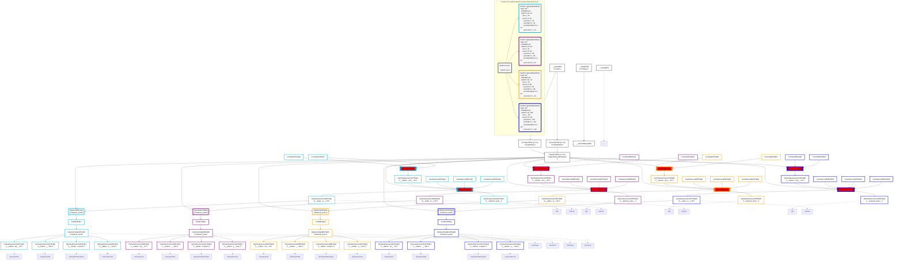

```mermaid
graph TD
    classDef path fill:#eee,stroke:#000,color:#000
    classDef plan fill:#fff,stroke-width:3px,color:#000
    classDef itemplan fill:#fff,stroke-width:6px,color:#000
    classDef sideeffectplan fill:#f00,stroke-width:6px,color:#000
    classDef bucket fill:#f6f6f6,color:#000,stroke-width:6px,text-align:left


    %% define plans
    __Value0["__Value[0∈0]"]:::plan
    PgClassExpression22["PgClassExpression[22∈1@1]<br />ᐸ__relational_posts__ᐳ"]:::plan
    PgClassExpression31["PgClassExpression[31∈1@1]<br />ᐸ__relation...sts__.”id”ᐳ"]:::plan
    PgClassExpression32["PgClassExpression[32∈1@1]<br />ᐸ__relation...__.”title”ᐳ"]:::plan
    PgClassExpression33["PgClassExpression[33∈1@1]<br />ᐸ__relation...scription”ᐳ"]:::plan
    PgClassExpression34["PgClassExpression[34∈1@1]<br />ᐸ__relation...s__.”note”ᐳ"]:::plan
    PgSelectSingle30["PgSelectSingle[30∈1@1]<br />ᐸrelational_postsᐳ"]:::plan
    First29["First[29∈1@1]"]:::plan
    PgSelect25[["PgSelect[25∈1@1]<br />ᐸrelational_postsᐳ"]]:::plan
    PgClassExpression23["PgClassExpression[23∈1@1]<br />ᐸ(__relatio...ts__).”id”ᐳ"]:::plan
    PgInsert18[["PgInsert[18∈1@1]"]]:::sideeffectplan
    PgClassExpression17["PgClassExpression[17∈1@1]<br />ᐸ__relation...ems__.”id”ᐳ"]:::plan
    PgInsert13[["PgInsert[13∈1@1]"]]:::sideeffectplan
    PgClassExpression50["PgClassExpression[50∈2@2]<br />ᐸ__relational_posts__ᐳ"]:::plan
    PgClassExpression59["PgClassExpression[59∈2@2]<br />ᐸ__relation...sts__.”id”ᐳ"]:::plan
    PgClassExpression60["PgClassExpression[60∈2@2]<br />ᐸ__relation...__.”title”ᐳ"]:::plan
    PgClassExpression61["PgClassExpression[61∈2@2]<br />ᐸ__relation...scription”ᐳ"]:::plan
    PgClassExpression62["PgClassExpression[62∈2@2]<br />ᐸ__relation...s__.”note”ᐳ"]:::plan
    PgSelectSingle58["PgSelectSingle[58∈2@2]<br />ᐸrelational_postsᐳ"]:::plan
    First57["First[57∈2@2]"]:::plan
    PgSelect53[["PgSelect[53∈2@2]<br />ᐸrelational_postsᐳ"]]:::plan
    PgClassExpression51["PgClassExpression[51∈2@2]<br />ᐸ(__relatio...ts__).”id”ᐳ"]:::plan
    PgInsert46[["PgInsert[46∈2@2]"]]:::sideeffectplan
    PgClassExpression45["PgClassExpression[45∈2@2]<br />ᐸ__relation...ems__.”id”ᐳ"]:::plan
    PgInsert41[["PgInsert[41∈2@2]"]]:::sideeffectplan
    PgClassExpression78["PgClassExpression[78∈3@3]<br />ᐸ__relational_posts__ᐳ"]:::plan
    PgClassExpression87["PgClassExpression[87∈3@3]<br />ᐸ__relation...sts__.”id”ᐳ"]:::plan
    PgClassExpression88["PgClassExpression[88∈3@3]<br />ᐸ__relation...__.”title”ᐳ"]:::plan
    PgClassExpression89["PgClassExpression[89∈3@3]<br />ᐸ__relation...scription”ᐳ"]:::plan
    PgClassExpression90["PgClassExpression[90∈3@3]<br />ᐸ__relation...s__.”note”ᐳ"]:::plan
    PgSelectSingle86["PgSelectSingle[86∈3@3]<br />ᐸrelational_postsᐳ"]:::plan
    First85["First[85∈3@3]"]:::plan
    PgSelect81[["PgSelect[81∈3@3]<br />ᐸrelational_postsᐳ"]]:::plan
    PgClassExpression79["PgClassExpression[79∈3@3]<br />ᐸ(__relatio...ts__).”id”ᐳ"]:::plan
    PgInsert74[["PgInsert[74∈3@3]"]]:::sideeffectplan
    PgClassExpression73["PgClassExpression[73∈3@3]<br />ᐸ__relation...ems__.”id”ᐳ"]:::plan
    PgInsert69[["PgInsert[69∈3@3]"]]:::sideeffectplan
    PgClassExpression106["PgClassExpression[106∈4@4]<br />ᐸ__relational_posts__ᐳ"]:::plan
    PgClassExpression115["PgClassExpression[115∈4@4]<br />ᐸ__relation...sts__.”id”ᐳ"]:::plan
    PgClassExpression116["PgClassExpression[116∈4@4]<br />ᐸ__relation...__.”title”ᐳ"]:::plan
    PgClassExpression117["PgClassExpression[117∈4@4]<br />ᐸ__relation...scription”ᐳ"]:::plan
    PgClassExpression118["PgClassExpression[118∈4@4]<br />ᐸ__relation...s__.”note”ᐳ"]:::plan
    PgSelectSingle114["PgSelectSingle[114∈4@4]<br />ᐸrelational_postsᐳ"]:::plan
    First113["First[113∈4@4]"]:::plan
    PgSelect109[["PgSelect[109∈4@4]<br />ᐸrelational_postsᐳ"]]:::plan
    PgClassExpression107["PgClassExpression[107∈4@4]<br />ᐸ(__relatio...ts__).”id”ᐳ"]:::plan
    PgInsert102[["PgInsert[102∈4@4]"]]:::sideeffectplan
    PgClassExpression101["PgClassExpression[101∈4@4]<br />ᐸ__relation...ems__.”id”ᐳ"]:::plan
    PgInsert97[["PgInsert[97∈4@4]"]]:::sideeffectplan
    Object112["Object[112∈0] {1,2,3,4}<br />ᐸ{pgSettings,withPgClient}ᐳ"]:::plan
    Access110["Access[110∈0] {1,2,3,4}<br />ᐸ3.pgSettingsᐳ"]:::plan
    Access111["Access[111∈0] {1,2,3,4}<br />ᐸ3.withPgClientᐳ"]:::plan
    __Value3["__Value[3∈0]<br />ᐸcontextᐳ"]:::plan
    __TrackedObject6["__TrackedObject[6∈0]"]:::plan
    __Value5["__Value[5∈0]<br />ᐸrootValueᐳ"]:::plan
    InputStaticLeaf8["InputStaticLeaf[8∈1@1]"]:::plan
    InputStaticLeaf9["InputStaticLeaf[9∈1@1]"]:::plan
    InputStaticLeaf10["InputStaticLeaf[10∈1@1]"]:::plan
    Constant11["Constant[11∈1@1]"]:::plan
    Constant12["Constant[12∈1@1]"]:::plan
    InputStaticLeaf36["InputStaticLeaf[36∈2@2]"]:::plan
    InputStaticLeaf37["InputStaticLeaf[37∈2@2]"]:::plan
    InputStaticLeaf38["InputStaticLeaf[38∈2@2]"]:::plan
    Constant39["Constant[39∈2@2]"]:::plan
    Constant40["Constant[40∈2@2]"]:::plan
    InputStaticLeaf64["InputStaticLeaf[64∈3@3]"]:::plan
    InputStaticLeaf65["InputStaticLeaf[65∈3@3]"]:::plan
    InputStaticLeaf66["InputStaticLeaf[66∈3@3]"]:::plan
    Constant67["Constant[67∈3@3]"]:::plan
    Constant68["Constant[68∈3@3]"]:::plan
    InputStaticLeaf92["InputStaticLeaf[92∈4@4]"]:::plan
    InputStaticLeaf93["InputStaticLeaf[93∈4@4]"]:::plan
    InputStaticLeaf94["InputStaticLeaf[94∈4@4]"]:::plan
    Constant95["Constant[95∈4@4]"]:::plan
    Constant96["Constant[96∈4@4]"]:::plan

    %% plan dependencies
    PgInsert18 --> PgClassExpression22
    PgSelectSingle30 --> PgClassExpression31
    PgSelectSingle30 --> PgClassExpression32
    PgSelectSingle30 --> PgClassExpression33
    PgSelectSingle30 --> PgClassExpression34
    First29 --> PgSelectSingle30
    PgSelect25 --> First29
    Object112 & PgClassExpression23 --> PgSelect25
    PgInsert18 --> PgClassExpression23
    Object112 & PgClassExpression17 & InputStaticLeaf8 & InputStaticLeaf9 & InputStaticLeaf10 --> PgInsert18
    PgInsert13 --> PgClassExpression17
    Object112 & Constant11 & Constant12 --> PgInsert13
    PgInsert46 --> PgClassExpression50
    PgSelectSingle58 --> PgClassExpression59
    PgSelectSingle58 --> PgClassExpression60
    PgSelectSingle58 --> PgClassExpression61
    PgSelectSingle58 --> PgClassExpression62
    First57 --> PgSelectSingle58
    PgSelect53 --> First57
    Object112 & PgClassExpression51 --> PgSelect53
    PgInsert46 --> PgClassExpression51
    Object112 & PgClassExpression45 & InputStaticLeaf36 & InputStaticLeaf37 & InputStaticLeaf38 --> PgInsert46
    PgInsert41 --> PgClassExpression45
    Object112 & Constant39 & Constant40 --> PgInsert41
    PgInsert74 --> PgClassExpression78
    PgSelectSingle86 --> PgClassExpression87
    PgSelectSingle86 --> PgClassExpression88
    PgSelectSingle86 --> PgClassExpression89
    PgSelectSingle86 --> PgClassExpression90
    First85 --> PgSelectSingle86
    PgSelect81 --> First85
    Object112 & PgClassExpression79 --> PgSelect81
    PgInsert74 --> PgClassExpression79
    Object112 & PgClassExpression73 & InputStaticLeaf64 & InputStaticLeaf65 & InputStaticLeaf66 --> PgInsert74
    PgInsert69 --> PgClassExpression73
    Object112 & Constant67 & Constant68 --> PgInsert69
    PgInsert102 --> PgClassExpression106
    PgSelectSingle114 --> PgClassExpression115
    PgSelectSingle114 --> PgClassExpression116
    PgSelectSingle114 --> PgClassExpression117
    PgSelectSingle114 --> PgClassExpression118
    First113 --> PgSelectSingle114
    PgSelect109 --> First113
    Object112 & PgClassExpression107 --> PgSelect109
    PgInsert102 --> PgClassExpression107
    Object112 & PgClassExpression101 & InputStaticLeaf92 & InputStaticLeaf93 & InputStaticLeaf94 --> PgInsert102
    PgInsert97 --> PgClassExpression101
    Object112 & Constant95 & Constant96 --> PgInsert97
    Access110 & Access111 --> Object112
    __Value3 --> Access110
    __Value3 --> Access111
    __Value5 --> __TrackedObject6

    %% plan-to-path relationships
    P0["~"]
    __Value0 -.-> P0
    P22["ᐳp1"]
    PgClassExpression22 -.-> P22
    P23["ᐳp1ᐳid"]
    PgClassExpression23 -.-> P23
    P30["ᐳp1ᐳpost"]
    PgSelectSingle30 -.-> P30
    P31["ᐳp1ᐳpostᐳid"]
    PgClassExpression31 -.-> P31
    P32["ᐳp1ᐳpostᐳtitle"]
    PgClassExpression32 -.-> P32
    P33["ᐳp1ᐳpostᐳdescription"]
    PgClassExpression33 -.-> P33
    P34["ᐳp1ᐳpostᐳnote"]
    PgClassExpression34 -.-> P34
    P50["ᐳp2"]
    PgClassExpression50 -.-> P50
    P51["ᐳp2ᐳid"]
    PgClassExpression51 -.-> P51
    P58["ᐳp2ᐳpost"]
    PgSelectSingle58 -.-> P58
    P59["ᐳp2ᐳpostᐳid"]
    PgClassExpression59 -.-> P59
    P60["ᐳp2ᐳpostᐳtitle"]
    PgClassExpression60 -.-> P60
    P61["ᐳp2ᐳpostᐳdescription"]
    PgClassExpression61 -.-> P61
    P62["ᐳp2ᐳpostᐳnote"]
    PgClassExpression62 -.-> P62
    P78["ᐳp3"]
    PgClassExpression78 -.-> P78
    P79["ᐳp3ᐳid"]
    PgClassExpression79 -.-> P79
    P86["ᐳp3ᐳpost"]
    PgSelectSingle86 -.-> P86
    P87["ᐳp3ᐳpostᐳid"]
    PgClassExpression87 -.-> P87
    P88["ᐳp3ᐳpostᐳtitle"]
    PgClassExpression88 -.-> P88
    P89["ᐳp3ᐳpostᐳdescription"]
    PgClassExpression89 -.-> P89
    P90["ᐳp3ᐳpostᐳnote"]
    PgClassExpression90 -.-> P90
    P106["ᐳp4"]
    PgClassExpression106 -.-> P106
    P107["ᐳp4ᐳid"]
    PgClassExpression107 -.-> P107
    P114["ᐳp4ᐳpost"]
    PgSelectSingle114 -.-> P114
    P115["ᐳp4ᐳpostᐳid"]
    PgClassExpression115 -.-> P115
    P116["ᐳp4ᐳpostᐳtitle"]
    PgClassExpression116 -.-> P116
    P117["ᐳp4ᐳpostᐳdescription"]
    PgClassExpression117 -.-> P117
    P118["ᐳp4ᐳpostᐳnote"]
    PgClassExpression118 -.-> P118

    subgraph "Buckets for mutations/basics/create-relational-post-x4"
    Bucket0("Bucket 0 (root)<br />~<br />⠀ROOT ᐸ-O- 0"):::bucket
    classDef bucket0 stroke:#696969
    class Bucket0,__Value0,__Value3,__Value5,__TrackedObject6,Access110,Access111,Object112 bucket0
    Bucket1("Bucket 1 (group1[mutation])<br />Deps: 112<br />~ᐳMutation.p1<br />⠀ROOT ᐸ-O- 22<br />⠀⠀id ᐸ-L- 23<br />⠀⠀post ᐸ-O- 30<br />⠀⠀⠀post.id ᐸ-L- 31<br />⠀⠀⠀post.title ᐸ-L- 32<br />⠀⠀⠀post.description ᐸ-L- 33<br />⠀⠀⠀post.note ᐸ-L- 34"):::bucket
    classDef bucket1 stroke:#00bfff
    class Bucket1,InputStaticLeaf8,InputStaticLeaf9,InputStaticLeaf10,Constant11,Constant12,PgInsert13,PgClassExpression17,PgInsert18,PgClassExpression22,PgClassExpression23,PgSelect25,First29,PgSelectSingle30,PgClassExpression31,PgClassExpression32,PgClassExpression33,PgClassExpression34 bucket1
    Bucket2("Bucket 2 (group2[mutation])<br />Deps: 112<br />~ᐳMutation.p2<br />⠀ROOT ᐸ-O- 50<br />⠀⠀id ᐸ-L- 51<br />⠀⠀post ᐸ-O- 58<br />⠀⠀⠀post.id ᐸ-L- 59<br />⠀⠀⠀post.title ᐸ-L- 60<br />⠀⠀⠀post.description ᐸ-L- 61<br />⠀⠀⠀post.note ᐸ-L- 62"):::bucket
    classDef bucket2 stroke:#7f007f
    class Bucket2,InputStaticLeaf36,InputStaticLeaf37,InputStaticLeaf38,Constant39,Constant40,PgInsert41,PgClassExpression45,PgInsert46,PgClassExpression50,PgClassExpression51,PgSelect53,First57,PgSelectSingle58,PgClassExpression59,PgClassExpression60,PgClassExpression61,PgClassExpression62 bucket2
    Bucket3("Bucket 3 (group3[mutation])<br />Deps: 112<br />~ᐳMutation.p3<br />⠀ROOT ᐸ-O- 78<br />⠀⠀id ᐸ-L- 79<br />⠀⠀post ᐸ-O- 86<br />⠀⠀⠀post.id ᐸ-L- 87<br />⠀⠀⠀post.title ᐸ-L- 88<br />⠀⠀⠀post.description ᐸ-L- 89<br />⠀⠀⠀post.note ᐸ-L- 90"):::bucket
    classDef bucket3 stroke:#ffa500
    class Bucket3,InputStaticLeaf64,InputStaticLeaf65,InputStaticLeaf66,Constant67,Constant68,PgInsert69,PgClassExpression73,PgInsert74,PgClassExpression78,PgClassExpression79,PgSelect81,First85,PgSelectSingle86,PgClassExpression87,PgClassExpression88,PgClassExpression89,PgClassExpression90 bucket3
    Bucket4("Bucket 4 (group4[mutation])<br />Deps: 112<br />~ᐳMutation.p4<br />⠀ROOT ᐸ-O- 106<br />⠀⠀id ᐸ-L- 107<br />⠀⠀post ᐸ-O- 114<br />⠀⠀⠀post.id ᐸ-L- 115<br />⠀⠀⠀post.title ᐸ-L- 116<br />⠀⠀⠀post.description ᐸ-L- 117<br />⠀⠀⠀post.note ᐸ-L- 118"):::bucket
    classDef bucket4 stroke:#0000ff
    class Bucket4,InputStaticLeaf92,InputStaticLeaf93,InputStaticLeaf94,Constant95,Constant96,PgInsert97,PgClassExpression101,PgInsert102,PgClassExpression106,PgClassExpression107,PgSelect109,First113,PgSelectSingle114,PgClassExpression115,PgClassExpression116,PgClassExpression117,PgClassExpression118 bucket4
    Bucket0 --> Bucket1 & Bucket2 & Bucket3 & Bucket4
    end
```
