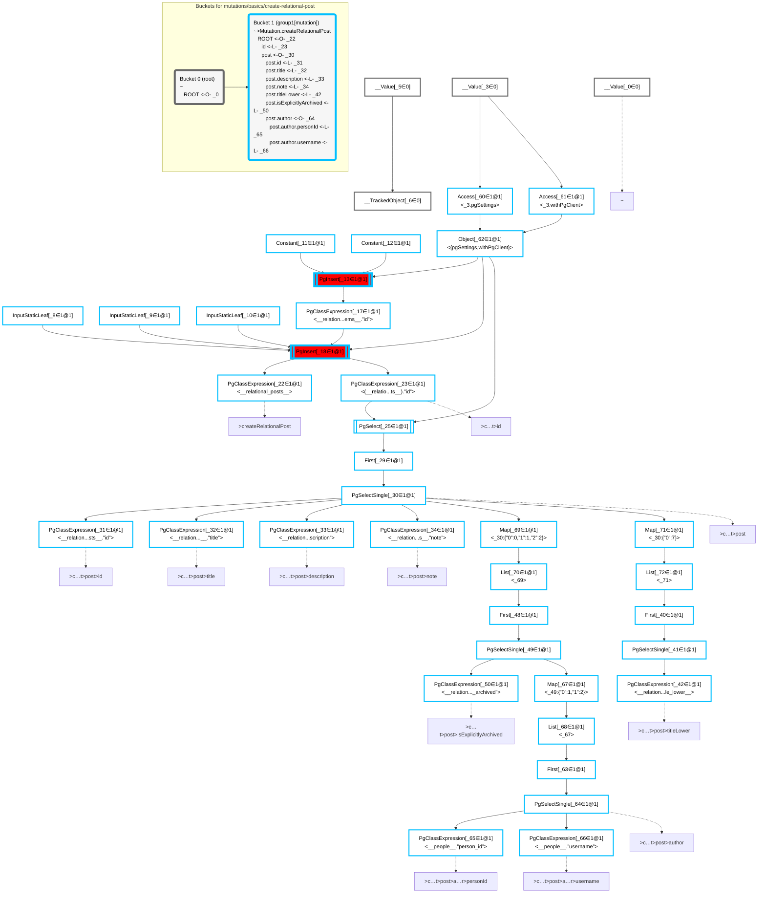

```mermaid
graph TD
    classDef path fill:#eee,stroke:#000,color:#000
    classDef plan fill:#fff,stroke-width:3px,color:#000
    classDef itemplan fill:#fff,stroke-width:6px,color:#000
    classDef sideeffectplan fill:#f00,stroke-width:6px,color:#000
    classDef bucket fill:#f6f6f6,color:#000,stroke-width:6px,text-align:left


    %% define plans
    __Value_0["__Value[_0∈0]"]:::plan
    __Value_3["__Value[_3∈0]<br /><context>"]:::plan
    __Value_5["__Value[_5∈0]<br /><rootValue>"]:::plan
    __TrackedObject_6["__TrackedObject[_6∈0]"]:::plan
    InputStaticLeaf_8["InputStaticLeaf[_8∈1@1]"]:::plan
    InputStaticLeaf_9["InputStaticLeaf[_9∈1@1]"]:::plan
    InputStaticLeaf_10["InputStaticLeaf[_10∈1@1]"]:::plan
    Constant_11["Constant[_11∈1@1]"]:::plan
    Constant_12["Constant[_12∈1@1]"]:::plan
    PgInsert_13[["PgInsert[_13∈1@1]"]]:::sideeffectplan
    PgClassExpression_17["PgClassExpression[_17∈1@1]<br /><__relation...ems__.”id”>"]:::plan
    PgInsert_18[["PgInsert[_18∈1@1]"]]:::sideeffectplan
    PgClassExpression_22["PgClassExpression[_22∈1@1]<br /><__relational_posts__>"]:::plan
    PgClassExpression_23["PgClassExpression[_23∈1@1]<br /><(__relatio...ts__).”id”>"]:::plan
    PgSelect_25[["PgSelect[_25∈1@1]<br /><relational_posts>"]]:::plan
    First_29["First[_29∈1@1]"]:::plan
    PgSelectSingle_30["PgSelectSingle[_30∈1@1]<br /><relational_posts>"]:::plan
    PgClassExpression_31["PgClassExpression[_31∈1@1]<br /><__relation...sts__.”id”>"]:::plan
    PgClassExpression_32["PgClassExpression[_32∈1@1]<br /><__relation...__.”title”>"]:::plan
    PgClassExpression_33["PgClassExpression[_33∈1@1]<br /><__relation...scription”>"]:::plan
    PgClassExpression_34["PgClassExpression[_34∈1@1]<br /><__relation...s__.”note”>"]:::plan
    First_40["First[_40∈1@1]"]:::plan
    PgSelectSingle_41["PgSelectSingle[_41∈1@1]<br /><text>"]:::plan
    PgClassExpression_42["PgClassExpression[_42∈1@1]<br /><__relation...le_lower__>"]:::plan
    First_48["First[_48∈1@1]"]:::plan
    PgSelectSingle_49["PgSelectSingle[_49∈1@1]<br /><relational_items>"]:::plan
    PgClassExpression_50["PgClassExpression[_50∈1@1]<br /><__relation..._archived”>"]:::plan
    Access_60["Access[_60∈1@1]<br /><_3.pgSettings>"]:::plan
    Access_61["Access[_61∈1@1]<br /><_3.withPgClient>"]:::plan
    Object_62["Object[_62∈1@1]<br /><{pgSettings,withPgClient}>"]:::plan
    First_63["First[_63∈1@1]"]:::plan
    PgSelectSingle_64["PgSelectSingle[_64∈1@1]<br /><people>"]:::plan
    PgClassExpression_65["PgClassExpression[_65∈1@1]<br /><__people__.”person_id”>"]:::plan
    PgClassExpression_66["PgClassExpression[_66∈1@1]<br /><__people__.”username”>"]:::plan
    Map_67["Map[_67∈1@1]<br /><_49:{”0”:1,”1”:2}>"]:::plan
    List_68["List[_68∈1@1]<br /><_67>"]:::plan
    Map_69["Map[_69∈1@1]<br /><_30:{”0”:0,”1”:1,”2”:2}>"]:::plan
    List_70["List[_70∈1@1]<br /><_69>"]:::plan
    Map_71["Map[_71∈1@1]<br /><_30:{”0”:7}>"]:::plan
    List_72["List[_72∈1@1]<br /><_71>"]:::plan

    %% plan dependencies
    __Value_5 --> __TrackedObject_6
    Object_62 --> PgInsert_13
    Constant_11 --> PgInsert_13
    Constant_12 --> PgInsert_13
    PgInsert_13 --> PgClassExpression_17
    Object_62 --> PgInsert_18
    PgClassExpression_17 --> PgInsert_18
    InputStaticLeaf_8 --> PgInsert_18
    InputStaticLeaf_9 --> PgInsert_18
    InputStaticLeaf_10 --> PgInsert_18
    PgInsert_18 --> PgClassExpression_22
    PgInsert_18 --> PgClassExpression_23
    Object_62 --> PgSelect_25
    PgClassExpression_23 --> PgSelect_25
    PgSelect_25 --> First_29
    First_29 --> PgSelectSingle_30
    PgSelectSingle_30 --> PgClassExpression_31
    PgSelectSingle_30 --> PgClassExpression_32
    PgSelectSingle_30 --> PgClassExpression_33
    PgSelectSingle_30 --> PgClassExpression_34
    List_72 --> First_40
    First_40 --> PgSelectSingle_41
    PgSelectSingle_41 --> PgClassExpression_42
    List_70 --> First_48
    First_48 --> PgSelectSingle_49
    PgSelectSingle_49 --> PgClassExpression_50
    __Value_3 --> Access_60
    __Value_3 --> Access_61
    Access_60 --> Object_62
    Access_61 --> Object_62
    List_68 --> First_63
    First_63 --> PgSelectSingle_64
    PgSelectSingle_64 --> PgClassExpression_65
    PgSelectSingle_64 --> PgClassExpression_66
    PgSelectSingle_49 --> Map_67
    Map_67 --> List_68
    PgSelectSingle_30 --> Map_69
    Map_69 --> List_70
    PgSelectSingle_30 --> Map_71
    Map_71 --> List_72

    %% plan-to-path relationships
    P_0["~"]
    __Value_0 -.-> P_0
    P_22[">createRelationalPost"]
    PgClassExpression_22 -.-> P_22
    P_23[">c…t>id"]
    PgClassExpression_23 -.-> P_23
    P_30[">c…t>post"]
    PgSelectSingle_30 -.-> P_30
    P_31[">c…t>post>id"]
    PgClassExpression_31 -.-> P_31
    P_32[">c…t>post>title"]
    PgClassExpression_32 -.-> P_32
    P_33[">c…t>post>description"]
    PgClassExpression_33 -.-> P_33
    P_34[">c…t>post>note"]
    PgClassExpression_34 -.-> P_34
    P_42[">c…t>post>titleLower"]
    PgClassExpression_42 -.-> P_42
    P_50[">c…t>post>isExplicitlyArchived"]
    PgClassExpression_50 -.-> P_50
    P_64[">c…t>post>author"]
    PgSelectSingle_64 -.-> P_64
    P_65[">c…t>post>a…r>personId"]
    PgClassExpression_65 -.-> P_65
    P_66[">c…t>post>a…r>username"]
    PgClassExpression_66 -.-> P_66

    %% allocate buckets
    classDef bucket0 stroke:#696969
    class __Value_0,__Value_3,__Value_5,__TrackedObject_6 bucket0
    classDef bucket1 stroke:#00bfff
    class InputStaticLeaf_8,InputStaticLeaf_9,InputStaticLeaf_10,Constant_11,Constant_12,PgInsert_13,PgClassExpression_17,PgInsert_18,PgClassExpression_22,PgClassExpression_23,PgSelect_25,First_29,PgSelectSingle_30,PgClassExpression_31,PgClassExpression_32,PgClassExpression_33,PgClassExpression_34,First_40,PgSelectSingle_41,PgClassExpression_42,First_48,PgSelectSingle_49,PgClassExpression_50,Access_60,Access_61,Object_62,First_63,PgSelectSingle_64,PgClassExpression_65,PgClassExpression_66,Map_67,List_68,Map_69,List_70,Map_71,List_72 bucket1

    subgraph "Buckets for mutations/basics/create-relational-post"
    Bucket0("Bucket 0 (root)<br />~<br />⠀ROOT <-O- _0"):::bucket
    style Bucket0 stroke:#696969
    Bucket1("Bucket 1 (group1[mutation])<br />~>Mutation.createRelationalPost<br />⠀ROOT <-O- _22<br />⠀⠀id <-L- _23<br />⠀⠀post <-O- _30<br />⠀⠀⠀post.id <-L- _31<br />⠀⠀⠀post.title <-L- _32<br />⠀⠀⠀post.description <-L- _33<br />⠀⠀⠀post.note <-L- _34<br />⠀⠀⠀post.titleLower <-L- _42<br />⠀⠀⠀post.isExplicitlyArchived <-L- _50<br />⠀⠀⠀post.author <-O- _64<br />⠀⠀⠀⠀post.author.personId <-L- _65<br />⠀⠀⠀⠀post.author.username <-L- _66"):::bucket
    style Bucket1 stroke:#00bfff
    Bucket0 --> Bucket1
    end
```
