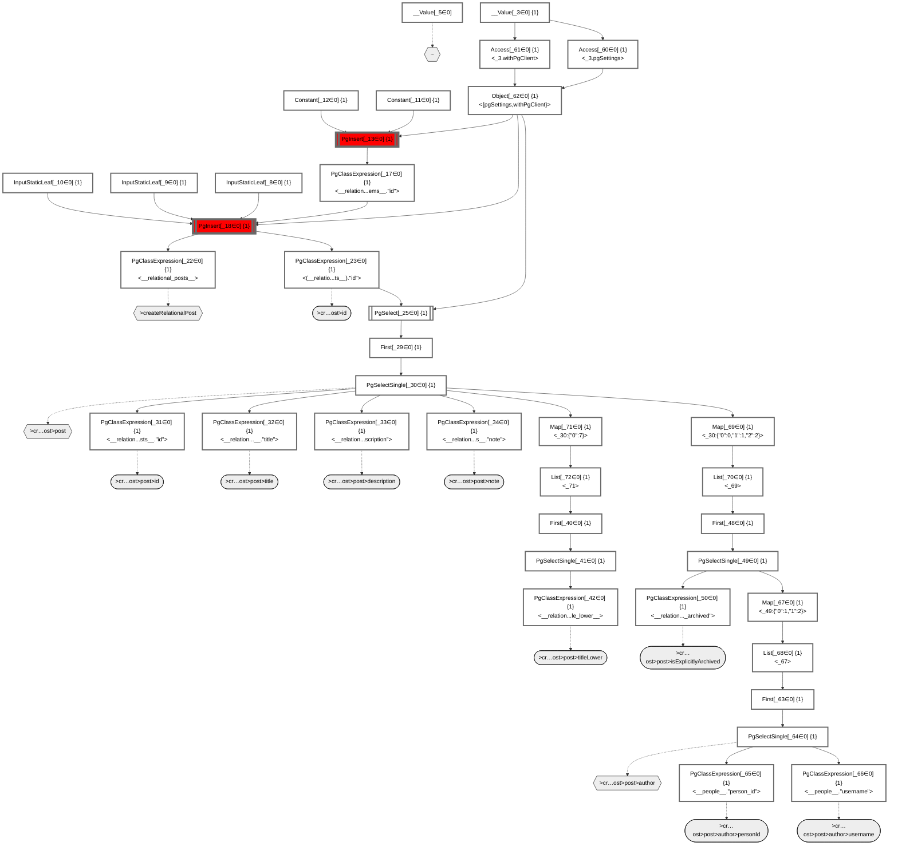

```mermaid
graph TD
    classDef path fill:#eee,stroke:#000,color:#000
    classDef plan fill:#fff,stroke-width:3px,color:#000
    classDef itemplan fill:#fff,stroke-width:6px,color:#000
    classDef sideeffectplan fill:#f00,stroke-width:6px,color:#000

    %% subgraph fields
    P1{{"~"}}:::path
    P2{{">createRelationalPost"}}:::path
    P3([">cr…ost>id"]):::path
    %% P2 -.-> P3
    P4{{">cr…ost>post"}}:::path
    P5([">cr…ost>post>id"]):::path
    %% P4 -.-> P5
    P6([">cr…ost>post>title"]):::path
    %% P4 -.-> P6
    P7([">cr…ost>post>description"]):::path
    %% P4 -.-> P7
    P8([">cr…ost>post>note"]):::path
    %% P4 -.-> P8
    P9([">cr…ost>post>titleLower"]):::path
    %% P4 -.-> P9
    P10([">cr…ost>post>isExplicitlyArchived"]):::path
    %% P4 -.-> P10
    P11{{">cr…ost>post>author"}}:::path
    P12([">cr…ost>post>author>personId"]):::path
    %% P11 -.-> P12
    P13([">cr…ost>post>author>username"]):::path
    %% P11 -.-> P13
    %% P4 -.-> P11
    %% P2 -.-> P4
    %% P1 -.-> P2
    %% end

    %% define plans
    __Value_3["__Value[_3∈0] {1}<br /><context>"]:::plan
    __Value_5["__Value[_5∈0]<br /><rootValue>"]:::plan
    InputStaticLeaf_8["InputStaticLeaf[_8∈0] {1}"]:::plan
    InputStaticLeaf_9["InputStaticLeaf[_9∈0] {1}"]:::plan
    InputStaticLeaf_10["InputStaticLeaf[_10∈0] {1}"]:::plan
    Constant_11["Constant[_11∈0] {1}"]:::plan
    Constant_12["Constant[_12∈0] {1}"]:::plan
    PgInsert_13[["PgInsert[_13∈0] {1}"]]:::sideeffectplan
    PgClassExpression_17["PgClassExpression[_17∈0] {1}<br /><__relation...ems__.#quot;id#quot;>"]:::plan
    PgInsert_18[["PgInsert[_18∈0] {1}"]]:::sideeffectplan
    PgClassExpression_22["PgClassExpression[_22∈0] {1}<br /><__relational_posts__>"]:::plan
    PgClassExpression_23["PgClassExpression[_23∈0] {1}<br /><(__relatio...ts__).#quot;id#quot;>"]:::plan
    PgSelect_25[["PgSelect[_25∈0] {1}<br /><relational_posts>"]]:::plan
    First_29["First[_29∈0] {1}"]:::plan
    PgSelectSingle_30["PgSelectSingle[_30∈0] {1}<br /><relational_posts>"]:::plan
    PgClassExpression_31["PgClassExpression[_31∈0] {1}<br /><__relation...sts__.#quot;id#quot;>"]:::plan
    PgClassExpression_32["PgClassExpression[_32∈0] {1}<br /><__relation...__.#quot;title#quot;>"]:::plan
    PgClassExpression_33["PgClassExpression[_33∈0] {1}<br /><__relation...scription#quot;>"]:::plan
    PgClassExpression_34["PgClassExpression[_34∈0] {1}<br /><__relation...s__.#quot;note#quot;>"]:::plan
    First_40["First[_40∈0] {1}"]:::plan
    PgSelectSingle_41["PgSelectSingle[_41∈0] {1}<br /><text>"]:::plan
    PgClassExpression_42["PgClassExpression[_42∈0] {1}<br /><__relation...le_lower__>"]:::plan
    First_48["First[_48∈0] {1}"]:::plan
    PgSelectSingle_49["PgSelectSingle[_49∈0] {1}<br /><relational_items>"]:::plan
    PgClassExpression_50["PgClassExpression[_50∈0] {1}<br /><__relation..._archived#quot;>"]:::plan
    Access_60["Access[_60∈0] {1}<br /><_3.pgSettings>"]:::plan
    Access_61["Access[_61∈0] {1}<br /><_3.withPgClient>"]:::plan
    Object_62["Object[_62∈0] {1}<br /><{pgSettings,withPgClient}>"]:::plan
    First_63["First[_63∈0] {1}"]:::plan
    PgSelectSingle_64["PgSelectSingle[_64∈0] {1}<br /><people>"]:::plan
    PgClassExpression_65["PgClassExpression[_65∈0] {1}<br /><__people__.#quot;person_id#quot;>"]:::plan
    PgClassExpression_66["PgClassExpression[_66∈0] {1}<br /><__people__.#quot;username#quot;>"]:::plan
    Map_67["Map[_67∈0] {1}<br /><_49:{#quot;0#quot;:1,#quot;1#quot;:2}>"]:::plan
    List_68["List[_68∈0] {1}<br /><_67>"]:::plan
    Map_69["Map[_69∈0] {1}<br /><_30:{#quot;0#quot;:0,#quot;1#quot;:1,#quot;2#quot;:2}>"]:::plan
    List_70["List[_70∈0] {1}<br /><_69>"]:::plan
    Map_71["Map[_71∈0] {1}<br /><_30:{#quot;0#quot;:7}>"]:::plan
    List_72["List[_72∈0] {1}<br /><_71>"]:::plan

    %% plan dependencies
    Object_62 --> PgInsert_13
    Constant_11 --> PgInsert_13
    Constant_12 --> PgInsert_13
    PgInsert_13 --> PgClassExpression_17
    Object_62 --> PgInsert_18
    PgClassExpression_17 --> PgInsert_18
    InputStaticLeaf_8 --> PgInsert_18
    InputStaticLeaf_9 --> PgInsert_18
    InputStaticLeaf_10 --> PgInsert_18
    PgInsert_18 --> PgClassExpression_22
    PgInsert_18 --> PgClassExpression_23
    Object_62 --> PgSelect_25
    PgClassExpression_23 --> PgSelect_25
    PgSelect_25 --> First_29
    First_29 --> PgSelectSingle_30
    PgSelectSingle_30 --> PgClassExpression_31
    PgSelectSingle_30 --> PgClassExpression_32
    PgSelectSingle_30 --> PgClassExpression_33
    PgSelectSingle_30 --> PgClassExpression_34
    List_72 --> First_40
    First_40 --> PgSelectSingle_41
    PgSelectSingle_41 --> PgClassExpression_42
    List_70 --> First_48
    First_48 --> PgSelectSingle_49
    PgSelectSingle_49 --> PgClassExpression_50
    __Value_3 --> Access_60
    __Value_3 --> Access_61
    Access_60 --> Object_62
    Access_61 --> Object_62
    List_68 --> First_63
    First_63 --> PgSelectSingle_64
    PgSelectSingle_64 --> PgClassExpression_65
    PgSelectSingle_64 --> PgClassExpression_66
    PgSelectSingle_49 --> Map_67
    Map_67 --> List_68
    PgSelectSingle_30 --> Map_69
    Map_69 --> List_70
    PgSelectSingle_30 --> Map_71
    Map_71 --> List_72

    %% plan-to-path relationships
    __Value_5 -.-> P1
    PgClassExpression_22 -.-> P2
    PgClassExpression_23 -.-> P3
    PgSelectSingle_30 -.-> P4
    PgClassExpression_31 -.-> P5
    PgClassExpression_32 -.-> P6
    PgClassExpression_33 -.-> P7
    PgClassExpression_34 -.-> P8
    PgClassExpression_42 -.-> P9
    PgClassExpression_50 -.-> P10
    PgSelectSingle_64 -.-> P11
    PgClassExpression_65 -.-> P12
    PgClassExpression_66 -.-> P13

    %% allocate buckets
    classDef bucket0 stroke:#696969
    class __Value_3,__Value_5,InputStaticLeaf_8,InputStaticLeaf_9,InputStaticLeaf_10,Constant_11,Constant_12,PgInsert_13,PgClassExpression_17,PgInsert_18,PgClassExpression_22,PgClassExpression_23,PgSelect_25,First_29,PgSelectSingle_30,PgClassExpression_31,PgClassExpression_32,PgClassExpression_33,PgClassExpression_34,First_40,PgSelectSingle_41,PgClassExpression_42,First_48,PgSelectSingle_49,PgClassExpression_50,Access_60,Access_61,Object_62,First_63,PgSelectSingle_64,PgClassExpression_65,PgClassExpression_66,Map_67,List_68,Map_69,List_70,Map_71,List_72 bucket0
```
