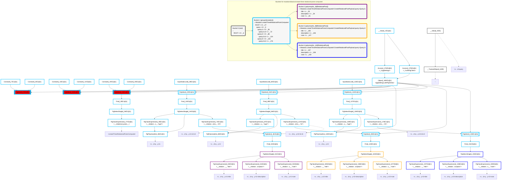

```mermaid
graph TD
    classDef path fill:#eee,stroke:#000,color:#000
    classDef plan fill:#fff,stroke-width:3px,color:#000
    classDef itemplan fill:#fff,stroke-width:6px,color:#000
    classDef sideeffectplan fill:#f00,stroke-width:6px,color:#000
    classDef bucket fill:#f6f6f6,color:#000,stroke-width:6px,text-align:left


    %% define plans
    __Value_3["__Value[_3∈1@1]<br /><context>"]:::plan
    __Value_5["__Value[_5∈0]<br /><rootValue>"]:::plan
    __TrackedObject_6["__TrackedObject[_6∈0]"]:::plan
    Constant_7["Constant[_7∈1@1]"]:::plan
    Constant_8["Constant[_8∈1@1]"]:::plan
    PgSelect_9[["PgSelect[_9∈1@1]<br /><relational_posts>"]]:::sideeffectplan
    Constant_13["Constant[_13∈1@1]"]:::plan
    Constant_14["Constant[_14∈1@1]"]:::plan
    PgSelect_15[["PgSelect[_15∈1@1]<br /><relational_posts>"]]:::sideeffectplan
    Constant_19["Constant[_19∈1@1]"]:::plan
    Constant_20["Constant[_20∈1@1]"]:::plan
    PgSelect_21[["PgSelect[_21∈1@1]<br /><relational_posts>"]]:::sideeffectplan
    First_25["First[_25∈1@1]"]:::plan
    PgSelectSingle_26["PgSelectSingle[_26∈1@1]<br /><relational_posts>"]:::plan
    PgClassExpression_27["PgClassExpression[_27∈1@1]<br /><__relational_posts__>"]:::plan
    InputStaticLeaf_28["InputStaticLeaf[_28∈1@1]"]:::plan
    PgSelect_29[["PgSelect[_29∈1@1]<br /><relational_items>"]]:::plan
    First_33["First[_33∈1@1]"]:::plan
    PgSelectSingle_34["PgSelectSingle[_34∈1@1]<br /><relational_items>"]:::plan
    PgClassExpression_35["PgClassExpression[_35∈1@1]<br /><__relation...s__.”type”>"]:::plan
    PgPolymorphic_36["PgPolymorphic[_36∈1@1]"]:::plan
    PgSelect_46[["PgSelect[_46∈1@1]<br /><relational_posts>"]]:::plan
    First_50["First[_50∈1@1]"]:::plan
    PgSelectSingle_51["PgSelectSingle[_51∈2@1]<br /><relational_posts>"]:::plan
    PgClassExpression_53["PgClassExpression[_53∈2@1]<br /><__relation...__.”title”>"]:::plan
    PgClassExpression_54["PgClassExpression[_54∈2@1]<br /><__relation...scription”>"]:::plan
    PgClassExpression_55["PgClassExpression[_55∈2@1]<br /><__relation...s__.”note”>"]:::plan
    PgClassExpression_72["PgClassExpression[_72∈1@1]<br /><__relation...ems__.”id”>"]:::plan
    InputStaticLeaf_80["InputStaticLeaf[_80∈1@1]"]:::plan
    PgSelect_81[["PgSelect[_81∈1@1]<br /><relational_items>"]]:::plan
    First_85["First[_85∈1@1]"]:::plan
    PgSelectSingle_86["PgSelectSingle[_86∈1@1]<br /><relational_items>"]:::plan
    PgClassExpression_87["PgClassExpression[_87∈1@1]<br /><__relation...s__.”type”>"]:::plan
    PgPolymorphic_88["PgPolymorphic[_88∈1@1]"]:::plan
    PgSelect_98[["PgSelect[_98∈1@1]<br /><relational_posts>"]]:::plan
    First_102["First[_102∈1@1]"]:::plan
    PgSelectSingle_103["PgSelectSingle[_103∈3@1]<br /><relational_posts>"]:::plan
    PgClassExpression_105["PgClassExpression[_105∈3@1]<br /><__relation...__.”title”>"]:::plan
    PgClassExpression_106["PgClassExpression[_106∈3@1]<br /><__relation...scription”>"]:::plan
    PgClassExpression_107["PgClassExpression[_107∈3@1]<br /><__relation...s__.”note”>"]:::plan
    PgClassExpression_124["PgClassExpression[_124∈1@1]<br /><__relation...ems__.”id”>"]:::plan
    InputStaticLeaf_132["InputStaticLeaf[_132∈1@1]"]:::plan
    PgSelect_133[["PgSelect[_133∈1@1]<br /><relational_items>"]]:::plan
    First_137["First[_137∈1@1]"]:::plan
    PgSelectSingle_138["PgSelectSingle[_138∈1@1]<br /><relational_items>"]:::plan
    PgClassExpression_139["PgClassExpression[_139∈1@1]<br /><__relation...s__.”type”>"]:::plan
    PgPolymorphic_140["PgPolymorphic[_140∈1@1]"]:::plan
    PgSelect_150[["PgSelect[_150∈1@1]<br /><relational_posts>"]]:::plan
    First_154["First[_154∈1@1]"]:::plan
    PgSelectSingle_155["PgSelectSingle[_155∈4@1]<br /><relational_posts>"]:::plan
    PgClassExpression_157["PgClassExpression[_157∈4@1]<br /><__relation...__.”title”>"]:::plan
    PgClassExpression_158["PgClassExpression[_158∈4@1]<br /><__relation...scription”>"]:::plan
    PgClassExpression_159["PgClassExpression[_159∈4@1]<br /><__relation...s__.”note”>"]:::plan
    PgClassExpression_176["PgClassExpression[_176∈1@1]<br /><__relation...ems__.”id”>"]:::plan
    Access_178["Access[_178∈1@1]<br /><_3.pgSettings>"]:::plan
    Access_179["Access[_179∈1@1]<br /><_3.withPgClient>"]:::plan
    Object_180["Object[_180∈1@1]<br /><{pgSettings,withPgClient}>"]:::plan

    %% plan dependencies
    __Value_5 --> __TrackedObject_6
    Object_180 --> PgSelect_9
    Constant_7 --> PgSelect_9
    Constant_8 --> PgSelect_9
    Object_180 --> PgSelect_15
    Constant_13 --> PgSelect_15
    Constant_14 --> PgSelect_15
    Object_180 --> PgSelect_21
    Constant_19 --> PgSelect_21
    Constant_20 --> PgSelect_21
    PgSelect_21 --> First_25
    First_25 --> PgSelectSingle_26
    PgSelectSingle_26 --> PgClassExpression_27
    Object_180 --> PgSelect_29
    InputStaticLeaf_28 --> PgSelect_29
    PgSelect_29 --> First_33
    First_33 --> PgSelectSingle_34
    PgSelectSingle_34 --> PgClassExpression_35
    PgSelectSingle_34 --> PgPolymorphic_36
    PgClassExpression_35 --> PgPolymorphic_36
    Object_180 --> PgSelect_46
    PgClassExpression_72 --> PgSelect_46
    PgSelect_46 --> First_50
    First_50 --> PgSelectSingle_51
    PgSelectSingle_51 --> PgClassExpression_53
    PgSelectSingle_51 --> PgClassExpression_54
    PgSelectSingle_51 --> PgClassExpression_55
    PgSelectSingle_34 --> PgClassExpression_72
    Object_180 --> PgSelect_81
    InputStaticLeaf_80 --> PgSelect_81
    PgSelect_81 --> First_85
    First_85 --> PgSelectSingle_86
    PgSelectSingle_86 --> PgClassExpression_87
    PgSelectSingle_86 --> PgPolymorphic_88
    PgClassExpression_87 --> PgPolymorphic_88
    Object_180 --> PgSelect_98
    PgClassExpression_124 --> PgSelect_98
    PgSelect_98 --> First_102
    First_102 --> PgSelectSingle_103
    PgSelectSingle_103 --> PgClassExpression_105
    PgSelectSingle_103 --> PgClassExpression_106
    PgSelectSingle_103 --> PgClassExpression_107
    PgSelectSingle_86 --> PgClassExpression_124
    Object_180 --> PgSelect_133
    InputStaticLeaf_132 --> PgSelect_133
    PgSelect_133 --> First_137
    First_137 --> PgSelectSingle_138
    PgSelectSingle_138 --> PgClassExpression_139
    PgSelectSingle_138 --> PgPolymorphic_140
    PgClassExpression_139 --> PgPolymorphic_140
    Object_180 --> PgSelect_150
    PgClassExpression_176 --> PgSelect_150
    PgSelect_150 --> First_154
    First_154 --> PgSelectSingle_155
    PgSelectSingle_155 --> PgClassExpression_157
    PgSelectSingle_155 --> PgClassExpression_158
    PgSelectSingle_155 --> PgClassExpression_159
    PgSelectSingle_138 --> PgClassExpression_176
    __Value_3 --> Access_178
    __Value_3 --> Access_179
    Access_178 --> Object_180
    Access_179 --> Object_180

    %% plan-to-path relationships
    P_5[">c…d>query"]
    __Value_5 -.-> P_5
    P_6["~"]
    __TrackedObject_6 -.-> P_6
    P_27[">createThreeRelationalPostsComputed"]
    PgClassExpression_27 -.-> P_27
    P_36[">c…d>q…y>i1"]
    PgPolymorphic_36 -.-> P_36
    P_53[">c…d>q…y>i1>title"]
    PgClassExpression_53 -.-> P_53
    P_54[">c…d>q…y>i1>description"]
    PgClassExpression_54 -.-> P_54
    P_55[">c…d>q…y>i1>note"]
    PgClassExpression_55 -.-> P_55
    P_72[">c…d>q…y>i1>id x5"]
    PgClassExpression_72 -.-> P_72
    P_88[">c…d>q…y>i2"]
    PgPolymorphic_88 -.-> P_88
    P_105[">c…d>q…y>i2>title"]
    PgClassExpression_105 -.-> P_105
    P_106[">c…d>q…y>i2>description"]
    PgClassExpression_106 -.-> P_106
    P_107[">c…d>q…y>i2>note"]
    PgClassExpression_107 -.-> P_107
    P_124[">c…d>q…y>i2>id x5"]
    PgClassExpression_124 -.-> P_124
    P_140[">c…d>q…y>i3"]
    PgPolymorphic_140 -.-> P_140
    P_157[">c…d>q…y>i3>title"]
    PgClassExpression_157 -.-> P_157
    P_158[">c…d>q…y>i3>description"]
    PgClassExpression_158 -.-> P_158
    P_159[">c…d>q…y>i3>note"]
    PgClassExpression_159 -.-> P_159
    P_176[">c…d>q…y>i3>id x5"]
    PgClassExpression_176 -.-> P_176

    %% allocate buckets
    classDef bucket0 stroke:#696969
    class __Value_5,__TrackedObject_6 bucket0
    classDef bucket1 stroke:#00bfff
    class __Value_3,Constant_7,Constant_8,PgSelect_9,Constant_13,Constant_14,PgSelect_15,Constant_19,Constant_20,PgSelect_21,First_25,PgSelectSingle_26,PgClassExpression_27,InputStaticLeaf_28,PgSelect_29,First_33,PgSelectSingle_34,PgClassExpression_35,PgPolymorphic_36,PgSelect_46,First_50,PgClassExpression_72,InputStaticLeaf_80,PgSelect_81,First_85,PgSelectSingle_86,PgClassExpression_87,PgPolymorphic_88,PgSelect_98,First_102,PgClassExpression_124,InputStaticLeaf_132,PgSelect_133,First_137,PgSelectSingle_138,PgClassExpression_139,PgPolymorphic_140,PgSelect_150,First_154,PgClassExpression_176,Access_178,Access_179,Object_180 bucket1
    classDef bucket2 stroke:#7f007f
    class PgSelectSingle_51,PgClassExpression_53,PgClassExpression_54,PgClassExpression_55 bucket2
    classDef bucket3 stroke:#ffa500
    class PgSelectSingle_103,PgClassExpression_105,PgClassExpression_106,PgClassExpression_107 bucket3
    classDef bucket4 stroke:#0000ff
    class PgSelectSingle_155,PgClassExpression_157,PgClassExpression_158,PgClassExpression_159 bucket4

    subgraph "Buckets for mutations/basics/create-three-relational-posts-computed"
    Bucket0("Bucket 0 (root)<br />~<br />⠀ROOT <-O- _6"):::bucket
    style Bucket0 stroke:#696969
    Bucket1("Bucket 1 (group1[mutation])<br />~>Mutation.createThreeRelationalPostsComputed<br />⠀ROOT <-O- _27<br />⠀⠀query <-O- _5<br />⠀⠀⠀query.i1 <-O- _36<br />⠀⠀⠀⠀query.i1.id <-L- _72<br />⠀⠀⠀query.i2 <-O- _88<br />⠀⠀⠀⠀query.i2.id <-L- _124<br />⠀⠀⠀query.i3 <-O- _140<br />⠀⠀⠀⠀query.i3.id <-L- _176"):::bucket
    style Bucket1 stroke:#00bfff
    Bucket0 --> Bucket1
    Bucket2("Bucket 2 (polymorphic_36[RelationalPost])<br />~>Mutation.createThreeRelationalPostsComputed>CreateRelationalPostPayload.query>Query.i1<br />⠀⠀title <-L- _53<br />⠀⠀description <-L- _54<br />⠀⠀note <-L- _55"):::bucket
    style Bucket2 stroke:#7f007f
    Bucket1 --> Bucket2
    Bucket3("Bucket 3 (polymorphic_88[RelationalPost])<br />~>Mutation.createThreeRelationalPostsComputed>CreateRelationalPostPayload.query>Query.i2<br />⠀⠀title <-L- _105<br />⠀⠀description <-L- _106<br />⠀⠀note <-L- _107"):::bucket
    style Bucket3 stroke:#ffa500
    Bucket1 --> Bucket3
    Bucket4("Bucket 4 (polymorphic_140[RelationalPost])<br />~>Mutation.createThreeRelationalPostsComputed>CreateRelationalPostPayload.query>Query.i3<br />⠀⠀title <-L- _157<br />⠀⠀description <-L- _158<br />⠀⠀note <-L- _159"):::bucket
    style Bucket4 stroke:#0000ff
    Bucket1 --> Bucket4
    end
```
