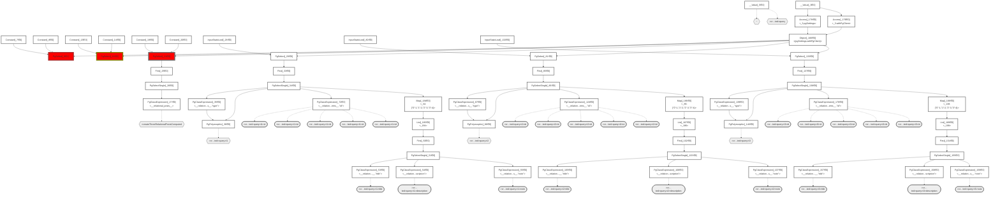

```mermaid
graph TD
    classDef path fill:#eee,stroke:#000
    classDef plan fill:#fff,stroke-width:3px
    classDef itemplan fill:#fff,stroke-width:6px
    classDef sideeffectplan fill:#f00,stroke-width:6px

    %% subgraph fields
    P1{{"~"}}:::path
    P2{{">createThreeRelationalPostsComputed"}}:::path
    P3{{">cr…ted>query"}}:::path
    P4{{">cr…ted>query>i1"}}:::path
    P5([">cr…ted>query>i1>id"]):::path
    %% P4 -.-> P5
    P6([">cr…ted>query>i1>id"]):::path
    %% P4 -.-> P6
    P7([">cr…ted>query>i1>title"]):::path
    %% P4 -.-> P7
    P8([">cr…ted>query>i1>description"]):::path
    %% P4 -.-> P8
    P9([">cr…ted>query>i1>note"]):::path
    %% P4 -.-> P9
    P10([">cr…ted>query>i1>id"]):::path
    %% P4 -.-> P10
    P11([">cr…ted>query>i1>id"]):::path
    %% P4 -.-> P11
    P12([">cr…ted>query>i1>id"]):::path
    %% P4 -.-> P12
    %% P3 -.-> P4
    P13{{">cr…ted>query>i2"}}:::path
    P14([">cr…ted>query>i2>id"]):::path
    %% P13 -.-> P14
    P15([">cr…ted>query>i2>id"]):::path
    %% P13 -.-> P15
    P16([">cr…ted>query>i2>title"]):::path
    %% P13 -.-> P16
    P17([">cr…ted>query>i2>description"]):::path
    %% P13 -.-> P17
    P18([">cr…ted>query>i2>note"]):::path
    %% P13 -.-> P18
    P19([">cr…ted>query>i2>id"]):::path
    %% P13 -.-> P19
    P20([">cr…ted>query>i2>id"]):::path
    %% P13 -.-> P20
    P21([">cr…ted>query>i2>id"]):::path
    %% P13 -.-> P21
    %% P3 -.-> P13
    P22{{">cr…ted>query>i3"}}:::path
    P23([">cr…ted>query>i3>id"]):::path
    %% P22 -.-> P23
    P24([">cr…ted>query>i3>id"]):::path
    %% P22 -.-> P24
    P25([">cr…ted>query>i3>title"]):::path
    %% P22 -.-> P25
    P26([">cr…ted>query>i3>description"]):::path
    %% P22 -.-> P26
    P27([">cr…ted>query>i3>note"]):::path
    %% P22 -.-> P27
    P28([">cr…ted>query>i3>id"]):::path
    %% P22 -.-> P28
    P29([">cr…ted>query>i3>id"]):::path
    %% P22 -.-> P29
    P30([">cr…ted>query>i3>id"]):::path
    %% P22 -.-> P30
    %% P3 -.-> P22
    %% P2 -.-> P3
    %% P1 -.-> P2
    %% end

    %% define plans
    __Value_3["__Value[_3∈0]<br /><context>"]:::plan
    __Value_5["__Value[_5∈0]<br /><rootValue>"]:::plan
    Constant_7["Constant[_7∈0]"]:::plan
    Constant_8["Constant[_8∈0]"]:::plan
    PgSelect_9["PgSelect[_9∈1]<br /><relational_posts>"]:::sideeffectplan
    Constant_13["Constant[_13∈0]"]:::plan
    Constant_14["Constant[_14∈0]"]:::plan
    PgSelect_15["PgSelect[_15∈2]<br /><relational_posts>"]:::sideeffectplan
    Constant_19["Constant[_19∈0]"]:::plan
    Constant_20["Constant[_20∈0]"]:::plan
    PgSelect_21["PgSelect[_21∈0]<br /><relational_posts>"]:::sideeffectplan
    First_25["First[_25∈0]"]:::plan
    PgSelectSingle_26["PgSelectSingle[_26∈0]<br /><relational_posts>"]:::plan
    PgClassExpression_27["PgClassExpression[_27∈0]<br /><__relational_posts__>"]:::plan
    InputStaticLeaf_28["InputStaticLeaf[_28∈0]"]:::plan
    PgSelect_29["PgSelect[_29∈0]<br /><relational_items>"]:::plan
    First_33["First[_33∈0]"]:::plan
    PgSelectSingle_34["PgSelectSingle[_34∈0]<br /><relational_items>"]:::plan
    PgClassExpression_35["PgClassExpression[_35∈0]<br /><__relation...s__.#quot;type#quot;>"]:::plan
    PgPolymorphic_36["PgPolymorphic[_36∈0]"]:::plan
    First_50["First[_50∈0]"]:::plan
    PgSelectSingle_51["PgSelectSingle[_51∈0]<br /><relational_posts>"]:::plan
    PgClassExpression_53["PgClassExpression[_53∈0]<br /><__relation...__.#quot;title#quot;>"]:::plan
    PgClassExpression_54["PgClassExpression[_54∈0]<br /><__relation...scription#quot;>"]:::plan
    PgClassExpression_55["PgClassExpression[_55∈0]<br /><__relation...s__.#quot;note#quot;>"]:::plan
    PgClassExpression_72["PgClassExpression[_72∈0]<br /><__relation...ems__.#quot;id#quot;>"]:::plan
    InputStaticLeaf_80["InputStaticLeaf[_80∈0]"]:::plan
    PgSelect_81["PgSelect[_81∈0]<br /><relational_items>"]:::plan
    First_85["First[_85∈0]"]:::plan
    PgSelectSingle_86["PgSelectSingle[_86∈0]<br /><relational_items>"]:::plan
    PgClassExpression_87["PgClassExpression[_87∈0]<br /><__relation...s__.#quot;type#quot;>"]:::plan
    PgPolymorphic_88["PgPolymorphic[_88∈0]"]:::plan
    First_102["First[_102∈0]"]:::plan
    PgSelectSingle_103["PgSelectSingle[_103∈0]<br /><relational_posts>"]:::plan
    PgClassExpression_105["PgClassExpression[_105∈0]<br /><__relation...__.#quot;title#quot;>"]:::plan
    PgClassExpression_106["PgClassExpression[_106∈0]<br /><__relation...scription#quot;>"]:::plan
    PgClassExpression_107["PgClassExpression[_107∈0]<br /><__relation...s__.#quot;note#quot;>"]:::plan
    PgClassExpression_124["PgClassExpression[_124∈0]<br /><__relation...ems__.#quot;id#quot;>"]:::plan
    InputStaticLeaf_132["InputStaticLeaf[_132∈0]"]:::plan
    PgSelect_133["PgSelect[_133∈0]<br /><relational_items>"]:::plan
    First_137["First[_137∈0]"]:::plan
    PgSelectSingle_138["PgSelectSingle[_138∈0]<br /><relational_items>"]:::plan
    PgClassExpression_139["PgClassExpression[_139∈0]<br /><__relation...s__.#quot;type#quot;>"]:::plan
    PgPolymorphic_140["PgPolymorphic[_140∈0]"]:::plan
    First_154["First[_154∈0]"]:::plan
    PgSelectSingle_155["PgSelectSingle[_155∈0]<br /><relational_posts>"]:::plan
    PgClassExpression_157["PgClassExpression[_157∈0]<br /><__relation...__.#quot;title#quot;>"]:::plan
    PgClassExpression_158["PgClassExpression[_158∈0]<br /><__relation...scription#quot;>"]:::plan
    PgClassExpression_159["PgClassExpression[_159∈0]<br /><__relation...s__.#quot;note#quot;>"]:::plan
    PgClassExpression_176["PgClassExpression[_176∈0]<br /><__relation...ems__.#quot;id#quot;>"]:::plan
    Access_178["Access[_178∈0]<br /><_3.pgSettings>"]:::plan
    Access_179["Access[_179∈0]<br /><_3.withPgClient>"]:::plan
    Object_180["Object[_180∈0]<br /><{pgSettings,withPgClient}>"]:::plan
    Map_184["Map[_184∈0]<br /><_34:{#quot;0#quot;:1,#quot;1#quot;:2,#quot;2#quot;:3,#quot;3#quot;:4}>"]:::plan
    List_185["List[_185∈0]<br /><_184>"]:::plan
    Map_186["Map[_186∈0]<br /><_86:{#quot;0#quot;:1,#quot;1#quot;:2,#quot;2#quot;:3,#quot;3#quot;:4}>"]:::plan
    List_187["List[_187∈0]<br /><_186>"]:::plan
    Map_188["Map[_188∈0]<br /><_138:{#quot;0#quot;:1,#quot;1#quot;:2,#quot;2#quot;:3,#quot;3#quot;:4}>"]:::plan
    List_189["List[_189∈0]<br /><_188>"]:::plan

    %% plan dependencies
    Object_180 --> PgSelect_9
    Constant_7 --> PgSelect_9
    Constant_8 --> PgSelect_9
    Object_180 --> PgSelect_15
    Constant_13 --> PgSelect_15
    Constant_14 --> PgSelect_15
    Object_180 --> PgSelect_21
    Constant_19 --> PgSelect_21
    Constant_20 --> PgSelect_21
    PgSelect_21 --> First_25
    First_25 --> PgSelectSingle_26
    PgSelectSingle_26 --> PgClassExpression_27
    Object_180 --> PgSelect_29
    InputStaticLeaf_28 --> PgSelect_29
    PgSelect_29 --> First_33
    First_33 --> PgSelectSingle_34
    PgSelectSingle_34 --> PgClassExpression_35
    PgSelectSingle_34 --> PgPolymorphic_36
    PgClassExpression_35 --> PgPolymorphic_36
    List_185 --> First_50
    First_50 --> PgSelectSingle_51
    PgSelectSingle_51 --> PgClassExpression_53
    PgSelectSingle_51 --> PgClassExpression_54
    PgSelectSingle_51 --> PgClassExpression_55
    PgSelectSingle_34 --> PgClassExpression_72
    Object_180 --> PgSelect_81
    InputStaticLeaf_80 --> PgSelect_81
    PgSelect_81 --> First_85
    First_85 --> PgSelectSingle_86
    PgSelectSingle_86 --> PgClassExpression_87
    PgSelectSingle_86 --> PgPolymorphic_88
    PgClassExpression_87 --> PgPolymorphic_88
    List_187 --> First_102
    First_102 --> PgSelectSingle_103
    PgSelectSingle_103 --> PgClassExpression_105
    PgSelectSingle_103 --> PgClassExpression_106
    PgSelectSingle_103 --> PgClassExpression_107
    PgSelectSingle_86 --> PgClassExpression_124
    Object_180 --> PgSelect_133
    InputStaticLeaf_132 --> PgSelect_133
    PgSelect_133 --> First_137
    First_137 --> PgSelectSingle_138
    PgSelectSingle_138 --> PgClassExpression_139
    PgSelectSingle_138 --> PgPolymorphic_140
    PgClassExpression_139 --> PgPolymorphic_140
    List_189 --> First_154
    First_154 --> PgSelectSingle_155
    PgSelectSingle_155 --> PgClassExpression_157
    PgSelectSingle_155 --> PgClassExpression_158
    PgSelectSingle_155 --> PgClassExpression_159
    PgSelectSingle_138 --> PgClassExpression_176
    __Value_3 --> Access_178
    __Value_3 --> Access_179
    Access_178 --> Object_180
    Access_179 --> Object_180
    PgSelectSingle_34 --> Map_184
    Map_184 --> List_185
    PgSelectSingle_86 --> Map_186
    Map_186 --> List_187
    PgSelectSingle_138 --> Map_188
    Map_188 --> List_189

    %% plan-to-path relationships
    __Value_5 -.-> P1
    PgClassExpression_27 -.-> P2
    __Value_5 -.-> P3
    PgPolymorphic_36 -.-> P4
    PgClassExpression_72 -.-> P5
    PgClassExpression_72 -.-> P6
    PgClassExpression_53 -.-> P7
    PgClassExpression_54 -.-> P8
    PgClassExpression_55 -.-> P9
    PgClassExpression_72 -.-> P10
    PgClassExpression_72 -.-> P11
    PgClassExpression_72 -.-> P12
    PgPolymorphic_88 -.-> P13
    PgClassExpression_124 -.-> P14
    PgClassExpression_124 -.-> P15
    PgClassExpression_105 -.-> P16
    PgClassExpression_106 -.-> P17
    PgClassExpression_107 -.-> P18
    PgClassExpression_124 -.-> P19
    PgClassExpression_124 -.-> P20
    PgClassExpression_124 -.-> P21
    PgPolymorphic_140 -.-> P22
    PgClassExpression_176 -.-> P23
    PgClassExpression_176 -.-> P24
    PgClassExpression_157 -.-> P25
    PgClassExpression_158 -.-> P26
    PgClassExpression_159 -.-> P27
    PgClassExpression_176 -.-> P28
    PgClassExpression_176 -.-> P29
    PgClassExpression_176 -.-> P30

    %% allocate buckets
    classDef bucket0 stroke:#696969
    class __Value_3,__Value_5,Constant_7,Constant_8,Constant_13,Constant_14,Constant_19,Constant_20,PgSelect_21,First_25,PgSelectSingle_26,PgClassExpression_27,InputStaticLeaf_28,PgSelect_29,First_33,PgSelectSingle_34,PgClassExpression_35,PgPolymorphic_36,First_50,PgSelectSingle_51,PgClassExpression_53,PgClassExpression_54,PgClassExpression_55,PgClassExpression_72,InputStaticLeaf_80,PgSelect_81,First_85,PgSelectSingle_86,PgClassExpression_87,PgPolymorphic_88,First_102,PgSelectSingle_103,PgClassExpression_105,PgClassExpression_106,PgClassExpression_107,PgClassExpression_124,InputStaticLeaf_132,PgSelect_133,First_137,PgSelectSingle_138,PgClassExpression_139,PgPolymorphic_140,First_154,PgSelectSingle_155,PgClassExpression_157,PgClassExpression_158,PgClassExpression_159,PgClassExpression_176,Access_178,Access_179,Object_180,Map_184,List_185,Map_186,List_187,Map_188,List_189 bucket0
    classDef bucket1 stroke:#a52a2a
    class PgSelect_9 bucket1
    classDef bucket2 stroke:#808000
    class PgSelect_15 bucket2
```
