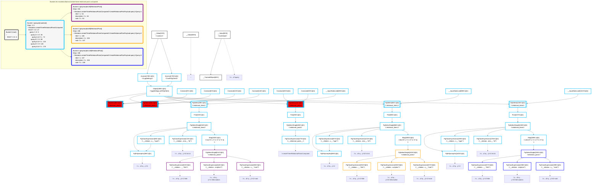

```mermaid
graph TD
    classDef path fill:#eee,stroke:#000,color:#000
    classDef plan fill:#fff,stroke-width:3px,color:#000
    classDef itemplan fill:#fff,stroke-width:6px,color:#000
    classDef sideeffectplan fill:#f00,stroke-width:6px,color:#000
    classDef bucket fill:#f6f6f6,color:#000,stroke-width:6px,text-align:left


    %% define plans
    __Value0["__Value[0∈0]"]:::plan
    PgSelect9[["PgSelect[9∈1@1]<br />ᐸrelational_postsᐳ"]]:::sideeffectplan
    PgSelect15[["PgSelect[15∈1@1]<br />ᐸrelational_postsᐳ"]]:::sideeffectplan
    PgClassExpression27["PgClassExpression[27∈1@1]<br />ᐸ__relational_posts__ᐳ"]:::plan
    PgSelectSingle26["PgSelectSingle[26∈1@1]<br />ᐸrelational_postsᐳ"]:::plan
    First25["First[25∈1@1]"]:::plan
    PgSelect21[["PgSelect[21∈1@1]<br />ᐸrelational_postsᐳ"]]:::sideeffectplan
    PgPolymorphic36["PgPolymorphic[36∈1@1]"]:::plan
    PgClassExpression35["PgClassExpression[35∈1@1]<br />ᐸ__relation...s__.”type”ᐳ"]:::plan
    PgClassExpression72["PgClassExpression[72∈1@1]<br />ᐸ__relation...ems__.”id”ᐳ"]:::plan
    PgClassExpression53["PgClassExpression[53∈2@1]<br />ᐸ__relation...__.”title”ᐳ"]:::plan
    PgClassExpression54["PgClassExpression[54∈2@1]<br />ᐸ__relation...scription”ᐳ"]:::plan
    PgClassExpression55["PgClassExpression[55∈2@1]<br />ᐸ__relation...s__.”note”ᐳ"]:::plan
    PgSelectSingle51["PgSelectSingle[51∈2@1]<br />ᐸrelational_postsᐳ"]:::plan
    Map184["Map[184∈1@1]<br />ᐸ34:{”0”:1,”1”:2,”2”:3,”3”:4}ᐳ"]:::plan
    PgSelectSingle34["PgSelectSingle[34∈1@1]<br />ᐸrelational_itemsᐳ"]:::plan
    First33["First[33∈1@1]"]:::plan
    PgSelect29[["PgSelect[29∈1@1]<br />ᐸrelational_itemsᐳ"]]:::plan
    PgPolymorphic88["PgPolymorphic[88∈1@1]"]:::plan
    PgClassExpression87["PgClassExpression[87∈1@1]<br />ᐸ__relation...s__.”type”ᐳ"]:::plan
    PgClassExpression124["PgClassExpression[124∈1@1]<br />ᐸ__relation...ems__.”id”ᐳ"]:::plan
    PgClassExpression105["PgClassExpression[105∈3@1]<br />ᐸ__relation...__.”title”ᐳ"]:::plan
    PgClassExpression106["PgClassExpression[106∈3@1]<br />ᐸ__relation...scription”ᐳ"]:::plan
    PgClassExpression107["PgClassExpression[107∈3@1]<br />ᐸ__relation...s__.”note”ᐳ"]:::plan
    PgSelectSingle103["PgSelectSingle[103∈3@1]<br />ᐸrelational_postsᐳ"]:::plan
    Map186["Map[186∈1@1]<br />ᐸ86:{”0”:1,”1”:2,”2”:3,”3”:4}ᐳ"]:::plan
    PgSelectSingle86["PgSelectSingle[86∈1@1]<br />ᐸrelational_itemsᐳ"]:::plan
    First85["First[85∈1@1]"]:::plan
    PgSelect81[["PgSelect[81∈1@1]<br />ᐸrelational_itemsᐳ"]]:::plan
    PgPolymorphic140["PgPolymorphic[140∈1@1]"]:::plan
    PgClassExpression139["PgClassExpression[139∈1@1]<br />ᐸ__relation...s__.”type”ᐳ"]:::plan
    PgClassExpression176["PgClassExpression[176∈1@1]<br />ᐸ__relation...ems__.”id”ᐳ"]:::plan
    PgClassExpression157["PgClassExpression[157∈4@1]<br />ᐸ__relation...__.”title”ᐳ"]:::plan
    PgClassExpression158["PgClassExpression[158∈4@1]<br />ᐸ__relation...scription”ᐳ"]:::plan
    PgClassExpression159["PgClassExpression[159∈4@1]<br />ᐸ__relation...s__.”note”ᐳ"]:::plan
    PgSelectSingle155["PgSelectSingle[155∈4@1]<br />ᐸrelational_postsᐳ"]:::plan
    Map188["Map[188∈1@1]<br />ᐸ138:{”0”:1,”1”:2,”2”:3,”3”:4}ᐳ"]:::plan
    PgSelectSingle138["PgSelectSingle[138∈1@1]<br />ᐸrelational_itemsᐳ"]:::plan
    First137["First[137∈1@1]"]:::plan
    PgSelect133[["PgSelect[133∈1@1]<br />ᐸrelational_itemsᐳ"]]:::plan
    Object180["Object[180∈1@1]<br />ᐸ{pgSettings,withPgClient}ᐳ"]:::plan
    Access178["Access[178∈1@1]<br />ᐸ3.pgSettingsᐳ"]:::plan
    Access179["Access[179∈1@1]<br />ᐸ3.withPgClientᐳ"]:::plan
    __Value3["__Value[3∈0]<br />ᐸcontextᐳ"]:::plan
    __TrackedObject6["__TrackedObject[6∈0]"]:::plan
    __Value5["__Value[5∈0]<br />ᐸrootValueᐳ"]:::plan
    Constant7["Constant[7∈1@1]"]:::plan
    Constant8["Constant[8∈1@1]"]:::plan
    Constant13["Constant[13∈1@1]"]:::plan
    Constant14["Constant[14∈1@1]"]:::plan
    Constant19["Constant[19∈1@1]"]:::plan
    Constant20["Constant[20∈1@1]"]:::plan
    __InputStaticLeaf28["__InputStaticLeaf[28∈1@1]"]:::plan
    __InputStaticLeaf80["__InputStaticLeaf[80∈1@1]"]:::plan
    __InputStaticLeaf132["__InputStaticLeaf[132∈1@1]"]:::plan

    %% plan dependencies
    Object180 & Constant7 & Constant8 --> PgSelect9
    Object180 & Constant13 & Constant14 --> PgSelect15
    PgSelectSingle26 --> PgClassExpression27
    First25 --> PgSelectSingle26
    PgSelect21 --> First25
    Object180 & Constant19 & Constant20 --> PgSelect21
    PgSelectSingle34 & PgClassExpression35 --> PgPolymorphic36
    PgSelectSingle34 --> PgClassExpression35
    PgSelectSingle34 --> PgClassExpression72
    PgSelectSingle51 --> PgClassExpression53
    PgSelectSingle51 --> PgClassExpression54
    PgSelectSingle51 --> PgClassExpression55
    Map184 --> PgSelectSingle51
    PgSelectSingle34 --> Map184
    First33 --> PgSelectSingle34
    PgSelect29 --> First33
    Object180 & __InputStaticLeaf28 --> PgSelect29
    PgSelectSingle86 & PgClassExpression87 --> PgPolymorphic88
    PgSelectSingle86 --> PgClassExpression87
    PgSelectSingle86 --> PgClassExpression124
    PgSelectSingle103 --> PgClassExpression105
    PgSelectSingle103 --> PgClassExpression106
    PgSelectSingle103 --> PgClassExpression107
    Map186 --> PgSelectSingle103
    PgSelectSingle86 --> Map186
    First85 --> PgSelectSingle86
    PgSelect81 --> First85
    Object180 & __InputStaticLeaf80 --> PgSelect81
    PgSelectSingle138 & PgClassExpression139 --> PgPolymorphic140
    PgSelectSingle138 --> PgClassExpression139
    PgSelectSingle138 --> PgClassExpression176
    PgSelectSingle155 --> PgClassExpression157
    PgSelectSingle155 --> PgClassExpression158
    PgSelectSingle155 --> PgClassExpression159
    Map188 --> PgSelectSingle155
    PgSelectSingle138 --> Map188
    First137 --> PgSelectSingle138
    PgSelect133 --> First137
    Object180 & __InputStaticLeaf132 --> PgSelect133
    Access178 & Access179 --> Object180
    __Value3 --> Access178
    __Value3 --> Access179
    __Value5 --> __TrackedObject6

    %% plan-to-path relationships
    P0["~"]
    __Value0 -.-> P0
    P5["ᐳc…dᐳquery"]
    __Value5 -.-> P5
    P27["ᐳcreateThreeRelationalPostsComputed"]
    PgClassExpression27 -.-> P27
    P36["ᐳc…dᐳq…yᐳi1"]
    PgPolymorphic36 -.-> P36
    P53["ᐳc…dᐳq…yᐳi1ᐳtitle"]
    PgClassExpression53 -.-> P53
    P54["ᐳc…dᐳq…yᐳi1ᐳdescription"]
    PgClassExpression54 -.-> P54
    P55["ᐳc…dᐳq…yᐳi1ᐳnote"]
    PgClassExpression55 -.-> P55
    P72["ᐳc…dᐳq…yᐳi1ᐳid x5"]
    PgClassExpression72 -.-> P72
    P88["ᐳc…dᐳq…yᐳi2"]
    PgPolymorphic88 -.-> P88
    P105["ᐳc…dᐳq…yᐳi2ᐳtitle"]
    PgClassExpression105 -.-> P105
    P106["ᐳc…dᐳq…yᐳi2ᐳdescription"]
    PgClassExpression106 -.-> P106
    P107["ᐳc…dᐳq…yᐳi2ᐳnote"]
    PgClassExpression107 -.-> P107
    P124["ᐳc…dᐳq…yᐳi2ᐳid x5"]
    PgClassExpression124 -.-> P124
    P140["ᐳc…dᐳq…yᐳi3"]
    PgPolymorphic140 -.-> P140
    P157["ᐳc…dᐳq…yᐳi3ᐳtitle"]
    PgClassExpression157 -.-> P157
    P158["ᐳc…dᐳq…yᐳi3ᐳdescription"]
    PgClassExpression158 -.-> P158
    P159["ᐳc…dᐳq…yᐳi3ᐳnote"]
    PgClassExpression159 -.-> P159
    P176["ᐳc…dᐳq…yᐳi3ᐳid x5"]
    PgClassExpression176 -.-> P176

    subgraph "Buckets for mutations/basics/create-three-relational-posts-computed"
    Bucket0("Bucket 0 (root)<br />~<br />⠀ROOT ᐸ-O- 0"):::bucket
    classDef bucket0 stroke:#696969
    class Bucket0,__Value0,__Value3,__Value5,__TrackedObject6 bucket0
    Bucket1("Bucket 1 (group1[mutation])<br />Deps: 3, 5<br />~ᐳMutation.createThreeRelationalPostsComputed<br />⠀ROOT ᐸ-O- 27<br />⠀⠀query ᐸ-O- 5<br />⠀⠀⠀query.i1 ᐸ-O- 36<br />⠀⠀⠀⠀query.i1.id ᐸ-L- 72<br />⠀⠀⠀query.i2 ᐸ-O- 88<br />⠀⠀⠀⠀query.i2.id ᐸ-L- 124<br />⠀⠀⠀query.i3 ᐸ-O- 140<br />⠀⠀⠀⠀query.i3.id ᐸ-L- 176"):::bucket
    classDef bucket1 stroke:#00bfff
    class Bucket1,Constant7,Constant8,PgSelect9,Constant13,Constant14,PgSelect15,Constant19,Constant20,PgSelect21,First25,PgSelectSingle26,PgClassExpression27,__InputStaticLeaf28,PgSelect29,First33,PgSelectSingle34,PgClassExpression35,PgPolymorphic36,PgClassExpression72,__InputStaticLeaf80,PgSelect81,First85,PgSelectSingle86,PgClassExpression87,PgPolymorphic88,PgClassExpression124,__InputStaticLeaf132,PgSelect133,First137,PgSelectSingle138,PgClassExpression139,PgPolymorphic140,PgClassExpression176,Access178,Access179,Object180,Map184,Map186,Map188 bucket1
    Bucket2("Bucket 2 (polymorphic36[RelationalPost])<br />Deps: 184<br />~ᐳMutation.createThreeRelationalPostsComputedᐳCreateRelationalPostPayload.queryᐳQuery.i1<br />⠀⠀title ᐸ-L- 53<br />⠀⠀description ᐸ-L- 54<br />⠀⠀note ᐸ-L- 55"):::bucket
    classDef bucket2 stroke:#7f007f
    class Bucket2,PgSelectSingle51,PgClassExpression53,PgClassExpression54,PgClassExpression55 bucket2
    Bucket3("Bucket 3 (polymorphic88[RelationalPost])<br />Deps: 186<br />~ᐳMutation.createThreeRelationalPostsComputedᐳCreateRelationalPostPayload.queryᐳQuery.i2<br />⠀⠀title ᐸ-L- 105<br />⠀⠀description ᐸ-L- 106<br />⠀⠀note ᐸ-L- 107"):::bucket
    classDef bucket3 stroke:#ffa500
    class Bucket3,PgSelectSingle103,PgClassExpression105,PgClassExpression106,PgClassExpression107 bucket3
    Bucket4("Bucket 4 (polymorphic140[RelationalPost])<br />Deps: 188<br />~ᐳMutation.createThreeRelationalPostsComputedᐳCreateRelationalPostPayload.queryᐳQuery.i3<br />⠀⠀title ᐸ-L- 157<br />⠀⠀description ᐸ-L- 158<br />⠀⠀note ᐸ-L- 159"):::bucket
    classDef bucket4 stroke:#0000ff
    class Bucket4,PgSelectSingle155,PgClassExpression157,PgClassExpression158,PgClassExpression159 bucket4
    Bucket0 --> Bucket1
    Bucket1 --> Bucket2 & Bucket3 & Bucket4
    end
```
