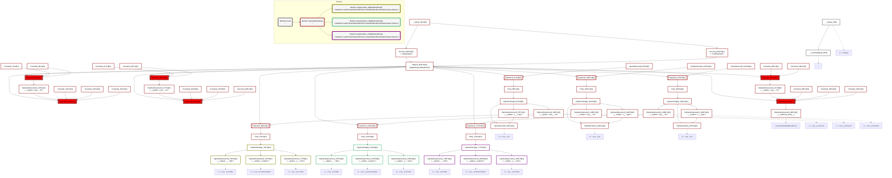

```mermaid
graph TD
    classDef path fill:#eee,stroke:#000,color:#000
    classDef plan fill:#fff,stroke-width:3px,color:#000
    classDef itemplan fill:#fff,stroke-width:6px,color:#000
    classDef sideeffectplan fill:#f00,stroke-width:6px,color:#000
    classDef bucket fill:#f6f6f6,color:#000,stroke-width:6px


    %% define plans
    __Value_3["__Value[_3∈1@1]<br /><context>"]:::plan
    __Value_5["__Value[_5∈0]<br /><rootValue>"]:::plan
    __TrackedObject_6["__TrackedObject[_6∈0]"]:::plan
    Constant_7["Constant[_7∈1@1]"]:::plan
    Constant_8["Constant[_8∈1@1]"]:::plan
    PgInsert_9[["PgInsert[_9∈1@1]"]]:::sideeffectplan
    PgClassExpression_13["PgClassExpression[_13∈1@1]<br /><__relation...ems__.”id”>"]:::plan
    Constant_14["Constant[_14∈1@1]"]:::plan
    Constant_15["Constant[_15∈1@1]"]:::plan
    Constant_16["Constant[_16∈1@1]"]:::plan
    PgInsert_17[["PgInsert[_17∈1@1]"]]:::sideeffectplan
    Constant_21["Constant[_21∈1@1]"]:::plan
    Constant_22["Constant[_22∈1@1]"]:::plan
    PgInsert_23[["PgInsert[_23∈1@1]"]]:::sideeffectplan
    PgClassExpression_27["PgClassExpression[_27∈1@1]<br /><__relation...ems__.”id”>"]:::plan
    Constant_28["Constant[_28∈1@1]"]:::plan
    Constant_29["Constant[_29∈1@1]"]:::plan
    Constant_30["Constant[_30∈1@1]"]:::plan
    PgInsert_31[["PgInsert[_31∈1@1]"]]:::sideeffectplan
    Constant_35["Constant[_35∈1@1]"]:::plan
    Constant_36["Constant[_36∈1@1]"]:::plan
    PgInsert_37[["PgInsert[_37∈1@1]"]]:::sideeffectplan
    PgClassExpression_41["PgClassExpression[_41∈1@1]<br /><__relation...ems__.”id”>"]:::plan
    Constant_42["Constant[_42∈1@1]"]:::plan
    Constant_43["Constant[_43∈1@1]"]:::plan
    Constant_44["Constant[_44∈1@1]"]:::plan
    PgInsert_45[["PgInsert[_45∈1@1]"]]:::sideeffectplan
    PgClassExpression_49["PgClassExpression[_49∈1@1]<br /><__relational_posts__>"]:::plan
    InputStaticLeaf_50["InputStaticLeaf[_50∈1@1]"]:::plan
    PgSelect_51[["PgSelect[_51∈1@1]<br /><relational_items>"]]:::plan
    First_55["First[_55∈1@1]"]:::plan
    PgSelectSingle_56["PgSelectSingle[_56∈1@1]<br /><relational_items>"]:::plan
    PgClassExpression_57["PgClassExpression[_57∈1@1]<br /><__relation...s__.”type”>"]:::plan
    PgPolymorphic_58["PgPolymorphic[_58∈1@1]"]:::plan
    PgSelect_68[["PgSelect[_68∈1@1]<br /><relational_posts>"]]:::plan
    First_72["First[_72∈1@1]"]:::plan
    PgSelectSingle_73["PgSelectSingle[_73∈2@1]<br /><relational_posts>"]:::plan
    PgClassExpression_75["PgClassExpression[_75∈2@1]<br /><__relation...__.”title”>"]:::plan
    PgClassExpression_76["PgClassExpression[_76∈2@1]<br /><__relation...scription”>"]:::plan
    PgClassExpression_77["PgClassExpression[_77∈2@1]<br /><__relation...s__.”note”>"]:::plan
    PgClassExpression_94["PgClassExpression[_94∈1@1]<br /><__relation...ems__.”id”>"]:::plan
    InputStaticLeaf_102["InputStaticLeaf[_102∈1@1]"]:::plan
    PgSelect_103[["PgSelect[_103∈1@1]<br /><relational_items>"]]:::plan
    First_107["First[_107∈1@1]"]:::plan
    PgSelectSingle_108["PgSelectSingle[_108∈1@1]<br /><relational_items>"]:::plan
    PgClassExpression_109["PgClassExpression[_109∈1@1]<br /><__relation...s__.”type”>"]:::plan
    PgPolymorphic_110["PgPolymorphic[_110∈1@1]"]:::plan
    PgSelect_120[["PgSelect[_120∈1@1]<br /><relational_posts>"]]:::plan
    First_124["First[_124∈1@1]"]:::plan
    PgSelectSingle_125["PgSelectSingle[_125∈3@1]<br /><relational_posts>"]:::plan
    PgClassExpression_127["PgClassExpression[_127∈3@1]<br /><__relation...__.”title”>"]:::plan
    PgClassExpression_128["PgClassExpression[_128∈3@1]<br /><__relation...scription”>"]:::plan
    PgClassExpression_129["PgClassExpression[_129∈3@1]<br /><__relation...s__.”note”>"]:::plan
    PgClassExpression_146["PgClassExpression[_146∈1@1]<br /><__relation...ems__.”id”>"]:::plan
    InputStaticLeaf_154["InputStaticLeaf[_154∈1@1]"]:::plan
    PgSelect_155[["PgSelect[_155∈1@1]<br /><relational_items>"]]:::plan
    First_159["First[_159∈1@1]"]:::plan
    PgSelectSingle_160["PgSelectSingle[_160∈1@1]<br /><relational_items>"]:::plan
    PgClassExpression_161["PgClassExpression[_161∈1@1]<br /><__relation...s__.”type”>"]:::plan
    PgPolymorphic_162["PgPolymorphic[_162∈1@1]"]:::plan
    PgSelect_172[["PgSelect[_172∈1@1]<br /><relational_posts>"]]:::plan
    First_176["First[_176∈1@1]"]:::plan
    PgSelectSingle_177["PgSelectSingle[_177∈4@1]<br /><relational_posts>"]:::plan
    PgClassExpression_179["PgClassExpression[_179∈4@1]<br /><__relation...__.”title”>"]:::plan
    PgClassExpression_180["PgClassExpression[_180∈4@1]<br /><__relation...scription”>"]:::plan
    PgClassExpression_181["PgClassExpression[_181∈4@1]<br /><__relation...s__.”note”>"]:::plan
    PgClassExpression_198["PgClassExpression[_198∈1@1]<br /><__relation...ems__.”id”>"]:::plan
    Access_200["Access[_200∈1@1]<br /><_3.pgSettings>"]:::plan
    Access_201["Access[_201∈1@1]<br /><_3.withPgClient>"]:::plan
    Object_202["Object[_202∈1@1]<br /><{pgSettings,withPgClient}>"]:::plan

    %% plan dependencies
    __Value_5 --> __TrackedObject_6
    Object_202 --> PgInsert_9
    Constant_7 --> PgInsert_9
    Constant_8 --> PgInsert_9
    PgInsert_9 --> PgClassExpression_13
    Object_202 --> PgInsert_17
    PgClassExpression_13 --> PgInsert_17
    Constant_14 --> PgInsert_17
    Constant_15 --> PgInsert_17
    Constant_16 --> PgInsert_17
    Object_202 --> PgInsert_23
    Constant_21 --> PgInsert_23
    Constant_22 --> PgInsert_23
    PgInsert_23 --> PgClassExpression_27
    Object_202 --> PgInsert_31
    PgClassExpression_27 --> PgInsert_31
    Constant_28 --> PgInsert_31
    Constant_29 --> PgInsert_31
    Constant_30 --> PgInsert_31
    Object_202 --> PgInsert_37
    Constant_35 --> PgInsert_37
    Constant_36 --> PgInsert_37
    PgInsert_37 --> PgClassExpression_41
    Object_202 --> PgInsert_45
    PgClassExpression_41 --> PgInsert_45
    Constant_42 --> PgInsert_45
    Constant_43 --> PgInsert_45
    Constant_44 --> PgInsert_45
    PgInsert_45 --> PgClassExpression_49
    Object_202 --> PgSelect_51
    InputStaticLeaf_50 --> PgSelect_51
    PgSelect_51 --> First_55
    First_55 --> PgSelectSingle_56
    PgSelectSingle_56 --> PgClassExpression_57
    PgSelectSingle_56 --> PgPolymorphic_58
    PgClassExpression_57 --> PgPolymorphic_58
    Object_202 --> PgSelect_68
    PgClassExpression_94 --> PgSelect_68
    PgSelect_68 --> First_72
    First_72 --> PgSelectSingle_73
    PgSelectSingle_73 --> PgClassExpression_75
    PgSelectSingle_73 --> PgClassExpression_76
    PgSelectSingle_73 --> PgClassExpression_77
    PgSelectSingle_56 --> PgClassExpression_94
    Object_202 --> PgSelect_103
    InputStaticLeaf_102 --> PgSelect_103
    PgSelect_103 --> First_107
    First_107 --> PgSelectSingle_108
    PgSelectSingle_108 --> PgClassExpression_109
    PgSelectSingle_108 --> PgPolymorphic_110
    PgClassExpression_109 --> PgPolymorphic_110
    Object_202 --> PgSelect_120
    PgClassExpression_146 --> PgSelect_120
    PgSelect_120 --> First_124
    First_124 --> PgSelectSingle_125
    PgSelectSingle_125 --> PgClassExpression_127
    PgSelectSingle_125 --> PgClassExpression_128
    PgSelectSingle_125 --> PgClassExpression_129
    PgSelectSingle_108 --> PgClassExpression_146
    Object_202 --> PgSelect_155
    InputStaticLeaf_154 --> PgSelect_155
    PgSelect_155 --> First_159
    First_159 --> PgSelectSingle_160
    PgSelectSingle_160 --> PgClassExpression_161
    PgSelectSingle_160 --> PgPolymorphic_162
    PgClassExpression_161 --> PgPolymorphic_162
    Object_202 --> PgSelect_172
    PgClassExpression_198 --> PgSelect_172
    PgSelect_172 --> First_176
    First_176 --> PgSelectSingle_177
    PgSelectSingle_177 --> PgClassExpression_179
    PgSelectSingle_177 --> PgClassExpression_180
    PgSelectSingle_177 --> PgClassExpression_181
    PgSelectSingle_160 --> PgClassExpression_198
    __Value_3 --> Access_200
    __Value_3 --> Access_201
    Access_200 --> Object_202
    Access_201 --> Object_202

    %% plan-to-path relationships
    P_6["~"]
    __TrackedObject_6 -.-> P_6
    P_49[">createThreeRelationalPosts"]
    PgClassExpression_49 -.-> P_49
    P_5[">c…s>query"]
    __Value_5 -.-> P_5
    P_58[">c…s>q…y>i1"]
    PgPolymorphic_58 -.-> P_58
    P_94[">c…s>q…y>i1>id x5"]
    PgClassExpression_94 -.-> P_94
    P_75[">c…s>q…y>i1>title"]
    PgClassExpression_75 -.-> P_75
    P_76[">c…s>q…y>i1>description"]
    PgClassExpression_76 -.-> P_76
    P_77[">c…s>q…y>i1>note"]
    PgClassExpression_77 -.-> P_77
    P_110[">c…s>q…y>i2"]
    PgPolymorphic_110 -.-> P_110
    P_146[">c…s>q…y>i2>id x5"]
    PgClassExpression_146 -.-> P_146
    P_127[">c…s>q…y>i2>title"]
    PgClassExpression_127 -.-> P_127
    P_128[">c…s>q…y>i2>description"]
    PgClassExpression_128 -.-> P_128
    P_129[">c…s>q…y>i2>note"]
    PgClassExpression_129 -.-> P_129
    P_162[">c…s>q…y>i3"]
    PgPolymorphic_162 -.-> P_162
    P_198[">c…s>q…y>i3>id x5"]
    PgClassExpression_198 -.-> P_198
    P_179[">c…s>q…y>i3>title"]
    PgClassExpression_179 -.-> P_179
    P_180[">c…s>q…y>i3>description"]
    PgClassExpression_180 -.-> P_180
    P_181[">c…s>q…y>i3>note"]
    PgClassExpression_181 -.-> P_181

    %% allocate buckets
    classDef bucket0 stroke:#696969
    class __Value_5,__TrackedObject_6 bucket0
    classDef bucket1 stroke:#a52a2a
    class __Value_3,Constant_7,Constant_8,PgInsert_9,PgClassExpression_13,Constant_14,Constant_15,Constant_16,PgInsert_17,Constant_21,Constant_22,PgInsert_23,PgClassExpression_27,Constant_28,Constant_29,Constant_30,PgInsert_31,Constant_35,Constant_36,PgInsert_37,PgClassExpression_41,Constant_42,Constant_43,Constant_44,PgInsert_45,PgClassExpression_49,InputStaticLeaf_50,PgSelect_51,First_55,PgSelectSingle_56,PgClassExpression_57,PgPolymorphic_58,PgSelect_68,First_72,PgClassExpression_94,InputStaticLeaf_102,PgSelect_103,First_107,PgSelectSingle_108,PgClassExpression_109,PgPolymorphic_110,PgSelect_120,First_124,PgClassExpression_146,InputStaticLeaf_154,PgSelect_155,First_159,PgSelectSingle_160,PgClassExpression_161,PgPolymorphic_162,PgSelect_172,First_176,PgClassExpression_198,Access_200,Access_201,Object_202 bucket1
    classDef bucket2 stroke:#808000
    class PgSelectSingle_73,PgClassExpression_75,PgClassExpression_76,PgClassExpression_77 bucket2
    classDef bucket3 stroke:#3cb371
    class PgSelectSingle_125,PgClassExpression_127,PgClassExpression_128,PgClassExpression_129 bucket3
    classDef bucket4 stroke:#7f007f
    class PgSelectSingle_177,PgClassExpression_179,PgClassExpression_180,PgClassExpression_181 bucket4

    subgraph Buckets
    Bucket0("Bucket 0 (root)<br />~"):::bucket
    style Bucket0 stroke:#696969
    Bucket1("Bucket 1 (group1[mutation])<br />~"):::bucket
    style Bucket1 stroke:#a52a2a
    Bucket0 --> Bucket1
    Bucket2("Bucket 2 (polymorphic_58[RelationalPost])<br />~>Mutation.createThreeRelationalPosts>CreateRelationalPostPayload.query>Query.i1"):::bucket
    style Bucket2 stroke:#808000
    Bucket1 --> Bucket2
    Bucket3("Bucket 3 (polymorphic_110[RelationalPost])<br />~>Mutation.createThreeRelationalPosts>CreateRelationalPostPayload.query>Query.i2"):::bucket
    style Bucket3 stroke:#3cb371
    Bucket1 --> Bucket3
    Bucket4("Bucket 4 (polymorphic_162[RelationalPost])<br />~>Mutation.createThreeRelationalPosts>CreateRelationalPostPayload.query>Query.i3"):::bucket
    style Bucket4 stroke:#7f007f
    Bucket1 --> Bucket4
    end
```
