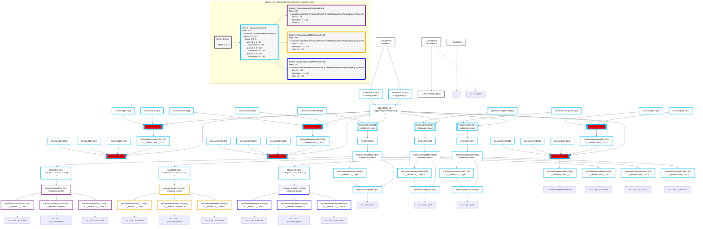

```mermaid
graph TD
    classDef path fill:#eee,stroke:#000,color:#000
    classDef plan fill:#fff,stroke-width:3px,color:#000
    classDef itemplan fill:#fff,stroke-width:6px,color:#000
    classDef sideeffectplan fill:#f00,stroke-width:6px,color:#000
    classDef bucket fill:#f6f6f6,color:#000,stroke-width:6px,text-align:left


    %% define plans
    __Value0["__Value[0∈0]"]:::plan
    PgInsert17[["PgInsert[17∈1@1]"]]:::sideeffectplan
    PgClassExpression13["PgClassExpression[13∈1@1]<br />ᐸ__relation...ems__.”id”ᐳ"]:::plan
    PgInsert9[["PgInsert[9∈1@1]"]]:::sideeffectplan
    PgInsert31[["PgInsert[31∈1@1]"]]:::sideeffectplan
    PgClassExpression27["PgClassExpression[27∈1@1]<br />ᐸ__relation...ems__.”id”ᐳ"]:::plan
    PgInsert23[["PgInsert[23∈1@1]"]]:::sideeffectplan
    PgClassExpression49["PgClassExpression[49∈1@1]<br />ᐸ__relational_posts__ᐳ"]:::plan
    PgInsert45[["PgInsert[45∈1@1]"]]:::sideeffectplan
    PgClassExpression41["PgClassExpression[41∈1@1]<br />ᐸ__relation...ems__.”id”ᐳ"]:::plan
    PgInsert37[["PgInsert[37∈1@1]"]]:::sideeffectplan
    PgPolymorphic58["PgPolymorphic[58∈1@1]"]:::plan
    PgClassExpression57["PgClassExpression[57∈1@1]<br />ᐸ__relation...s__.”type”ᐳ"]:::plan
    PgClassExpression94["PgClassExpression[94∈1@1]<br />ᐸ__relation...ems__.”id”ᐳ"]:::plan
    PgClassExpression75["PgClassExpression[75∈2@1]<br />ᐸ__relation...__.”title”ᐳ"]:::plan
    PgClassExpression76["PgClassExpression[76∈2@1]<br />ᐸ__relation...scription”ᐳ"]:::plan
    PgClassExpression77["PgClassExpression[77∈2@1]<br />ᐸ__relation...s__.”note”ᐳ"]:::plan
    PgSelectSingle73["PgSelectSingle[73∈2@1]<br />ᐸrelational_postsᐳ"]:::plan
    Map206["Map[206∈1@1]<br />ᐸ56:{”0”:1,”1”:2,”2”:3,”3”:4}ᐳ"]:::plan
    PgSelectSingle56["PgSelectSingle[56∈1@1]<br />ᐸrelational_itemsᐳ"]:::plan
    First55["First[55∈1@1]"]:::plan
    PgSelect51[["PgSelect[51∈1@1]<br />ᐸrelational_itemsᐳ"]]:::plan
    PgPolymorphic110["PgPolymorphic[110∈1@1]"]:::plan
    PgClassExpression109["PgClassExpression[109∈1@1]<br />ᐸ__relation...s__.”type”ᐳ"]:::plan
    PgClassExpression146["PgClassExpression[146∈1@1]<br />ᐸ__relation...ems__.”id”ᐳ"]:::plan
    PgClassExpression127["PgClassExpression[127∈3@1]<br />ᐸ__relation...__.”title”ᐳ"]:::plan
    PgClassExpression128["PgClassExpression[128∈3@1]<br />ᐸ__relation...scription”ᐳ"]:::plan
    PgClassExpression129["PgClassExpression[129∈3@1]<br />ᐸ__relation...s__.”note”ᐳ"]:::plan
    PgSelectSingle125["PgSelectSingle[125∈3@1]<br />ᐸrelational_postsᐳ"]:::plan
    Map208["Map[208∈1@1]<br />ᐸ108:{”0”:1,”1”:2,”2”:3,”3”:4}ᐳ"]:::plan
    PgSelectSingle108["PgSelectSingle[108∈1@1]<br />ᐸrelational_itemsᐳ"]:::plan
    First107["First[107∈1@1]"]:::plan
    PgSelect103[["PgSelect[103∈1@1]<br />ᐸrelational_itemsᐳ"]]:::plan
    PgPolymorphic162["PgPolymorphic[162∈1@1]"]:::plan
    PgClassExpression161["PgClassExpression[161∈1@1]<br />ᐸ__relation...s__.”type”ᐳ"]:::plan
    PgClassExpression198["PgClassExpression[198∈1@1]<br />ᐸ__relation...ems__.”id”ᐳ"]:::plan
    PgClassExpression179["PgClassExpression[179∈4@1]<br />ᐸ__relation...__.”title”ᐳ"]:::plan
    PgClassExpression180["PgClassExpression[180∈4@1]<br />ᐸ__relation...scription”ᐳ"]:::plan
    PgClassExpression181["PgClassExpression[181∈4@1]<br />ᐸ__relation...s__.”note”ᐳ"]:::plan
    PgSelectSingle177["PgSelectSingle[177∈4@1]<br />ᐸrelational_postsᐳ"]:::plan
    Map210["Map[210∈1@1]<br />ᐸ160:{”0”:1,”1”:2,”2”:3,”3”:4}ᐳ"]:::plan
    PgSelectSingle160["PgSelectSingle[160∈1@1]<br />ᐸrelational_itemsᐳ"]:::plan
    First159["First[159∈1@1]"]:::plan
    PgSelect155[["PgSelect[155∈1@1]<br />ᐸrelational_itemsᐳ"]]:::plan
    Object202["Object[202∈1@1]<br />ᐸ{pgSettings,withPgClient}ᐳ"]:::plan
    Access200["Access[200∈1@1]<br />ᐸ3.pgSettingsᐳ"]:::plan
    Access201["Access[201∈1@1]<br />ᐸ3.withPgClientᐳ"]:::plan
    __Value3["__Value[3∈0]<br />ᐸcontextᐳ"]:::plan
    __TrackedObject6["__TrackedObject[6∈0]"]:::plan
    __Value5["__Value[5∈0]<br />ᐸrootValueᐳ"]:::plan
    Constant7["Constant[7∈1@1]"]:::plan
    Constant8["Constant[8∈1@1]"]:::plan
    Constant14["Constant[14∈1@1]"]:::plan
    Constant15["Constant[15∈1@1]"]:::plan
    Constant16["Constant[16∈1@1]"]:::plan
    Constant21["Constant[21∈1@1]"]:::plan
    Constant22["Constant[22∈1@1]"]:::plan
    Constant28["Constant[28∈1@1]"]:::plan
    Constant29["Constant[29∈1@1]"]:::plan
    Constant30["Constant[30∈1@1]"]:::plan
    Constant35["Constant[35∈1@1]"]:::plan
    Constant36["Constant[36∈1@1]"]:::plan
    Constant42["Constant[42∈1@1]"]:::plan
    Constant43["Constant[43∈1@1]"]:::plan
    Constant44["Constant[44∈1@1]"]:::plan
    InputStaticLeaf50["InputStaticLeaf[50∈1@1]"]:::plan
    InputStaticLeaf102["InputStaticLeaf[102∈1@1]"]:::plan
    InputStaticLeaf154["InputStaticLeaf[154∈1@1]"]:::plan

    %% plan dependencies
    Object202 & PgClassExpression13 & Constant14 & Constant15 & Constant16 --> PgInsert17
    PgInsert9 --> PgClassExpression13
    Object202 & Constant7 & Constant8 --> PgInsert9
    Object202 & PgClassExpression27 & Constant28 & Constant29 & Constant30 --> PgInsert31
    PgInsert23 --> PgClassExpression27
    Object202 & Constant21 & Constant22 --> PgInsert23
    PgInsert45 --> PgClassExpression49
    Object202 & PgClassExpression41 & Constant42 & Constant43 & Constant44 --> PgInsert45
    PgInsert37 --> PgClassExpression41
    Object202 & Constant35 & Constant36 --> PgInsert37
    PgSelectSingle56 & PgClassExpression57 --> PgPolymorphic58
    PgSelectSingle56 --> PgClassExpression57
    PgSelectSingle56 --> PgClassExpression94
    PgSelectSingle73 --> PgClassExpression75
    PgSelectSingle73 --> PgClassExpression76
    PgSelectSingle73 --> PgClassExpression77
    Map206 --> PgSelectSingle73
    PgSelectSingle56 --> Map206
    First55 --> PgSelectSingle56
    PgSelect51 --> First55
    Object202 & InputStaticLeaf50 --> PgSelect51
    PgSelectSingle108 & PgClassExpression109 --> PgPolymorphic110
    PgSelectSingle108 --> PgClassExpression109
    PgSelectSingle108 --> PgClassExpression146
    PgSelectSingle125 --> PgClassExpression127
    PgSelectSingle125 --> PgClassExpression128
    PgSelectSingle125 --> PgClassExpression129
    Map208 --> PgSelectSingle125
    PgSelectSingle108 --> Map208
    First107 --> PgSelectSingle108
    PgSelect103 --> First107
    Object202 & InputStaticLeaf102 --> PgSelect103
    PgSelectSingle160 & PgClassExpression161 --> PgPolymorphic162
    PgSelectSingle160 --> PgClassExpression161
    PgSelectSingle160 --> PgClassExpression198
    PgSelectSingle177 --> PgClassExpression179
    PgSelectSingle177 --> PgClassExpression180
    PgSelectSingle177 --> PgClassExpression181
    Map210 --> PgSelectSingle177
    PgSelectSingle160 --> Map210
    First159 --> PgSelectSingle160
    PgSelect155 --> First159
    Object202 & InputStaticLeaf154 --> PgSelect155
    Access200 & Access201 --> Object202
    __Value3 --> Access200
    __Value3 --> Access201
    __Value5 --> __TrackedObject6

    %% plan-to-path relationships
    P0["~"]
    __Value0 -.-> P0
    P5["ᐳc…sᐳquery"]
    __Value5 -.-> P5
    P49["ᐳcreateThreeRelationalPosts"]
    PgClassExpression49 -.-> P49
    P58["ᐳc…sᐳq…yᐳi1"]
    PgPolymorphic58 -.-> P58
    P75["ᐳc…sᐳq…yᐳi1ᐳtitle"]
    PgClassExpression75 -.-> P75
    P76["ᐳc…sᐳq…yᐳi1ᐳdescription"]
    PgClassExpression76 -.-> P76
    P77["ᐳc…sᐳq…yᐳi1ᐳnote"]
    PgClassExpression77 -.-> P77
    P94["ᐳc…sᐳq…yᐳi1ᐳid x5"]
    PgClassExpression94 -.-> P94
    P110["ᐳc…sᐳq…yᐳi2"]
    PgPolymorphic110 -.-> P110
    P127["ᐳc…sᐳq…yᐳi2ᐳtitle"]
    PgClassExpression127 -.-> P127
    P128["ᐳc…sᐳq…yᐳi2ᐳdescription"]
    PgClassExpression128 -.-> P128
    P129["ᐳc…sᐳq…yᐳi2ᐳnote"]
    PgClassExpression129 -.-> P129
    P146["ᐳc…sᐳq…yᐳi2ᐳid x5"]
    PgClassExpression146 -.-> P146
    P162["ᐳc…sᐳq…yᐳi3"]
    PgPolymorphic162 -.-> P162
    P179["ᐳc…sᐳq…yᐳi3ᐳtitle"]
    PgClassExpression179 -.-> P179
    P180["ᐳc…sᐳq…yᐳi3ᐳdescription"]
    PgClassExpression180 -.-> P180
    P181["ᐳc…sᐳq…yᐳi3ᐳnote"]
    PgClassExpression181 -.-> P181
    P198["ᐳc…sᐳq…yᐳi3ᐳid x5"]
    PgClassExpression198 -.-> P198

    subgraph "Buckets for mutations/basics/create-three-relational-posts"
    Bucket0("Bucket 0 (root)<br />~<br />⠀ROOT ᐸ-O- 0"):::bucket
    classDef bucket0 stroke:#696969
    class Bucket0,__Value0,__Value3,__Value5,__TrackedObject6 bucket0
    Bucket1("Bucket 1 (group1[mutation])<br />Deps: 3, 5<br />~ᐳMutation.createThreeRelationalPosts<br />⠀ROOT ᐸ-O- 49<br />⠀⠀query ᐸ-O- 5<br />⠀⠀⠀query.i1 ᐸ-O- 58<br />⠀⠀⠀⠀query.i1.id ᐸ-L- 94<br />⠀⠀⠀query.i2 ᐸ-O- 110<br />⠀⠀⠀⠀query.i2.id ᐸ-L- 146<br />⠀⠀⠀query.i3 ᐸ-O- 162<br />⠀⠀⠀⠀query.i3.id ᐸ-L- 198"):::bucket
    classDef bucket1 stroke:#00bfff
    class Bucket1,Constant7,Constant8,PgInsert9,PgClassExpression13,Constant14,Constant15,Constant16,PgInsert17,Constant21,Constant22,PgInsert23,PgClassExpression27,Constant28,Constant29,Constant30,PgInsert31,Constant35,Constant36,PgInsert37,PgClassExpression41,Constant42,Constant43,Constant44,PgInsert45,PgClassExpression49,InputStaticLeaf50,PgSelect51,First55,PgSelectSingle56,PgClassExpression57,PgPolymorphic58,PgClassExpression94,InputStaticLeaf102,PgSelect103,First107,PgSelectSingle108,PgClassExpression109,PgPolymorphic110,PgClassExpression146,InputStaticLeaf154,PgSelect155,First159,PgSelectSingle160,PgClassExpression161,PgPolymorphic162,PgClassExpression198,Access200,Access201,Object202,Map206,Map208,Map210 bucket1
    Bucket2("Bucket 2 (polymorphic58[RelationalPost])<br />Deps: 206<br />~ᐳMutation.createThreeRelationalPostsᐳCreateRelationalPostPayload.queryᐳQuery.i1<br />⠀⠀title ᐸ-L- 75<br />⠀⠀description ᐸ-L- 76<br />⠀⠀note ᐸ-L- 77"):::bucket
    classDef bucket2 stroke:#7f007f
    class Bucket2,PgSelectSingle73,PgClassExpression75,PgClassExpression76,PgClassExpression77 bucket2
    Bucket3("Bucket 3 (polymorphic110[RelationalPost])<br />Deps: 208<br />~ᐳMutation.createThreeRelationalPostsᐳCreateRelationalPostPayload.queryᐳQuery.i2<br />⠀⠀title ᐸ-L- 127<br />⠀⠀description ᐸ-L- 128<br />⠀⠀note ᐸ-L- 129"):::bucket
    classDef bucket3 stroke:#ffa500
    class Bucket3,PgSelectSingle125,PgClassExpression127,PgClassExpression128,PgClassExpression129 bucket3
    Bucket4("Bucket 4 (polymorphic162[RelationalPost])<br />Deps: 210<br />~ᐳMutation.createThreeRelationalPostsᐳCreateRelationalPostPayload.queryᐳQuery.i3<br />⠀⠀title ᐸ-L- 179<br />⠀⠀description ᐸ-L- 180<br />⠀⠀note ᐸ-L- 181"):::bucket
    classDef bucket4 stroke:#0000ff
    class Bucket4,PgSelectSingle177,PgClassExpression179,PgClassExpression180,PgClassExpression181 bucket4
    Bucket0 --> Bucket1
    Bucket1 --> Bucket2 & Bucket3 & Bucket4
    end
```
