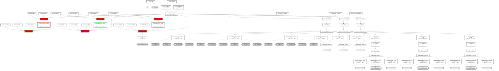

```mermaid
graph TD
    classDef path fill:#eee,stroke:#000,color:#000
    classDef plan fill:#fff,stroke-width:3px,color:#000
    classDef itemplan fill:#fff,stroke-width:6px,color:#000
    classDef sideeffectplan fill:#f00,stroke-width:6px,color:#000

    %% subgraph fields
    P1{{"~"}}:::path
    P2{{">createThreeRelationalPosts"}}:::path
    P3{{">cr…sts>query"}}:::path
    P4{{">cr…sts>query>i1"}}:::path
    P5([">cr…sts>query>i1>id"]):::path
    %% P4 -.-> P5
    P6([">cr…sts>query>i1>id"]):::path
    %% P4 -.-> P6
    P7([">cr…sts>query>i1>title"]):::path
    %% P4 -.-> P7
    P8([">cr…sts>query>i1>description"]):::path
    %% P4 -.-> P8
    P9([">cr…sts>query>i1>note"]):::path
    %% P4 -.-> P9
    P10([">cr…sts>query>i1>id"]):::path
    %% P4 -.-> P10
    P11([">cr…sts>query>i1>id"]):::path
    %% P4 -.-> P11
    P12([">cr…sts>query>i1>id"]):::path
    %% P4 -.-> P12
    %% P3 -.-> P4
    P13{{">cr…sts>query>i2"}}:::path
    P14([">cr…sts>query>i2>id"]):::path
    %% P13 -.-> P14
    P15([">cr…sts>query>i2>id"]):::path
    %% P13 -.-> P15
    P16([">cr…sts>query>i2>title"]):::path
    %% P13 -.-> P16
    P17([">cr…sts>query>i2>description"]):::path
    %% P13 -.-> P17
    P18([">cr…sts>query>i2>note"]):::path
    %% P13 -.-> P18
    P19([">cr…sts>query>i2>id"]):::path
    %% P13 -.-> P19
    P20([">cr…sts>query>i2>id"]):::path
    %% P13 -.-> P20
    P21([">cr…sts>query>i2>id"]):::path
    %% P13 -.-> P21
    %% P3 -.-> P13
    P22{{">cr…sts>query>i3"}}:::path
    P23([">cr…sts>query>i3>id"]):::path
    %% P22 -.-> P23
    P24([">cr…sts>query>i3>id"]):::path
    %% P22 -.-> P24
    P25([">cr…sts>query>i3>title"]):::path
    %% P22 -.-> P25
    P26([">cr…sts>query>i3>description"]):::path
    %% P22 -.-> P26
    P27([">cr…sts>query>i3>note"]):::path
    %% P22 -.-> P27
    P28([">cr…sts>query>i3>id"]):::path
    %% P22 -.-> P28
    P29([">cr…sts>query>i3>id"]):::path
    %% P22 -.-> P29
    P30([">cr…sts>query>i3>id"]):::path
    %% P22 -.-> P30
    %% P3 -.-> P22
    %% P2 -.-> P3
    %% P1 -.-> P2
    %% end

    %% define plans
    __Value_3["__Value[_3∈0] {1}<br /><context>"]:::plan
    __Value_5["__Value[_5∈0]<br /><rootValue>"]:::plan
    Constant_7["Constant[_7∈0] {}"]:::plan
    Constant_8["Constant[_8∈0] {}"]:::plan
    PgInsert_9[["PgInsert[_9∈1] {}"]]:::sideeffectplan
    PgClassExpression_13["PgClassExpression[_13∈1] {}<br /><__relation...ems__.#quot;id#quot;>"]:::plan
    Constant_14["Constant[_14∈0] {}"]:::plan
    Constant_15["Constant[_15∈0] {}"]:::plan
    Constant_16["Constant[_16∈0] {}"]:::plan
    PgInsert_17[["PgInsert[_17∈2] {}"]]:::sideeffectplan
    Constant_21["Constant[_21∈0] {}"]:::plan
    Constant_22["Constant[_22∈0] {}"]:::plan
    PgInsert_23[["PgInsert[_23∈3] {}"]]:::sideeffectplan
    PgClassExpression_27["PgClassExpression[_27∈3] {}<br /><__relation...ems__.#quot;id#quot;>"]:::plan
    Constant_28["Constant[_28∈0] {}"]:::plan
    Constant_29["Constant[_29∈0] {}"]:::plan
    Constant_30["Constant[_30∈0] {}"]:::plan
    PgInsert_31[["PgInsert[_31∈4] {}"]]:::sideeffectplan
    Constant_35["Constant[_35∈0] {1}"]:::plan
    Constant_36["Constant[_36∈0] {1}"]:::plan
    PgInsert_37[["PgInsert[_37∈0] {1}"]]:::sideeffectplan
    PgClassExpression_41["PgClassExpression[_41∈0] {1}<br /><__relation...ems__.#quot;id#quot;>"]:::plan
    Constant_42["Constant[_42∈0] {1}"]:::plan
    Constant_43["Constant[_43∈0] {1}"]:::plan
    Constant_44["Constant[_44∈0] {1}"]:::plan
    PgInsert_45[["PgInsert[_45∈0] {1}"]]:::sideeffectplan
    PgClassExpression_49["PgClassExpression[_49∈0] {1}<br /><__relational_posts__>"]:::plan
    InputStaticLeaf_50["InputStaticLeaf[_50∈0] {1}"]:::plan
    PgSelect_51[["PgSelect[_51∈0] {1}<br /><relational_items>"]]:::plan
    First_55["First[_55∈0] {1}"]:::plan
    PgSelectSingle_56["PgSelectSingle[_56∈0] {1}<br /><relational_items>"]:::plan
    PgClassExpression_57["PgClassExpression[_57∈0] {1}<br /><__relation...s__.#quot;type#quot;>"]:::plan
    PgPolymorphic_58["PgPolymorphic[_58∈0] {1}"]:::plan
    First_72["First[_72∈0] {1}"]:::plan
    PgSelectSingle_73["PgSelectSingle[_73∈0] {1}<br /><relational_posts>"]:::plan
    PgClassExpression_75["PgClassExpression[_75∈0] {1}<br /><__relation...__.#quot;title#quot;>"]:::plan
    PgClassExpression_76["PgClassExpression[_76∈0] {1}<br /><__relation...scription#quot;>"]:::plan
    PgClassExpression_77["PgClassExpression[_77∈0] {1}<br /><__relation...s__.#quot;note#quot;>"]:::plan
    PgClassExpression_94["PgClassExpression[_94∈0] {1}<br /><__relation...ems__.#quot;id#quot;>"]:::plan
    InputStaticLeaf_102["InputStaticLeaf[_102∈0] {1}"]:::plan
    PgSelect_103[["PgSelect[_103∈0] {1}<br /><relational_items>"]]:::plan
    First_107["First[_107∈0] {1}"]:::plan
    PgSelectSingle_108["PgSelectSingle[_108∈0] {1}<br /><relational_items>"]:::plan
    PgClassExpression_109["PgClassExpression[_109∈0] {1}<br /><__relation...s__.#quot;type#quot;>"]:::plan
    PgPolymorphic_110["PgPolymorphic[_110∈0] {1}"]:::plan
    First_124["First[_124∈0] {1}"]:::plan
    PgSelectSingle_125["PgSelectSingle[_125∈0] {1}<br /><relational_posts>"]:::plan
    PgClassExpression_127["PgClassExpression[_127∈0] {1}<br /><__relation...__.#quot;title#quot;>"]:::plan
    PgClassExpression_128["PgClassExpression[_128∈0] {1}<br /><__relation...scription#quot;>"]:::plan
    PgClassExpression_129["PgClassExpression[_129∈0] {1}<br /><__relation...s__.#quot;note#quot;>"]:::plan
    PgClassExpression_146["PgClassExpression[_146∈0] {1}<br /><__relation...ems__.#quot;id#quot;>"]:::plan
    InputStaticLeaf_154["InputStaticLeaf[_154∈0] {1}"]:::plan
    PgSelect_155[["PgSelect[_155∈0] {1}<br /><relational_items>"]]:::plan
    First_159["First[_159∈0] {1}"]:::plan
    PgSelectSingle_160["PgSelectSingle[_160∈0] {1}<br /><relational_items>"]:::plan
    PgClassExpression_161["PgClassExpression[_161∈0] {1}<br /><__relation...s__.#quot;type#quot;>"]:::plan
    PgPolymorphic_162["PgPolymorphic[_162∈0] {1}"]:::plan
    First_176["First[_176∈0] {1}"]:::plan
    PgSelectSingle_177["PgSelectSingle[_177∈0] {1}<br /><relational_posts>"]:::plan
    PgClassExpression_179["PgClassExpression[_179∈0] {1}<br /><__relation...__.#quot;title#quot;>"]:::plan
    PgClassExpression_180["PgClassExpression[_180∈0] {1}<br /><__relation...scription#quot;>"]:::plan
    PgClassExpression_181["PgClassExpression[_181∈0] {1}<br /><__relation...s__.#quot;note#quot;>"]:::plan
    PgClassExpression_198["PgClassExpression[_198∈0] {1}<br /><__relation...ems__.#quot;id#quot;>"]:::plan
    Access_200["Access[_200∈0] {1}<br /><_3.pgSettings>"]:::plan
    Access_201["Access[_201∈0] {1}<br /><_3.withPgClient>"]:::plan
    Object_202["Object[_202∈0] {1}<br /><{pgSettings,withPgClient}>"]:::plan
    Map_206["Map[_206∈0] {1}<br /><_56:{#quot;0#quot;:1,#quot;1#quot;:2,#quot;2#quot;:3,#quot;3#quot;:4}>"]:::plan
    List_207["List[_207∈0] {1}<br /><_206>"]:::plan
    Map_208["Map[_208∈0] {1}<br /><_108:{#quot;0#quot;:1,#quot;1#quot;:2,#quot;2#quot;:3,#quot;3#quot;:4}>"]:::plan
    List_209["List[_209∈0] {1}<br /><_208>"]:::plan
    Map_210["Map[_210∈0] {1}<br /><_160:{#quot;0#quot;:1,#quot;1#quot;:2,#quot;2#quot;:3,#quot;3#quot;:4}>"]:::plan
    List_211["List[_211∈0] {1}<br /><_210>"]:::plan

    %% plan dependencies
    Object_202 --> PgInsert_9
    Constant_7 --> PgInsert_9
    Constant_8 --> PgInsert_9
    PgInsert_9 --> PgClassExpression_13
    Object_202 --> PgInsert_17
    PgClassExpression_13 --> PgInsert_17
    Constant_14 --> PgInsert_17
    Constant_15 --> PgInsert_17
    Constant_16 --> PgInsert_17
    Object_202 --> PgInsert_23
    Constant_21 --> PgInsert_23
    Constant_22 --> PgInsert_23
    PgInsert_23 --> PgClassExpression_27
    Object_202 --> PgInsert_31
    PgClassExpression_27 --> PgInsert_31
    Constant_28 --> PgInsert_31
    Constant_29 --> PgInsert_31
    Constant_30 --> PgInsert_31
    Object_202 --> PgInsert_37
    Constant_35 --> PgInsert_37
    Constant_36 --> PgInsert_37
    PgInsert_37 --> PgClassExpression_41
    Object_202 --> PgInsert_45
    PgClassExpression_41 --> PgInsert_45
    Constant_42 --> PgInsert_45
    Constant_43 --> PgInsert_45
    Constant_44 --> PgInsert_45
    PgInsert_45 --> PgClassExpression_49
    Object_202 --> PgSelect_51
    InputStaticLeaf_50 --> PgSelect_51
    PgSelect_51 --> First_55
    First_55 --> PgSelectSingle_56
    PgSelectSingle_56 --> PgClassExpression_57
    PgSelectSingle_56 --> PgPolymorphic_58
    PgClassExpression_57 --> PgPolymorphic_58
    List_207 --> First_72
    First_72 --> PgSelectSingle_73
    PgSelectSingle_73 --> PgClassExpression_75
    PgSelectSingle_73 --> PgClassExpression_76
    PgSelectSingle_73 --> PgClassExpression_77
    PgSelectSingle_56 --> PgClassExpression_94
    Object_202 --> PgSelect_103
    InputStaticLeaf_102 --> PgSelect_103
    PgSelect_103 --> First_107
    First_107 --> PgSelectSingle_108
    PgSelectSingle_108 --> PgClassExpression_109
    PgSelectSingle_108 --> PgPolymorphic_110
    PgClassExpression_109 --> PgPolymorphic_110
    List_209 --> First_124
    First_124 --> PgSelectSingle_125
    PgSelectSingle_125 --> PgClassExpression_127
    PgSelectSingle_125 --> PgClassExpression_128
    PgSelectSingle_125 --> PgClassExpression_129
    PgSelectSingle_108 --> PgClassExpression_146
    Object_202 --> PgSelect_155
    InputStaticLeaf_154 --> PgSelect_155
    PgSelect_155 --> First_159
    First_159 --> PgSelectSingle_160
    PgSelectSingle_160 --> PgClassExpression_161
    PgSelectSingle_160 --> PgPolymorphic_162
    PgClassExpression_161 --> PgPolymorphic_162
    List_211 --> First_176
    First_176 --> PgSelectSingle_177
    PgSelectSingle_177 --> PgClassExpression_179
    PgSelectSingle_177 --> PgClassExpression_180
    PgSelectSingle_177 --> PgClassExpression_181
    PgSelectSingle_160 --> PgClassExpression_198
    __Value_3 --> Access_200
    __Value_3 --> Access_201
    Access_200 --> Object_202
    Access_201 --> Object_202
    PgSelectSingle_56 --> Map_206
    Map_206 --> List_207
    PgSelectSingle_108 --> Map_208
    Map_208 --> List_209
    PgSelectSingle_160 --> Map_210
    Map_210 --> List_211

    %% plan-to-path relationships
    __Value_5 -.-> P1
    PgClassExpression_49 -.-> P2
    __Value_5 -.-> P3
    PgPolymorphic_58 -.-> P4
    PgClassExpression_94 -.-> P5
    PgClassExpression_94 -.-> P6
    PgClassExpression_75 -.-> P7
    PgClassExpression_76 -.-> P8
    PgClassExpression_77 -.-> P9
    PgClassExpression_94 -.-> P10
    PgClassExpression_94 -.-> P11
    PgClassExpression_94 -.-> P12
    PgPolymorphic_110 -.-> P13
    PgClassExpression_146 -.-> P14
    PgClassExpression_146 -.-> P15
    PgClassExpression_127 -.-> P16
    PgClassExpression_128 -.-> P17
    PgClassExpression_129 -.-> P18
    PgClassExpression_146 -.-> P19
    PgClassExpression_146 -.-> P20
    PgClassExpression_146 -.-> P21
    PgPolymorphic_162 -.-> P22
    PgClassExpression_198 -.-> P23
    PgClassExpression_198 -.-> P24
    PgClassExpression_179 -.-> P25
    PgClassExpression_180 -.-> P26
    PgClassExpression_181 -.-> P27
    PgClassExpression_198 -.-> P28
    PgClassExpression_198 -.-> P29
    PgClassExpression_198 -.-> P30

    %% allocate buckets
    classDef bucket0 stroke:#696969
    class __Value_3,__Value_5,Constant_7,Constant_8,Constant_14,Constant_15,Constant_16,Constant_21,Constant_22,Constant_28,Constant_29,Constant_30,Constant_35,Constant_36,PgInsert_37,PgClassExpression_41,Constant_42,Constant_43,Constant_44,PgInsert_45,PgClassExpression_49,InputStaticLeaf_50,PgSelect_51,First_55,PgSelectSingle_56,PgClassExpression_57,PgPolymorphic_58,First_72,PgSelectSingle_73,PgClassExpression_75,PgClassExpression_76,PgClassExpression_77,PgClassExpression_94,InputStaticLeaf_102,PgSelect_103,First_107,PgSelectSingle_108,PgClassExpression_109,PgPolymorphic_110,First_124,PgSelectSingle_125,PgClassExpression_127,PgClassExpression_128,PgClassExpression_129,PgClassExpression_146,InputStaticLeaf_154,PgSelect_155,First_159,PgSelectSingle_160,PgClassExpression_161,PgPolymorphic_162,First_176,PgSelectSingle_177,PgClassExpression_179,PgClassExpression_180,PgClassExpression_181,PgClassExpression_198,Access_200,Access_201,Object_202,Map_206,List_207,Map_208,List_209,Map_210,List_211 bucket0
    classDef bucket1 stroke:#a52a2a
    class PgInsert_9,PgClassExpression_13 bucket1
    classDef bucket2 stroke:#808000
    class PgInsert_17 bucket2
    classDef bucket3 stroke:#3cb371
    class PgInsert_23,PgClassExpression_27 bucket3
    classDef bucket4 stroke:#7f007f
    class PgInsert_31 bucket4
```
