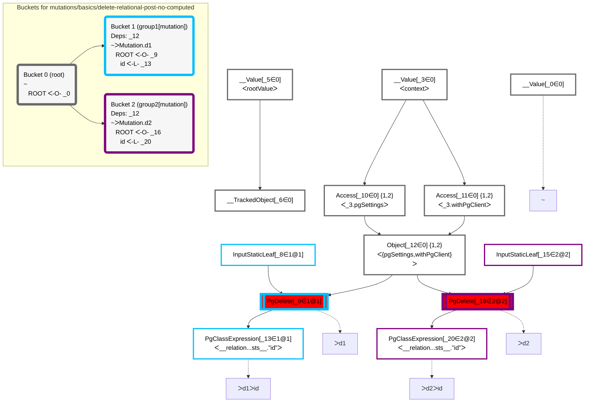

```mermaid
graph TD
    classDef path fill:#eee,stroke:#000,color:#000
    classDef plan fill:#fff,stroke-width:3px,color:#000
    classDef itemplan fill:#fff,stroke-width:6px,color:#000
    classDef sideeffectplan fill:#f00,stroke-width:6px,color:#000
    classDef bucket fill:#f6f6f6,color:#000,stroke-width:6px,text-align:left


    %% define plans
    __Value_0["__Value[_0∈0]"]:::plan
    __Value_3["__Value[_3∈0]<br />ᐸcontextᐳ"]:::plan
    __Value_5["__Value[_5∈0]<br />ᐸrootValueᐳ"]:::plan
    __TrackedObject_6["__TrackedObject[_6∈0]"]:::plan
    InputStaticLeaf_8["InputStaticLeaf[_8∈1@1]"]:::plan
    PgDelete_9[["PgDelete[_9∈1@1]"]]:::sideeffectplan
    Access_10["Access[_10∈0] {1,2}<br />ᐸ_3.pgSettingsᐳ"]:::plan
    Access_11["Access[_11∈0] {1,2}<br />ᐸ_3.withPgClientᐳ"]:::plan
    Object_12["Object[_12∈0] {1,2}<br />ᐸ{pgSettings,withPgClient}ᐳ"]:::plan
    PgClassExpression_13["PgClassExpression[_13∈1@1]<br />ᐸ__relation...sts__.”id”ᐳ"]:::plan
    InputStaticLeaf_15["InputStaticLeaf[_15∈2@2]"]:::plan
    PgDelete_16[["PgDelete[_16∈2@2]"]]:::sideeffectplan
    PgClassExpression_20["PgClassExpression[_20∈2@2]<br />ᐸ__relation...sts__.”id”ᐳ"]:::plan

    %% plan dependencies
    __Value_5 --> __TrackedObject_6
    Object_12 & InputStaticLeaf_8 --> PgDelete_9
    __Value_3 --> Access_10
    __Value_3 --> Access_11
    Access_10 & Access_11 --> Object_12
    PgDelete_9 --> PgClassExpression_13
    Object_12 & InputStaticLeaf_15 --> PgDelete_16
    PgDelete_16 --> PgClassExpression_20

    %% plan-to-path relationships
    P_0["~"]
    __Value_0 -.-> P_0
    P_9["ᐳd1"]
    PgDelete_9 -.-> P_9
    P_13["ᐳd1ᐳid"]
    PgClassExpression_13 -.-> P_13
    P_16["ᐳd2"]
    PgDelete_16 -.-> P_16
    P_20["ᐳd2ᐳid"]
    PgClassExpression_20 -.-> P_20

    subgraph "Buckets for mutations/basics/delete-relational-post-no-computed"
    Bucket0("Bucket 0 (root)<br />~<br />⠀ROOT ᐸ-O- _0"):::bucket
    classDef bucket0 stroke:#696969
    class Bucket0,__Value_0,__Value_3,__Value_5,__TrackedObject_6,Access_10,Access_11,Object_12 bucket0
    Bucket1("Bucket 1 (group1[mutation])<br />Deps: _12<br />~ᐳMutation.d1<br />⠀ROOT ᐸ-O- _9<br />⠀⠀id ᐸ-L- _13"):::bucket
    classDef bucket1 stroke:#00bfff
    class Bucket1,InputStaticLeaf_8,PgDelete_9,PgClassExpression_13 bucket1
    Bucket2("Bucket 2 (group2[mutation])<br />Deps: _12<br />~ᐳMutation.d2<br />⠀ROOT ᐸ-O- _16<br />⠀⠀id ᐸ-L- _20"):::bucket
    classDef bucket2 stroke:#7f007f
    class Bucket2,InputStaticLeaf_15,PgDelete_16,PgClassExpression_20 bucket2
    Bucket0 --> Bucket1 & Bucket2
    end
```
