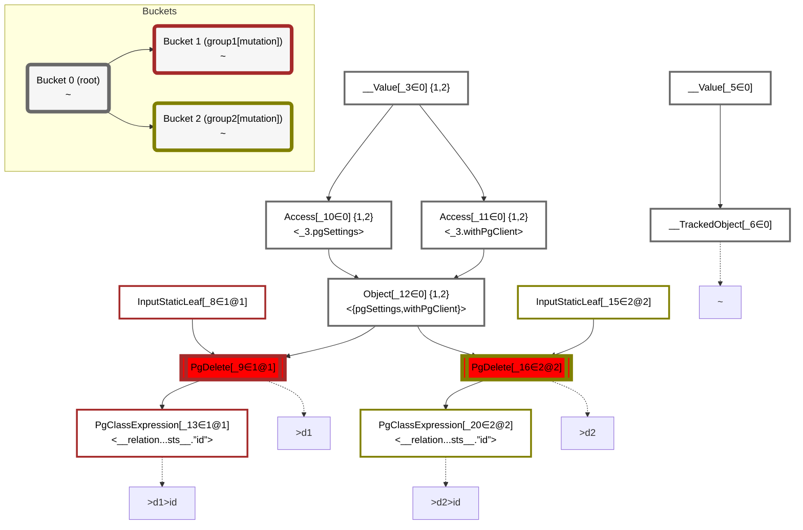

```mermaid
graph TD
    classDef path fill:#eee,stroke:#000,color:#000
    classDef plan fill:#fff,stroke-width:3px,color:#000
    classDef itemplan fill:#fff,stroke-width:6px,color:#000
    classDef sideeffectplan fill:#f00,stroke-width:6px,color:#000
    classDef bucket fill:#f6f6f6,color:#000,stroke-width:6px


    %% define plans
    __Value_3["__Value[_3∈0] {1,2}<br /><context>"]:::plan
    __Value_5["__Value[_5∈0]<br /><rootValue>"]:::plan
    __TrackedObject_6["__TrackedObject[_6∈0]"]:::plan
    InputStaticLeaf_8["InputStaticLeaf[_8∈1@1]"]:::plan
    PgDelete_9[["PgDelete[_9∈1@1]"]]:::sideeffectplan
    Access_10["Access[_10∈0] {1,2}<br /><_3.pgSettings>"]:::plan
    Access_11["Access[_11∈0] {1,2}<br /><_3.withPgClient>"]:::plan
    Object_12["Object[_12∈0] {1,2}<br /><{pgSettings,withPgClient}>"]:::plan
    PgClassExpression_13["PgClassExpression[_13∈1@1]<br /><__relation...sts__.”id”>"]:::plan
    InputStaticLeaf_15["InputStaticLeaf[_15∈2@2]"]:::plan
    PgDelete_16[["PgDelete[_16∈2@2]"]]:::sideeffectplan
    PgClassExpression_20["PgClassExpression[_20∈2@2]<br /><__relation...sts__.”id”>"]:::plan

    %% plan dependencies
    __Value_5 --> __TrackedObject_6
    Object_12 --> PgDelete_9
    InputStaticLeaf_8 --> PgDelete_9
    __Value_3 --> Access_10
    __Value_3 --> Access_11
    Access_10 --> Object_12
    Access_11 --> Object_12
    PgDelete_9 --> PgClassExpression_13
    Object_12 --> PgDelete_16
    InputStaticLeaf_15 --> PgDelete_16
    PgDelete_16 --> PgClassExpression_20

    %% plan-to-path relationships
    P1["~"]
    __TrackedObject_6 -.-> P1
    P2[">d1"]
    PgDelete_9 -.-> P2
    P3[">d1>id"]
    PgClassExpression_13 -.-> P3
    P4[">d2"]
    PgDelete_16 -.-> P4
    P5[">d2>id"]
    PgClassExpression_20 -.-> P5

    %% allocate buckets
    classDef bucket0 stroke:#696969
    class __Value_3,__Value_5,__TrackedObject_6,Access_10,Access_11,Object_12 bucket0
    classDef bucket1 stroke:#a52a2a
    class InputStaticLeaf_8,PgDelete_9,PgClassExpression_13 bucket1
    classDef bucket2 stroke:#808000
    class InputStaticLeaf_15,PgDelete_16,PgClassExpression_20 bucket2

    subgraph Buckets
    Bucket0("Bucket 0 (root)<br />~"):::bucket
    style Bucket0 stroke:#696969
    Bucket1("Bucket 1 (group1[mutation])<br />~"):::bucket
    style Bucket1 stroke:#a52a2a
    Bucket0 --> Bucket1
    Bucket2("Bucket 2 (group2[mutation])<br />~"):::bucket
    style Bucket2 stroke:#808000
    Bucket0 --> Bucket2
    end
```
