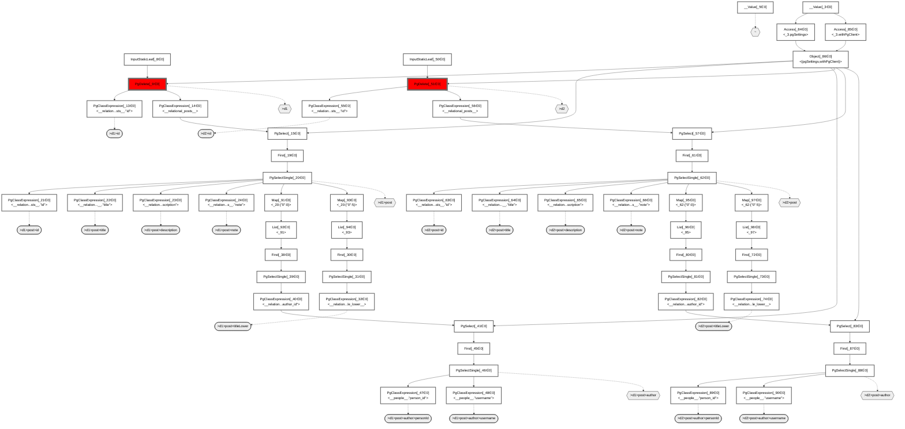

```mermaid
graph TD
    classDef path fill:#eee,stroke:#000,color:#000
    classDef plan fill:#fff,stroke-width:3px,color:#000
    classDef itemplan fill:#fff,stroke-width:6px,color:#000
    classDef sideeffectplan fill:#f00,stroke-width:6px,color:#000

    %% subgraph fields
    P1{{"~"}}:::path
    P2{{">d1"}}:::path
    P3([">d1>id"]):::path
    %% P2 -.-> P3
    P4{{">d1>post"}}:::path
    P5([">d1>post>id"]):::path
    %% P4 -.-> P5
    P6([">d1>post>title"]):::path
    %% P4 -.-> P6
    P7([">d1>post>description"]):::path
    %% P4 -.-> P7
    P8([">d1>post>note"]):::path
    %% P4 -.-> P8
    P9([">d1>post>titleLower"]):::path
    %% P4 -.-> P9
    P10{{">d1>post>author"}}:::path
    P11([">d1>post>author>personId"]):::path
    %% P10 -.-> P11
    P12([">d1>post>author>username"]):::path
    %% P10 -.-> P12
    %% P4 -.-> P10
    %% P2 -.-> P4
    %% P1 -.-> P2
    P13{{">d2"}}:::path
    P14([">d2>id"]):::path
    %% P13 -.-> P14
    P15{{">d2>post"}}:::path
    P16([">d2>post>id"]):::path
    %% P15 -.-> P16
    P17([">d2>post>title"]):::path
    %% P15 -.-> P17
    P18([">d2>post>description"]):::path
    %% P15 -.-> P18
    P19([">d2>post>note"]):::path
    %% P15 -.-> P19
    P20([">d2>post>titleLower"]):::path
    %% P15 -.-> P20
    P21{{">d2>post>author"}}:::path
    P22([">d2>post>author>personId"]):::path
    %% P21 -.-> P22
    P23([">d2>post>author>username"]):::path
    %% P21 -.-> P23
    %% P15 -.-> P21
    %% P13 -.-> P15
    %% P1 -.-> P13
    %% end

    %% define plans
    __Value_3["__Value[_3∈0]<br /><context>"]:::plan
    __Value_5["__Value[_5∈0]<br /><rootValue>"]:::plan
    InputStaticLeaf_8["InputStaticLeaf[_8∈0]"]:::plan
    PgDelete_9["PgDelete[_9∈0]"]:::sideeffectplan
    PgClassExpression_13["PgClassExpression[_13∈0]<br /><__relation...sts__.#quot;id#quot;>"]:::plan
    PgClassExpression_14["PgClassExpression[_14∈0]<br /><__relational_posts__>"]:::plan
    PgSelect_15["PgSelect[_15∈0]<br /><relational_posts>"]:::plan
    First_19["First[_19∈0]"]:::plan
    PgSelectSingle_20["PgSelectSingle[_20∈0]<br /><relational_posts>"]:::plan
    PgClassExpression_21["PgClassExpression[_21∈0]<br /><__relation...sts__.#quot;id#quot;>"]:::plan
    PgClassExpression_22["PgClassExpression[_22∈0]<br /><__relation...__.#quot;title#quot;>"]:::plan
    PgClassExpression_23["PgClassExpression[_23∈0]<br /><__relation...scription#quot;>"]:::plan
    PgClassExpression_24["PgClassExpression[_24∈0]<br /><__relation...s__.#quot;note#quot;>"]:::plan
    First_30["First[_30∈0]"]:::plan
    PgSelectSingle_31["PgSelectSingle[_31∈0]<br /><text>"]:::plan
    PgClassExpression_32["PgClassExpression[_32∈0]<br /><__relation...le_lower__>"]:::plan
    First_38["First[_38∈0]"]:::plan
    PgSelectSingle_39["PgSelectSingle[_39∈0]<br /><relational_items>"]:::plan
    PgClassExpression_40["PgClassExpression[_40∈0]<br /><__relation...author_id#quot;>"]:::plan
    PgSelect_41["PgSelect[_41∈0]<br /><people>"]:::plan
    First_45["First[_45∈0]"]:::plan
    PgSelectSingle_46["PgSelectSingle[_46∈0]<br /><people>"]:::plan
    PgClassExpression_47["PgClassExpression[_47∈0]<br /><__people__.#quot;person_id#quot;>"]:::plan
    PgClassExpression_48["PgClassExpression[_48∈0]<br /><__people__.#quot;username#quot;>"]:::plan
    InputStaticLeaf_50["InputStaticLeaf[_50∈0]"]:::plan
    PgDelete_51["PgDelete[_51∈0]"]:::sideeffectplan
    PgClassExpression_55["PgClassExpression[_55∈0]<br /><__relation...sts__.#quot;id#quot;>"]:::plan
    PgClassExpression_56["PgClassExpression[_56∈0]<br /><__relational_posts__>"]:::plan
    PgSelect_57["PgSelect[_57∈0]<br /><relational_posts>"]:::plan
    First_61["First[_61∈0]"]:::plan
    PgSelectSingle_62["PgSelectSingle[_62∈0]<br /><relational_posts>"]:::plan
    PgClassExpression_63["PgClassExpression[_63∈0]<br /><__relation...sts__.#quot;id#quot;>"]:::plan
    PgClassExpression_64["PgClassExpression[_64∈0]<br /><__relation...__.#quot;title#quot;>"]:::plan
    PgClassExpression_65["PgClassExpression[_65∈0]<br /><__relation...scription#quot;>"]:::plan
    PgClassExpression_66["PgClassExpression[_66∈0]<br /><__relation...s__.#quot;note#quot;>"]:::plan
    First_72["First[_72∈0]"]:::plan
    PgSelectSingle_73["PgSelectSingle[_73∈0]<br /><text>"]:::plan
    PgClassExpression_74["PgClassExpression[_74∈0]<br /><__relation...le_lower__>"]:::plan
    First_80["First[_80∈0]"]:::plan
    PgSelectSingle_81["PgSelectSingle[_81∈0]<br /><relational_items>"]:::plan
    PgClassExpression_82["PgClassExpression[_82∈0]<br /><__relation...author_id#quot;>"]:::plan
    PgSelect_83["PgSelect[_83∈0]<br /><people>"]:::plan
    Access_84["Access[_84∈0]<br /><_3.pgSettings>"]:::plan
    Access_85["Access[_85∈0]<br /><_3.withPgClient>"]:::plan
    Object_86["Object[_86∈0]<br /><{pgSettings,withPgClient}>"]:::plan
    First_87["First[_87∈0]"]:::plan
    PgSelectSingle_88["PgSelectSingle[_88∈0]<br /><people>"]:::plan
    PgClassExpression_89["PgClassExpression[_89∈0]<br /><__people__.#quot;person_id#quot;>"]:::plan
    PgClassExpression_90["PgClassExpression[_90∈0]<br /><__people__.#quot;username#quot;>"]:::plan
    Map_91["Map[_91∈0]<br /><_20:{#quot;0#quot;:0}>"]:::plan
    List_92["List[_92∈0]<br /><_91>"]:::plan
    Map_93["Map[_93∈0]<br /><_20:{#quot;0#quot;:5}>"]:::plan
    List_94["List[_94∈0]<br /><_93>"]:::plan
    Map_95["Map[_95∈0]<br /><_62:{#quot;0#quot;:0}>"]:::plan
    List_96["List[_96∈0]<br /><_95>"]:::plan
    Map_97["Map[_97∈0]<br /><_62:{#quot;0#quot;:5}>"]:::plan
    List_98["List[_98∈0]<br /><_97>"]:::plan

    %% plan dependencies
    Object_86 --> PgDelete_9
    InputStaticLeaf_8 --> PgDelete_9
    PgDelete_9 --> PgClassExpression_13
    PgDelete_9 --> PgClassExpression_14
    Object_86 --> PgSelect_15
    PgClassExpression_14 --> PgSelect_15
    PgSelect_15 --> First_19
    First_19 --> PgSelectSingle_20
    PgSelectSingle_20 --> PgClassExpression_21
    PgSelectSingle_20 --> PgClassExpression_22
    PgSelectSingle_20 --> PgClassExpression_23
    PgSelectSingle_20 --> PgClassExpression_24
    List_94 --> First_30
    First_30 --> PgSelectSingle_31
    PgSelectSingle_31 --> PgClassExpression_32
    List_92 --> First_38
    First_38 --> PgSelectSingle_39
    PgSelectSingle_39 --> PgClassExpression_40
    Object_86 --> PgSelect_41
    PgClassExpression_40 --> PgSelect_41
    PgSelect_41 --> First_45
    First_45 --> PgSelectSingle_46
    PgSelectSingle_46 --> PgClassExpression_47
    PgSelectSingle_46 --> PgClassExpression_48
    Object_86 --> PgDelete_51
    InputStaticLeaf_50 --> PgDelete_51
    PgDelete_51 --> PgClassExpression_55
    PgDelete_51 --> PgClassExpression_56
    Object_86 --> PgSelect_57
    PgClassExpression_56 --> PgSelect_57
    PgSelect_57 --> First_61
    First_61 --> PgSelectSingle_62
    PgSelectSingle_62 --> PgClassExpression_63
    PgSelectSingle_62 --> PgClassExpression_64
    PgSelectSingle_62 --> PgClassExpression_65
    PgSelectSingle_62 --> PgClassExpression_66
    List_98 --> First_72
    First_72 --> PgSelectSingle_73
    PgSelectSingle_73 --> PgClassExpression_74
    List_96 --> First_80
    First_80 --> PgSelectSingle_81
    PgSelectSingle_81 --> PgClassExpression_82
    Object_86 --> PgSelect_83
    PgClassExpression_82 --> PgSelect_83
    __Value_3 --> Access_84
    __Value_3 --> Access_85
    Access_84 --> Object_86
    Access_85 --> Object_86
    PgSelect_83 --> First_87
    First_87 --> PgSelectSingle_88
    PgSelectSingle_88 --> PgClassExpression_89
    PgSelectSingle_88 --> PgClassExpression_90
    PgSelectSingle_20 --> Map_91
    Map_91 --> List_92
    PgSelectSingle_20 --> Map_93
    Map_93 --> List_94
    PgSelectSingle_62 --> Map_95
    Map_95 --> List_96
    PgSelectSingle_62 --> Map_97
    Map_97 --> List_98

    %% plan-to-path relationships
    __Value_5 -.-> P1
    PgDelete_9 -.-> P2
    PgClassExpression_13 -.-> P3
    PgSelectSingle_20 -.-> P4
    PgClassExpression_21 -.-> P5
    PgClassExpression_22 -.-> P6
    PgClassExpression_23 -.-> P7
    PgClassExpression_24 -.-> P8
    PgClassExpression_32 -.-> P9
    PgSelectSingle_46 -.-> P10
    PgClassExpression_47 -.-> P11
    PgClassExpression_48 -.-> P12
    PgDelete_51 -.-> P13
    PgClassExpression_55 -.-> P14
    PgSelectSingle_62 -.-> P15
    PgClassExpression_63 -.-> P16
    PgClassExpression_64 -.-> P17
    PgClassExpression_65 -.-> P18
    PgClassExpression_66 -.-> P19
    PgClassExpression_74 -.-> P20
    PgSelectSingle_88 -.-> P21
    PgClassExpression_89 -.-> P22
    PgClassExpression_90 -.-> P23

    %% allocate buckets
    classDef bucket0 stroke:#696969
    class __Value_3,__Value_5,InputStaticLeaf_8,PgDelete_9,PgClassExpression_13,PgClassExpression_14,PgSelect_15,First_19,PgSelectSingle_20,PgClassExpression_21,PgClassExpression_22,PgClassExpression_23,PgClassExpression_24,First_30,PgSelectSingle_31,PgClassExpression_32,First_38,PgSelectSingle_39,PgClassExpression_40,PgSelect_41,First_45,PgSelectSingle_46,PgClassExpression_47,PgClassExpression_48,InputStaticLeaf_50,PgDelete_51,PgClassExpression_55,PgClassExpression_56,PgSelect_57,First_61,PgSelectSingle_62,PgClassExpression_63,PgClassExpression_64,PgClassExpression_65,PgClassExpression_66,First_72,PgSelectSingle_73,PgClassExpression_74,First_80,PgSelectSingle_81,PgClassExpression_82,PgSelect_83,Access_84,Access_85,Object_86,First_87,PgSelectSingle_88,PgClassExpression_89,PgClassExpression_90,Map_91,List_92,Map_93,List_94,Map_95,List_96,Map_97,List_98 bucket0
```
