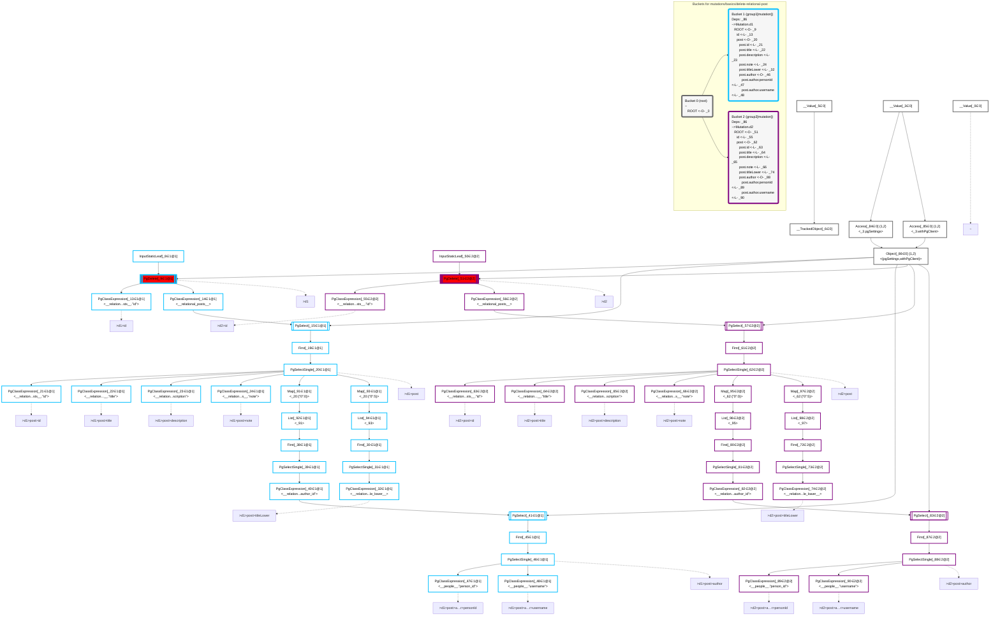

```mermaid
graph TD
    classDef path fill:#eee,stroke:#000,color:#000
    classDef plan fill:#fff,stroke-width:3px,color:#000
    classDef itemplan fill:#fff,stroke-width:6px,color:#000
    classDef sideeffectplan fill:#f00,stroke-width:6px,color:#000
    classDef bucket fill:#f6f6f6,color:#000,stroke-width:6px,text-align:left


    %% define plans
    __Value_0["__Value[_0∈0]"]:::plan
    __Value_3["__Value[_3∈0]<br /><context>"]:::plan
    __Value_5["__Value[_5∈0]<br /><rootValue>"]:::plan
    __TrackedObject_6["__TrackedObject[_6∈0]"]:::plan
    InputStaticLeaf_8["InputStaticLeaf[_8∈1@1]"]:::plan
    PgDelete_9[["PgDelete[_9∈1@1]"]]:::sideeffectplan
    PgClassExpression_13["PgClassExpression[_13∈1@1]<br /><__relation...sts__.”id”>"]:::plan
    PgClassExpression_14["PgClassExpression[_14∈1@1]<br /><__relational_posts__>"]:::plan
    PgSelect_15[["PgSelect[_15∈1@1]<br /><relational_posts>"]]:::plan
    First_19["First[_19∈1@1]"]:::plan
    PgSelectSingle_20["PgSelectSingle[_20∈1@1]<br /><relational_posts>"]:::plan
    PgClassExpression_21["PgClassExpression[_21∈1@1]<br /><__relation...sts__.”id”>"]:::plan
    PgClassExpression_22["PgClassExpression[_22∈1@1]<br /><__relation...__.”title”>"]:::plan
    PgClassExpression_23["PgClassExpression[_23∈1@1]<br /><__relation...scription”>"]:::plan
    PgClassExpression_24["PgClassExpression[_24∈1@1]<br /><__relation...s__.”note”>"]:::plan
    First_30["First[_30∈1@1]"]:::plan
    PgSelectSingle_31["PgSelectSingle[_31∈1@1]<br /><text>"]:::plan
    PgClassExpression_32["PgClassExpression[_32∈1@1]<br /><__relation...le_lower__>"]:::plan
    First_38["First[_38∈1@1]"]:::plan
    PgSelectSingle_39["PgSelectSingle[_39∈1@1]<br /><relational_items>"]:::plan
    PgClassExpression_40["PgClassExpression[_40∈1@1]<br /><__relation...author_id”>"]:::plan
    PgSelect_41[["PgSelect[_41∈1@1]<br /><people>"]]:::plan
    First_45["First[_45∈1@1]"]:::plan
    PgSelectSingle_46["PgSelectSingle[_46∈1@1]<br /><people>"]:::plan
    PgClassExpression_47["PgClassExpression[_47∈1@1]<br /><__people__.”person_id”>"]:::plan
    PgClassExpression_48["PgClassExpression[_48∈1@1]<br /><__people__.”username”>"]:::plan
    InputStaticLeaf_50["InputStaticLeaf[_50∈2@2]"]:::plan
    PgDelete_51[["PgDelete[_51∈2@2]"]]:::sideeffectplan
    PgClassExpression_55["PgClassExpression[_55∈2@2]<br /><__relation...sts__.”id”>"]:::plan
    PgClassExpression_56["PgClassExpression[_56∈2@2]<br /><__relational_posts__>"]:::plan
    PgSelect_57[["PgSelect[_57∈2@2]<br /><relational_posts>"]]:::plan
    First_61["First[_61∈2@2]"]:::plan
    PgSelectSingle_62["PgSelectSingle[_62∈2@2]<br /><relational_posts>"]:::plan
    PgClassExpression_63["PgClassExpression[_63∈2@2]<br /><__relation...sts__.”id”>"]:::plan
    PgClassExpression_64["PgClassExpression[_64∈2@2]<br /><__relation...__.”title”>"]:::plan
    PgClassExpression_65["PgClassExpression[_65∈2@2]<br /><__relation...scription”>"]:::plan
    PgClassExpression_66["PgClassExpression[_66∈2@2]<br /><__relation...s__.”note”>"]:::plan
    First_72["First[_72∈2@2]"]:::plan
    PgSelectSingle_73["PgSelectSingle[_73∈2@2]<br /><text>"]:::plan
    PgClassExpression_74["PgClassExpression[_74∈2@2]<br /><__relation...le_lower__>"]:::plan
    First_80["First[_80∈2@2]"]:::plan
    PgSelectSingle_81["PgSelectSingle[_81∈2@2]<br /><relational_items>"]:::plan
    PgClassExpression_82["PgClassExpression[_82∈2@2]<br /><__relation...author_id”>"]:::plan
    PgSelect_83[["PgSelect[_83∈2@2]<br /><people>"]]:::plan
    Access_84["Access[_84∈0] {1,2}<br /><_3.pgSettings>"]:::plan
    Access_85["Access[_85∈0] {1,2}<br /><_3.withPgClient>"]:::plan
    Object_86["Object[_86∈0] {1,2}<br /><{pgSettings,withPgClient}>"]:::plan
    First_87["First[_87∈2@2]"]:::plan
    PgSelectSingle_88["PgSelectSingle[_88∈2@2]<br /><people>"]:::plan
    PgClassExpression_89["PgClassExpression[_89∈2@2]<br /><__people__.”person_id”>"]:::plan
    PgClassExpression_90["PgClassExpression[_90∈2@2]<br /><__people__.”username”>"]:::plan
    Map_91["Map[_91∈1@1]<br /><_20:{”0”:0}>"]:::plan
    List_92["List[_92∈1@1]<br /><_91>"]:::plan
    Map_93["Map[_93∈1@1]<br /><_20:{”0”:5}>"]:::plan
    List_94["List[_94∈1@1]<br /><_93>"]:::plan
    Map_95["Map[_95∈2@2]<br /><_62:{”0”:0}>"]:::plan
    List_96["List[_96∈2@2]<br /><_95>"]:::plan
    Map_97["Map[_97∈2@2]<br /><_62:{”0”:5}>"]:::plan
    List_98["List[_98∈2@2]<br /><_97>"]:::plan

    %% plan dependencies
    __Value_5 --> __TrackedObject_6
    Object_86 --> PgDelete_9
    InputStaticLeaf_8 --> PgDelete_9
    PgDelete_9 --> PgClassExpression_13
    PgDelete_9 --> PgClassExpression_14
    Object_86 --> PgSelect_15
    PgClassExpression_14 --> PgSelect_15
    PgSelect_15 --> First_19
    First_19 --> PgSelectSingle_20
    PgSelectSingle_20 --> PgClassExpression_21
    PgSelectSingle_20 --> PgClassExpression_22
    PgSelectSingle_20 --> PgClassExpression_23
    PgSelectSingle_20 --> PgClassExpression_24
    List_94 --> First_30
    First_30 --> PgSelectSingle_31
    PgSelectSingle_31 --> PgClassExpression_32
    List_92 --> First_38
    First_38 --> PgSelectSingle_39
    PgSelectSingle_39 --> PgClassExpression_40
    Object_86 --> PgSelect_41
    PgClassExpression_40 --> PgSelect_41
    PgSelect_41 --> First_45
    First_45 --> PgSelectSingle_46
    PgSelectSingle_46 --> PgClassExpression_47
    PgSelectSingle_46 --> PgClassExpression_48
    Object_86 --> PgDelete_51
    InputStaticLeaf_50 --> PgDelete_51
    PgDelete_51 --> PgClassExpression_55
    PgDelete_51 --> PgClassExpression_56
    Object_86 --> PgSelect_57
    PgClassExpression_56 --> PgSelect_57
    PgSelect_57 --> First_61
    First_61 --> PgSelectSingle_62
    PgSelectSingle_62 --> PgClassExpression_63
    PgSelectSingle_62 --> PgClassExpression_64
    PgSelectSingle_62 --> PgClassExpression_65
    PgSelectSingle_62 --> PgClassExpression_66
    List_98 --> First_72
    First_72 --> PgSelectSingle_73
    PgSelectSingle_73 --> PgClassExpression_74
    List_96 --> First_80
    First_80 --> PgSelectSingle_81
    PgSelectSingle_81 --> PgClassExpression_82
    Object_86 --> PgSelect_83
    PgClassExpression_82 --> PgSelect_83
    __Value_3 --> Access_84
    __Value_3 --> Access_85
    Access_84 --> Object_86
    Access_85 --> Object_86
    PgSelect_83 --> First_87
    First_87 --> PgSelectSingle_88
    PgSelectSingle_88 --> PgClassExpression_89
    PgSelectSingle_88 --> PgClassExpression_90
    PgSelectSingle_20 --> Map_91
    Map_91 --> List_92
    PgSelectSingle_20 --> Map_93
    Map_93 --> List_94
    PgSelectSingle_62 --> Map_95
    Map_95 --> List_96
    PgSelectSingle_62 --> Map_97
    Map_97 --> List_98

    %% plan-to-path relationships
    P_0["~"]
    __Value_0 -.-> P_0
    P_9[">d1"]
    PgDelete_9 -.-> P_9
    P_13[">d1>id"]
    PgClassExpression_13 -.-> P_13
    P_20[">d1>post"]
    PgSelectSingle_20 -.-> P_20
    P_21[">d1>post>id"]
    PgClassExpression_21 -.-> P_21
    P_22[">d1>post>title"]
    PgClassExpression_22 -.-> P_22
    P_23[">d1>post>description"]
    PgClassExpression_23 -.-> P_23
    P_24[">d1>post>note"]
    PgClassExpression_24 -.-> P_24
    P_32[">d1>post>titleLower"]
    PgClassExpression_32 -.-> P_32
    P_46[">d1>post>author"]
    PgSelectSingle_46 -.-> P_46
    P_47[">d1>post>a…r>personId"]
    PgClassExpression_47 -.-> P_47
    P_48[">d1>post>a…r>username"]
    PgClassExpression_48 -.-> P_48
    P_51[">d2"]
    PgDelete_51 -.-> P_51
    P_55[">d2>id"]
    PgClassExpression_55 -.-> P_55
    P_62[">d2>post"]
    PgSelectSingle_62 -.-> P_62
    P_63[">d2>post>id"]
    PgClassExpression_63 -.-> P_63
    P_64[">d2>post>title"]
    PgClassExpression_64 -.-> P_64
    P_65[">d2>post>description"]
    PgClassExpression_65 -.-> P_65
    P_66[">d2>post>note"]
    PgClassExpression_66 -.-> P_66
    P_74[">d2>post>titleLower"]
    PgClassExpression_74 -.-> P_74
    P_88[">d2>post>author"]
    PgSelectSingle_88 -.-> P_88
    P_89[">d2>post>a…r>personId"]
    PgClassExpression_89 -.-> P_89
    P_90[">d2>post>a…r>username"]
    PgClassExpression_90 -.-> P_90

    %% allocate buckets
    classDef bucket0 stroke:#696969
    class __Value_0,__Value_3,__Value_5,__TrackedObject_6,Access_84,Access_85,Object_86 bucket0
    classDef bucket1 stroke:#00bfff
    class InputStaticLeaf_8,PgDelete_9,PgClassExpression_13,PgClassExpression_14,PgSelect_15,First_19,PgSelectSingle_20,PgClassExpression_21,PgClassExpression_22,PgClassExpression_23,PgClassExpression_24,First_30,PgSelectSingle_31,PgClassExpression_32,First_38,PgSelectSingle_39,PgClassExpression_40,PgSelect_41,First_45,PgSelectSingle_46,PgClassExpression_47,PgClassExpression_48,Map_91,List_92,Map_93,List_94 bucket1
    classDef bucket2 stroke:#7f007f
    class InputStaticLeaf_50,PgDelete_51,PgClassExpression_55,PgClassExpression_56,PgSelect_57,First_61,PgSelectSingle_62,PgClassExpression_63,PgClassExpression_64,PgClassExpression_65,PgClassExpression_66,First_72,PgSelectSingle_73,PgClassExpression_74,First_80,PgSelectSingle_81,PgClassExpression_82,PgSelect_83,First_87,PgSelectSingle_88,PgClassExpression_89,PgClassExpression_90,Map_95,List_96,Map_97,List_98 bucket2

    subgraph "Buckets for mutations/basics/delete-relational-post"
    Bucket0("Bucket 0 (root)<br />~<br />⠀ROOT <-O- _0"):::bucket
    style Bucket0 stroke:#696969
    Bucket1("Bucket 1 (group1[mutation])<br />Deps: _86<br />~>Mutation.d1<br />⠀ROOT <-O- _9<br />⠀⠀id <-L- _13<br />⠀⠀post <-O- _20<br />⠀⠀⠀post.id <-L- _21<br />⠀⠀⠀post.title <-L- _22<br />⠀⠀⠀post.description <-L- _23<br />⠀⠀⠀post.note <-L- _24<br />⠀⠀⠀post.titleLower <-L- _32<br />⠀⠀⠀post.author <-O- _46<br />⠀⠀⠀⠀post.author.personId <-L- _47<br />⠀⠀⠀⠀post.author.username <-L- _48"):::bucket
    style Bucket1 stroke:#00bfff
    Bucket0 --> Bucket1
    Bucket2("Bucket 2 (group2[mutation])<br />Deps: _86<br />~>Mutation.d2<br />⠀ROOT <-O- _51<br />⠀⠀id <-L- _55<br />⠀⠀post <-O- _62<br />⠀⠀⠀post.id <-L- _63<br />⠀⠀⠀post.title <-L- _64<br />⠀⠀⠀post.description <-L- _65<br />⠀⠀⠀post.note <-L- _66<br />⠀⠀⠀post.titleLower <-L- _74<br />⠀⠀⠀post.author <-O- _88<br />⠀⠀⠀⠀post.author.personId <-L- _89<br />⠀⠀⠀⠀post.author.username <-L- _90"):::bucket
    style Bucket2 stroke:#7f007f
    Bucket0 --> Bucket2
    end
```
