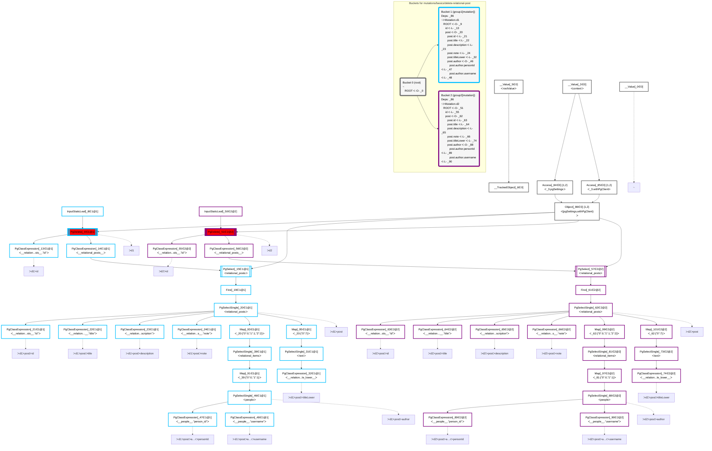

```mermaid
graph TD
    classDef path fill:#eee,stroke:#000,color:#000
    classDef plan fill:#fff,stroke-width:3px,color:#000
    classDef itemplan fill:#fff,stroke-width:6px,color:#000
    classDef sideeffectplan fill:#f00,stroke-width:6px,color:#000
    classDef bucket fill:#f6f6f6,color:#000,stroke-width:6px,text-align:left


    %% define plans
    __Value_0["__Value[_0∈0]"]:::plan
    __Value_3["__Value[_3∈0]<br />ᐸcontextᐳ"]:::plan
    __Value_5["__Value[_5∈0]<br />ᐸrootValueᐳ"]:::plan
    __TrackedObject_6["__TrackedObject[_6∈0]"]:::plan
    InputStaticLeaf_8["InputStaticLeaf[_8∈1@1]"]:::plan
    PgDelete_9[["PgDelete[_9∈1@1]"]]:::sideeffectplan
    PgClassExpression_13["PgClassExpression[_13∈1@1]<br />ᐸ__relation...sts__.”id”ᐳ"]:::plan
    PgClassExpression_14["PgClassExpression[_14∈1@1]<br />ᐸ__relational_posts__ᐳ"]:::plan
    PgSelect_15[["PgSelect[_15∈1@1]<br />ᐸrelational_postsᐳ"]]:::plan
    First_19["First[_19∈1@1]"]:::plan
    PgSelectSingle_20["PgSelectSingle[_20∈1@1]<br />ᐸrelational_postsᐳ"]:::plan
    PgClassExpression_21["PgClassExpression[_21∈1@1]<br />ᐸ__relation...sts__.”id”ᐳ"]:::plan
    PgClassExpression_22["PgClassExpression[_22∈1@1]<br />ᐸ__relation...__.”title”ᐳ"]:::plan
    PgClassExpression_23["PgClassExpression[_23∈1@1]<br />ᐸ__relation...scription”ᐳ"]:::plan
    PgClassExpression_24["PgClassExpression[_24∈1@1]<br />ᐸ__relation...s__.”note”ᐳ"]:::plan
    PgSelectSingle_31["PgSelectSingle[_31∈1@1]<br />ᐸtextᐳ"]:::plan
    PgClassExpression_32["PgClassExpression[_32∈1@1]<br />ᐸ__relation...le_lower__ᐳ"]:::plan
    PgSelectSingle_39["PgSelectSingle[_39∈1@1]<br />ᐸrelational_itemsᐳ"]:::plan
    PgSelectSingle_46["PgSelectSingle[_46∈1@1]<br />ᐸpeopleᐳ"]:::plan
    PgClassExpression_47["PgClassExpression[_47∈1@1]<br />ᐸ__people__.”person_id”ᐳ"]:::plan
    PgClassExpression_48["PgClassExpression[_48∈1@1]<br />ᐸ__people__.”username”ᐳ"]:::plan
    InputStaticLeaf_50["InputStaticLeaf[_50∈2@2]"]:::plan
    PgDelete_51[["PgDelete[_51∈2@2]"]]:::sideeffectplan
    PgClassExpression_55["PgClassExpression[_55∈2@2]<br />ᐸ__relation...sts__.”id”ᐳ"]:::plan
    PgClassExpression_56["PgClassExpression[_56∈2@2]<br />ᐸ__relational_posts__ᐳ"]:::plan
    PgSelect_57[["PgSelect[_57∈2@2]<br />ᐸrelational_postsᐳ"]]:::plan
    First_61["First[_61∈2@2]"]:::plan
    PgSelectSingle_62["PgSelectSingle[_62∈2@2]<br />ᐸrelational_postsᐳ"]:::plan
    PgClassExpression_63["PgClassExpression[_63∈2@2]<br />ᐸ__relation...sts__.”id”ᐳ"]:::plan
    PgClassExpression_64["PgClassExpression[_64∈2@2]<br />ᐸ__relation...__.”title”ᐳ"]:::plan
    PgClassExpression_65["PgClassExpression[_65∈2@2]<br />ᐸ__relation...scription”ᐳ"]:::plan
    PgClassExpression_66["PgClassExpression[_66∈2@2]<br />ᐸ__relation...s__.”note”ᐳ"]:::plan
    PgSelectSingle_73["PgSelectSingle[_73∈2@2]<br />ᐸtextᐳ"]:::plan
    PgClassExpression_74["PgClassExpression[_74∈2@2]<br />ᐸ__relation...le_lower__ᐳ"]:::plan
    PgSelectSingle_81["PgSelectSingle[_81∈2@2]<br />ᐸrelational_itemsᐳ"]:::plan
    Access_84["Access[_84∈0] {1,2}<br />ᐸ_3.pgSettingsᐳ"]:::plan
    Access_85["Access[_85∈0] {1,2}<br />ᐸ_3.withPgClientᐳ"]:::plan
    Object_86["Object[_86∈0] {1,2}<br />ᐸ{pgSettings,withPgClient}ᐳ"]:::plan
    PgSelectSingle_88["PgSelectSingle[_88∈2@2]<br />ᐸpeopleᐳ"]:::plan
    PgClassExpression_89["PgClassExpression[_89∈2@2]<br />ᐸ__people__.”person_id”ᐳ"]:::plan
    PgClassExpression_90["PgClassExpression[_90∈2@2]<br />ᐸ__people__.”username”ᐳ"]:::plan
    Map_91["Map[_91∈1@1]<br />ᐸ_39:{”0”:0,”1”:1}ᐳ"]:::plan
    Map_93["Map[_93∈1@1]<br />ᐸ_20:{”0”:0,”1”:1,”2”:2}ᐳ"]:::plan
    Map_95["Map[_95∈1@1]<br />ᐸ_20:{”0”:7}ᐳ"]:::plan
    Map_97["Map[_97∈2@2]<br />ᐸ_81:{”0”:0,”1”:1}ᐳ"]:::plan
    Map_99["Map[_99∈2@2]<br />ᐸ_62:{”0”:0,”1”:1,”2”:2}ᐳ"]:::plan
    Map_101["Map[_101∈2@2]<br />ᐸ_62:{”0”:7}ᐳ"]:::plan

    %% plan dependencies
    __Value_5 --> __TrackedObject_6
    Object_86 & InputStaticLeaf_8 --> PgDelete_9
    PgDelete_9 --> PgClassExpression_13
    PgDelete_9 --> PgClassExpression_14
    Object_86 & PgClassExpression_14 --> PgSelect_15
    PgSelect_15 --> First_19
    First_19 --> PgSelectSingle_20
    PgSelectSingle_20 --> PgClassExpression_21
    PgSelectSingle_20 --> PgClassExpression_22
    PgSelectSingle_20 --> PgClassExpression_23
    PgSelectSingle_20 --> PgClassExpression_24
    Map_95 --> PgSelectSingle_31
    PgSelectSingle_31 --> PgClassExpression_32
    Map_93 --> PgSelectSingle_39
    Map_91 --> PgSelectSingle_46
    PgSelectSingle_46 --> PgClassExpression_47
    PgSelectSingle_46 --> PgClassExpression_48
    Object_86 & InputStaticLeaf_50 --> PgDelete_51
    PgDelete_51 --> PgClassExpression_55
    PgDelete_51 --> PgClassExpression_56
    Object_86 & PgClassExpression_56 --> PgSelect_57
    PgSelect_57 --> First_61
    First_61 --> PgSelectSingle_62
    PgSelectSingle_62 --> PgClassExpression_63
    PgSelectSingle_62 --> PgClassExpression_64
    PgSelectSingle_62 --> PgClassExpression_65
    PgSelectSingle_62 --> PgClassExpression_66
    Map_101 --> PgSelectSingle_73
    PgSelectSingle_73 --> PgClassExpression_74
    Map_99 --> PgSelectSingle_81
    __Value_3 --> Access_84
    __Value_3 --> Access_85
    Access_84 & Access_85 --> Object_86
    Map_97 --> PgSelectSingle_88
    PgSelectSingle_88 --> PgClassExpression_89
    PgSelectSingle_88 --> PgClassExpression_90
    PgSelectSingle_39 --> Map_91
    PgSelectSingle_20 --> Map_93
    PgSelectSingle_20 --> Map_95
    PgSelectSingle_81 --> Map_97
    PgSelectSingle_62 --> Map_99
    PgSelectSingle_62 --> Map_101

    %% plan-to-path relationships
    P_0["~"]
    __Value_0 -.-> P_0
    P_9["ᐳd1"]
    PgDelete_9 -.-> P_9
    P_13["ᐳd1ᐳid"]
    PgClassExpression_13 -.-> P_13
    P_20["ᐳd1ᐳpost"]
    PgSelectSingle_20 -.-> P_20
    P_21["ᐳd1ᐳpostᐳid"]
    PgClassExpression_21 -.-> P_21
    P_22["ᐳd1ᐳpostᐳtitle"]
    PgClassExpression_22 -.-> P_22
    P_23["ᐳd1ᐳpostᐳdescription"]
    PgClassExpression_23 -.-> P_23
    P_24["ᐳd1ᐳpostᐳnote"]
    PgClassExpression_24 -.-> P_24
    P_32["ᐳd1ᐳpostᐳtitleLower"]
    PgClassExpression_32 -.-> P_32
    P_46["ᐳd1ᐳpostᐳauthor"]
    PgSelectSingle_46 -.-> P_46
    P_47["ᐳd1ᐳpostᐳa…rᐳpersonId"]
    PgClassExpression_47 -.-> P_47
    P_48["ᐳd1ᐳpostᐳa…rᐳusername"]
    PgClassExpression_48 -.-> P_48
    P_51["ᐳd2"]
    PgDelete_51 -.-> P_51
    P_55["ᐳd2ᐳid"]
    PgClassExpression_55 -.-> P_55
    P_62["ᐳd2ᐳpost"]
    PgSelectSingle_62 -.-> P_62
    P_63["ᐳd2ᐳpostᐳid"]
    PgClassExpression_63 -.-> P_63
    P_64["ᐳd2ᐳpostᐳtitle"]
    PgClassExpression_64 -.-> P_64
    P_65["ᐳd2ᐳpostᐳdescription"]
    PgClassExpression_65 -.-> P_65
    P_66["ᐳd2ᐳpostᐳnote"]
    PgClassExpression_66 -.-> P_66
    P_74["ᐳd2ᐳpostᐳtitleLower"]
    PgClassExpression_74 -.-> P_74
    P_88["ᐳd2ᐳpostᐳauthor"]
    PgSelectSingle_88 -.-> P_88
    P_89["ᐳd2ᐳpostᐳa…rᐳpersonId"]
    PgClassExpression_89 -.-> P_89
    P_90["ᐳd2ᐳpostᐳa…rᐳusername"]
    PgClassExpression_90 -.-> P_90

    %% allocate buckets
    classDef bucket0 stroke:#696969
    class __Value_0,__Value_3,__Value_5,__TrackedObject_6,Access_84,Access_85,Object_86 bucket0
    classDef bucket1 stroke:#00bfff
    class InputStaticLeaf_8,PgDelete_9,PgClassExpression_13,PgClassExpression_14,PgSelect_15,First_19,PgSelectSingle_20,PgClassExpression_21,PgClassExpression_22,PgClassExpression_23,PgClassExpression_24,PgSelectSingle_31,PgClassExpression_32,PgSelectSingle_39,PgSelectSingle_46,PgClassExpression_47,PgClassExpression_48,Map_91,Map_93,Map_95 bucket1
    classDef bucket2 stroke:#7f007f
    class InputStaticLeaf_50,PgDelete_51,PgClassExpression_55,PgClassExpression_56,PgSelect_57,First_61,PgSelectSingle_62,PgClassExpression_63,PgClassExpression_64,PgClassExpression_65,PgClassExpression_66,PgSelectSingle_73,PgClassExpression_74,PgSelectSingle_81,PgSelectSingle_88,PgClassExpression_89,PgClassExpression_90,Map_97,Map_99,Map_101 bucket2

    subgraph "Buckets for mutations/basics/delete-relational-post"
    Bucket0("Bucket 0 (root)<br />~<br />⠀ROOT ᐸ-O- _0"):::bucket
    style Bucket0 stroke:#696969
    Bucket1("Bucket 1 (group1[mutation])<br />Deps: _86<br />~ᐳMutation.d1<br />⠀ROOT ᐸ-O- _9<br />⠀⠀id ᐸ-L- _13<br />⠀⠀post ᐸ-O- _20<br />⠀⠀⠀post.id ᐸ-L- _21<br />⠀⠀⠀post.title ᐸ-L- _22<br />⠀⠀⠀post.description ᐸ-L- _23<br />⠀⠀⠀post.note ᐸ-L- _24<br />⠀⠀⠀post.titleLower ᐸ-L- _32<br />⠀⠀⠀post.author ᐸ-O- _46<br />⠀⠀⠀⠀post.author.personId ᐸ-L- _47<br />⠀⠀⠀⠀post.author.username ᐸ-L- _48"):::bucket
    style Bucket1 stroke:#00bfff
    Bucket2("Bucket 2 (group2[mutation])<br />Deps: _86<br />~ᐳMutation.d2<br />⠀ROOT ᐸ-O- _51<br />⠀⠀id ᐸ-L- _55<br />⠀⠀post ᐸ-O- _62<br />⠀⠀⠀post.id ᐸ-L- _63<br />⠀⠀⠀post.title ᐸ-L- _64<br />⠀⠀⠀post.description ᐸ-L- _65<br />⠀⠀⠀post.note ᐸ-L- _66<br />⠀⠀⠀post.titleLower ᐸ-L- _74<br />⠀⠀⠀post.author ᐸ-O- _88<br />⠀⠀⠀⠀post.author.personId ᐸ-L- _89<br />⠀⠀⠀⠀post.author.username ᐸ-L- _90"):::bucket
    style Bucket2 stroke:#7f007f
    Bucket0 --> Bucket1 & Bucket2
    end
```
