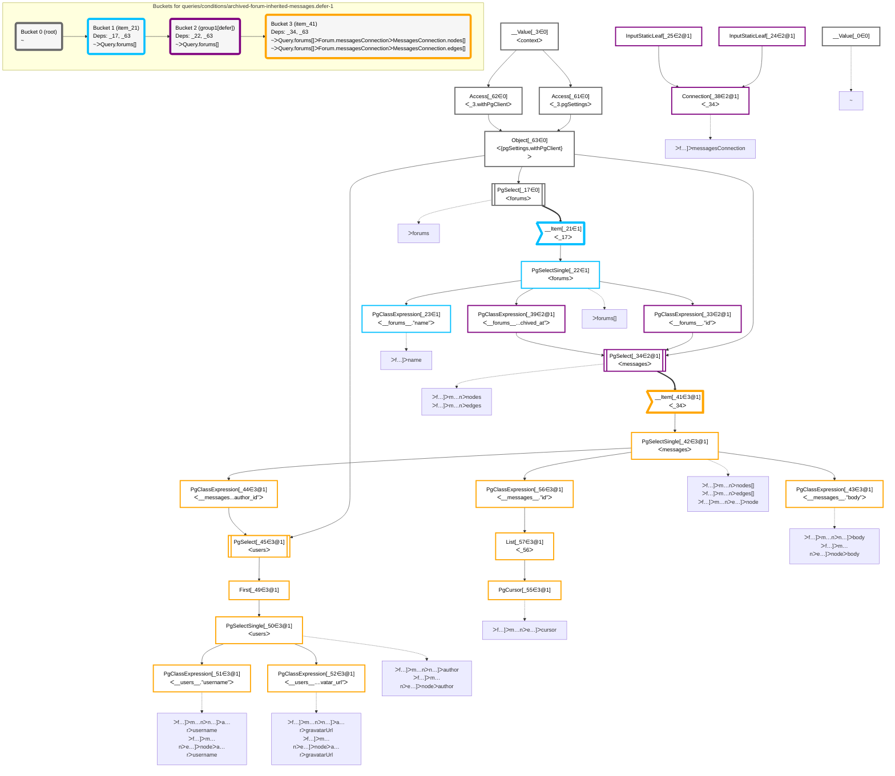

```mermaid
graph TD
    classDef path fill:#eee,stroke:#000,color:#000
    classDef plan fill:#fff,stroke-width:3px,color:#000
    classDef itemplan fill:#fff,stroke-width:6px,color:#000
    classDef sideeffectplan fill:#f00,stroke-width:6px,color:#000
    classDef bucket fill:#f6f6f6,color:#000,stroke-width:6px,text-align:left


    %% define plans
    __Value_0["__Value[_0∈0]"]:::plan
    PgClassExpression_23["PgClassExpression[_23∈1]<br />ᐸ__forums__.”name”ᐳ"]:::plan
    PgClassExpression_43["PgClassExpression[_43∈3@1]<br />ᐸ__messages__.”body”ᐳ"]:::plan
    PgClassExpression_51["PgClassExpression[_51∈3@1]<br />ᐸ__users__.”username”ᐳ"]:::plan
    PgClassExpression_52["PgClassExpression[_52∈3@1]<br />ᐸ__users__....vatar_url”ᐳ"]:::plan
    PgSelectSingle_50["PgSelectSingle[_50∈3@1]<br />ᐸusersᐳ"]:::plan
    First_49["First[_49∈3@1]"]:::plan
    PgSelect_45[["PgSelect[_45∈3@1]<br />ᐸusersᐳ"]]:::plan
    PgClassExpression_44["PgClassExpression[_44∈3@1]<br />ᐸ__messages...author_id”ᐳ"]:::plan
    PgCursor_55["PgCursor[_55∈3@1]"]:::plan
    List_57["List[_57∈3@1]<br />ᐸ_56ᐳ"]:::plan
    PgClassExpression_56["PgClassExpression[_56∈3@1]<br />ᐸ__messages__.”id”ᐳ"]:::plan
    PgSelectSingle_42["PgSelectSingle[_42∈3@1]<br />ᐸmessagesᐳ"]:::plan
    __Item_41>"__Item[_41∈3@1]<br />ᐸ_34ᐳ"]:::itemplan
    PgSelect_34[["PgSelect[_34∈2@1]<br />ᐸmessagesᐳ"]]:::plan
    PgClassExpression_33["PgClassExpression[_33∈2@1]<br />ᐸ__forums__.”id”ᐳ"]:::plan
    PgClassExpression_39["PgClassExpression[_39∈2@1]<br />ᐸ__forums__...chived_at”ᐳ"]:::plan
    PgSelectSingle_22["PgSelectSingle[_22∈1]<br />ᐸforumsᐳ"]:::plan
    __Item_21>"__Item[_21∈1]<br />ᐸ_17ᐳ"]:::itemplan
    PgSelect_17[["PgSelect[_17∈0]<br />ᐸforumsᐳ"]]:::plan
    Object_63["Object[_63∈0]<br />ᐸ{pgSettings,withPgClient}ᐳ"]:::plan
    Access_61["Access[_61∈0]<br />ᐸ_3.pgSettingsᐳ"]:::plan
    Access_62["Access[_62∈0]<br />ᐸ_3.withPgClientᐳ"]:::plan
    __Value_3["__Value[_3∈0]<br />ᐸcontextᐳ"]:::plan
    Connection_38["Connection[_38∈2@1]<br />ᐸ_34ᐳ"]:::plan
    InputStaticLeaf_24["InputStaticLeaf[_24∈2@1]"]:::plan
    InputStaticLeaf_25["InputStaticLeaf[_25∈2@1]"]:::plan

    %% plan dependencies
    PgSelectSingle_22 --> PgClassExpression_23
    PgSelectSingle_42 --> PgClassExpression_43
    PgSelectSingle_50 --> PgClassExpression_51
    PgSelectSingle_50 --> PgClassExpression_52
    First_49 --> PgSelectSingle_50
    PgSelect_45 --> First_49
    Object_63 & PgClassExpression_44 --> PgSelect_45
    PgSelectSingle_42 --> PgClassExpression_44
    List_57 --> PgCursor_55
    PgClassExpression_56 --> List_57
    PgSelectSingle_42 --> PgClassExpression_56
    __Item_41 --> PgSelectSingle_42
    PgSelect_34 ==> __Item_41
    Object_63 & PgClassExpression_33 & PgClassExpression_39 --> PgSelect_34
    PgSelectSingle_22 --> PgClassExpression_33
    PgSelectSingle_22 --> PgClassExpression_39
    __Item_21 --> PgSelectSingle_22
    PgSelect_17 ==> __Item_21
    Object_63 --> PgSelect_17
    Access_61 & Access_62 --> Object_63
    __Value_3 --> Access_61
    __Value_3 --> Access_62
    InputStaticLeaf_24 & InputStaticLeaf_25 --> Connection_38

    %% plan-to-path relationships
    P_0["~"]
    __Value_0 -.-> P_0
    P_17["ᐳforums"]
    PgSelect_17 -.-> P_17
    P_22["ᐳforums[]"]
    PgSelectSingle_22 -.-> P_22
    P_23["ᐳf…]ᐳname"]
    PgClassExpression_23 -.-> P_23
    P_34["ᐳf…]ᐳm…nᐳnodes<br />ᐳf…]ᐳm…nᐳedges"]
    PgSelect_34 -.-> P_34
    P_38["ᐳf…]ᐳmessagesConnection"]
    Connection_38 -.-> P_38
    P_42["ᐳf…]ᐳm…nᐳnodes[]<br />ᐳf…]ᐳm…nᐳedges[]<br />ᐳf…]ᐳm…nᐳe…]ᐳnode"]
    PgSelectSingle_42 -.-> P_42
    P_43["ᐳf…]ᐳm…nᐳn…]ᐳbody<br />ᐳf…]ᐳm…nᐳe…]ᐳnodeᐳbody"]
    PgClassExpression_43 -.-> P_43
    P_50["ᐳf…]ᐳm…nᐳn…]ᐳauthor<br />ᐳf…]ᐳm…nᐳe…]ᐳnodeᐳauthor"]
    PgSelectSingle_50 -.-> P_50
    P_51["ᐳf…]ᐳm…nᐳn…]ᐳa…rᐳusername<br />ᐳf…]ᐳm…nᐳe…]ᐳnodeᐳa…rᐳusername"]
    PgClassExpression_51 -.-> P_51
    P_52["ᐳf…]ᐳm…nᐳn…]ᐳa…rᐳgravatarUrl<br />ᐳf…]ᐳm…nᐳe…]ᐳnodeᐳa…rᐳgravatarUrl"]
    PgClassExpression_52 -.-> P_52
    P_55["ᐳf…]ᐳm…nᐳe…]ᐳcursor"]
    PgCursor_55 -.-> P_55

    subgraph "Buckets for queries/conditions/archived-forum-inherited-messages.defer-1"
    Bucket0("Bucket 0 (root)<br />~"):::bucket
    classDef bucket0 stroke:#696969
    class Bucket0,__Value_0,__Value_3,PgSelect_17,Access_61,Access_62,Object_63 bucket0
    Bucket1("Bucket 1 (item_21)<br />Deps: _17, _63<br />~ᐳQuery.forums[]"):::bucket
    classDef bucket1 stroke:#00bfff
    class Bucket1,__Item_21,PgSelectSingle_22,PgClassExpression_23 bucket1
    Bucket2("Bucket 2 (group1[defer])<br />Deps: _22, _63<br />~ᐳQuery.forums[]"):::bucket
    classDef bucket2 stroke:#7f007f
    class Bucket2,InputStaticLeaf_24,InputStaticLeaf_25,PgClassExpression_33,PgSelect_34,Connection_38,PgClassExpression_39 bucket2
    Bucket3("Bucket 3 (item_41)<br />Deps: _34, _63<br />~ᐳQuery.forums[]ᐳForum.messagesConnectionᐳMessagesConnection.nodes[]<br />~ᐳQuery.forums[]ᐳForum.messagesConnectionᐳMessagesConnection.edges[]"):::bucket
    classDef bucket3 stroke:#ffa500
    class Bucket3,__Item_41,PgSelectSingle_42,PgClassExpression_43,PgClassExpression_44,PgSelect_45,First_49,PgSelectSingle_50,PgClassExpression_51,PgClassExpression_52,PgCursor_55,PgClassExpression_56,List_57 bucket3
    Bucket0 --> Bucket1
    Bucket1 --> Bucket2
    Bucket2 --> Bucket3
    end
```
