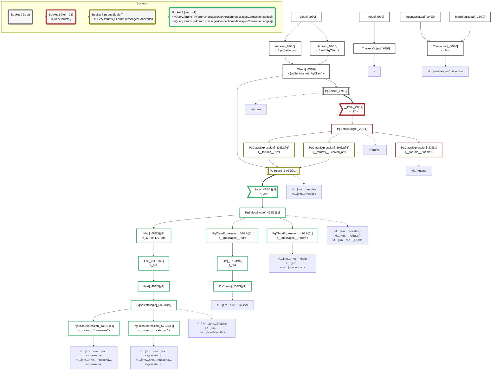

```mermaid
graph TD
    classDef path fill:#eee,stroke:#000,color:#000
    classDef plan fill:#fff,stroke-width:3px,color:#000
    classDef itemplan fill:#fff,stroke-width:6px,color:#000
    classDef sideeffectplan fill:#f00,stroke-width:6px,color:#000
    classDef bucket fill:#f6f6f6,color:#000,stroke-width:6px,text-align:left


    %% define plans
    __Value_3["__Value[_3∈0]<br /><context>"]:::plan
    __Value_5["__Value[_5∈0]<br /><rootValue>"]:::plan
    __TrackedObject_6["__TrackedObject[_6∈0]"]:::plan
    PgSelect_17[["PgSelect[_17∈0]<br /><forums>"]]:::plan
    __Item_21>"__Item[_21∈1]<br /><_17>"]:::itemplan
    PgSelectSingle_22["PgSelectSingle[_22∈1]<br /><forums>"]:::plan
    PgClassExpression_23["PgClassExpression[_23∈1]<br /><__forums__.”name”>"]:::plan
    InputStaticLeaf_24["InputStaticLeaf[_24∈0]"]:::plan
    InputStaticLeaf_25["InputStaticLeaf[_25∈0]"]:::plan
    PgClassExpression_33["PgClassExpression[_33∈2@1]<br /><__forums__.”id”>"]:::plan
    PgSelect_34[["PgSelect[_34∈2@1]<br /><messages>"]]:::plan
    Connection_38["Connection[_38∈0]<br /><_34>"]:::plan
    PgClassExpression_39["PgClassExpression[_39∈2@1]<br /><__forums__...chived_at”>"]:::plan
    __Item_41>"__Item[_41∈3@1]<br /><_34>"]:::itemplan
    PgSelectSingle_42["PgSelectSingle[_42∈3@1]<br /><messages>"]:::plan
    PgClassExpression_43["PgClassExpression[_43∈3@1]<br /><__messages__.”body”>"]:::plan
    First_49["First[_49∈3@1]"]:::plan
    PgSelectSingle_50["PgSelectSingle[_50∈3@1]<br /><users>"]:::plan
    PgClassExpression_51["PgClassExpression[_51∈3@1]<br /><__users__.”username”>"]:::plan
    PgClassExpression_52["PgClassExpression[_52∈3@1]<br /><__users__....vatar_url”>"]:::plan
    PgCursor_55["PgCursor[_55∈3@1]"]:::plan
    PgClassExpression_56["PgClassExpression[_56∈3@1]<br /><__messages__.”id”>"]:::plan
    List_57["List[_57∈3@1]<br /><_56>"]:::plan
    Access_61["Access[_61∈0]<br /><_3.pgSettings>"]:::plan
    Access_62["Access[_62∈0]<br /><_3.withPgClient>"]:::plan
    Object_63["Object[_63∈0]<br /><{pgSettings,withPgClient}>"]:::plan
    Map_68["Map[_68∈3@1]<br /><_42:{”0”:1,”1”:2}>"]:::plan
    List_69["List[_69∈3@1]<br /><_68>"]:::plan

    %% plan dependencies
    __Value_5 --> __TrackedObject_6
    Object_63 --> PgSelect_17
    PgSelect_17 ==> __Item_21
    __Item_21 --> PgSelectSingle_22
    PgSelectSingle_22 --> PgClassExpression_23
    PgSelectSingle_22 --> PgClassExpression_33
    Object_63 --> PgSelect_34
    PgClassExpression_33 --> PgSelect_34
    PgClassExpression_39 --> PgSelect_34
    InputStaticLeaf_24 --> Connection_38
    InputStaticLeaf_25 --> Connection_38
    PgSelectSingle_22 --> PgClassExpression_39
    PgSelect_34 ==> __Item_41
    __Item_41 --> PgSelectSingle_42
    PgSelectSingle_42 --> PgClassExpression_43
    List_69 --> First_49
    First_49 --> PgSelectSingle_50
    PgSelectSingle_50 --> PgClassExpression_51
    PgSelectSingle_50 --> PgClassExpression_52
    List_57 --> PgCursor_55
    PgSelectSingle_42 --> PgClassExpression_56
    PgClassExpression_56 --> List_57
    __Value_3 --> Access_61
    __Value_3 --> Access_62
    Access_61 --> Object_63
    Access_62 --> Object_63
    PgSelectSingle_42 --> Map_68
    Map_68 --> List_69

    %% plan-to-path relationships
    P_6["~"]
    __TrackedObject_6 -.-> P_6
    P_17[">forums"]
    PgSelect_17 -.-> P_17
    P_22[">forums[]"]
    PgSelectSingle_22 -.-> P_22
    P_23[">f…]>name"]
    PgClassExpression_23 -.-> P_23
    P_34[">f…]>m…n>nodes<br />>f…]>m…n>edges"]
    PgSelect_34 -.-> P_34
    P_38[">f…]>messagesConnection"]
    Connection_38 -.-> P_38
    P_42[">f…]>m…n>nodes[]<br />>f…]>m…n>edges[]<br />>f…]>m…n>e…]>node"]
    PgSelectSingle_42 -.-> P_42
    P_43[">f…]>m…n>n…]>body<br />>f…]>m…n>e…]>node>body"]
    PgClassExpression_43 -.-> P_43
    P_50[">f…]>m…n>n…]>author<br />>f…]>m…n>e…]>node>author"]
    PgSelectSingle_50 -.-> P_50
    P_51[">f…]>m…n>n…]>a…r>username<br />>f…]>m…n>e…]>node>a…r>username"]
    PgClassExpression_51 -.-> P_51
    P_52[">f…]>m…n>n…]>a…r>gravatarUrl<br />>f…]>m…n>e…]>node>a…r>gravatarUrl"]
    PgClassExpression_52 -.-> P_52
    P_55[">f…]>m…n>e…]>cursor"]
    PgCursor_55 -.-> P_55

    %% allocate buckets
    classDef bucket0 stroke:#696969
    class __Value_3,__Value_5,__TrackedObject_6,PgSelect_17,InputStaticLeaf_24,InputStaticLeaf_25,Connection_38,Access_61,Access_62,Object_63 bucket0
    classDef bucket1 stroke:#a52a2a
    class __Item_21,PgSelectSingle_22,PgClassExpression_23 bucket1
    classDef bucket2 stroke:#808000
    class PgClassExpression_33,PgSelect_34,PgClassExpression_39 bucket2
    classDef bucket3 stroke:#3cb371
    class __Item_41,PgSelectSingle_42,PgClassExpression_43,First_49,PgSelectSingle_50,PgClassExpression_51,PgClassExpression_52,PgCursor_55,PgClassExpression_56,List_57,Map_68,List_69 bucket3

    subgraph Buckets
    Bucket0("Bucket 0 (root)<br />~"):::bucket
    style Bucket0 stroke:#696969
    Bucket1("Bucket 1 (item_21)<br />~>Query.forums[]"):::bucket
    style Bucket1 stroke:#a52a2a
    Bucket0 --> Bucket1
    Bucket2("Bucket 2 (group1[defer])<br />~>Query.forums[]>Forum.messagesConnection"):::bucket
    style Bucket2 stroke:#808000
    Bucket1 --> Bucket2
    Bucket3("Bucket 3 (item_41)<br />~>Query.forums[]>Forum.messagesConnection>MessagesConnection.nodes[]<br />~>Query.forums[]>Forum.messagesConnection>MessagesConnection.edges[]"):::bucket
    style Bucket3 stroke:#3cb371
    Bucket2 --> Bucket3
    end
```
