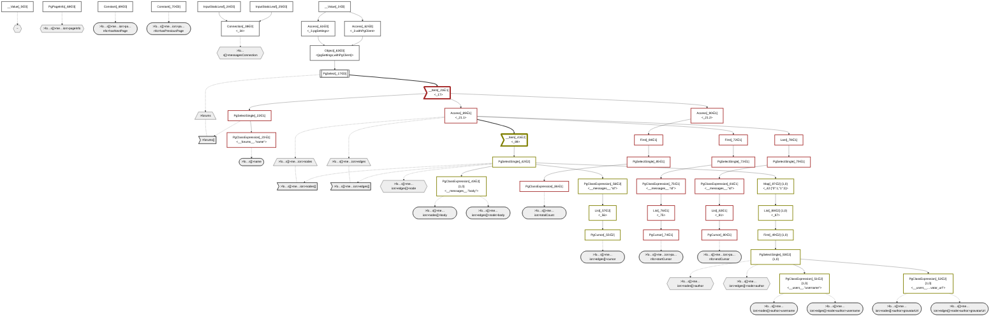

```mermaid
graph TD
    classDef path fill:#eee,stroke:#000,color:#000
    classDef plan fill:#fff,stroke-width:3px,color:#000
    classDef itemplan fill:#fff,stroke-width:6px,color:#000
    classDef sideeffectplan fill:#f00,stroke-width:6px,color:#000

    %% subgraph fields
    P1{{"~"}}:::path
    P2[/">forums"\]:::path
    P3>">forums[]"]:::path
    P2 -.- P3
    P4([">fo…s[]>name"]):::path
    %% P3 -.-> P4
    P5{{">fo…s[]>messagesConnection"}}:::path
    P6[/">fo…s[]>me…ion>nodes"\]:::path
    P7>">fo…s[]>me…ion>nodes[]"]:::path
    P6 -.- P7
    P8([">fo…s[]>me…ion>nodes[]>body"]):::path
    %% P7 -.-> P8
    P9{{">fo…s[]>me…ion>nodes[]>author"}}:::path
    P10([">fo…s[]>me…ion>nodes[]>author>username"]):::path
    %% P9 -.-> P10
    P11([">fo…s[]>me…ion>nodes[]>author>gravatarUrl"]):::path
    %% P9 -.-> P11
    %% P7 -.-> P9
    %% P5 -.-> P6
    P12[/">fo…s[]>me…ion>edges"\]:::path
    P13>">fo…s[]>me…ion>edges[]"]:::path
    P12 -.- P13
    P14([">fo…s[]>me…ion>edges[]>cursor"]):::path
    %% P13 -.-> P14
    P15{{">fo…s[]>me…ion>edges[]>node"}}:::path
    P16([">fo…s[]>me…ion>edges[]>node>body"]):::path
    %% P15 -.-> P16
    P17{{">fo…s[]>me…ion>edges[]>node>author"}}:::path
    P18([">fo…s[]>me…ion>edges[]>node>author>username"]):::path
    %% P17 -.-> P18
    P19([">fo…s[]>me…ion>edges[]>node>author>gravatarUrl"]):::path
    %% P17 -.-> P19
    %% P15 -.-> P17
    %% P13 -.-> P15
    %% P5 -.-> P12
    P20{{">fo…s[]>me…ion>pageInfo"}}:::path
    P21([">fo…s[]>me…ion>pa…nfo>hasNextPage"]):::path
    %% P20 -.-> P21
    P22([">fo…s[]>me…ion>pa…nfo>hasPreviousPage"]):::path
    %% P20 -.-> P22
    P23([">fo…s[]>me…ion>pa…nfo>startCursor"]):::path
    %% P20 -.-> P23
    P24([">fo…s[]>me…ion>pa…nfo>endCursor"]):::path
    %% P20 -.-> P24
    %% P5 -.-> P20
    P25([">fo…s[]>me…ion>totalCount"]):::path
    %% P5 -.-> P25
    %% P3 -.-> P5
    %% P1 -.-> P2
    %% end

    %% define plans
    __Value_3["__Value[_3∈0]<br /><context>"]:::plan
    __Value_5["__Value[_5∈0]<br /><rootValue>"]:::plan
    PgSelect_17[["PgSelect[_17∈0]<br /><forums>"]]:::plan
    __Item_21>"__Item[_21∈1]<br /><_17>"]:::itemplan
    PgSelectSingle_22["PgSelectSingle[_22∈1]<br /><forums>"]:::plan
    PgClassExpression_23["PgClassExpression[_23∈1]<br /><__forums__.#quot;name#quot;>"]:::plan
    InputStaticLeaf_24["InputStaticLeaf[_24∈0]"]:::plan
    InputStaticLeaf_25["InputStaticLeaf[_25∈0]"]:::plan
    Connection_38["Connection[_38∈0]<br /><_34>"]:::plan
    __Item_41>"__Item[_41∈2]<br /><_89>"]:::itemplan
    PgSelectSingle_42["PgSelectSingle[_42∈2]<br /><messages>"]:::plan
    PgClassExpression_43["PgClassExpression[_43∈2] {1,0}<br /><__messages__.#quot;body#quot;>"]:::plan
    First_49["First[_49∈2] {1,0}"]:::plan
    PgSelectSingle_50["PgSelectSingle[_50∈2] {1,0}<br /><users>"]:::plan
    PgClassExpression_51["PgClassExpression[_51∈2] {1,0}<br /><__users__.#quot;username#quot;>"]:::plan
    PgClassExpression_52["PgClassExpression[_52∈2] {1,0}<br /><__users__....vatar_url#quot;>"]:::plan
    PgCursor_55["PgCursor[_55∈2]"]:::plan
    PgClassExpression_56["PgClassExpression[_56∈2]<br /><__messages__.#quot;id#quot;>"]:::plan
    List_57["List[_57∈2]<br /><_56>"]:::plan
    Access_61["Access[_61∈0]<br /><_3.pgSettings>"]:::plan
    Access_62["Access[_62∈0]<br /><_3.withPgClient>"]:::plan
    Object_63["Object[_63∈0]<br /><{pgSettings,withPgClient}>"]:::plan
    PgPageInfo_68["PgPageInfo[_68∈0]"]:::plan
    Constant_69["Constant[_69∈0]"]:::plan
    Constant_70["Constant[_70∈0]"]:::plan
    First_72["First[_72∈1]"]:::plan
    PgSelectSingle_73["PgSelectSingle[_73∈1]<br /><messages>"]:::plan
    PgCursor_74["PgCursor[_74∈1]"]:::plan
    PgClassExpression_75["PgClassExpression[_75∈1]<br /><__messages__.#quot;id#quot;>"]:::plan
    List_76["List[_76∈1]<br /><_75>"]:::plan
    Last_78["Last[_78∈1]"]:::plan
    PgSelectSingle_79["PgSelectSingle[_79∈1]<br /><messages>"]:::plan
    PgCursor_80["PgCursor[_80∈1]"]:::plan
    PgClassExpression_81["PgClassExpression[_81∈1]<br /><__messages__.#quot;id#quot;>"]:::plan
    List_82["List[_82∈1]<br /><_81>"]:::plan
    First_84["First[_84∈1]"]:::plan
    PgSelectSingle_85["PgSelectSingle[_85∈1]<br /><messages>"]:::plan
    PgClassExpression_86["PgClassExpression[_86∈1]<br /><count(*)>"]:::plan
    Map_87["Map[_87∈2] {1,0}<br /><_42:{#quot;0#quot;:1,#quot;1#quot;:2}>"]:::plan
    List_88["List[_88∈2] {1,0}<br /><_87>"]:::plan
    Access_89["Access[_89∈1]<br /><_21.1>"]:::plan
    Access_90["Access[_90∈1]<br /><_21.2>"]:::plan

    %% plan dependencies
    Object_63 --> PgSelect_17
    PgSelect_17 ==> __Item_21
    __Item_21 --> PgSelectSingle_22
    PgSelectSingle_22 --> PgClassExpression_23
    InputStaticLeaf_24 --> Connection_38
    InputStaticLeaf_25 --> Connection_38
    Access_89 ==> __Item_41
    __Item_41 --> PgSelectSingle_42
    PgSelectSingle_42 --> PgClassExpression_43
    List_88 --> First_49
    First_49 --> PgSelectSingle_50
    PgSelectSingle_50 --> PgClassExpression_51
    PgSelectSingle_50 --> PgClassExpression_52
    List_57 --> PgCursor_55
    PgSelectSingle_42 --> PgClassExpression_56
    PgClassExpression_56 --> List_57
    __Value_3 --> Access_61
    __Value_3 --> Access_62
    Access_61 --> Object_63
    Access_62 --> Object_63
    Access_89 --> First_72
    First_72 --> PgSelectSingle_73
    List_76 --> PgCursor_74
    PgSelectSingle_73 --> PgClassExpression_75
    PgClassExpression_75 --> List_76
    Access_89 --> Last_78
    Last_78 --> PgSelectSingle_79
    List_82 --> PgCursor_80
    PgSelectSingle_79 --> PgClassExpression_81
    PgClassExpression_81 --> List_82
    Access_90 --> First_84
    First_84 --> PgSelectSingle_85
    PgSelectSingle_85 --> PgClassExpression_86
    PgSelectSingle_42 --> Map_87
    Map_87 --> List_88
    __Item_21 --> Access_89
    __Item_21 --> Access_90

    %% plan-to-path relationships
    __Value_5 -.-> P1
    PgSelect_17 -.-> P2
    PgSelectSingle_22 -.-> P3
    PgClassExpression_23 -.-> P4
    Connection_38 -.-> P5
    Access_89 -.-> P6
    PgSelectSingle_42 -.-> P7
    PgClassExpression_43 -.-> P8
    PgSelectSingle_50 -.-> P9
    PgClassExpression_51 -.-> P10
    PgClassExpression_52 -.-> P11
    Access_89 -.-> P12
    PgSelectSingle_42 -.-> P13
    PgCursor_55 -.-> P14
    PgSelectSingle_42 -.-> P15
    PgClassExpression_43 -.-> P16
    PgSelectSingle_50 -.-> P17
    PgClassExpression_51 -.-> P18
    PgClassExpression_52 -.-> P19
    PgPageInfo_68 -.-> P20
    Constant_69 -.-> P21
    Constant_70 -.-> P22
    PgCursor_74 -.-> P23
    PgCursor_80 -.-> P24
    PgClassExpression_86 -.-> P25

    %% allocate buckets
    classDef bucket0 stroke:#696969
    class __Value_3,__Value_5,PgSelect_17,InputStaticLeaf_24,InputStaticLeaf_25,Connection_38,Access_61,Access_62,Object_63,PgPageInfo_68,Constant_69,Constant_70 bucket0
    classDef bucket1 stroke:#a52a2a
    class __Item_21,PgSelectSingle_22,PgClassExpression_23,First_72,PgSelectSingle_73,PgCursor_74,PgClassExpression_75,List_76,Last_78,PgSelectSingle_79,PgCursor_80,PgClassExpression_81,List_82,First_84,PgSelectSingle_85,PgClassExpression_86,Access_89,Access_90 bucket1
    classDef bucket2 stroke:#808000
    class __Item_41,PgSelectSingle_42,PgClassExpression_43,First_49,PgSelectSingle_50,PgClassExpression_51,PgClassExpression_52,PgCursor_55,PgClassExpression_56,List_57,Map_87,List_88 bucket2
```
