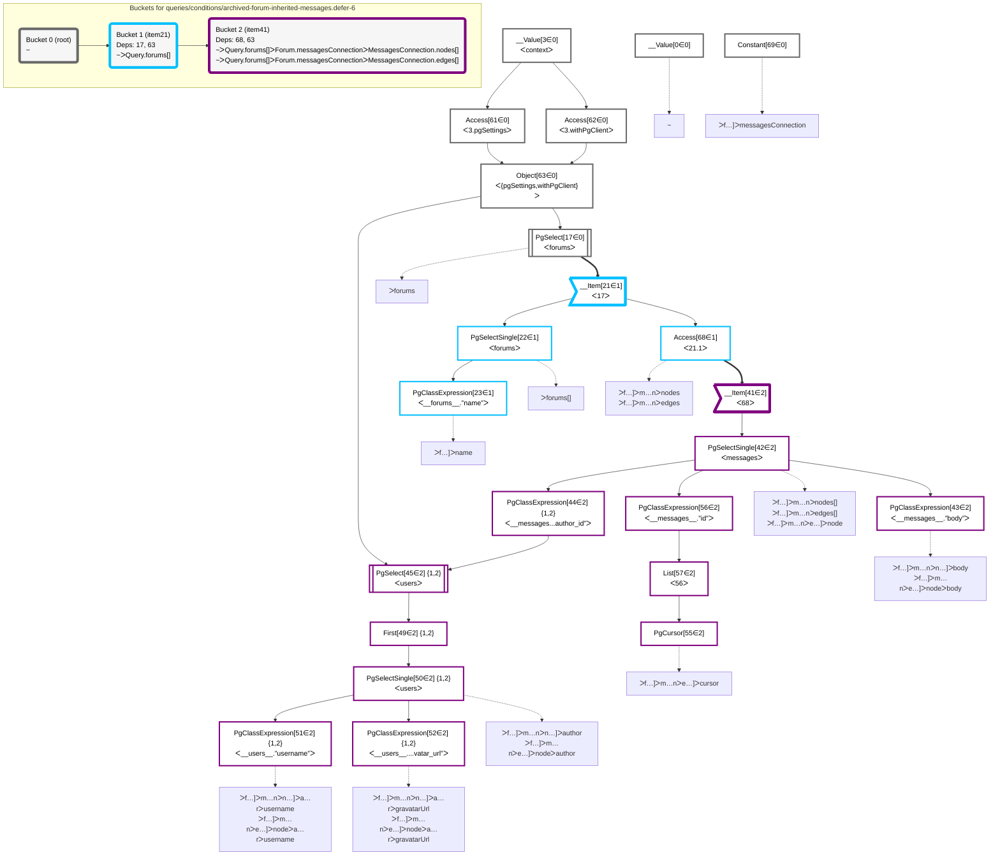

```mermaid
graph TD
    classDef path fill:#eee,stroke:#000,color:#000
    classDef plan fill:#fff,stroke-width:3px,color:#000
    classDef itemplan fill:#fff,stroke-width:6px,color:#000
    classDef sideeffectplan fill:#f00,stroke-width:6px,color:#000
    classDef bucket fill:#f6f6f6,color:#000,stroke-width:6px,text-align:left


    %% define plans
    __Value0["__Value[0∈0]"]:::plan
    PgClassExpression23["PgClassExpression[23∈1]<br />ᐸ__forums__.”name”ᐳ"]:::plan
    PgSelectSingle22["PgSelectSingle[22∈1]<br />ᐸforumsᐳ"]:::plan
    PgClassExpression43["PgClassExpression[43∈2]<br />ᐸ__messages__.”body”ᐳ"]:::plan
    PgClassExpression51["PgClassExpression[51∈2] {1,2}<br />ᐸ__users__.”username”ᐳ"]:::plan
    PgClassExpression52["PgClassExpression[52∈2] {1,2}<br />ᐸ__users__....vatar_url”ᐳ"]:::plan
    PgSelectSingle50["PgSelectSingle[50∈2] {1,2}<br />ᐸusersᐳ"]:::plan
    First49["First[49∈2] {1,2}"]:::plan
    PgSelect45[["PgSelect[45∈2] {1,2}<br />ᐸusersᐳ"]]:::plan
    PgClassExpression44["PgClassExpression[44∈2] {1,2}<br />ᐸ__messages...author_id”ᐳ"]:::plan
    PgCursor55["PgCursor[55∈2]"]:::plan
    List57["List[57∈2]<br />ᐸ56ᐳ"]:::plan
    PgClassExpression56["PgClassExpression[56∈2]<br />ᐸ__messages__.”id”ᐳ"]:::plan
    PgSelectSingle42["PgSelectSingle[42∈2]<br />ᐸmessagesᐳ"]:::plan
    __Item41>"__Item[41∈2]<br />ᐸ68ᐳ"]:::itemplan
    Access68["Access[68∈1]<br />ᐸ21.1ᐳ"]:::plan
    __Item21>"__Item[21∈1]<br />ᐸ17ᐳ"]:::itemplan
    PgSelect17[["PgSelect[17∈0]<br />ᐸforumsᐳ"]]:::plan
    Object63["Object[63∈0]<br />ᐸ{pgSettings,withPgClient}ᐳ"]:::plan
    Access61["Access[61∈0]<br />ᐸ3.pgSettingsᐳ"]:::plan
    Access62["Access[62∈0]<br />ᐸ3.withPgClientᐳ"]:::plan
    __Value3["__Value[3∈0]<br />ᐸcontextᐳ"]:::plan
    Constant69["Constant[69∈0]"]:::plan

    %% plan dependencies
    PgSelectSingle22 --> PgClassExpression23
    __Item21 --> PgSelectSingle22
    PgSelectSingle42 --> PgClassExpression43
    PgSelectSingle50 --> PgClassExpression51
    PgSelectSingle50 --> PgClassExpression52
    First49 --> PgSelectSingle50
    PgSelect45 --> First49
    Object63 & PgClassExpression44 --> PgSelect45
    PgSelectSingle42 --> PgClassExpression44
    List57 --> PgCursor55
    PgClassExpression56 --> List57
    PgSelectSingle42 --> PgClassExpression56
    __Item41 --> PgSelectSingle42
    Access68 ==> __Item41
    __Item21 --> Access68
    PgSelect17 ==> __Item21
    Object63 --> PgSelect17
    Access61 & Access62 --> Object63
    __Value3 --> Access61
    __Value3 --> Access62

    %% plan-to-path relationships
    P0["~"]
    __Value0 -.-> P0
    P17["ᐳforums"]
    PgSelect17 -.-> P17
    P22["ᐳforums[]"]
    PgSelectSingle22 -.-> P22
    P23["ᐳf…]ᐳname"]
    PgClassExpression23 -.-> P23
    P42["ᐳf…]ᐳm…nᐳnodes[]<br />ᐳf…]ᐳm…nᐳedges[]<br />ᐳf…]ᐳm…nᐳe…]ᐳnode"]
    PgSelectSingle42 -.-> P42
    P43["ᐳf…]ᐳm…nᐳn…]ᐳbody<br />ᐳf…]ᐳm…nᐳe…]ᐳnodeᐳbody"]
    PgClassExpression43 -.-> P43
    P50["ᐳf…]ᐳm…nᐳn…]ᐳauthor<br />ᐳf…]ᐳm…nᐳe…]ᐳnodeᐳauthor"]
    PgSelectSingle50 -.-> P50
    P51["ᐳf…]ᐳm…nᐳn…]ᐳa…rᐳusername<br />ᐳf…]ᐳm…nᐳe…]ᐳnodeᐳa…rᐳusername"]
    PgClassExpression51 -.-> P51
    P52["ᐳf…]ᐳm…nᐳn…]ᐳa…rᐳgravatarUrl<br />ᐳf…]ᐳm…nᐳe…]ᐳnodeᐳa…rᐳgravatarUrl"]
    PgClassExpression52 -.-> P52
    P55["ᐳf…]ᐳm…nᐳe…]ᐳcursor"]
    PgCursor55 -.-> P55
    P68["ᐳf…]ᐳm…nᐳnodes<br />ᐳf…]ᐳm…nᐳedges"]
    Access68 -.-> P68
    P69["ᐳf…]ᐳmessagesConnection"]
    Constant69 -.-> P69

    subgraph "Buckets for queries/conditions/archived-forum-inherited-messages.defer-6"
    Bucket0("Bucket 0 (root)<br />~"):::bucket
    classDef bucket0 stroke:#696969
    class Bucket0,__Value0,__Value3,PgSelect17,Access61,Access62,Object63,Constant69 bucket0
    Bucket1("Bucket 1 (item21)<br />Deps: 17, 63<br />~ᐳQuery.forums[]"):::bucket
    classDef bucket1 stroke:#00bfff
    class Bucket1,__Item21,PgSelectSingle22,PgClassExpression23,Access68 bucket1
    Bucket2("Bucket 2 (item41)<br />Deps: 68, 63<br />~ᐳQuery.forums[]ᐳForum.messagesConnectionᐳMessagesConnection.nodes[]<br />~ᐳQuery.forums[]ᐳForum.messagesConnectionᐳMessagesConnection.edges[]"):::bucket
    classDef bucket2 stroke:#7f007f
    class Bucket2,__Item41,PgSelectSingle42,PgClassExpression43,PgClassExpression44,PgSelect45,First49,PgSelectSingle50,PgClassExpression51,PgClassExpression52,PgCursor55,PgClassExpression56,List57 bucket2
    Bucket0 --> Bucket1
    Bucket1 --> Bucket2
    end
```
