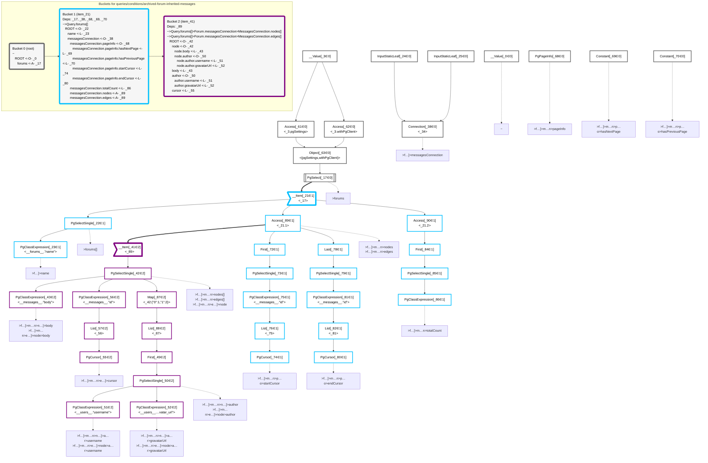

```mermaid
graph TD
    classDef path fill:#eee,stroke:#000,color:#000
    classDef plan fill:#fff,stroke-width:3px,color:#000
    classDef itemplan fill:#fff,stroke-width:6px,color:#000
    classDef sideeffectplan fill:#f00,stroke-width:6px,color:#000
    classDef bucket fill:#f6f6f6,color:#000,stroke-width:6px,text-align:left


    %% define plans
    __Value_0["__Value[_0∈0]"]:::plan
    __Value_3["__Value[_3∈0]<br /><context>"]:::plan
    PgSelect_17[["PgSelect[_17∈0]<br /><forums>"]]:::plan
    __Item_21>"__Item[_21∈1]<br /><_17>"]:::itemplan
    PgSelectSingle_22["PgSelectSingle[_22∈1]<br /><forums>"]:::plan
    PgClassExpression_23["PgClassExpression[_23∈1]<br /><__forums__.”name”>"]:::plan
    InputStaticLeaf_24["InputStaticLeaf[_24∈0]"]:::plan
    InputStaticLeaf_25["InputStaticLeaf[_25∈0]"]:::plan
    Connection_38["Connection[_38∈0]<br /><_34>"]:::plan
    __Item_41>"__Item[_41∈2]<br /><_89>"]:::itemplan
    PgSelectSingle_42["PgSelectSingle[_42∈2]<br /><messages>"]:::plan
    PgClassExpression_43["PgClassExpression[_43∈2]<br /><__messages__.”body”>"]:::plan
    First_49["First[_49∈2]"]:::plan
    PgSelectSingle_50["PgSelectSingle[_50∈2]<br /><users>"]:::plan
    PgClassExpression_51["PgClassExpression[_51∈2]<br /><__users__.”username”>"]:::plan
    PgClassExpression_52["PgClassExpression[_52∈2]<br /><__users__....vatar_url”>"]:::plan
    PgCursor_55["PgCursor[_55∈2]"]:::plan
    PgClassExpression_56["PgClassExpression[_56∈2]<br /><__messages__.”id”>"]:::plan
    List_57["List[_57∈2]<br /><_56>"]:::plan
    Access_61["Access[_61∈0]<br /><_3.pgSettings>"]:::plan
    Access_62["Access[_62∈0]<br /><_3.withPgClient>"]:::plan
    Object_63["Object[_63∈0]<br /><{pgSettings,withPgClient}>"]:::plan
    PgPageInfo_68["PgPageInfo[_68∈0]"]:::plan
    Constant_69["Constant[_69∈0]"]:::plan
    Constant_70["Constant[_70∈0]"]:::plan
    First_72["First[_72∈1]"]:::plan
    PgSelectSingle_73["PgSelectSingle[_73∈1]<br /><messages>"]:::plan
    PgCursor_74["PgCursor[_74∈1]"]:::plan
    PgClassExpression_75["PgClassExpression[_75∈1]<br /><__messages__.”id”>"]:::plan
    List_76["List[_76∈1]<br /><_75>"]:::plan
    Last_78["Last[_78∈1]"]:::plan
    PgSelectSingle_79["PgSelectSingle[_79∈1]<br /><messages>"]:::plan
    PgCursor_80["PgCursor[_80∈1]"]:::plan
    PgClassExpression_81["PgClassExpression[_81∈1]<br /><__messages__.”id”>"]:::plan
    List_82["List[_82∈1]<br /><_81>"]:::plan
    First_84["First[_84∈1]"]:::plan
    PgSelectSingle_85["PgSelectSingle[_85∈1]<br /><messages>"]:::plan
    PgClassExpression_86["PgClassExpression[_86∈1]<br /><count(*)>"]:::plan
    Map_87["Map[_87∈2]<br /><_42:{”0”:1,”1”:2}>"]:::plan
    List_88["List[_88∈2]<br /><_87>"]:::plan
    Access_89["Access[_89∈1]<br /><_21.1>"]:::plan
    Access_90["Access[_90∈1]<br /><_21.2>"]:::plan

    %% plan dependencies
    Object_63 --> PgSelect_17
    PgSelect_17 ==> __Item_21
    __Item_21 --> PgSelectSingle_22
    PgSelectSingle_22 --> PgClassExpression_23
    InputStaticLeaf_24 --> Connection_38
    InputStaticLeaf_25 --> Connection_38
    Access_89 ==> __Item_41
    __Item_41 --> PgSelectSingle_42
    PgSelectSingle_42 --> PgClassExpression_43
    List_88 --> First_49
    First_49 --> PgSelectSingle_50
    PgSelectSingle_50 --> PgClassExpression_51
    PgSelectSingle_50 --> PgClassExpression_52
    List_57 --> PgCursor_55
    PgSelectSingle_42 --> PgClassExpression_56
    PgClassExpression_56 --> List_57
    __Value_3 --> Access_61
    __Value_3 --> Access_62
    Access_61 --> Object_63
    Access_62 --> Object_63
    Access_89 --> First_72
    First_72 --> PgSelectSingle_73
    List_76 --> PgCursor_74
    PgSelectSingle_73 --> PgClassExpression_75
    PgClassExpression_75 --> List_76
    Access_89 --> Last_78
    Last_78 --> PgSelectSingle_79
    List_82 --> PgCursor_80
    PgSelectSingle_79 --> PgClassExpression_81
    PgClassExpression_81 --> List_82
    Access_90 --> First_84
    First_84 --> PgSelectSingle_85
    PgSelectSingle_85 --> PgClassExpression_86
    PgSelectSingle_42 --> Map_87
    Map_87 --> List_88
    __Item_21 --> Access_89
    __Item_21 --> Access_90

    %% plan-to-path relationships
    P_0["~"]
    __Value_0 -.-> P_0
    P_17[">forums"]
    PgSelect_17 -.-> P_17
    P_22[">forums[]"]
    PgSelectSingle_22 -.-> P_22
    P_23[">f…]>name"]
    PgClassExpression_23 -.-> P_23
    P_38[">f…]>messagesConnection"]
    Connection_38 -.-> P_38
    P_42[">f…]>m…n>nodes[]<br />>f…]>m…n>edges[]<br />>f…]>m…n>e…]>node"]
    PgSelectSingle_42 -.-> P_42
    P_43[">f…]>m…n>n…]>body<br />>f…]>m…n>e…]>node>body"]
    PgClassExpression_43 -.-> P_43
    P_50[">f…]>m…n>n…]>author<br />>f…]>m…n>e…]>node>author"]
    PgSelectSingle_50 -.-> P_50
    P_51[">f…]>m…n>n…]>a…r>username<br />>f…]>m…n>e…]>node>a…r>username"]
    PgClassExpression_51 -.-> P_51
    P_52[">f…]>m…n>n…]>a…r>gravatarUrl<br />>f…]>m…n>e…]>node>a…r>gravatarUrl"]
    PgClassExpression_52 -.-> P_52
    P_55[">f…]>m…n>e…]>cursor"]
    PgCursor_55 -.-> P_55
    P_68[">f…]>m…n>pageInfo"]
    PgPageInfo_68 -.-> P_68
    P_69[">f…]>m…n>p…o>hasNextPage"]
    Constant_69 -.-> P_69
    P_70[">f…]>m…n>p…o>hasPreviousPage"]
    Constant_70 -.-> P_70
    P_74[">f…]>m…n>p…o>startCursor"]
    PgCursor_74 -.-> P_74
    P_80[">f…]>m…n>p…o>endCursor"]
    PgCursor_80 -.-> P_80
    P_86[">f…]>m…n>totalCount"]
    PgClassExpression_86 -.-> P_86
    P_89[">f…]>m…n>nodes<br />>f…]>m…n>edges"]
    Access_89 -.-> P_89

    %% allocate buckets
    classDef bucket0 stroke:#696969
    class __Value_0,__Value_3,PgSelect_17,InputStaticLeaf_24,InputStaticLeaf_25,Connection_38,Access_61,Access_62,Object_63,PgPageInfo_68,Constant_69,Constant_70 bucket0
    classDef bucket1 stroke:#00bfff
    class __Item_21,PgSelectSingle_22,PgClassExpression_23,First_72,PgSelectSingle_73,PgCursor_74,PgClassExpression_75,List_76,Last_78,PgSelectSingle_79,PgCursor_80,PgClassExpression_81,List_82,First_84,PgSelectSingle_85,PgClassExpression_86,Access_89,Access_90 bucket1
    classDef bucket2 stroke:#7f007f
    class __Item_41,PgSelectSingle_42,PgClassExpression_43,First_49,PgSelectSingle_50,PgClassExpression_51,PgClassExpression_52,PgCursor_55,PgClassExpression_56,List_57,Map_87,List_88 bucket2

    subgraph "Buckets for queries/conditions/archived-forum-inherited-messages"
    Bucket0("Bucket 0 (root)<br />~<br />⠀ROOT <-O- _0<br />⠀⠀forums <-A- _17"):::bucket
    style Bucket0 stroke:#696969
    Bucket1("Bucket 1 (item_21)<br />Deps: _17, _38, _68, _69, _70<br />~>Query.forums[]<br />⠀ROOT <-O- _22<br />⠀⠀name <-L- _23<br />⠀⠀messagesConnection <-O- _38<br />⠀⠀⠀messagesConnection.pageInfo <-O- _68<br />⠀⠀⠀⠀messagesConnection.pageInfo.hasNextPage <-L- _69<br />⠀⠀⠀⠀messagesConnection.pageInfo.hasPreviousPage <-L- _70<br />⠀⠀⠀⠀messagesConnection.pageInfo.startCursor <-L- _74<br />⠀⠀⠀⠀messagesConnection.pageInfo.endCursor <-L- _80<br />⠀⠀⠀messagesConnection.totalCount <-L- _86<br />⠀⠀⠀messagesConnection.nodes <-A- _89<br />⠀⠀⠀messagesConnection.edges <-A- _89"):::bucket
    style Bucket1 stroke:#00bfff
    Bucket0 --> Bucket1
    Bucket2("Bucket 2 (item_41)<br />Deps: _89<br />~>Query.forums[]>Forum.messagesConnection>MessagesConnection.nodes[]<br />~>Query.forums[]>Forum.messagesConnection>MessagesConnection.edges[]<br />⠀ROOT <-O- _42<br />⠀⠀node <-O- _42<br />⠀⠀⠀node.body <-L- _43<br />⠀⠀⠀node.author <-O- _50<br />⠀⠀⠀⠀node.author.username <-L- _51<br />⠀⠀⠀⠀node.author.gravatarUrl <-L- _52<br />⠀⠀body <-L- _43<br />⠀⠀author <-O- _50<br />⠀⠀⠀author.username <-L- _51<br />⠀⠀⠀author.gravatarUrl <-L- _52<br />⠀⠀cursor <-L- _55"):::bucket
    style Bucket2 stroke:#7f007f
    Bucket1 --> Bucket2
    end
```
