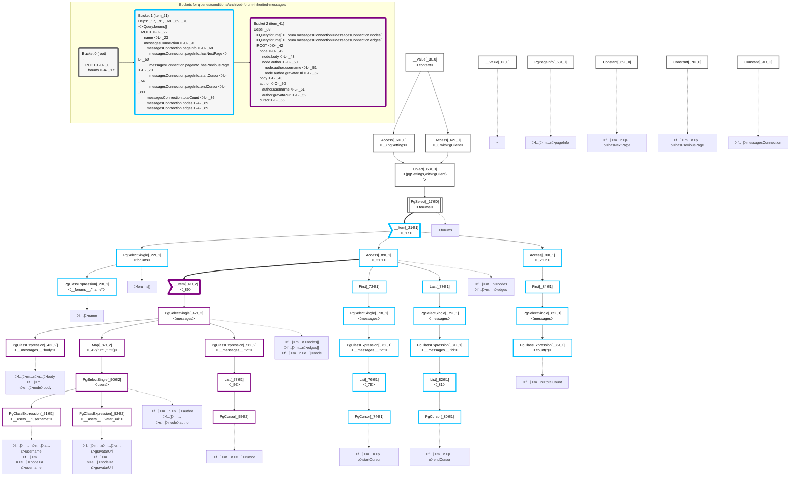

```mermaid
graph TD
    classDef path fill:#eee,stroke:#000,color:#000
    classDef plan fill:#fff,stroke-width:3px,color:#000
    classDef itemplan fill:#fff,stroke-width:6px,color:#000
    classDef sideeffectplan fill:#f00,stroke-width:6px,color:#000
    classDef bucket fill:#f6f6f6,color:#000,stroke-width:6px,text-align:left


    %% define plans
    __Value_0["__Value[_0∈0]"]:::plan
    PgClassExpression_23["PgClassExpression[_23∈1]<br />ᐸ__forums__.”name”ᐳ"]:::plan
    PgSelectSingle_22["PgSelectSingle[_22∈1]<br />ᐸforumsᐳ"]:::plan
    PgClassExpression_43["PgClassExpression[_43∈2]<br />ᐸ__messages__.”body”ᐳ"]:::plan
    PgClassExpression_51["PgClassExpression[_51∈2]<br />ᐸ__users__.”username”ᐳ"]:::plan
    PgClassExpression_52["PgClassExpression[_52∈2]<br />ᐸ__users__....vatar_url”ᐳ"]:::plan
    PgSelectSingle_50["PgSelectSingle[_50∈2]<br />ᐸusersᐳ"]:::plan
    Map_87["Map[_87∈2]<br />ᐸ_42:{”0”:1,”1”:2}ᐳ"]:::plan
    PgCursor_55["PgCursor[_55∈2]"]:::plan
    List_57["List[_57∈2]<br />ᐸ_56ᐳ"]:::plan
    PgClassExpression_56["PgClassExpression[_56∈2]<br />ᐸ__messages__.”id”ᐳ"]:::plan
    PgSelectSingle_42["PgSelectSingle[_42∈2]<br />ᐸmessagesᐳ"]:::plan
    __Item_41>"__Item[_41∈2]<br />ᐸ_89ᐳ"]:::itemplan
    PgCursor_74["PgCursor[_74∈1]"]:::plan
    List_76["List[_76∈1]<br />ᐸ_75ᐳ"]:::plan
    PgClassExpression_75["PgClassExpression[_75∈1]<br />ᐸ__messages__.”id”ᐳ"]:::plan
    PgSelectSingle_73["PgSelectSingle[_73∈1]<br />ᐸmessagesᐳ"]:::plan
    First_72["First[_72∈1]"]:::plan
    PgCursor_80["PgCursor[_80∈1]"]:::plan
    List_82["List[_82∈1]<br />ᐸ_81ᐳ"]:::plan
    PgClassExpression_81["PgClassExpression[_81∈1]<br />ᐸ__messages__.”id”ᐳ"]:::plan
    PgSelectSingle_79["PgSelectSingle[_79∈1]<br />ᐸmessagesᐳ"]:::plan
    Last_78["Last[_78∈1]"]:::plan
    Access_89["Access[_89∈1]<br />ᐸ_21.1ᐳ"]:::plan
    PgClassExpression_86["PgClassExpression[_86∈1]<br />ᐸcount(*)ᐳ"]:::plan
    PgSelectSingle_85["PgSelectSingle[_85∈1]<br />ᐸmessagesᐳ"]:::plan
    First_84["First[_84∈1]"]:::plan
    Access_90["Access[_90∈1]<br />ᐸ_21.2ᐳ"]:::plan
    __Item_21>"__Item[_21∈1]<br />ᐸ_17ᐳ"]:::itemplan
    PgSelect_17[["PgSelect[_17∈0]<br />ᐸforumsᐳ"]]:::plan
    Object_63["Object[_63∈0]<br />ᐸ{pgSettings,withPgClient}ᐳ"]:::plan
    Access_61["Access[_61∈0]<br />ᐸ_3.pgSettingsᐳ"]:::plan
    Access_62["Access[_62∈0]<br />ᐸ_3.withPgClientᐳ"]:::plan
    __Value_3["__Value[_3∈0]<br />ᐸcontextᐳ"]:::plan
    Constant_91["Constant[_91∈0]"]:::plan
    PgPageInfo_68["PgPageInfo[_68∈0]"]:::plan
    Constant_69["Constant[_69∈0]"]:::plan
    Constant_70["Constant[_70∈0]"]:::plan

    %% plan dependencies
    PgSelectSingle_22 --> PgClassExpression_23
    __Item_21 --> PgSelectSingle_22
    PgSelectSingle_42 --> PgClassExpression_43
    PgSelectSingle_50 --> PgClassExpression_51
    PgSelectSingle_50 --> PgClassExpression_52
    Map_87 --> PgSelectSingle_50
    PgSelectSingle_42 --> Map_87
    List_57 --> PgCursor_55
    PgClassExpression_56 --> List_57
    PgSelectSingle_42 --> PgClassExpression_56
    __Item_41 --> PgSelectSingle_42
    Access_89 ==> __Item_41
    List_76 --> PgCursor_74
    PgClassExpression_75 --> List_76
    PgSelectSingle_73 --> PgClassExpression_75
    First_72 --> PgSelectSingle_73
    Access_89 --> First_72
    List_82 --> PgCursor_80
    PgClassExpression_81 --> List_82
    PgSelectSingle_79 --> PgClassExpression_81
    Last_78 --> PgSelectSingle_79
    Access_89 --> Last_78
    __Item_21 --> Access_89
    PgSelectSingle_85 --> PgClassExpression_86
    First_84 --> PgSelectSingle_85
    Access_90 --> First_84
    __Item_21 --> Access_90
    PgSelect_17 ==> __Item_21
    Object_63 --> PgSelect_17
    Access_61 & Access_62 --> Object_63
    __Value_3 --> Access_61
    __Value_3 --> Access_62

    %% plan-to-path relationships
    P_0["~"]
    __Value_0 -.-> P_0
    P_17["ᐳforums"]
    PgSelect_17 -.-> P_17
    P_22["ᐳforums[]"]
    PgSelectSingle_22 -.-> P_22
    P_23["ᐳf…]ᐳname"]
    PgClassExpression_23 -.-> P_23
    P_42["ᐳf…]ᐳm…nᐳnodes[]<br />ᐳf…]ᐳm…nᐳedges[]<br />ᐳf…]ᐳm…nᐳe…]ᐳnode"]
    PgSelectSingle_42 -.-> P_42
    P_43["ᐳf…]ᐳm…nᐳn…]ᐳbody<br />ᐳf…]ᐳm…nᐳe…]ᐳnodeᐳbody"]
    PgClassExpression_43 -.-> P_43
    P_50["ᐳf…]ᐳm…nᐳn…]ᐳauthor<br />ᐳf…]ᐳm…nᐳe…]ᐳnodeᐳauthor"]
    PgSelectSingle_50 -.-> P_50
    P_51["ᐳf…]ᐳm…nᐳn…]ᐳa…rᐳusername<br />ᐳf…]ᐳm…nᐳe…]ᐳnodeᐳa…rᐳusername"]
    PgClassExpression_51 -.-> P_51
    P_52["ᐳf…]ᐳm…nᐳn…]ᐳa…rᐳgravatarUrl<br />ᐳf…]ᐳm…nᐳe…]ᐳnodeᐳa…rᐳgravatarUrl"]
    PgClassExpression_52 -.-> P_52
    P_55["ᐳf…]ᐳm…nᐳe…]ᐳcursor"]
    PgCursor_55 -.-> P_55
    P_68["ᐳf…]ᐳm…nᐳpageInfo"]
    PgPageInfo_68 -.-> P_68
    P_69["ᐳf…]ᐳm…nᐳp…oᐳhasNextPage"]
    Constant_69 -.-> P_69
    P_70["ᐳf…]ᐳm…nᐳp…oᐳhasPreviousPage"]
    Constant_70 -.-> P_70
    P_74["ᐳf…]ᐳm…nᐳp…oᐳstartCursor"]
    PgCursor_74 -.-> P_74
    P_80["ᐳf…]ᐳm…nᐳp…oᐳendCursor"]
    PgCursor_80 -.-> P_80
    P_86["ᐳf…]ᐳm…nᐳtotalCount"]
    PgClassExpression_86 -.-> P_86
    P_89["ᐳf…]ᐳm…nᐳnodes<br />ᐳf…]ᐳm…nᐳedges"]
    Access_89 -.-> P_89
    P_91["ᐳf…]ᐳmessagesConnection"]
    Constant_91 -.-> P_91

    subgraph "Buckets for queries/conditions/archived-forum-inherited-messages"
    Bucket0("Bucket 0 (root)<br />~<br />⠀ROOT ᐸ-O- _0<br />⠀⠀forums ᐸ-A- _17"):::bucket
    classDef bucket0 stroke:#696969
    class Bucket0,__Value_0,__Value_3,PgSelect_17,Access_61,Access_62,Object_63,PgPageInfo_68,Constant_69,Constant_70,Constant_91 bucket0
    Bucket1("Bucket 1 (item_21)<br />Deps: _17, _91, _68, _69, _70<br />~ᐳQuery.forums[]<br />⠀ROOT ᐸ-O- _22<br />⠀⠀name ᐸ-L- _23<br />⠀⠀messagesConnection ᐸ-O- _91<br />⠀⠀⠀messagesConnection.pageInfo ᐸ-O- _68<br />⠀⠀⠀⠀messagesConnection.pageInfo.hasNextPage ᐸ-L- _69<br />⠀⠀⠀⠀messagesConnection.pageInfo.hasPreviousPage ᐸ-L- _70<br />⠀⠀⠀⠀messagesConnection.pageInfo.startCursor ᐸ-L- _74<br />⠀⠀⠀⠀messagesConnection.pageInfo.endCursor ᐸ-L- _80<br />⠀⠀⠀messagesConnection.totalCount ᐸ-L- _86<br />⠀⠀⠀messagesConnection.nodes ᐸ-A- _89<br />⠀⠀⠀messagesConnection.edges ᐸ-A- _89"):::bucket
    classDef bucket1 stroke:#00bfff
    class Bucket1,__Item_21,PgSelectSingle_22,PgClassExpression_23,First_72,PgSelectSingle_73,PgCursor_74,PgClassExpression_75,List_76,Last_78,PgSelectSingle_79,PgCursor_80,PgClassExpression_81,List_82,First_84,PgSelectSingle_85,PgClassExpression_86,Access_89,Access_90 bucket1
    Bucket2("Bucket 2 (item_41)<br />Deps: _89<br />~ᐳQuery.forums[]ᐳForum.messagesConnectionᐳMessagesConnection.nodes[]<br />~ᐳQuery.forums[]ᐳForum.messagesConnectionᐳMessagesConnection.edges[]<br />⠀ROOT ᐸ-O- _42<br />⠀⠀node ᐸ-O- _42<br />⠀⠀⠀node.body ᐸ-L- _43<br />⠀⠀⠀node.author ᐸ-O- _50<br />⠀⠀⠀⠀node.author.username ᐸ-L- _51<br />⠀⠀⠀⠀node.author.gravatarUrl ᐸ-L- _52<br />⠀⠀body ᐸ-L- _43<br />⠀⠀author ᐸ-O- _50<br />⠀⠀⠀author.username ᐸ-L- _51<br />⠀⠀⠀author.gravatarUrl ᐸ-L- _52<br />⠀⠀cursor ᐸ-L- _55"):::bucket
    classDef bucket2 stroke:#7f007f
    class Bucket2,__Item_41,PgSelectSingle_42,PgClassExpression_43,PgSelectSingle_50,PgClassExpression_51,PgClassExpression_52,PgCursor_55,PgClassExpression_56,List_57,Map_87 bucket2
    Bucket0 --> Bucket1
    Bucket1 --> Bucket2
    end
```
