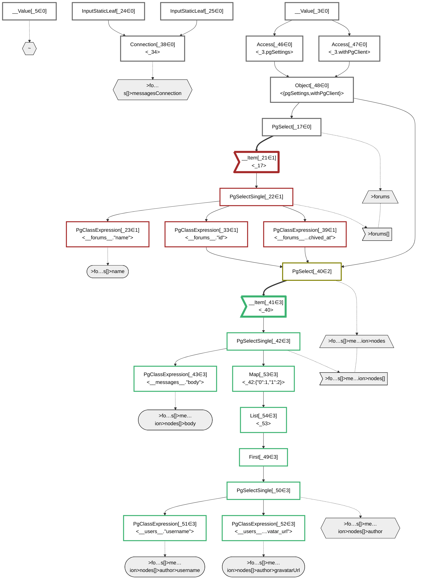

```mermaid
graph TD
    classDef path fill:#eee,stroke:#000,color:#000
    classDef plan fill:#fff,stroke-width:3px,color:#000
    classDef itemplan fill:#fff,stroke-width:6px,color:#000
    classDef sideeffectplan fill:#f00,stroke-width:6px,color:#000

    %% subgraph fields
    P1{{"~"}}:::path
    P2[/">forums"\]:::path
    P3>">forums[]"]:::path
    P2 -.- P3
    P4([">fo…s[]>name"]):::path
    %% P3 -.-> P4
    P5{{">fo…s[]>messagesConnection"}}:::path
    P6[/">fo…s[]>me…ion>nodes"\]:::path
    P7>">fo…s[]>me…ion>nodes[]"]:::path
    P6 -.- P7
    P8([">fo…s[]>me…ion>nodes[]>body"]):::path
    %% P7 -.-> P8
    P9{{">fo…s[]>me…ion>nodes[]>author"}}:::path
    P10([">fo…s[]>me…ion>nodes[]>author>username"]):::path
    %% P9 -.-> P10
    P11([">fo…s[]>me…ion>nodes[]>author>gravatarUrl"]):::path
    %% P9 -.-> P11
    %% P7 -.-> P9
    %% P5 -.-> P6
    %% P3 -.-> P5
    %% P1 -.-> P2
    %% end

    %% define plans
    __Value_3["__Value[_3∈0]<br /><context>"]:::plan
    __Value_5["__Value[_5∈0]<br /><rootValue>"]:::plan
    PgSelect_17["PgSelect[_17∈0]<br /><forums>"]:::plan
    __Item_21>"__Item[_21∈1]<br /><_17>"]:::itemplan
    PgSelectSingle_22["PgSelectSingle[_22∈1]<br /><forums>"]:::plan
    PgClassExpression_23["PgClassExpression[_23∈1]<br /><__forums__.#quot;name#quot;>"]:::plan
    InputStaticLeaf_24["InputStaticLeaf[_24∈0]"]:::plan
    InputStaticLeaf_25["InputStaticLeaf[_25∈0]"]:::plan
    PgClassExpression_33["PgClassExpression[_33∈1]<br /><__forums__.#quot;id#quot;>"]:::plan
    Connection_38["Connection[_38∈0]<br /><_34>"]:::plan
    PgClassExpression_39["PgClassExpression[_39∈1]<br /><__forums__...chived_at#quot;>"]:::plan
    PgSelect_40["PgSelect[_40∈2]<br /><messages>"]:::plan
    __Item_41>"__Item[_41∈3]<br /><_40>"]:::itemplan
    PgSelectSingle_42["PgSelectSingle[_42∈3]<br /><messages>"]:::plan
    PgClassExpression_43["PgClassExpression[_43∈3]<br /><__messages__.#quot;body#quot;>"]:::plan
    Access_46["Access[_46∈0]<br /><_3.pgSettings>"]:::plan
    Access_47["Access[_47∈0]<br /><_3.withPgClient>"]:::plan
    Object_48["Object[_48∈0]<br /><{pgSettings,withPgClient}>"]:::plan
    First_49["First[_49∈3]"]:::plan
    PgSelectSingle_50["PgSelectSingle[_50∈3]<br /><users>"]:::plan
    PgClassExpression_51["PgClassExpression[_51∈3]<br /><__users__.#quot;username#quot;>"]:::plan
    PgClassExpression_52["PgClassExpression[_52∈3]<br /><__users__....vatar_url#quot;>"]:::plan
    Map_53["Map[_53∈3]<br /><_42:{#quot;0#quot;:1,#quot;1#quot;:2}>"]:::plan
    List_54["List[_54∈3]<br /><_53>"]:::plan

    %% plan dependencies
    Object_48 --> PgSelect_17
    PgSelect_17 ==> __Item_21
    __Item_21 --> PgSelectSingle_22
    PgSelectSingle_22 --> PgClassExpression_23
    PgSelectSingle_22 --> PgClassExpression_33
    InputStaticLeaf_24 --> Connection_38
    InputStaticLeaf_25 --> Connection_38
    PgSelectSingle_22 --> PgClassExpression_39
    Object_48 --> PgSelect_40
    PgClassExpression_33 --> PgSelect_40
    PgClassExpression_39 --> PgSelect_40
    PgSelect_40 ==> __Item_41
    __Item_41 --> PgSelectSingle_42
    PgSelectSingle_42 --> PgClassExpression_43
    __Value_3 --> Access_46
    __Value_3 --> Access_47
    Access_46 --> Object_48
    Access_47 --> Object_48
    List_54 --> First_49
    First_49 --> PgSelectSingle_50
    PgSelectSingle_50 --> PgClassExpression_51
    PgSelectSingle_50 --> PgClassExpression_52
    PgSelectSingle_42 --> Map_53
    Map_53 --> List_54

    %% plan-to-path relationships
    __Value_5 -.-> P1
    PgSelect_17 -.-> P2
    PgSelectSingle_22 -.-> P3
    PgClassExpression_23 -.-> P4
    Connection_38 -.-> P5
    PgSelect_40 -.-> P6
    PgSelectSingle_42 -.-> P7
    PgClassExpression_43 -.-> P8
    PgSelectSingle_50 -.-> P9
    PgClassExpression_51 -.-> P10
    PgClassExpression_52 -.-> P11

    %% allocate buckets
    classDef bucket0 stroke:#696969
    class __Value_3,__Value_5,PgSelect_17,InputStaticLeaf_24,InputStaticLeaf_25,Connection_38,Access_46,Access_47,Object_48 bucket0
    classDef bucket1 stroke:#a52a2a
    class __Item_21,PgSelectSingle_22,PgClassExpression_23,PgClassExpression_33,PgClassExpression_39 bucket1
    classDef bucket2 stroke:#808000
    class PgSelect_40 bucket2
    classDef bucket3 stroke:#3cb371
    class __Item_41,PgSelectSingle_42,PgClassExpression_43,First_49,PgSelectSingle_50,PgClassExpression_51,PgClassExpression_52,Map_53,List_54 bucket3
```
