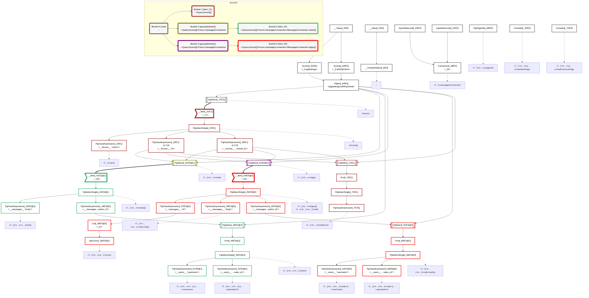

```mermaid
graph TD
    classDef path fill:#eee,stroke:#000,color:#000
    classDef plan fill:#fff,stroke-width:3px,color:#000
    classDef itemplan fill:#fff,stroke-width:6px,color:#000
    classDef sideeffectplan fill:#f00,stroke-width:6px,color:#000
    classDef bucket fill:#f6f6f6,color:#000,stroke-width:6px


    %% define plans
    __Value_3["__Value[_3∈0]<br /><context>"]:::plan
    __Value_5["__Value[_5∈0]<br /><rootValue>"]:::plan
    __TrackedObject_6["__TrackedObject[_6∈0]"]:::plan
    PgSelect_17[["PgSelect[_17∈0]<br /><forums>"]]:::plan
    __Item_21>"__Item[_21∈1]<br /><_17>"]:::itemplan
    PgSelectSingle_22["PgSelectSingle[_22∈1]<br /><forums>"]:::plan
    PgClassExpression_23["PgClassExpression[_23∈1]<br /><__forums__.”name”>"]:::plan
    InputStaticLeaf_24["InputStaticLeaf[_24∈0]"]:::plan
    InputStaticLeaf_25["InputStaticLeaf[_25∈0]"]:::plan
    PgClassExpression_33["PgClassExpression[_33∈1] {1,2,0}<br /><__forums__.”id”>"]:::plan
    Connection_38["Connection[_38∈0]<br /><_34>"]:::plan
    PgClassExpression_39["PgClassExpression[_39∈1] {1,2,0}<br /><__forums__...chived_at”>"]:::plan
    PgSelect_40[["PgSelect[_40∈2@1]<br /><messages>"]]:::plan
    __Item_41>"__Item[_41∈3@1]<br /><_40>"]:::itemplan
    PgSelectSingle_42["PgSelectSingle[_42∈3@1]<br /><messages>"]:::plan
    PgClassExpression_43["PgClassExpression[_43∈3@1]<br /><__messages__.”body”>"]:::plan
    PgClassExpression_44["PgClassExpression[_44∈3@1]<br /><__messages...author_id”>"]:::plan
    PgSelect_45[["PgSelect[_45∈3@1]<br /><users>"]]:::plan
    First_49["First[_49∈3@1]"]:::plan
    PgSelectSingle_50["PgSelectSingle[_50∈3@1]<br /><users>"]:::plan
    PgClassExpression_51["PgClassExpression[_51∈3@1]<br /><__users__.”username”>"]:::plan
    PgClassExpression_52["PgClassExpression[_52∈3@1]<br /><__users__....vatar_url”>"]:::plan
    PgSelect_53[["PgSelect[_53∈4@2]<br /><messages>"]]:::plan
    __Item_54>"__Item[_54∈5@2]<br /><_53>"]:::itemplan
    PgSelectSingle_55["PgSelectSingle[_55∈5@2]<br /><messages>"]:::plan
    PgCursor_56["PgCursor[_56∈5@2]"]:::plan
    PgClassExpression_57["PgClassExpression[_57∈5@2]<br /><__messages__.”id”>"]:::plan
    List_58["List[_58∈5@2]<br /><_57>"]:::plan
    PgClassExpression_59["PgClassExpression[_59∈5@2]<br /><__messages__.”body”>"]:::plan
    PgClassExpression_60["PgClassExpression[_60∈5@2]<br /><__messages...author_id”>"]:::plan
    PgSelect_61[["PgSelect[_61∈5@2]<br /><users>"]]:::plan
    Access_62["Access[_62∈0]<br /><_3.pgSettings>"]:::plan
    Access_63["Access[_63∈0]<br /><_3.withPgClient>"]:::plan
    Object_64["Object[_64∈0]<br /><{pgSettings,withPgClient}>"]:::plan
    First_65["First[_65∈5@2]"]:::plan
    PgSelectSingle_66["PgSelectSingle[_66∈5@2]<br /><users>"]:::plan
    PgClassExpression_67["PgClassExpression[_67∈5@2]<br /><__users__.”username”>"]:::plan
    PgClassExpression_68["PgClassExpression[_68∈5@2]<br /><__users__....vatar_url”>"]:::plan
    PgPageInfo_69["PgPageInfo[_69∈0]"]:::plan
    Constant_70["Constant[_70∈0]"]:::plan
    Constant_71["Constant[_71∈0]"]:::plan
    PgSelect_72[["PgSelect[_72∈1]<br /><messages>"]]:::plan
    First_73["First[_73∈1]"]:::plan
    PgSelectSingle_74["PgSelectSingle[_74∈1]<br /><messages>"]:::plan
    PgClassExpression_75["PgClassExpression[_75∈1]<br /><count(*)>"]:::plan

    %% plan dependencies
    __Value_5 --> __TrackedObject_6
    Object_64 --> PgSelect_17
    PgSelect_17 ==> __Item_21
    __Item_21 --> PgSelectSingle_22
    PgSelectSingle_22 --> PgClassExpression_23
    PgSelectSingle_22 --> PgClassExpression_33
    InputStaticLeaf_24 --> Connection_38
    InputStaticLeaf_25 --> Connection_38
    PgSelectSingle_22 --> PgClassExpression_39
    Object_64 --> PgSelect_40
    PgClassExpression_33 --> PgSelect_40
    PgClassExpression_39 --> PgSelect_40
    PgSelect_40 ==> __Item_41
    __Item_41 --> PgSelectSingle_42
    PgSelectSingle_42 --> PgClassExpression_43
    PgSelectSingle_42 --> PgClassExpression_44
    Object_64 --> PgSelect_45
    PgClassExpression_44 --> PgSelect_45
    PgSelect_45 --> First_49
    First_49 --> PgSelectSingle_50
    PgSelectSingle_50 --> PgClassExpression_51
    PgSelectSingle_50 --> PgClassExpression_52
    Object_64 --> PgSelect_53
    PgClassExpression_33 --> PgSelect_53
    PgClassExpression_39 --> PgSelect_53
    PgSelect_53 ==> __Item_54
    __Item_54 --> PgSelectSingle_55
    List_58 --> PgCursor_56
    PgSelectSingle_55 --> PgClassExpression_57
    PgClassExpression_57 --> List_58
    PgSelectSingle_55 --> PgClassExpression_59
    PgSelectSingle_55 --> PgClassExpression_60
    Object_64 --> PgSelect_61
    PgClassExpression_60 --> PgSelect_61
    __Value_3 --> Access_62
    __Value_3 --> Access_63
    Access_62 --> Object_64
    Access_63 --> Object_64
    PgSelect_61 --> First_65
    First_65 --> PgSelectSingle_66
    PgSelectSingle_66 --> PgClassExpression_67
    PgSelectSingle_66 --> PgClassExpression_68
    Object_64 --> PgSelect_72
    PgClassExpression_33 --> PgSelect_72
    PgClassExpression_39 --> PgSelect_72
    PgSelect_72 --> First_73
    First_73 --> PgSelectSingle_74
    PgSelectSingle_74 --> PgClassExpression_75

    %% plan-to-path relationships
    P1["~"]
    __TrackedObject_6 -.-> P1
    P2[">forums"]
    PgSelect_17 -.-> P2
    P3[">forums[]"]
    PgSelectSingle_22 -.-> P3
    P4[">f…]>name"]
    PgClassExpression_23 -.-> P4
    P5[">f…]>messagesConnection"]
    Connection_38 -.-> P5
    P6[">f…]>m…n>nodes"]
    PgSelect_40 -.-> P6
    P7[">f…]>m…n>nodes[]"]
    PgSelectSingle_42 -.-> P7
    P8[">f…]>m…n>n…]>body"]
    PgClassExpression_43 -.-> P8
    P9[">f…]>m…n>n…]>author"]
    PgSelectSingle_50 -.-> P9
    P10[">f…]>m…n>n…]>a…r>username"]
    PgClassExpression_51 -.-> P10
    P11[">f…]>m…n>n…]>a…r>gravatarUrl"]
    PgClassExpression_52 -.-> P11
    P12[">f…]>m…n>edges"]
    PgSelect_53 -.-> P12
    P13[">f…]>m…n>edges[]<br />>f…]>m…n>e…]>node"]
    PgSelectSingle_55 -.-> P13
    P14[">f…]>m…n>e…]>cursor"]
    PgCursor_56 -.-> P14
    P15[">f…]>m…n>e…]>node>body"]
    PgClassExpression_59 -.-> P15
    P16[">f…]>m…n>e…]>node>author"]
    PgSelectSingle_66 -.-> P16
    P17[">f…]>m…n>e…]>node>a…r>username"]
    PgClassExpression_67 -.-> P17
    P18[">f…]>m…n>e…]>node>a…r>gravatarUrl"]
    PgClassExpression_68 -.-> P18
    P19[">f…]>m…n>pageInfo"]
    PgPageInfo_69 -.-> P19
    P20[">f…]>m…n>p…o>hasNextPage"]
    Constant_70 -.-> P20
    P21[">f…]>m…n>p…o>hasPreviousPage"]
    Constant_71 -.-> P21
    P22[">f…]>m…n>totalCount"]
    PgClassExpression_75 -.-> P22

    %% allocate buckets
    classDef bucket0 stroke:#696969
    class __Value_3,__Value_5,__TrackedObject_6,PgSelect_17,InputStaticLeaf_24,InputStaticLeaf_25,Connection_38,Access_62,Access_63,Object_64,PgPageInfo_69,Constant_70,Constant_71 bucket0
    classDef bucket1 stroke:#a52a2a
    class __Item_21,PgSelectSingle_22,PgClassExpression_23,PgClassExpression_33,PgClassExpression_39,PgSelect_72,First_73,PgSelectSingle_74,PgClassExpression_75 bucket1
    classDef bucket2 stroke:#808000
    class PgSelect_40 bucket2
    classDef bucket3 stroke:#3cb371
    class __Item_41,PgSelectSingle_42,PgClassExpression_43,PgClassExpression_44,PgSelect_45,First_49,PgSelectSingle_50,PgClassExpression_51,PgClassExpression_52 bucket3
    classDef bucket4 stroke:#7f007f
    class PgSelect_53 bucket4
    classDef bucket5 stroke:#ff0000
    class __Item_54,PgSelectSingle_55,PgCursor_56,PgClassExpression_57,List_58,PgClassExpression_59,PgClassExpression_60,PgSelect_61,First_65,PgSelectSingle_66,PgClassExpression_67,PgClassExpression_68 bucket5

    subgraph Buckets
    Bucket0("Bucket 0 (root)<br />~"):::bucket
    style Bucket0 stroke:#696969
    Bucket1("Bucket 1 (item_21)<br />~>Query.forums[]"):::bucket
    style Bucket1 stroke:#a52a2a
    Bucket0 --> Bucket1
    Bucket2("Bucket 2 (group1[stream])<br />~>Query.forums[]>Forum.messagesConnection"):::bucket
    style Bucket2 stroke:#808000
    Bucket0 --> Bucket2
    Bucket3("Bucket 3 (item_41)<br />~>Query.forums[]>Forum.messagesConnection>MessagesConnection.nodes[]"):::bucket
    style Bucket3 stroke:#3cb371
    Bucket2 --> Bucket3
    Bucket4("Bucket 4 (group2[stream])<br />~>Query.forums[]>Forum.messagesConnection"):::bucket
    style Bucket4 stroke:#7f007f
    Bucket0 --> Bucket4
    Bucket5("Bucket 5 (item_54)<br />~>Query.forums[]>Forum.messagesConnection>MessagesConnection.edges[]"):::bucket
    style Bucket5 stroke:#ff0000
    Bucket4 --> Bucket5
    end
```
