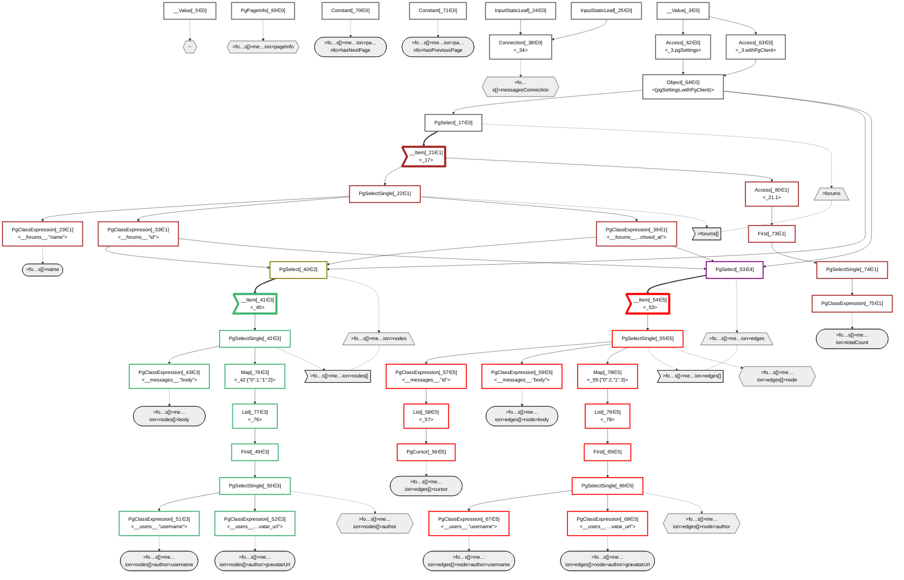

```mermaid
graph TD
    classDef path fill:#eee,stroke:#000,color:#000
    classDef plan fill:#fff,stroke-width:3px,color:#000
    classDef itemplan fill:#fff,stroke-width:6px,color:#000
    classDef sideeffectplan fill:#f00,stroke-width:6px,color:#000

    %% subgraph fields
    P1{{"~"}}:::path
    P2[/">forums"\]:::path
    P3>">forums[]"]:::path
    P2 -.- P3
    P4([">fo…s[]>name"]):::path
    %% P3 -.-> P4
    P5{{">fo…s[]>messagesConnection"}}:::path
    P6[/">fo…s[]>me…ion>nodes"\]:::path
    P7>">fo…s[]>me…ion>nodes[]"]:::path
    P6 -.- P7
    P8([">fo…s[]>me…ion>nodes[]>body"]):::path
    %% P7 -.-> P8
    P9{{">fo…s[]>me…ion>nodes[]>author"}}:::path
    P10([">fo…s[]>me…ion>nodes[]>author>username"]):::path
    %% P9 -.-> P10
    P11([">fo…s[]>me…ion>nodes[]>author>gravatarUrl"]):::path
    %% P9 -.-> P11
    %% P7 -.-> P9
    %% P5 -.-> P6
    P12[/">fo…s[]>me…ion>edges"\]:::path
    P13>">fo…s[]>me…ion>edges[]"]:::path
    P12 -.- P13
    P14([">fo…s[]>me…ion>edges[]>cursor"]):::path
    %% P13 -.-> P14
    P15{{">fo…s[]>me…ion>edges[]>node"}}:::path
    P16([">fo…s[]>me…ion>edges[]>node>body"]):::path
    %% P15 -.-> P16
    P17{{">fo…s[]>me…ion>edges[]>node>author"}}:::path
    P18([">fo…s[]>me…ion>edges[]>node>author>username"]):::path
    %% P17 -.-> P18
    P19([">fo…s[]>me…ion>edges[]>node>author>gravatarUrl"]):::path
    %% P17 -.-> P19
    %% P15 -.-> P17
    %% P13 -.-> P15
    %% P5 -.-> P12
    P20{{">fo…s[]>me…ion>pageInfo"}}:::path
    P21([">fo…s[]>me…ion>pa…nfo>hasNextPage"]):::path
    %% P20 -.-> P21
    P22([">fo…s[]>me…ion>pa…nfo>hasPreviousPage"]):::path
    %% P20 -.-> P22
    %% P5 -.-> P20
    P23([">fo…s[]>me…ion>totalCount"]):::path
    %% P5 -.-> P23
    %% P3 -.-> P5
    %% P1 -.-> P2
    %% end

    %% define plans
    __Value_3["__Value[_3∈0]<br /><context>"]:::plan
    __Value_5["__Value[_5∈0]<br /><rootValue>"]:::plan
    PgSelect_17["PgSelect[_17∈0]<br /><forums>"]:::plan
    __Item_21>"__Item[_21∈1]<br /><_17>"]:::itemplan
    PgSelectSingle_22["PgSelectSingle[_22∈1]<br /><forums>"]:::plan
    PgClassExpression_23["PgClassExpression[_23∈1]<br /><__forums__.#quot;name#quot;>"]:::plan
    InputStaticLeaf_24["InputStaticLeaf[_24∈0]"]:::plan
    InputStaticLeaf_25["InputStaticLeaf[_25∈0]"]:::plan
    PgClassExpression_33["PgClassExpression[_33∈1]<br /><__forums__.#quot;id#quot;>"]:::plan
    Connection_38["Connection[_38∈0]<br /><_34>"]:::plan
    PgClassExpression_39["PgClassExpression[_39∈1]<br /><__forums__...chived_at#quot;>"]:::plan
    PgSelect_40["PgSelect[_40∈2]<br /><messages>"]:::plan
    __Item_41>"__Item[_41∈3]<br /><_40>"]:::itemplan
    PgSelectSingle_42["PgSelectSingle[_42∈3]<br /><messages>"]:::plan
    PgClassExpression_43["PgClassExpression[_43∈3]<br /><__messages__.#quot;body#quot;>"]:::plan
    First_49["First[_49∈3]"]:::plan
    PgSelectSingle_50["PgSelectSingle[_50∈3]<br /><users>"]:::plan
    PgClassExpression_51["PgClassExpression[_51∈3]<br /><__users__.#quot;username#quot;>"]:::plan
    PgClassExpression_52["PgClassExpression[_52∈3]<br /><__users__....vatar_url#quot;>"]:::plan
    PgSelect_53["PgSelect[_53∈4]<br /><messages>"]:::plan
    __Item_54>"__Item[_54∈5]<br /><_53>"]:::itemplan
    PgSelectSingle_55["PgSelectSingle[_55∈5]<br /><messages>"]:::plan
    PgCursor_56["PgCursor[_56∈5]"]:::plan
    PgClassExpression_57["PgClassExpression[_57∈5]<br /><__messages__.#quot;id#quot;>"]:::plan
    List_58["List[_58∈5]<br /><_57>"]:::plan
    PgClassExpression_59["PgClassExpression[_59∈5]<br /><__messages__.#quot;body#quot;>"]:::plan
    Access_62["Access[_62∈0]<br /><_3.pgSettings>"]:::plan
    Access_63["Access[_63∈0]<br /><_3.withPgClient>"]:::plan
    Object_64["Object[_64∈0]<br /><{pgSettings,withPgClient}>"]:::plan
    First_65["First[_65∈5]"]:::plan
    PgSelectSingle_66["PgSelectSingle[_66∈5]<br /><users>"]:::plan
    PgClassExpression_67["PgClassExpression[_67∈5]<br /><__users__.#quot;username#quot;>"]:::plan
    PgClassExpression_68["PgClassExpression[_68∈5]<br /><__users__....vatar_url#quot;>"]:::plan
    PgPageInfo_69["PgPageInfo[_69∈0]"]:::plan
    Constant_70["Constant[_70∈0]"]:::plan
    Constant_71["Constant[_71∈0]"]:::plan
    First_73["First[_73∈1]"]:::plan
    PgSelectSingle_74["PgSelectSingle[_74∈1]<br /><messages>"]:::plan
    PgClassExpression_75["PgClassExpression[_75∈1]<br /><count(*)>"]:::plan
    Map_76["Map[_76∈3]<br /><_42:{#quot;0#quot;:1,#quot;1#quot;:2}>"]:::plan
    List_77["List[_77∈3]<br /><_76>"]:::plan
    Map_78["Map[_78∈5]<br /><_55:{#quot;0#quot;:2,#quot;1#quot;:3}>"]:::plan
    List_79["List[_79∈5]<br /><_78>"]:::plan
    Access_80["Access[_80∈1]<br /><_21.1>"]:::plan

    %% plan dependencies
    Object_64 --> PgSelect_17
    PgSelect_17 ==> __Item_21
    __Item_21 --> PgSelectSingle_22
    PgSelectSingle_22 --> PgClassExpression_23
    PgSelectSingle_22 --> PgClassExpression_33
    InputStaticLeaf_24 --> Connection_38
    InputStaticLeaf_25 --> Connection_38
    PgSelectSingle_22 --> PgClassExpression_39
    Object_64 --> PgSelect_40
    PgClassExpression_33 --> PgSelect_40
    PgClassExpression_39 --> PgSelect_40
    PgSelect_40 ==> __Item_41
    __Item_41 --> PgSelectSingle_42
    PgSelectSingle_42 --> PgClassExpression_43
    List_77 --> First_49
    First_49 --> PgSelectSingle_50
    PgSelectSingle_50 --> PgClassExpression_51
    PgSelectSingle_50 --> PgClassExpression_52
    Object_64 --> PgSelect_53
    PgClassExpression_33 --> PgSelect_53
    PgClassExpression_39 --> PgSelect_53
    PgSelect_53 ==> __Item_54
    __Item_54 --> PgSelectSingle_55
    List_58 --> PgCursor_56
    PgSelectSingle_55 --> PgClassExpression_57
    PgClassExpression_57 --> List_58
    PgSelectSingle_55 --> PgClassExpression_59
    __Value_3 --> Access_62
    __Value_3 --> Access_63
    Access_62 --> Object_64
    Access_63 --> Object_64
    List_79 --> First_65
    First_65 --> PgSelectSingle_66
    PgSelectSingle_66 --> PgClassExpression_67
    PgSelectSingle_66 --> PgClassExpression_68
    Access_80 --> First_73
    First_73 --> PgSelectSingle_74
    PgSelectSingle_74 --> PgClassExpression_75
    PgSelectSingle_42 --> Map_76
    Map_76 --> List_77
    PgSelectSingle_55 --> Map_78
    Map_78 --> List_79
    __Item_21 --> Access_80

    %% plan-to-path relationships
    __Value_5 -.-> P1
    PgSelect_17 -.-> P2
    PgSelectSingle_22 -.-> P3
    PgClassExpression_23 -.-> P4
    Connection_38 -.-> P5
    PgSelect_40 -.-> P6
    PgSelectSingle_42 -.-> P7
    PgClassExpression_43 -.-> P8
    PgSelectSingle_50 -.-> P9
    PgClassExpression_51 -.-> P10
    PgClassExpression_52 -.-> P11
    PgSelect_53 -.-> P12
    PgSelectSingle_55 -.-> P13
    PgCursor_56 -.-> P14
    PgSelectSingle_55 -.-> P15
    PgClassExpression_59 -.-> P16
    PgSelectSingle_66 -.-> P17
    PgClassExpression_67 -.-> P18
    PgClassExpression_68 -.-> P19
    PgPageInfo_69 -.-> P20
    Constant_70 -.-> P21
    Constant_71 -.-> P22
    PgClassExpression_75 -.-> P23

    %% allocate buckets
    classDef bucket0 stroke:#696969
    class __Value_3,__Value_5,PgSelect_17,InputStaticLeaf_24,InputStaticLeaf_25,Connection_38,Access_62,Access_63,Object_64,PgPageInfo_69,Constant_70,Constant_71 bucket0
    classDef bucket1 stroke:#a52a2a
    class __Item_21,PgSelectSingle_22,PgClassExpression_23,PgClassExpression_33,PgClassExpression_39,First_73,PgSelectSingle_74,PgClassExpression_75,Access_80 bucket1
    classDef bucket2 stroke:#808000
    class PgSelect_40 bucket2
    classDef bucket3 stroke:#3cb371
    class __Item_41,PgSelectSingle_42,PgClassExpression_43,First_49,PgSelectSingle_50,PgClassExpression_51,PgClassExpression_52,Map_76,List_77 bucket3
    classDef bucket4 stroke:#7f007f
    class PgSelect_53 bucket4
    classDef bucket5 stroke:#ff0000
    class __Item_54,PgSelectSingle_55,PgCursor_56,PgClassExpression_57,List_58,PgClassExpression_59,First_65,PgSelectSingle_66,PgClassExpression_67,PgClassExpression_68,Map_78,List_79 bucket5
```
