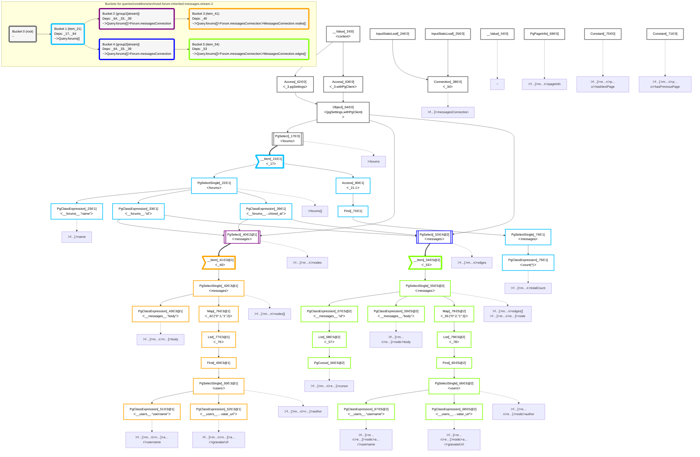

```mermaid
graph TD
    classDef path fill:#eee,stroke:#000,color:#000
    classDef plan fill:#fff,stroke-width:3px,color:#000
    classDef itemplan fill:#fff,stroke-width:6px,color:#000
    classDef sideeffectplan fill:#f00,stroke-width:6px,color:#000
    classDef bucket fill:#f6f6f6,color:#000,stroke-width:6px,text-align:left


    %% define plans
    __Value_0["__Value[_0∈0]"]:::plan
    __Value_3["__Value[_3∈0]<br />ᐸcontextᐳ"]:::plan
    PgSelect_17[["PgSelect[_17∈0]<br />ᐸforumsᐳ"]]:::plan
    __Item_21>"__Item[_21∈1]<br />ᐸ_17ᐳ"]:::itemplan
    PgSelectSingle_22["PgSelectSingle[_22∈1]<br />ᐸforumsᐳ"]:::plan
    PgClassExpression_23["PgClassExpression[_23∈1]<br />ᐸ__forums__.”name”ᐳ"]:::plan
    InputStaticLeaf_24["InputStaticLeaf[_24∈0]"]:::plan
    InputStaticLeaf_25["InputStaticLeaf[_25∈0]"]:::plan
    PgClassExpression_33["PgClassExpression[_33∈1]<br />ᐸ__forums__.”id”ᐳ"]:::plan
    Connection_38["Connection[_38∈0]<br />ᐸ_34ᐳ"]:::plan
    PgClassExpression_39["PgClassExpression[_39∈1]<br />ᐸ__forums__...chived_at”ᐳ"]:::plan
    PgSelect_40[["PgSelect[_40∈2@1]<br />ᐸmessagesᐳ"]]:::plan
    __Item_41>"__Item[_41∈3@1]<br />ᐸ_40ᐳ"]:::itemplan
    PgSelectSingle_42["PgSelectSingle[_42∈3@1]<br />ᐸmessagesᐳ"]:::plan
    PgClassExpression_43["PgClassExpression[_43∈3@1]<br />ᐸ__messages__.”body”ᐳ"]:::plan
    First_49["First[_49∈3@1]"]:::plan
    PgSelectSingle_50["PgSelectSingle[_50∈3@1]<br />ᐸusersᐳ"]:::plan
    PgClassExpression_51["PgClassExpression[_51∈3@1]<br />ᐸ__users__.”username”ᐳ"]:::plan
    PgClassExpression_52["PgClassExpression[_52∈3@1]<br />ᐸ__users__....vatar_url”ᐳ"]:::plan
    PgSelect_53[["PgSelect[_53∈4@2]<br />ᐸmessagesᐳ"]]:::plan
    __Item_54>"__Item[_54∈5@2]<br />ᐸ_53ᐳ"]:::itemplan
    PgSelectSingle_55["PgSelectSingle[_55∈5@2]<br />ᐸmessagesᐳ"]:::plan
    PgCursor_56["PgCursor[_56∈5@2]"]:::plan
    PgClassExpression_57["PgClassExpression[_57∈5@2]<br />ᐸ__messages__.”id”ᐳ"]:::plan
    List_58["List[_58∈5@2]<br />ᐸ_57ᐳ"]:::plan
    PgClassExpression_59["PgClassExpression[_59∈5@2]<br />ᐸ__messages__.”body”ᐳ"]:::plan
    Access_62["Access[_62∈0]<br />ᐸ_3.pgSettingsᐳ"]:::plan
    Access_63["Access[_63∈0]<br />ᐸ_3.withPgClientᐳ"]:::plan
    Object_64["Object[_64∈0]<br />ᐸ{pgSettings,withPgClient}ᐳ"]:::plan
    First_65["First[_65∈5@2]"]:::plan
    PgSelectSingle_66["PgSelectSingle[_66∈5@2]<br />ᐸusersᐳ"]:::plan
    PgClassExpression_67["PgClassExpression[_67∈5@2]<br />ᐸ__users__.”username”ᐳ"]:::plan
    PgClassExpression_68["PgClassExpression[_68∈5@2]<br />ᐸ__users__....vatar_url”ᐳ"]:::plan
    PgPageInfo_69["PgPageInfo[_69∈0]"]:::plan
    Constant_70["Constant[_70∈0]"]:::plan
    Constant_71["Constant[_71∈0]"]:::plan
    First_73["First[_73∈1]"]:::plan
    PgSelectSingle_74["PgSelectSingle[_74∈1]<br />ᐸmessagesᐳ"]:::plan
    PgClassExpression_75["PgClassExpression[_75∈1]<br />ᐸcount(*)ᐳ"]:::plan
    Map_76["Map[_76∈3@1]<br />ᐸ_42:{”0”:1,”1”:2}ᐳ"]:::plan
    List_77["List[_77∈3@1]<br />ᐸ_76ᐳ"]:::plan
    Map_78["Map[_78∈5@2]<br />ᐸ_55:{”0”:2,”1”:3}ᐳ"]:::plan
    List_79["List[_79∈5@2]<br />ᐸ_78ᐳ"]:::plan
    Access_80["Access[_80∈1]<br />ᐸ_21.1ᐳ"]:::plan

    %% plan dependencies
    Object_64 --> PgSelect_17
    PgSelect_17 ==> __Item_21
    __Item_21 --> PgSelectSingle_22
    PgSelectSingle_22 --> PgClassExpression_23
    PgSelectSingle_22 --> PgClassExpression_33
    InputStaticLeaf_24 --> Connection_38
    InputStaticLeaf_25 --> Connection_38
    PgSelectSingle_22 --> PgClassExpression_39
    Object_64 --> PgSelect_40
    PgClassExpression_33 --> PgSelect_40
    PgClassExpression_39 --> PgSelect_40
    PgSelect_40 ==> __Item_41
    __Item_41 --> PgSelectSingle_42
    PgSelectSingle_42 --> PgClassExpression_43
    List_77 --> First_49
    First_49 --> PgSelectSingle_50
    PgSelectSingle_50 --> PgClassExpression_51
    PgSelectSingle_50 --> PgClassExpression_52
    Object_64 --> PgSelect_53
    PgClassExpression_33 --> PgSelect_53
    PgClassExpression_39 --> PgSelect_53
    PgSelect_53 ==> __Item_54
    __Item_54 --> PgSelectSingle_55
    List_58 --> PgCursor_56
    PgSelectSingle_55 --> PgClassExpression_57
    PgClassExpression_57 --> List_58
    PgSelectSingle_55 --> PgClassExpression_59
    __Value_3 --> Access_62
    __Value_3 --> Access_63
    Access_62 --> Object_64
    Access_63 --> Object_64
    List_79 --> First_65
    First_65 --> PgSelectSingle_66
    PgSelectSingle_66 --> PgClassExpression_67
    PgSelectSingle_66 --> PgClassExpression_68
    Access_80 --> First_73
    First_73 --> PgSelectSingle_74
    PgSelectSingle_74 --> PgClassExpression_75
    PgSelectSingle_42 --> Map_76
    Map_76 --> List_77
    PgSelectSingle_55 --> Map_78
    Map_78 --> List_79
    __Item_21 --> Access_80

    %% plan-to-path relationships
    P_0["~"]
    __Value_0 -.-> P_0
    P_17["ᐳforums"]
    PgSelect_17 -.-> P_17
    P_22["ᐳforums[]"]
    PgSelectSingle_22 -.-> P_22
    P_23["ᐳf…]ᐳname"]
    PgClassExpression_23 -.-> P_23
    P_38["ᐳf…]ᐳmessagesConnection"]
    Connection_38 -.-> P_38
    P_40["ᐳf…]ᐳm…nᐳnodes"]
    PgSelect_40 -.-> P_40
    P_42["ᐳf…]ᐳm…nᐳnodes[]"]
    PgSelectSingle_42 -.-> P_42
    P_43["ᐳf…]ᐳm…nᐳn…]ᐳbody"]
    PgClassExpression_43 -.-> P_43
    P_50["ᐳf…]ᐳm…nᐳn…]ᐳauthor"]
    PgSelectSingle_50 -.-> P_50
    P_51["ᐳf…]ᐳm…nᐳn…]ᐳa…rᐳusername"]
    PgClassExpression_51 -.-> P_51
    P_52["ᐳf…]ᐳm…nᐳn…]ᐳa…rᐳgravatarUrl"]
    PgClassExpression_52 -.-> P_52
    P_53["ᐳf…]ᐳm…nᐳedges"]
    PgSelect_53 -.-> P_53
    P_55["ᐳf…]ᐳm…nᐳedges[]<br />ᐳf…]ᐳm…nᐳe…]ᐳnode"]
    PgSelectSingle_55 -.-> P_55
    P_56["ᐳf…]ᐳm…nᐳe…]ᐳcursor"]
    PgCursor_56 -.-> P_56
    P_59["ᐳf…]ᐳm…nᐳe…]ᐳnodeᐳbody"]
    PgClassExpression_59 -.-> P_59
    P_66["ᐳf…]ᐳm…nᐳe…]ᐳnodeᐳauthor"]
    PgSelectSingle_66 -.-> P_66
    P_67["ᐳf…]ᐳm…nᐳe…]ᐳnodeᐳa…rᐳusername"]
    PgClassExpression_67 -.-> P_67
    P_68["ᐳf…]ᐳm…nᐳe…]ᐳnodeᐳa…rᐳgravatarUrl"]
    PgClassExpression_68 -.-> P_68
    P_69["ᐳf…]ᐳm…nᐳpageInfo"]
    PgPageInfo_69 -.-> P_69
    P_70["ᐳf…]ᐳm…nᐳp…oᐳhasNextPage"]
    Constant_70 -.-> P_70
    P_71["ᐳf…]ᐳm…nᐳp…oᐳhasPreviousPage"]
    Constant_71 -.-> P_71
    P_75["ᐳf…]ᐳm…nᐳtotalCount"]
    PgClassExpression_75 -.-> P_75

    %% allocate buckets
    classDef bucket0 stroke:#696969
    class __Value_0,__Value_3,PgSelect_17,InputStaticLeaf_24,InputStaticLeaf_25,Connection_38,Access_62,Access_63,Object_64,PgPageInfo_69,Constant_70,Constant_71 bucket0
    classDef bucket1 stroke:#00bfff
    class __Item_21,PgSelectSingle_22,PgClassExpression_23,PgClassExpression_33,PgClassExpression_39,First_73,PgSelectSingle_74,PgClassExpression_75,Access_80 bucket1
    classDef bucket2 stroke:#7f007f
    class PgSelect_40 bucket2
    classDef bucket3 stroke:#ffa500
    class __Item_41,PgSelectSingle_42,PgClassExpression_43,First_49,PgSelectSingle_50,PgClassExpression_51,PgClassExpression_52,Map_76,List_77 bucket3
    classDef bucket4 stroke:#0000ff
    class PgSelect_53 bucket4
    classDef bucket5 stroke:#7fff00
    class __Item_54,PgSelectSingle_55,PgCursor_56,PgClassExpression_57,List_58,PgClassExpression_59,First_65,PgSelectSingle_66,PgClassExpression_67,PgClassExpression_68,Map_78,List_79 bucket5

    subgraph "Buckets for queries/conditions/archived-forum-inherited-messages.stream-2"
    Bucket0("Bucket 0 (root)<br />~"):::bucket
    style Bucket0 stroke:#696969
    Bucket1("Bucket 1 (item_21)<br />Deps: _17, _64<br />~ᐳQuery.forums[]"):::bucket
    style Bucket1 stroke:#00bfff
    Bucket0 --> Bucket1
    Bucket2("Bucket 2 (group1[stream])<br />Deps: _64, _33, _39<br />~ᐳQuery.forums[]ᐳForum.messagesConnection"):::bucket
    style Bucket2 stroke:#7f007f
    Bucket1 --> Bucket2
    Bucket3("Bucket 3 (item_41)<br />Deps: _40<br />~ᐳQuery.forums[]ᐳForum.messagesConnectionᐳMessagesConnection.nodes[]"):::bucket
    style Bucket3 stroke:#ffa500
    Bucket2 --> Bucket3
    Bucket4("Bucket 4 (group2[stream])<br />Deps: _64, _33, _39<br />~ᐳQuery.forums[]ᐳForum.messagesConnection"):::bucket
    style Bucket4 stroke:#0000ff
    Bucket1 --> Bucket4
    Bucket5("Bucket 5 (item_54)<br />Deps: _53<br />~ᐳQuery.forums[]ᐳForum.messagesConnectionᐳMessagesConnection.edges[]"):::bucket
    style Bucket5 stroke:#7fff00
    Bucket4 --> Bucket5
    end
```
