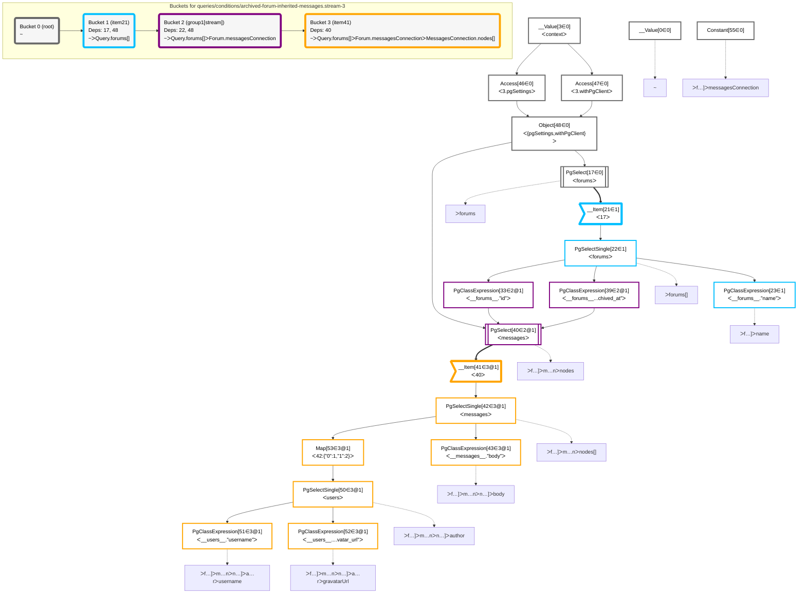

```mermaid
graph TD
    classDef path fill:#eee,stroke:#000,color:#000
    classDef plan fill:#fff,stroke-width:3px,color:#000
    classDef itemplan fill:#fff,stroke-width:6px,color:#000
    classDef sideeffectplan fill:#f00,stroke-width:6px,color:#000
    classDef bucket fill:#f6f6f6,color:#000,stroke-width:6px,text-align:left


    %% define plans
    __Value0["__Value[0∈0]"]:::plan
    PgClassExpression23["PgClassExpression[23∈1]<br />ᐸ__forums__.”name”ᐳ"]:::plan
    PgClassExpression43["PgClassExpression[43∈3@1]<br />ᐸ__messages__.”body”ᐳ"]:::plan
    PgClassExpression51["PgClassExpression[51∈3@1]<br />ᐸ__users__.”username”ᐳ"]:::plan
    PgClassExpression52["PgClassExpression[52∈3@1]<br />ᐸ__users__....vatar_url”ᐳ"]:::plan
    PgSelectSingle50["PgSelectSingle[50∈3@1]<br />ᐸusersᐳ"]:::plan
    Map53["Map[53∈3@1]<br />ᐸ42:{”0”:1,”1”:2}ᐳ"]:::plan
    PgSelectSingle42["PgSelectSingle[42∈3@1]<br />ᐸmessagesᐳ"]:::plan
    __Item41>"__Item[41∈3@1]<br />ᐸ40ᐳ"]:::itemplan
    PgSelect40[["PgSelect[40∈2@1]<br />ᐸmessagesᐳ"]]:::plan
    PgClassExpression33["PgClassExpression[33∈2@1]<br />ᐸ__forums__.”id”ᐳ"]:::plan
    PgClassExpression39["PgClassExpression[39∈2@1]<br />ᐸ__forums__...chived_at”ᐳ"]:::plan
    PgSelectSingle22["PgSelectSingle[22∈1]<br />ᐸforumsᐳ"]:::plan
    __Item21>"__Item[21∈1]<br />ᐸ17ᐳ"]:::itemplan
    PgSelect17[["PgSelect[17∈0]<br />ᐸforumsᐳ"]]:::plan
    Object48["Object[48∈0]<br />ᐸ{pgSettings,withPgClient}ᐳ"]:::plan
    Access46["Access[46∈0]<br />ᐸ3.pgSettingsᐳ"]:::plan
    Access47["Access[47∈0]<br />ᐸ3.withPgClientᐳ"]:::plan
    __Value3["__Value[3∈0]<br />ᐸcontextᐳ"]:::plan
    Constant55["Constant[55∈0]"]:::plan

    %% plan dependencies
    PgSelectSingle22 --> PgClassExpression23
    PgSelectSingle42 --> PgClassExpression43
    PgSelectSingle50 --> PgClassExpression51
    PgSelectSingle50 --> PgClassExpression52
    Map53 --> PgSelectSingle50
    PgSelectSingle42 --> Map53
    __Item41 --> PgSelectSingle42
    PgSelect40 ==> __Item41
    Object48 & PgClassExpression33 & PgClassExpression39 --> PgSelect40
    PgSelectSingle22 --> PgClassExpression33
    PgSelectSingle22 --> PgClassExpression39
    __Item21 --> PgSelectSingle22
    PgSelect17 ==> __Item21
    Object48 --> PgSelect17
    Access46 & Access47 --> Object48
    __Value3 --> Access46
    __Value3 --> Access47

    %% plan-to-path relationships
    P0["~"]
    __Value0 -.-> P0
    P17["ᐳforums"]
    PgSelect17 -.-> P17
    P22["ᐳforums[]"]
    PgSelectSingle22 -.-> P22
    P23["ᐳf…]ᐳname"]
    PgClassExpression23 -.-> P23
    P40["ᐳf…]ᐳm…nᐳnodes"]
    PgSelect40 -.-> P40
    P42["ᐳf…]ᐳm…nᐳnodes[]"]
    PgSelectSingle42 -.-> P42
    P43["ᐳf…]ᐳm…nᐳn…]ᐳbody"]
    PgClassExpression43 -.-> P43
    P50["ᐳf…]ᐳm…nᐳn…]ᐳauthor"]
    PgSelectSingle50 -.-> P50
    P51["ᐳf…]ᐳm…nᐳn…]ᐳa…rᐳusername"]
    PgClassExpression51 -.-> P51
    P52["ᐳf…]ᐳm…nᐳn…]ᐳa…rᐳgravatarUrl"]
    PgClassExpression52 -.-> P52
    P55["ᐳf…]ᐳmessagesConnection"]
    Constant55 -.-> P55

    subgraph "Buckets for queries/conditions/archived-forum-inherited-messages.stream-3"
    Bucket0("Bucket 0 (root)<br />~"):::bucket
    classDef bucket0 stroke:#696969
    class Bucket0,__Value0,__Value3,PgSelect17,Access46,Access47,Object48,Constant55 bucket0
    Bucket1("Bucket 1 (item21)<br />Deps: 17, 48<br />~ᐳQuery.forums[]"):::bucket
    classDef bucket1 stroke:#00bfff
    class Bucket1,__Item21,PgSelectSingle22,PgClassExpression23 bucket1
    Bucket2("Bucket 2 (group1[stream])<br />Deps: 22, 48<br />~ᐳQuery.forums[]ᐳForum.messagesConnection"):::bucket
    classDef bucket2 stroke:#7f007f
    class Bucket2,PgClassExpression33,PgClassExpression39,PgSelect40 bucket2
    Bucket3("Bucket 3 (item41)<br />Deps: 40<br />~ᐳQuery.forums[]ᐳForum.messagesConnectionᐳMessagesConnection.nodes[]"):::bucket
    classDef bucket3 stroke:#ffa500
    class Bucket3,__Item41,PgSelectSingle42,PgClassExpression43,PgSelectSingle50,PgClassExpression51,PgClassExpression52,Map53 bucket3
    Bucket0 --> Bucket1
    Bucket1 --> Bucket2
    Bucket2 --> Bucket3
    end
```
