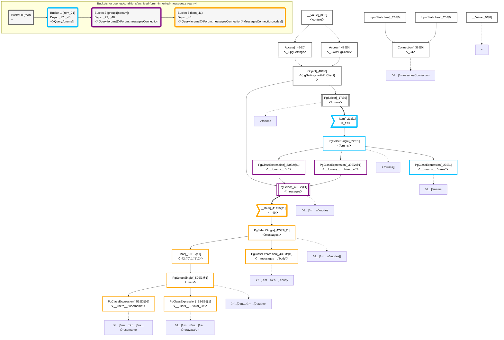

```mermaid
graph TD
    classDef path fill:#eee,stroke:#000,color:#000
    classDef plan fill:#fff,stroke-width:3px,color:#000
    classDef itemplan fill:#fff,stroke-width:6px,color:#000
    classDef sideeffectplan fill:#f00,stroke-width:6px,color:#000
    classDef bucket fill:#f6f6f6,color:#000,stroke-width:6px,text-align:left


    %% define plans
    __Value_0["__Value[_0∈0]"]:::plan
    PgClassExpression_23["PgClassExpression[_23∈1]<br />ᐸ__forums__.”name”ᐳ"]:::plan
    PgClassExpression_43["PgClassExpression[_43∈3@1]<br />ᐸ__messages__.”body”ᐳ"]:::plan
    PgClassExpression_51["PgClassExpression[_51∈3@1]<br />ᐸ__users__.”username”ᐳ"]:::plan
    PgClassExpression_52["PgClassExpression[_52∈3@1]<br />ᐸ__users__....vatar_url”ᐳ"]:::plan
    PgSelectSingle_50["PgSelectSingle[_50∈3@1]<br />ᐸusersᐳ"]:::plan
    Map_53["Map[_53∈3@1]<br />ᐸ_42:{”0”:1,”1”:2}ᐳ"]:::plan
    PgSelectSingle_42["PgSelectSingle[_42∈3@1]<br />ᐸmessagesᐳ"]:::plan
    __Item_41>"__Item[_41∈3@1]<br />ᐸ_40ᐳ"]:::itemplan
    PgSelect_40[["PgSelect[_40∈2@1]<br />ᐸmessagesᐳ"]]:::plan
    PgClassExpression_33["PgClassExpression[_33∈2@1]<br />ᐸ__forums__.”id”ᐳ"]:::plan
    PgClassExpression_39["PgClassExpression[_39∈2@1]<br />ᐸ__forums__...chived_at”ᐳ"]:::plan
    PgSelectSingle_22["PgSelectSingle[_22∈1]<br />ᐸforumsᐳ"]:::plan
    __Item_21>"__Item[_21∈1]<br />ᐸ_17ᐳ"]:::itemplan
    PgSelect_17[["PgSelect[_17∈0]<br />ᐸforumsᐳ"]]:::plan
    Object_48["Object[_48∈0]<br />ᐸ{pgSettings,withPgClient}ᐳ"]:::plan
    Access_46["Access[_46∈0]<br />ᐸ_3.pgSettingsᐳ"]:::plan
    Access_47["Access[_47∈0]<br />ᐸ_3.withPgClientᐳ"]:::plan
    __Value_3["__Value[_3∈0]<br />ᐸcontextᐳ"]:::plan
    Connection_38["Connection[_38∈0]<br />ᐸ_34ᐳ"]:::plan
    InputStaticLeaf_24["InputStaticLeaf[_24∈0]"]:::plan
    InputStaticLeaf_25["InputStaticLeaf[_25∈0]"]:::plan

    %% plan dependencies
    PgSelectSingle_22 --> PgClassExpression_23
    PgSelectSingle_42 --> PgClassExpression_43
    PgSelectSingle_50 --> PgClassExpression_51
    PgSelectSingle_50 --> PgClassExpression_52
    Map_53 --> PgSelectSingle_50
    PgSelectSingle_42 --> Map_53
    __Item_41 --> PgSelectSingle_42
    PgSelect_40 ==> __Item_41
    Object_48 & PgClassExpression_33 & PgClassExpression_39 --> PgSelect_40
    PgSelectSingle_22 --> PgClassExpression_33
    PgSelectSingle_22 --> PgClassExpression_39
    __Item_21 --> PgSelectSingle_22
    PgSelect_17 ==> __Item_21
    Object_48 --> PgSelect_17
    Access_46 & Access_47 --> Object_48
    __Value_3 --> Access_46
    __Value_3 --> Access_47
    InputStaticLeaf_24 & InputStaticLeaf_25 --> Connection_38

    %% plan-to-path relationships
    P_0["~"]
    __Value_0 -.-> P_0
    P_17["ᐳforums"]
    PgSelect_17 -.-> P_17
    P_22["ᐳforums[]"]
    PgSelectSingle_22 -.-> P_22
    P_23["ᐳf…]ᐳname"]
    PgClassExpression_23 -.-> P_23
    P_38["ᐳf…]ᐳmessagesConnection"]
    Connection_38 -.-> P_38
    P_40["ᐳf…]ᐳm…nᐳnodes"]
    PgSelect_40 -.-> P_40
    P_42["ᐳf…]ᐳm…nᐳnodes[]"]
    PgSelectSingle_42 -.-> P_42
    P_43["ᐳf…]ᐳm…nᐳn…]ᐳbody"]
    PgClassExpression_43 -.-> P_43
    P_50["ᐳf…]ᐳm…nᐳn…]ᐳauthor"]
    PgSelectSingle_50 -.-> P_50
    P_51["ᐳf…]ᐳm…nᐳn…]ᐳa…rᐳusername"]
    PgClassExpression_51 -.-> P_51
    P_52["ᐳf…]ᐳm…nᐳn…]ᐳa…rᐳgravatarUrl"]
    PgClassExpression_52 -.-> P_52

    subgraph "Buckets for queries/conditions/archived-forum-inherited-messages.stream-4"
    Bucket0("Bucket 0 (root)<br />~"):::bucket
    classDef bucket0 stroke:#696969
    class Bucket0,__Value_0,__Value_3,PgSelect_17,InputStaticLeaf_24,InputStaticLeaf_25,Connection_38,Access_46,Access_47,Object_48 bucket0
    Bucket1("Bucket 1 (item_21)<br />Deps: _17, _48<br />~ᐳQuery.forums[]"):::bucket
    classDef bucket1 stroke:#00bfff
    class Bucket1,__Item_21,PgSelectSingle_22,PgClassExpression_23 bucket1
    Bucket2("Bucket 2 (group1[stream])<br />Deps: _22, _48<br />~ᐳQuery.forums[]ᐳForum.messagesConnection"):::bucket
    classDef bucket2 stroke:#7f007f
    class Bucket2,PgClassExpression_33,PgClassExpression_39,PgSelect_40 bucket2
    Bucket3("Bucket 3 (item_41)<br />Deps: _40<br />~ᐳQuery.forums[]ᐳForum.messagesConnectionᐳMessagesConnection.nodes[]"):::bucket
    classDef bucket3 stroke:#ffa500
    class Bucket3,__Item_41,PgSelectSingle_42,PgClassExpression_43,PgSelectSingle_50,PgClassExpression_51,PgClassExpression_52,Map_53 bucket3
    Bucket0 --> Bucket1
    Bucket1 --> Bucket2
    Bucket2 --> Bucket3
    end
```
