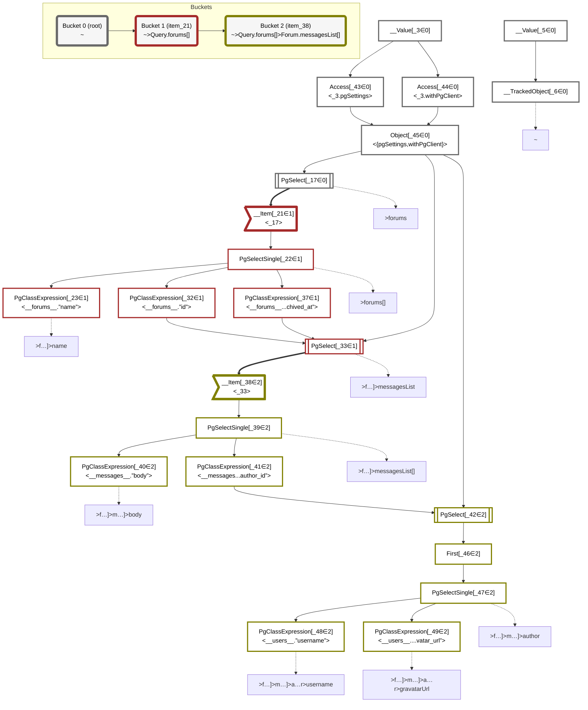

```mermaid
graph TD
    classDef path fill:#eee,stroke:#000,color:#000
    classDef plan fill:#fff,stroke-width:3px,color:#000
    classDef itemplan fill:#fff,stroke-width:6px,color:#000
    classDef sideeffectplan fill:#f00,stroke-width:6px,color:#000
    classDef bucket fill:#f6f6f6,color:#000,stroke-width:6px


    %% define plans
    __Value_3["__Value[_3∈0]<br /><context>"]:::plan
    __Value_5["__Value[_5∈0]<br /><rootValue>"]:::plan
    __TrackedObject_6["__TrackedObject[_6∈0]"]:::plan
    PgSelect_17[["PgSelect[_17∈0]<br /><forums>"]]:::plan
    __Item_21>"__Item[_21∈1]<br /><_17>"]:::itemplan
    PgSelectSingle_22["PgSelectSingle[_22∈1]<br /><forums>"]:::plan
    PgClassExpression_23["PgClassExpression[_23∈1]<br /><__forums__.”name”>"]:::plan
    PgClassExpression_32["PgClassExpression[_32∈1]<br /><__forums__.”id”>"]:::plan
    PgSelect_33[["PgSelect[_33∈1]<br /><messages>"]]:::plan
    PgClassExpression_37["PgClassExpression[_37∈1]<br /><__forums__...chived_at”>"]:::plan
    __Item_38>"__Item[_38∈2]<br /><_33>"]:::itemplan
    PgSelectSingle_39["PgSelectSingle[_39∈2]<br /><messages>"]:::plan
    PgClassExpression_40["PgClassExpression[_40∈2]<br /><__messages__.”body”>"]:::plan
    PgClassExpression_41["PgClassExpression[_41∈2]<br /><__messages...author_id”>"]:::plan
    PgSelect_42[["PgSelect[_42∈2]<br /><users>"]]:::plan
    Access_43["Access[_43∈0]<br /><_3.pgSettings>"]:::plan
    Access_44["Access[_44∈0]<br /><_3.withPgClient>"]:::plan
    Object_45["Object[_45∈0]<br /><{pgSettings,withPgClient}>"]:::plan
    First_46["First[_46∈2]"]:::plan
    PgSelectSingle_47["PgSelectSingle[_47∈2]<br /><users>"]:::plan
    PgClassExpression_48["PgClassExpression[_48∈2]<br /><__users__.”username”>"]:::plan
    PgClassExpression_49["PgClassExpression[_49∈2]<br /><__users__....vatar_url”>"]:::plan

    %% plan dependencies
    __Value_5 --> __TrackedObject_6
    Object_45 --> PgSelect_17
    PgSelect_17 ==> __Item_21
    __Item_21 --> PgSelectSingle_22
    PgSelectSingle_22 --> PgClassExpression_23
    PgSelectSingle_22 --> PgClassExpression_32
    Object_45 --> PgSelect_33
    PgClassExpression_32 --> PgSelect_33
    PgClassExpression_37 --> PgSelect_33
    PgSelectSingle_22 --> PgClassExpression_37
    PgSelect_33 ==> __Item_38
    __Item_38 --> PgSelectSingle_39
    PgSelectSingle_39 --> PgClassExpression_40
    PgSelectSingle_39 --> PgClassExpression_41
    Object_45 --> PgSelect_42
    PgClassExpression_41 --> PgSelect_42
    __Value_3 --> Access_43
    __Value_3 --> Access_44
    Access_43 --> Object_45
    Access_44 --> Object_45
    PgSelect_42 --> First_46
    First_46 --> PgSelectSingle_47
    PgSelectSingle_47 --> PgClassExpression_48
    PgSelectSingle_47 --> PgClassExpression_49

    %% plan-to-path relationships
    P1["~"]
    __TrackedObject_6 -.-> P1
    P2[">forums"]
    PgSelect_17 -.-> P2
    P3[">forums[]"]
    PgSelectSingle_22 -.-> P3
    P4[">f…]>name"]
    PgClassExpression_23 -.-> P4
    P5[">f…]>messagesList"]
    PgSelect_33 -.-> P5
    P6[">f…]>messagesList[]"]
    PgSelectSingle_39 -.-> P6
    P7[">f…]>m…]>body"]
    PgClassExpression_40 -.-> P7
    P8[">f…]>m…]>author"]
    PgSelectSingle_47 -.-> P8
    P9[">f…]>m…]>a…r>username"]
    PgClassExpression_48 -.-> P9
    P10[">f…]>m…]>a…r>gravatarUrl"]
    PgClassExpression_49 -.-> P10

    %% allocate buckets
    classDef bucket0 stroke:#696969
    class __Value_3,__Value_5,__TrackedObject_6,PgSelect_17,Access_43,Access_44,Object_45 bucket0
    classDef bucket1 stroke:#a52a2a
    class __Item_21,PgSelectSingle_22,PgClassExpression_23,PgClassExpression_32,PgSelect_33,PgClassExpression_37 bucket1
    classDef bucket2 stroke:#808000
    class __Item_38,PgSelectSingle_39,PgClassExpression_40,PgClassExpression_41,PgSelect_42,First_46,PgSelectSingle_47,PgClassExpression_48,PgClassExpression_49 bucket2

    subgraph Buckets
    Bucket0("Bucket 0 (root)<br />~"):::bucket
    style Bucket0 stroke:#696969
    Bucket1("Bucket 1 (item_21)<br />~>Query.forums[]"):::bucket
    style Bucket1 stroke:#a52a2a
    Bucket0 --> Bucket1
    Bucket2("Bucket 2 (item_38)<br />~>Query.forums[]>Forum.messagesList[]"):::bucket
    style Bucket2 stroke:#808000
    Bucket1 --> Bucket2
    end
```
