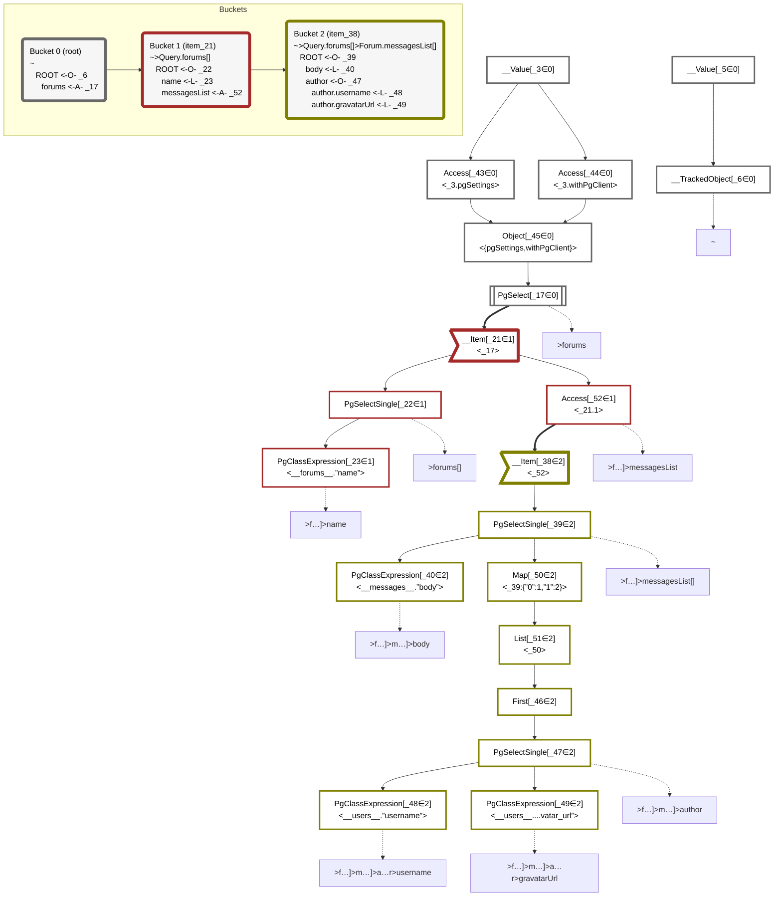

```mermaid
graph TD
    classDef path fill:#eee,stroke:#000,color:#000
    classDef plan fill:#fff,stroke-width:3px,color:#000
    classDef itemplan fill:#fff,stroke-width:6px,color:#000
    classDef sideeffectplan fill:#f00,stroke-width:6px,color:#000
    classDef bucket fill:#f6f6f6,color:#000,stroke-width:6px,text-align:left


    %% define plans
    __Value_3["__Value[_3∈0]<br /><context>"]:::plan
    __Value_5["__Value[_5∈0]<br /><rootValue>"]:::plan
    __TrackedObject_6["__TrackedObject[_6∈0]"]:::plan
    PgSelect_17[["PgSelect[_17∈0]<br /><forums>"]]:::plan
    __Item_21>"__Item[_21∈1]<br /><_17>"]:::itemplan
    PgSelectSingle_22["PgSelectSingle[_22∈1]<br /><forums>"]:::plan
    PgClassExpression_23["PgClassExpression[_23∈1]<br /><__forums__.”name”>"]:::plan
    __Item_38>"__Item[_38∈2]<br /><_52>"]:::itemplan
    PgSelectSingle_39["PgSelectSingle[_39∈2]<br /><messages>"]:::plan
    PgClassExpression_40["PgClassExpression[_40∈2]<br /><__messages__.”body”>"]:::plan
    Access_43["Access[_43∈0]<br /><_3.pgSettings>"]:::plan
    Access_44["Access[_44∈0]<br /><_3.withPgClient>"]:::plan
    Object_45["Object[_45∈0]<br /><{pgSettings,withPgClient}>"]:::plan
    First_46["First[_46∈2]"]:::plan
    PgSelectSingle_47["PgSelectSingle[_47∈2]<br /><users>"]:::plan
    PgClassExpression_48["PgClassExpression[_48∈2]<br /><__users__.”username”>"]:::plan
    PgClassExpression_49["PgClassExpression[_49∈2]<br /><__users__....vatar_url”>"]:::plan
    Map_50["Map[_50∈2]<br /><_39:{”0”:1,”1”:2}>"]:::plan
    List_51["List[_51∈2]<br /><_50>"]:::plan
    Access_52["Access[_52∈1]<br /><_21.1>"]:::plan

    %% plan dependencies
    __Value_5 --> __TrackedObject_6
    Object_45 --> PgSelect_17
    PgSelect_17 ==> __Item_21
    __Item_21 --> PgSelectSingle_22
    PgSelectSingle_22 --> PgClassExpression_23
    Access_52 ==> __Item_38
    __Item_38 --> PgSelectSingle_39
    PgSelectSingle_39 --> PgClassExpression_40
    __Value_3 --> Access_43
    __Value_3 --> Access_44
    Access_43 --> Object_45
    Access_44 --> Object_45
    List_51 --> First_46
    First_46 --> PgSelectSingle_47
    PgSelectSingle_47 --> PgClassExpression_48
    PgSelectSingle_47 --> PgClassExpression_49
    PgSelectSingle_39 --> Map_50
    Map_50 --> List_51
    __Item_21 --> Access_52

    %% plan-to-path relationships
    P_6["~"]
    __TrackedObject_6 -.-> P_6
    P_17[">forums"]
    PgSelect_17 -.-> P_17
    P_22[">forums[]"]
    PgSelectSingle_22 -.-> P_22
    P_23[">f…]>name"]
    PgClassExpression_23 -.-> P_23
    P_39[">f…]>messagesList[]"]
    PgSelectSingle_39 -.-> P_39
    P_40[">f…]>m…]>body"]
    PgClassExpression_40 -.-> P_40
    P_47[">f…]>m…]>author"]
    PgSelectSingle_47 -.-> P_47
    P_48[">f…]>m…]>a…r>username"]
    PgClassExpression_48 -.-> P_48
    P_49[">f…]>m…]>a…r>gravatarUrl"]
    PgClassExpression_49 -.-> P_49
    P_52[">f…]>messagesList"]
    Access_52 -.-> P_52

    %% allocate buckets
    classDef bucket0 stroke:#696969
    class __Value_3,__Value_5,__TrackedObject_6,PgSelect_17,Access_43,Access_44,Object_45 bucket0
    classDef bucket1 stroke:#a52a2a
    class __Item_21,PgSelectSingle_22,PgClassExpression_23,Access_52 bucket1
    classDef bucket2 stroke:#808000
    class __Item_38,PgSelectSingle_39,PgClassExpression_40,First_46,PgSelectSingle_47,PgClassExpression_48,PgClassExpression_49,Map_50,List_51 bucket2

    subgraph Buckets
    Bucket0("Bucket 0 (root)<br />~<br />⠀ROOT <-O- _6<br />⠀⠀forums <-A- _17"):::bucket
    style Bucket0 stroke:#696969
    Bucket1("Bucket 1 (item_21)<br />~>Query.forums[]<br />⠀ROOT <-O- _22<br />⠀⠀name <-L- _23<br />⠀⠀messagesList <-A- _52"):::bucket
    style Bucket1 stroke:#a52a2a
    Bucket0 --> Bucket1
    Bucket2("Bucket 2 (item_38)<br />~>Query.forums[]>Forum.messagesList[]<br />⠀ROOT <-O- _39<br />⠀⠀body <-L- _40<br />⠀⠀author <-O- _47<br />⠀⠀⠀author.username <-L- _48<br />⠀⠀⠀author.gravatarUrl <-L- _49"):::bucket
    style Bucket2 stroke:#808000
    Bucket1 --> Bucket2
    end
```
