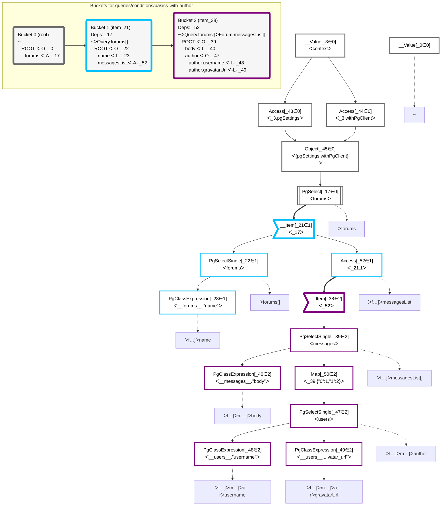

```mermaid
graph TD
    classDef path fill:#eee,stroke:#000,color:#000
    classDef plan fill:#fff,stroke-width:3px,color:#000
    classDef itemplan fill:#fff,stroke-width:6px,color:#000
    classDef sideeffectplan fill:#f00,stroke-width:6px,color:#000
    classDef bucket fill:#f6f6f6,color:#000,stroke-width:6px,text-align:left


    %% define plans
    __Value_0["__Value[_0∈0]"]:::plan
    __Value_3["__Value[_3∈0]<br />ᐸcontextᐳ"]:::plan
    PgSelect_17[["PgSelect[_17∈0]<br />ᐸforumsᐳ"]]:::plan
    __Item_21>"__Item[_21∈1]<br />ᐸ_17ᐳ"]:::itemplan
    PgSelectSingle_22["PgSelectSingle[_22∈1]<br />ᐸforumsᐳ"]:::plan
    PgClassExpression_23["PgClassExpression[_23∈1]<br />ᐸ__forums__.”name”ᐳ"]:::plan
    __Item_38>"__Item[_38∈2]<br />ᐸ_52ᐳ"]:::itemplan
    PgSelectSingle_39["PgSelectSingle[_39∈2]<br />ᐸmessagesᐳ"]:::plan
    PgClassExpression_40["PgClassExpression[_40∈2]<br />ᐸ__messages__.”body”ᐳ"]:::plan
    Access_43["Access[_43∈0]<br />ᐸ_3.pgSettingsᐳ"]:::plan
    Access_44["Access[_44∈0]<br />ᐸ_3.withPgClientᐳ"]:::plan
    Object_45["Object[_45∈0]<br />ᐸ{pgSettings,withPgClient}ᐳ"]:::plan
    PgSelectSingle_47["PgSelectSingle[_47∈2]<br />ᐸusersᐳ"]:::plan
    PgClassExpression_48["PgClassExpression[_48∈2]<br />ᐸ__users__.”username”ᐳ"]:::plan
    PgClassExpression_49["PgClassExpression[_49∈2]<br />ᐸ__users__....vatar_url”ᐳ"]:::plan
    Map_50["Map[_50∈2]<br />ᐸ_39:{”0”:1,”1”:2}ᐳ"]:::plan
    Access_52["Access[_52∈1]<br />ᐸ_21.1ᐳ"]:::plan

    %% plan dependencies
    Object_45 --> PgSelect_17
    PgSelect_17 ==> __Item_21
    __Item_21 --> PgSelectSingle_22
    PgSelectSingle_22 --> PgClassExpression_23
    Access_52 ==> __Item_38
    __Item_38 --> PgSelectSingle_39
    PgSelectSingle_39 --> PgClassExpression_40
    __Value_3 --> Access_43
    __Value_3 --> Access_44
    Access_43 --> Object_45
    Access_44 --> Object_45
    Map_50 --> PgSelectSingle_47
    PgSelectSingle_47 --> PgClassExpression_48
    PgSelectSingle_47 --> PgClassExpression_49
    PgSelectSingle_39 --> Map_50
    __Item_21 --> Access_52

    %% plan-to-path relationships
    P_0["~"]
    __Value_0 -.-> P_0
    P_17["ᐳforums"]
    PgSelect_17 -.-> P_17
    P_22["ᐳforums[]"]
    PgSelectSingle_22 -.-> P_22
    P_23["ᐳf…]ᐳname"]
    PgClassExpression_23 -.-> P_23
    P_39["ᐳf…]ᐳmessagesList[]"]
    PgSelectSingle_39 -.-> P_39
    P_40["ᐳf…]ᐳm…]ᐳbody"]
    PgClassExpression_40 -.-> P_40
    P_47["ᐳf…]ᐳm…]ᐳauthor"]
    PgSelectSingle_47 -.-> P_47
    P_48["ᐳf…]ᐳm…]ᐳa…rᐳusername"]
    PgClassExpression_48 -.-> P_48
    P_49["ᐳf…]ᐳm…]ᐳa…rᐳgravatarUrl"]
    PgClassExpression_49 -.-> P_49
    P_52["ᐳf…]ᐳmessagesList"]
    Access_52 -.-> P_52

    %% allocate buckets
    classDef bucket0 stroke:#696969
    class __Value_0,__Value_3,PgSelect_17,Access_43,Access_44,Object_45 bucket0
    classDef bucket1 stroke:#00bfff
    class __Item_21,PgSelectSingle_22,PgClassExpression_23,Access_52 bucket1
    classDef bucket2 stroke:#7f007f
    class __Item_38,PgSelectSingle_39,PgClassExpression_40,PgSelectSingle_47,PgClassExpression_48,PgClassExpression_49,Map_50 bucket2

    subgraph "Buckets for queries/conditions/basics-with-author"
    Bucket0("Bucket 0 (root)<br />~<br />⠀ROOT ᐸ-O- _0<br />⠀⠀forums ᐸ-A- _17"):::bucket
    style Bucket0 stroke:#696969
    Bucket1("Bucket 1 (item_21)<br />Deps: _17<br />~ᐳQuery.forums[]<br />⠀ROOT ᐸ-O- _22<br />⠀⠀name ᐸ-L- _23<br />⠀⠀messagesList ᐸ-A- _52"):::bucket
    style Bucket1 stroke:#00bfff
    Bucket0 --> Bucket1
    Bucket2("Bucket 2 (item_38)<br />Deps: _52<br />~ᐳQuery.forums[]ᐳForum.messagesList[]<br />⠀ROOT ᐸ-O- _39<br />⠀⠀body ᐸ-L- _40<br />⠀⠀author ᐸ-O- _47<br />⠀⠀⠀author.username ᐸ-L- _48<br />⠀⠀⠀author.gravatarUrl ᐸ-L- _49"):::bucket
    style Bucket2 stroke:#7f007f
    Bucket1 --> Bucket2
    end
```
