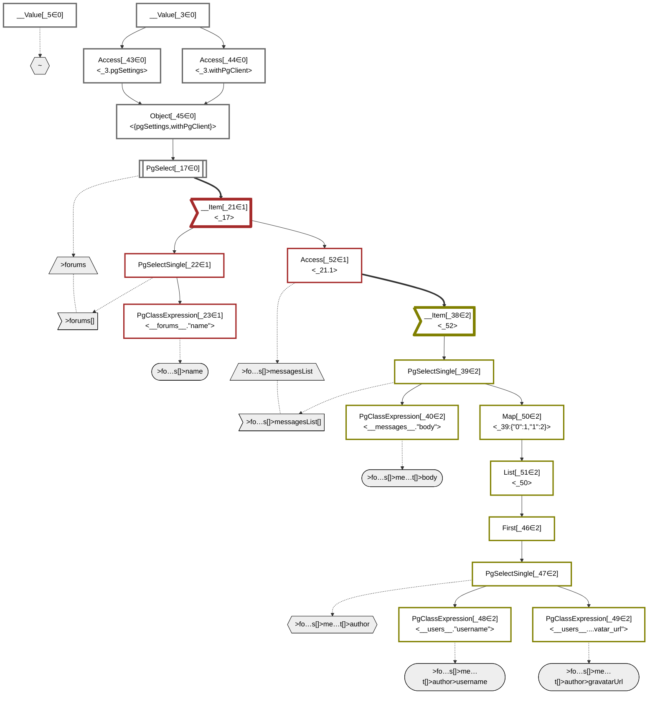

```mermaid
graph TD
    classDef path fill:#eee,stroke:#000,color:#000
    classDef plan fill:#fff,stroke-width:3px,color:#000
    classDef itemplan fill:#fff,stroke-width:6px,color:#000
    classDef sideeffectplan fill:#f00,stroke-width:6px,color:#000

    %% subgraph fields
    P1{{"~"}}:::path
    P2[/">forums"\]:::path
    P3>">forums[]"]:::path
    P2 -.- P3
    P4([">fo…s[]>name"]):::path
    %% P3 -.-> P4
    P5[/">fo…s[]>messagesList"\]:::path
    P6>">fo…s[]>messagesList[]"]:::path
    P5 -.- P6
    P7([">fo…s[]>me…t[]>body"]):::path
    %% P6 -.-> P7
    P8{{">fo…s[]>me…t[]>author"}}:::path
    P9([">fo…s[]>me…t[]>author>username"]):::path
    %% P8 -.-> P9
    P10([">fo…s[]>me…t[]>author>gravatarUrl"]):::path
    %% P8 -.-> P10
    %% P6 -.-> P8
    %% P3 -.-> P5
    %% P1 -.-> P2
    %% end

    %% define plans
    __Value_3["__Value[_3∈0]<br /><context>"]:::plan
    __Value_5["__Value[_5∈0]<br /><rootValue>"]:::plan
    PgSelect_17[["PgSelect[_17∈0]<br /><forums>"]]:::plan
    __Item_21>"__Item[_21∈1]<br /><_17>"]:::itemplan
    PgSelectSingle_22["PgSelectSingle[_22∈1]<br /><forums>"]:::plan
    PgClassExpression_23["PgClassExpression[_23∈1]<br /><__forums__.#quot;name#quot;>"]:::plan
    __Item_38>"__Item[_38∈2]<br /><_52>"]:::itemplan
    PgSelectSingle_39["PgSelectSingle[_39∈2]<br /><messages>"]:::plan
    PgClassExpression_40["PgClassExpression[_40∈2]<br /><__messages__.#quot;body#quot;>"]:::plan
    Access_43["Access[_43∈0]<br /><_3.pgSettings>"]:::plan
    Access_44["Access[_44∈0]<br /><_3.withPgClient>"]:::plan
    Object_45["Object[_45∈0]<br /><{pgSettings,withPgClient}>"]:::plan
    First_46["First[_46∈2]"]:::plan
    PgSelectSingle_47["PgSelectSingle[_47∈2]<br /><users>"]:::plan
    PgClassExpression_48["PgClassExpression[_48∈2]<br /><__users__.#quot;username#quot;>"]:::plan
    PgClassExpression_49["PgClassExpression[_49∈2]<br /><__users__....vatar_url#quot;>"]:::plan
    Map_50["Map[_50∈2]<br /><_39:{#quot;0#quot;:1,#quot;1#quot;:2}>"]:::plan
    List_51["List[_51∈2]<br /><_50>"]:::plan
    Access_52["Access[_52∈1]<br /><_21.1>"]:::plan

    %% plan dependencies
    Object_45 --> PgSelect_17
    PgSelect_17 ==> __Item_21
    __Item_21 --> PgSelectSingle_22
    PgSelectSingle_22 --> PgClassExpression_23
    Access_52 ==> __Item_38
    __Item_38 --> PgSelectSingle_39
    PgSelectSingle_39 --> PgClassExpression_40
    __Value_3 --> Access_43
    __Value_3 --> Access_44
    Access_43 --> Object_45
    Access_44 --> Object_45
    List_51 --> First_46
    First_46 --> PgSelectSingle_47
    PgSelectSingle_47 --> PgClassExpression_48
    PgSelectSingle_47 --> PgClassExpression_49
    PgSelectSingle_39 --> Map_50
    Map_50 --> List_51
    __Item_21 --> Access_52

    %% plan-to-path relationships
    __Value_5 -.-> P1
    PgSelect_17 -.-> P2
    PgSelectSingle_22 -.-> P3
    PgClassExpression_23 -.-> P4
    Access_52 -.-> P5
    PgSelectSingle_39 -.-> P6
    PgClassExpression_40 -.-> P7
    PgSelectSingle_47 -.-> P8
    PgClassExpression_48 -.-> P9
    PgClassExpression_49 -.-> P10

    %% allocate buckets
    classDef bucket0 stroke:#696969
    class __Value_3,__Value_5,PgSelect_17,Access_43,Access_44,Object_45 bucket0
    classDef bucket1 stroke:#a52a2a
    class __Item_21,PgSelectSingle_22,PgClassExpression_23,Access_52 bucket1
    classDef bucket2 stroke:#808000
    class __Item_38,PgSelectSingle_39,PgClassExpression_40,First_46,PgSelectSingle_47,PgClassExpression_48,PgClassExpression_49,Map_50,List_51 bucket2
```
