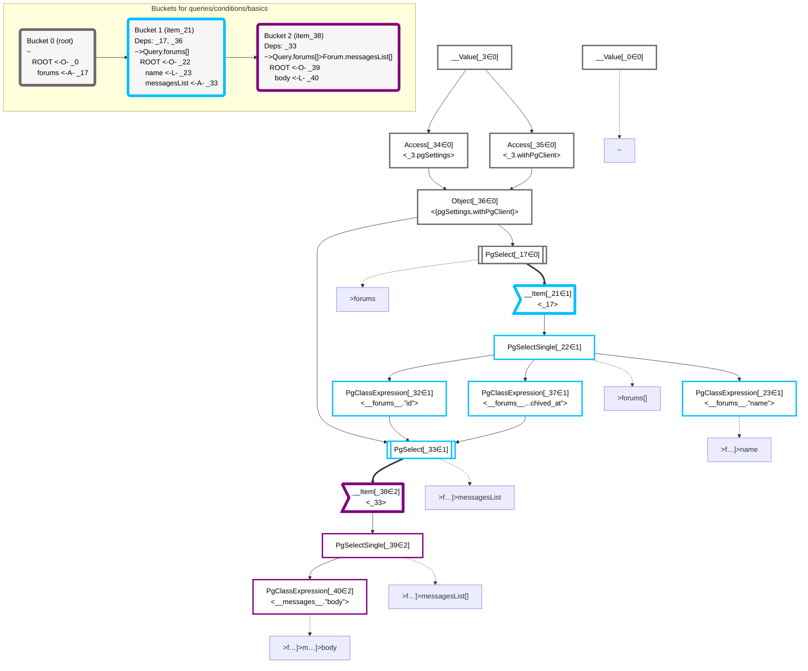

```mermaid
graph TD
    classDef path fill:#eee,stroke:#000,color:#000
    classDef plan fill:#fff,stroke-width:3px,color:#000
    classDef itemplan fill:#fff,stroke-width:6px,color:#000
    classDef sideeffectplan fill:#f00,stroke-width:6px,color:#000
    classDef bucket fill:#f6f6f6,color:#000,stroke-width:6px,text-align:left


    %% define plans
    __Value_0["__Value[_0∈0]"]:::plan
    __Value_3["__Value[_3∈0]<br /><context>"]:::plan
    PgSelect_17[["PgSelect[_17∈0]<br /><forums>"]]:::plan
    __Item_21>"__Item[_21∈1]<br /><_17>"]:::itemplan
    PgSelectSingle_22["PgSelectSingle[_22∈1]<br /><forums>"]:::plan
    PgClassExpression_23["PgClassExpression[_23∈1]<br /><__forums__.”name”>"]:::plan
    PgClassExpression_32["PgClassExpression[_32∈1]<br /><__forums__.”id”>"]:::plan
    PgSelect_33[["PgSelect[_33∈1]<br /><messages>"]]:::plan
    Access_34["Access[_34∈0]<br /><_3.pgSettings>"]:::plan
    Access_35["Access[_35∈0]<br /><_3.withPgClient>"]:::plan
    Object_36["Object[_36∈0]<br /><{pgSettings,withPgClient}>"]:::plan
    PgClassExpression_37["PgClassExpression[_37∈1]<br /><__forums__...chived_at”>"]:::plan
    __Item_38>"__Item[_38∈2]<br /><_33>"]:::itemplan
    PgSelectSingle_39["PgSelectSingle[_39∈2]<br /><messages>"]:::plan
    PgClassExpression_40["PgClassExpression[_40∈2]<br /><__messages__.”body”>"]:::plan

    %% plan dependencies
    Object_36 --> PgSelect_17
    PgSelect_17 ==> __Item_21
    __Item_21 --> PgSelectSingle_22
    PgSelectSingle_22 --> PgClassExpression_23
    PgSelectSingle_22 --> PgClassExpression_32
    Object_36 --> PgSelect_33
    PgClassExpression_32 --> PgSelect_33
    PgClassExpression_37 --> PgSelect_33
    __Value_3 --> Access_34
    __Value_3 --> Access_35
    Access_34 --> Object_36
    Access_35 --> Object_36
    PgSelectSingle_22 --> PgClassExpression_37
    PgSelect_33 ==> __Item_38
    __Item_38 --> PgSelectSingle_39
    PgSelectSingle_39 --> PgClassExpression_40

    %% plan-to-path relationships
    P_0["~"]
    __Value_0 -.-> P_0
    P_17[">forums"]
    PgSelect_17 -.-> P_17
    P_22[">forums[]"]
    PgSelectSingle_22 -.-> P_22
    P_23[">f…]>name"]
    PgClassExpression_23 -.-> P_23
    P_33[">f…]>messagesList"]
    PgSelect_33 -.-> P_33
    P_39[">f…]>messagesList[]"]
    PgSelectSingle_39 -.-> P_39
    P_40[">f…]>m…]>body"]
    PgClassExpression_40 -.-> P_40

    %% allocate buckets
    classDef bucket0 stroke:#696969
    class __Value_0,__Value_3,PgSelect_17,Access_34,Access_35,Object_36 bucket0
    classDef bucket1 stroke:#00bfff
    class __Item_21,PgSelectSingle_22,PgClassExpression_23,PgClassExpression_32,PgSelect_33,PgClassExpression_37 bucket1
    classDef bucket2 stroke:#7f007f
    class __Item_38,PgSelectSingle_39,PgClassExpression_40 bucket2

    subgraph "Buckets for queries/conditions/basics"
    Bucket0("Bucket 0 (root)<br />~<br />⠀ROOT <-O- _0<br />⠀⠀forums <-A- _17"):::bucket
    style Bucket0 stroke:#696969
    Bucket1("Bucket 1 (item_21)<br />Deps: _17, _36<br />~>Query.forums[]<br />⠀ROOT <-O- _22<br />⠀⠀name <-L- _23<br />⠀⠀messagesList <-A- _33"):::bucket
    style Bucket1 stroke:#00bfff
    Bucket0 --> Bucket1
    Bucket2("Bucket 2 (item_38)<br />Deps: _33<br />~>Query.forums[]>Forum.messagesList[]<br />⠀ROOT <-O- _39<br />⠀⠀body <-L- _40"):::bucket
    style Bucket2 stroke:#7f007f
    Bucket1 --> Bucket2
    end
```
