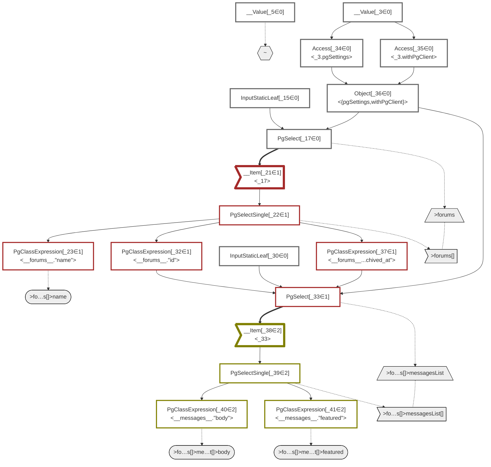

```mermaid
graph TD
    classDef path fill:#eee,stroke:#000
    classDef plan fill:#fff,stroke-width:3px
    classDef itemplan fill:#fff,stroke-width:6px
    classDef sideeffectplan fill:#f00,stroke-width:6px

    %% subgraph fields
    P1{{"~"}}:::path
    P2[/">forums"\]:::path
    P3>">forums[]"]:::path
    P2 -.- P3
    P4([">fo…s[]>name"]):::path
    %% P3 -.-> P4
    P5[/">fo…s[]>messagesList"\]:::path
    P6>">fo…s[]>messagesList[]"]:::path
    P5 -.- P6
    P7([">fo…s[]>me…t[]>body"]):::path
    %% P6 -.-> P7
    P8([">fo…s[]>me…t[]>featured"]):::path
    %% P6 -.-> P8
    %% P3 -.-> P5
    %% P1 -.-> P2
    %% end

    %% define plans
    __Value_3["__Value[_3∈0]<br /><context>"]:::plan
    __Value_5["__Value[_5∈0]<br /><rootValue>"]:::plan
    InputStaticLeaf_15["InputStaticLeaf[_15∈0]"]:::plan
    PgSelect_17["PgSelect[_17∈0]<br /><forums>"]:::plan
    __Item_21>"__Item[_21∈1]<br /><_17>"]:::itemplan
    PgSelectSingle_22["PgSelectSingle[_22∈1]<br /><forums>"]:::plan
    PgClassExpression_23["PgClassExpression[_23∈1]<br /><__forums__.#quot;name#quot;>"]:::plan
    InputStaticLeaf_30["InputStaticLeaf[_30∈0]"]:::plan
    PgClassExpression_32["PgClassExpression[_32∈1]<br /><__forums__.#quot;id#quot;>"]:::plan
    PgSelect_33["PgSelect[_33∈1]<br /><messages>"]:::plan
    Access_34["Access[_34∈0]<br /><_3.pgSettings>"]:::plan
    Access_35["Access[_35∈0]<br /><_3.withPgClient>"]:::plan
    Object_36["Object[_36∈0]<br /><{pgSettings,withPgClient}>"]:::plan
    PgClassExpression_37["PgClassExpression[_37∈1]<br /><__forums__...chived_at#quot;>"]:::plan
    __Item_38>"__Item[_38∈2]<br /><_33>"]:::itemplan
    PgSelectSingle_39["PgSelectSingle[_39∈2]<br /><messages>"]:::plan
    PgClassExpression_40["PgClassExpression[_40∈2]<br /><__messages__.#quot;body#quot;>"]:::plan
    PgClassExpression_41["PgClassExpression[_41∈2]<br /><__messages__.#quot;featured#quot;>"]:::plan

    %% plan dependencies
    Object_36 --> PgSelect_17
    InputStaticLeaf_15 --> PgSelect_17
    PgSelect_17 ==> __Item_21
    __Item_21 --> PgSelectSingle_22
    PgSelectSingle_22 --> PgClassExpression_23
    PgSelectSingle_22 --> PgClassExpression_32
    Object_36 --> PgSelect_33
    PgClassExpression_32 --> PgSelect_33
    InputStaticLeaf_30 --> PgSelect_33
    PgClassExpression_37 --> PgSelect_33
    __Value_3 --> Access_34
    __Value_3 --> Access_35
    Access_34 --> Object_36
    Access_35 --> Object_36
    PgSelectSingle_22 --> PgClassExpression_37
    PgSelect_33 ==> __Item_38
    __Item_38 --> PgSelectSingle_39
    PgSelectSingle_39 --> PgClassExpression_40
    PgSelectSingle_39 --> PgClassExpression_41

    %% plan-to-path relationships
    __Value_5 -.-> P1
    PgSelect_17 -.-> P2
    PgSelectSingle_22 -.-> P3
    PgClassExpression_23 -.-> P4
    PgSelect_33 -.-> P5
    PgSelectSingle_39 -.-> P6
    PgClassExpression_40 -.-> P7
    PgClassExpression_41 -.-> P8

    %% allocate buckets
    classDef bucket0 stroke:#696969
    class __Value_3,__Value_5,InputStaticLeaf_15,PgSelect_17,InputStaticLeaf_30,Access_34,Access_35,Object_36 bucket0
    classDef bucket1 stroke:#a52a2a
    class __Item_21,PgSelectSingle_22,PgClassExpression_23,PgClassExpression_32,PgSelect_33,PgClassExpression_37 bucket1
    classDef bucket2 stroke:#808000
    class __Item_38,PgSelectSingle_39,PgClassExpression_40,PgClassExpression_41 bucket2
```
