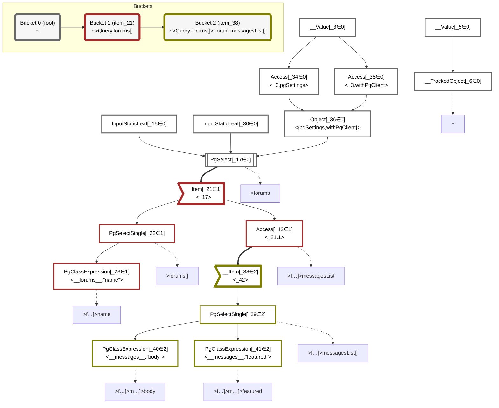

```mermaid
graph TD
    classDef path fill:#eee,stroke:#000,color:#000
    classDef plan fill:#fff,stroke-width:3px,color:#000
    classDef itemplan fill:#fff,stroke-width:6px,color:#000
    classDef sideeffectplan fill:#f00,stroke-width:6px,color:#000
    classDef bucket fill:#f6f6f6,color:#000,stroke-width:6px


    %% define plans
    __Value_3["__Value[_3∈0]<br /><context>"]:::plan
    __Value_5["__Value[_5∈0]<br /><rootValue>"]:::plan
    __TrackedObject_6["__TrackedObject[_6∈0]"]:::plan
    InputStaticLeaf_15["InputStaticLeaf[_15∈0]"]:::plan
    PgSelect_17[["PgSelect[_17∈0]<br /><forums>"]]:::plan
    __Item_21>"__Item[_21∈1]<br /><_17>"]:::itemplan
    PgSelectSingle_22["PgSelectSingle[_22∈1]<br /><forums>"]:::plan
    PgClassExpression_23["PgClassExpression[_23∈1]<br /><__forums__.”name”>"]:::plan
    InputStaticLeaf_30["InputStaticLeaf[_30∈0]"]:::plan
    Access_34["Access[_34∈0]<br /><_3.pgSettings>"]:::plan
    Access_35["Access[_35∈0]<br /><_3.withPgClient>"]:::plan
    Object_36["Object[_36∈0]<br /><{pgSettings,withPgClient}>"]:::plan
    __Item_38>"__Item[_38∈2]<br /><_42>"]:::itemplan
    PgSelectSingle_39["PgSelectSingle[_39∈2]<br /><messages>"]:::plan
    PgClassExpression_40["PgClassExpression[_40∈2]<br /><__messages__.”body”>"]:::plan
    PgClassExpression_41["PgClassExpression[_41∈2]<br /><__messages__.”featured”>"]:::plan
    Access_42["Access[_42∈1]<br /><_21.1>"]:::plan

    %% plan dependencies
    __Value_5 --> __TrackedObject_6
    Object_36 --> PgSelect_17
    InputStaticLeaf_15 --> PgSelect_17
    InputStaticLeaf_30 --> PgSelect_17
    PgSelect_17 ==> __Item_21
    __Item_21 --> PgSelectSingle_22
    PgSelectSingle_22 --> PgClassExpression_23
    __Value_3 --> Access_34
    __Value_3 --> Access_35
    Access_34 --> Object_36
    Access_35 --> Object_36
    Access_42 ==> __Item_38
    __Item_38 --> PgSelectSingle_39
    PgSelectSingle_39 --> PgClassExpression_40
    PgSelectSingle_39 --> PgClassExpression_41
    __Item_21 --> Access_42

    %% plan-to-path relationships
    P_6["~"]
    __TrackedObject_6 -.-> P_6
    P_17[">forums"]
    PgSelect_17 -.-> P_17
    P_22[">forums[]"]
    PgSelectSingle_22 -.-> P_22
    P_23[">f…]>name"]
    PgClassExpression_23 -.-> P_23
    P_42[">f…]>messagesList"]
    Access_42 -.-> P_42
    P_39[">f…]>messagesList[]"]
    PgSelectSingle_39 -.-> P_39
    P_40[">f…]>m…]>body"]
    PgClassExpression_40 -.-> P_40
    P_41[">f…]>m…]>featured"]
    PgClassExpression_41 -.-> P_41

    %% allocate buckets
    classDef bucket0 stroke:#696969
    class __Value_3,__Value_5,__TrackedObject_6,InputStaticLeaf_15,PgSelect_17,InputStaticLeaf_30,Access_34,Access_35,Object_36 bucket0
    classDef bucket1 stroke:#a52a2a
    class __Item_21,PgSelectSingle_22,PgClassExpression_23,Access_42 bucket1
    classDef bucket2 stroke:#808000
    class __Item_38,PgSelectSingle_39,PgClassExpression_40,PgClassExpression_41 bucket2

    subgraph Buckets
    Bucket0("Bucket 0 (root)<br />~"):::bucket
    style Bucket0 stroke:#696969
    Bucket1("Bucket 1 (item_21)<br />~>Query.forums[]"):::bucket
    style Bucket1 stroke:#a52a2a
    Bucket0 --> Bucket1
    Bucket2("Bucket 2 (item_38)<br />~>Query.forums[]>Forum.messagesList[]"):::bucket
    style Bucket2 stroke:#808000
    Bucket1 --> Bucket2
    end
```
