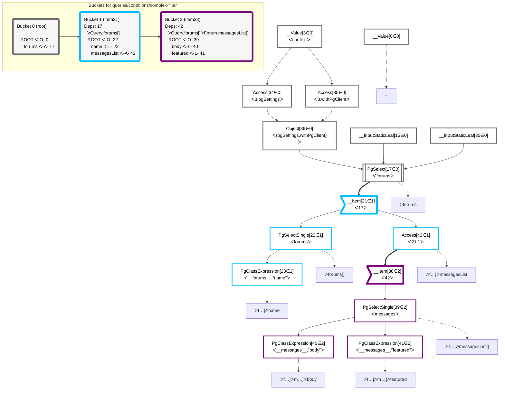

```mermaid
graph TD
    classDef path fill:#eee,stroke:#000,color:#000
    classDef plan fill:#fff,stroke-width:3px,color:#000
    classDef itemplan fill:#fff,stroke-width:6px,color:#000
    classDef sideeffectplan fill:#f00,stroke-width:6px,color:#000
    classDef bucket fill:#f6f6f6,color:#000,stroke-width:6px,text-align:left


    %% define plans
    __Value0["__Value[0∈0]"]:::plan
    PgClassExpression23["PgClassExpression[23∈1]<br />ᐸ__forums__.”name”ᐳ"]:::plan
    PgSelectSingle22["PgSelectSingle[22∈1]<br />ᐸforumsᐳ"]:::plan
    PgClassExpression40["PgClassExpression[40∈2]<br />ᐸ__messages__.”body”ᐳ"]:::plan
    PgClassExpression41["PgClassExpression[41∈2]<br />ᐸ__messages__.”featured”ᐳ"]:::plan
    PgSelectSingle39["PgSelectSingle[39∈2]<br />ᐸmessagesᐳ"]:::plan
    __Item38>"__Item[38∈2]<br />ᐸ42ᐳ"]:::itemplan
    Access42["Access[42∈1]<br />ᐸ21.1ᐳ"]:::plan
    __Item21>"__Item[21∈1]<br />ᐸ17ᐳ"]:::itemplan
    PgSelect17[["PgSelect[17∈0]<br />ᐸforumsᐳ"]]:::plan
    Object36["Object[36∈0]<br />ᐸ{pgSettings,withPgClient}ᐳ"]:::plan
    Access34["Access[34∈0]<br />ᐸ3.pgSettingsᐳ"]:::plan
    Access35["Access[35∈0]<br />ᐸ3.withPgClientᐳ"]:::plan
    __Value3["__Value[3∈0]<br />ᐸcontextᐳ"]:::plan
    __InputStaticLeaf15["__InputStaticLeaf[15∈0]"]:::plan
    __InputStaticLeaf30["__InputStaticLeaf[30∈0]"]:::plan

    %% plan dependencies
    PgSelectSingle22 --> PgClassExpression23
    __Item21 --> PgSelectSingle22
    PgSelectSingle39 --> PgClassExpression40
    PgSelectSingle39 --> PgClassExpression41
    __Item38 --> PgSelectSingle39
    Access42 ==> __Item38
    __Item21 --> Access42
    PgSelect17 ==> __Item21
    Object36 & __InputStaticLeaf15 & __InputStaticLeaf30 --> PgSelect17
    Access34 & Access35 --> Object36
    __Value3 --> Access34
    __Value3 --> Access35

    %% plan-to-path relationships
    P0["~"]
    __Value0 -.-> P0
    P17["ᐳforums"]
    PgSelect17 -.-> P17
    P22["ᐳforums[]"]
    PgSelectSingle22 -.-> P22
    P23["ᐳf…]ᐳname"]
    PgClassExpression23 -.-> P23
    P39["ᐳf…]ᐳmessagesList[]"]
    PgSelectSingle39 -.-> P39
    P40["ᐳf…]ᐳm…]ᐳbody"]
    PgClassExpression40 -.-> P40
    P41["ᐳf…]ᐳm…]ᐳfeatured"]
    PgClassExpression41 -.-> P41
    P42["ᐳf…]ᐳmessagesList"]
    Access42 -.-> P42

    subgraph "Buckets for queries/conditions/complex-filter"
    Bucket0("Bucket 0 (root)<br />~<br />⠀ROOT ᐸ-O- 0<br />⠀⠀forums ᐸ-A- 17"):::bucket
    classDef bucket0 stroke:#696969
    class Bucket0,__Value0,__Value3,__InputStaticLeaf15,PgSelect17,__InputStaticLeaf30,Access34,Access35,Object36 bucket0
    Bucket1("Bucket 1 (item21)<br />Deps: 17<br />~ᐳQuery.forums[]<br />⠀ROOT ᐸ-O- 22<br />⠀⠀name ᐸ-L- 23<br />⠀⠀messagesList ᐸ-A- 42"):::bucket
    classDef bucket1 stroke:#00bfff
    class Bucket1,__Item21,PgSelectSingle22,PgClassExpression23,Access42 bucket1
    Bucket2("Bucket 2 (item38)<br />Deps: 42<br />~ᐳQuery.forums[]ᐳForum.messagesList[]<br />⠀ROOT ᐸ-O- 39<br />⠀⠀body ᐸ-L- 40<br />⠀⠀featured ᐸ-L- 41"):::bucket
    classDef bucket2 stroke:#7f007f
    class Bucket2,__Item38,PgSelectSingle39,PgClassExpression40,PgClassExpression41 bucket2
    Bucket0 --> Bucket1
    Bucket1 --> Bucket2
    end
```
