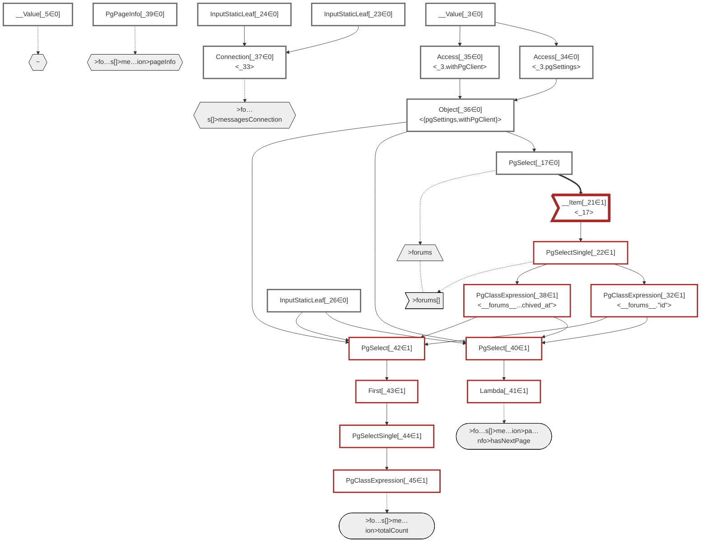

```mermaid
graph TD
    classDef path fill:#eee,stroke:#000
    classDef plan fill:#fff,stroke-width:3px
    classDef itemplan fill:#fff,stroke-width:6px
    classDef sideeffectplan fill:#f00,stroke-width:6px

    %% subgraph fields
    P1{{"~"}}:::path
    P2[/">forums"\]:::path
    P3>">forums[]"]:::path
    P2 -.- P3
    P4{{">fo…s[]>messagesConnection"}}:::path
    P5{{">fo…s[]>me…ion>pageInfo"}}:::path
    P6([">fo…s[]>me…ion>pa…nfo>hasNextPage"]):::path
    %% P5 -.-> P6
    %% P4 -.-> P5
    P7([">fo…s[]>me…ion>totalCount"]):::path
    %% P4 -.-> P7
    %% P3 -.-> P4
    %% P1 -.-> P2
    %% end

    %% define plans
    __Value_3["__Value[_3∈0]<br /><context>"]:::plan
    __Value_5["__Value[_5∈0]<br /><rootValue>"]:::plan
    PgSelect_17["PgSelect[_17∈0]<br /><forums>"]:::plan
    __Item_21>"__Item[_21∈1]<br /><_17>"]:::itemplan
    PgSelectSingle_22["PgSelectSingle[_22∈1]<br /><forums>"]:::plan
    InputStaticLeaf_23["InputStaticLeaf[_23∈0]"]:::plan
    InputStaticLeaf_24["InputStaticLeaf[_24∈0]"]:::plan
    InputStaticLeaf_26["InputStaticLeaf[_26∈0]"]:::plan
    PgClassExpression_32["PgClassExpression[_32∈1]<br /><__forums__.#quot;id#quot;>"]:::plan
    Access_34["Access[_34∈0]<br /><_3.pgSettings>"]:::plan
    Access_35["Access[_35∈0]<br /><_3.withPgClient>"]:::plan
    Object_36["Object[_36∈0]<br /><{pgSettings,withPgClient}>"]:::plan
    Connection_37["Connection[_37∈0]<br /><_33>"]:::plan
    PgClassExpression_38["PgClassExpression[_38∈1]<br /><__forums__...chived_at#quot;>"]:::plan
    PgPageInfo_39["PgPageInfo[_39∈0]"]:::plan
    PgSelect_40["PgSelect[_40∈1]<br /><messages>"]:::plan
    Lambda_41["Lambda[_41∈1]<br /><listHasMore>"]:::plan
    PgSelect_42["PgSelect[_42∈1]<br /><messages>"]:::plan
    First_43["First[_43∈1]"]:::plan
    PgSelectSingle_44["PgSelectSingle[_44∈1]<br /><messages>"]:::plan
    PgClassExpression_45["PgClassExpression[_45∈1]<br /><count(*)>"]:::plan

    %% plan dependencies
    Object_36 --> PgSelect_17
    PgSelect_17 ==> __Item_21
    __Item_21 --> PgSelectSingle_22
    PgSelectSingle_22 --> PgClassExpression_32
    __Value_3 --> Access_34
    __Value_3 --> Access_35
    Access_34 --> Object_36
    Access_35 --> Object_36
    InputStaticLeaf_23 --> Connection_37
    InputStaticLeaf_24 --> Connection_37
    PgSelectSingle_22 --> PgClassExpression_38
    Object_36 --> PgSelect_40
    PgClassExpression_32 --> PgSelect_40
    InputStaticLeaf_26 --> PgSelect_40
    PgClassExpression_38 --> PgSelect_40
    PgSelect_40 --> Lambda_41
    Object_36 --> PgSelect_42
    PgClassExpression_32 --> PgSelect_42
    InputStaticLeaf_26 --> PgSelect_42
    PgClassExpression_38 --> PgSelect_42
    PgSelect_42 --> First_43
    First_43 --> PgSelectSingle_44
    PgSelectSingle_44 --> PgClassExpression_45

    %% plan-to-path relationships
    __Value_5 -.-> P1
    PgSelect_17 -.-> P2
    PgSelectSingle_22 -.-> P3
    Connection_37 -.-> P4
    PgPageInfo_39 -.-> P5
    Lambda_41 -.-> P6
    PgClassExpression_45 -.-> P7

    %% allocate buckets
    classDef bucket0 stroke:#696969
    class __Value_3,__Value_5,PgSelect_17,InputStaticLeaf_23,InputStaticLeaf_24,InputStaticLeaf_26,Access_34,Access_35,Object_36,Connection_37,PgPageInfo_39 bucket0
    classDef bucket1 stroke:#a52a2a
    class __Item_21,PgSelectSingle_22,PgClassExpression_32,PgClassExpression_38,PgSelect_40,Lambda_41,PgSelect_42,First_43,PgSelectSingle_44,PgClassExpression_45 bucket1
```
